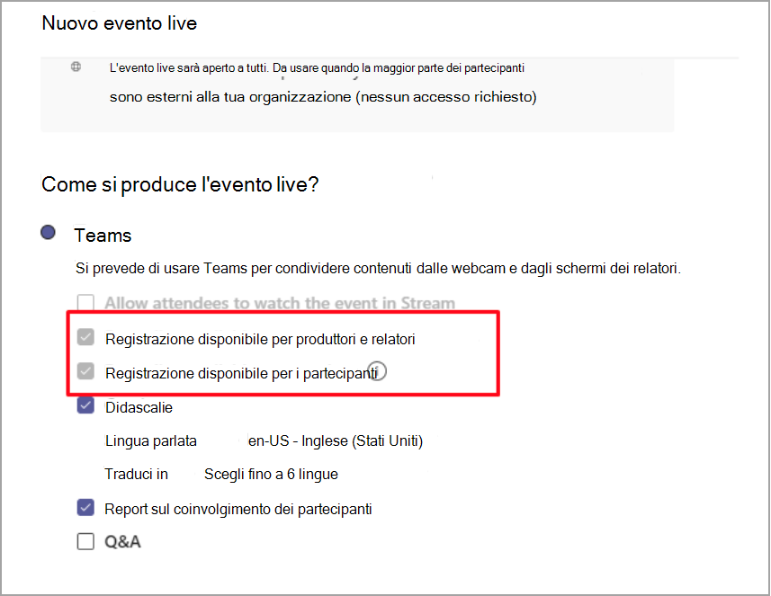

# Criteri di registrazione degli eventi live in Microsoft Teams

Sono disponibili diverse opzioni per registrare un evento live di Microsoft Teams. Le opzioni di registrazione vengono impostate usando i criteri di registrazione. Questo articolo descrive le varie impostazioni.

Le opzioni di registrazione vengono impostate usando il comando di PowerShell [Set-CsTeamsMeetingBroadcastPolicy](/powershell/module/skype/set-csteamsmeetingbroadcastpolicy?view=skype-ps)

## Comportamenti di pianificazione e opzioni

Durante la pianificazione di una registrazione di un evento live sono disponibili due opzioni per l'organizzatore:

- Registrazione disponibile per produttori e relatori

  - File di registrazione: fornisce un file di registrazione che i produttori e i relatori possono scaricare al termine dell'evento.

- Registrazione disponibile per i partecipanti

  - DVR: un videoregistratore digitale (DVR) consente ai partecipanti di riavvolgere e mettere in pausa durante l'evento

  - VOD: un video su richiesta (VOD) consente ai partecipanti di guardare al termine dell'evento

## Impostazione dei criteri di registrazione broadcast

Nell'ambito dei criteri di trasmissione, è possibile attivare o disattivare la registrazione per un evento live.

|                                 | Registrazione disponibile per produttori e relatori | Registrazione disponibile per i partecipanti |
| ------------------------------- | ---------------------------------------------------- | ------------------------------------- |
| Registra sempre               | Disabilitato e selezionato                                | Disabilitato e selezionato         |
| L'organizzatore può registrare o meno | Abilitato e non selezionato per impostazione predefinita                  | Abilitato e non selezionato per impostazione predefinita   |
| Non registrare mai               | Disabilitato e non selezionato                            | Disabilitato e non selezionato      |

Quando il criterio è impostato su **Registra sempre**, nella pagina dei criteri sono disponibili le opzioni selezionate seguenti:

## Comportamento di archiviazione e persistenza

| Opzione                                       | Stato   | DVR                                                   | VOD                                                     | Registrazione                |
| ------------------------------------------------ | ------------ | --------------------------------------------------------- | ----------------------------------------------------------- | ---------------------------- |
| Registrazione disponibile per produttori e relatori | Selezionato     | DVR è disponibile e l'asset di Azure Media Services (AMS) è archiviato per 180 giorni | Il partecipante può accedere e guardare l'evento                     |                              |
|                                                  | Non selezionato | DVR è disponibile e la risorsa AMS viene archiviata per 180 giorni | Il partecipante non ottiene l'accesso all'evento al termine |                              |
||Disabilitato (non selezionato)|DVR è disponibile e la risorsa AMS viene eliminata dopo l'evento|Il partecipante non ottiene l'accesso all'evento al termine||
| Registrazione disponibile per produttori e relatori | Selezionato     |                                                           |                                                             | Viene creato e archiviato un MP4 |
|                                                  | Non selezionato |                                                           |                                                             | Non viene creato alcun file           |

### Argomenti correlati

- [Cosa sono gli eventi live di Teams?](what-are-teams-live-events.md)
- [Pianificare gli eventi live di Teams](plan-for-teams-live-events.md)
- [Configurare le impostazioni degli eventi live in Teams](configure-teams-live-events.md)
- [Registrazione delle riunioni nel cloud di Teams](../cloud-recording.md)