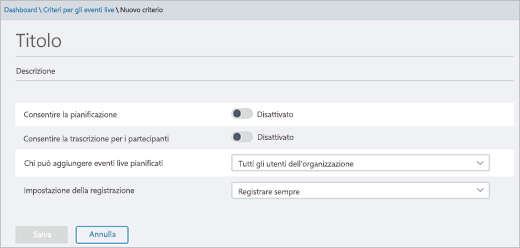

# Configurare gli eventi live in Microsoft Teams

La configurazione per gli eventi live prevede diversi passaggi.

## Passaggio 1: Configurare la rete per gli eventi live in Teams

Per produrre eventi live in Teams occorre [preparare la rete dell'organizzazione per Teams](https://docs.microsoft.com/microsoftteams/prepare-network).  

## Passaggio 2: Ottenere e assegnare licenze

Assicurarsi di aver assegnato correttamente le licenze per [chi può creare e pianificare eventi live](plan-for-teams-live-events.md#who-can-attend-create-and-schedule-live-events) e [chi può guardare gli eventi live](plan-for-teams-live-events.md#who-can-watch-live-events).

## Passaggio 3: Configurare i criteri per gli eventi live

I criteri per gli eventi live consentono di controllare chi nell'organizzazione può organizzare eventi live e le funzionalità disponibili negli eventi creati. È possibile usare il criterio predefinito o creare uno o più criteri personalizzati per gli eventi live. Dopo aver creato un criterio personalizzato, assegnarlo a un utente o a un gruppo di utenti dell'organizzazione.

> [!NOTE]
> Se non si creano e assegnano criteri personalizzati, gli utenti dell'organizzazione riceveranno il criterio globale. Per impostazione predefinita, nel criterio globale la pianificazione di eventi live per gli utenti di Teams è abilitata, le didascalie e i sottotitoli in tempo reale sono disattivati, chiunque all'interno dell'organizzazione può partecipare agli eventi live e l'impostazione di registrazione è configurata in modo da registrare sempre.

### Creare o modificare un criterio per gli eventi live

** Usare l'interfaccia di amministrazione di Microsoft Teams**

1. Nel riquadro di spostamento sinistro passare a **Riunioni** > **Criteri eventi live**.
2. Eseguire una delle operazioni seguenti:

- Se si vuole modificare il criterio predefinito esistente, scegliere **Globale (predefinito a livello di organizzazione)**.
- Se si vuole creare un nuovo criterio personalizzato, scegliere **Nuovo criterio**.
- Se si vuole modificare un criterio personalizzato, selezionare il criterio e quindi scegliere **Modifica**.

    Ecco le impostazioni che è possibile modificare per soddisfare le esigenze dell'organizzazione.

    

|Impostazione  |Descrizione  |
|---------|---------|
|**Titolo**     |Questo è il titolo del criterio che viene visualizzato nella pagina dei criteri per gli eventi live. Non può contenere caratteri speciali o più di 64 caratteri.          |
|**Descrizione**    |Inserire una descrizione di facile comprensione del criterio.         |
|**Consenti la pianificazione**     |Se si attiva questa impostazione, gli utenti dell'organizzazione possono creare e pianificare eventi live in Team. È importante sapere che, se si vuole che gli utenti possano pianificare un evento live prodotto con un'app o un dispositivo esterno, è necessario eseguire altre operazioni. Per altre informazioni, vedere [Consentire agli utenti di pianificare eventi prodotti con un'app o un dispositivo esterno](#enable-users-to-schedule-events-that-were-produced-with-an-external-app-or-device).     |
|**Consenti trascrizione per i partecipanti** |Questa impostazione può essere applicata solo agli eventi prodotti in Teams. Attivandola, i partecipanti potranno visualizzare didascalie e sottotitoli in tempo reale durante l'evento live.         |
|**Chi può aggiungere eventi live pianificati**    |Scegliere una delle opzioni seguenti.  **Tutti** Gli utenti possono creare eventi live a cui può partecipare chiunque, incluse persone esterne all'organizzazione. Questa impostazione abilita il tipo di autorizzazione **Pubblico** in Teams quando un utente pianifica un evento live.  **Tutti gli utenti dell'organizzazione** Gli utenti possono creare eventi live a cui possono partecipare le persone dell'organizzazione, compresi gli [utenti guest](../add-guests.md) aggiunti all'organizzazione. Gli utenti non possono creare eventi live aperti agli utenti anonimi. Questa impostazione abilita il tipo di autorizzazione **A livello di organizzazione** in Teams quando un utente pianifica un evento live.  **Utenti o gruppi specifici** Gli utenti possono creare eventi live a cui possono partecipare solo utenti o gruppi specifici dell'organizzazione. Gli utenti non possono creare eventi live aperti a tutte le persone dell'organizzazione o a utenti anonimi. Questa impostazione abilita il tipo di autorizzazione **Persone e gruppi** in Teams quando un utente pianifica un evento live.       |
|**Impostazione della registrazione**        | Questa impostazione può essere applicata solo agli eventi prodotti in Teams. Scegliere una delle opzioni seguenti.    **Registra sempre** Gli eventi live creati dagli utenti vengono sempre registrati. Una volta terminato l'evento, i membri del team dell'evento possono scaricare la registrazione e i partecipanti possono guardare l'evento.   **Non registrare mai** Gli eventi live creati dagli utenti non vengono mai registrati.  **L'organizzatore può registrare o meno** Gli utenti possono decidere se registrare l'evento live. Se viene registrato, i membri del team dell'evento possono scaricare la registrazione e i partecipanti possono guardare l'evento.      

È anche possibile eseguire questa operazione usando Windows PowerShell. Per altre informazioni, vedere [Usare PowerShell per impostare i criteri degli eventi live in Microsoft Teams](set-teams-live-events-policies-using-powershell.md). 

### Assegnare un criterio per gli eventi live agli utenti 

Se è stato creato un criterio personalizzato per gli eventi live, assegnarlo agli utenti per renderlo attivo. 

 Usando l'interfaccia di amministrazione di Microsoft Teams.

1. Nel riquadro di spostamento sinistro passare a **Utenti**e quindi selezionare l'utente.
2. Accanto a **Criteri assegnati** scegliere **Modifica**. 
3. Selezionare il criterio per gli eventi live da assegnare e quindi scegliere **Salva**. 

È anche possibile assegnare un criterio per gli eventi live a uno o più utenti, come illustrato di seguito:

 Usando l'interfaccia di amministrazione di Microsoft Teams.

1. Passare a **Riunioni** > **Criteri eventi live**.
2. Selezionare il criterio facendo clic a sinistra del nome del criterio.
3. Scegliere **Gestisci utenti**.
4. Nel riquadro **Gestisci utenti** cercare l'utente per nome visualizzato o in base al nome utente, selezionare il nome e poi selezionare **Aggiungi**. Ripetere questa operazione per ogni utente da aggiungere.
5. Dopo aver aggiunto gli utenti, selezionare **Salva**.
 

### Consentire agli utenti di pianificare eventi prodotti con un'app o un dispositivo esterno

Per fare in modo che gli utenti possano pianificare eventi prodotti con un'app o un dispositivo esterno è inoltre necessario eseguire queste operazioni:

1. Abilitare Microsoft Stream per gli utenti dell'organizzazione. Stream è disponibile come parte degli abbonamenti Microsoft 365 o Office 365 idonei o come servizio autonomo. Stream non è incluso nei piani Business Essentials o Business Premium. Per altre informazioni, vedere la [Panoramica sulle licenze di Stream](https://docs.microsoft.com/stream/license-overview).

      Leggi altre informazioni su come [assegnare licenze agli utenti in](https://support.office.com/article/Assign-licenses-to-users-in-Office-365-for-business-997596B5-4173-4627-B915-36ABAC6786DC) modo che gli utenti possano accedere al flusso. Assicurarsi che Stream non sia bloccato per gli utenti, come illustrato in [questo articolo](https://docs.microsoft.com/stream/disable-user-organization).

2. Assicurarsi che gli utenti abbiano le autorizzazioni per la creazione di eventi live in Stream. Per impostazione predefinita, gli amministratori possono creare eventi con un'app o un dispositivo esterno. L'amministratore di Stream può [abilitare altri utenti per la creazione di eventi live](https://docs.microsoft.com/stream/live-event-administration#enabling-and-restricting-users-to-creating) in Stream.  

3. Assicurarsi che gli organizzatori di eventi live abbiano accettato le norme aziendali impostate dall'amministratore di Stream. Se un amministratore del flusso ha [configurato delle linee guida aziendali](https://docs.microsoft.com/stream/company-policy-and-consent) e richiede ai dipendenti di accettarle prima di poter salvare contenuti, gli utenti devono farlo prima di creare un evento live (con un'app o un dispositivo esterno) in Teams. Prima di implementare la funzionalità degli eventi live nell'organizzazione, assicurarsi che tutti gli utenti che creeranno utenti live abbiano accettato le norme aziendali. 

## Passaggio 4: Configurare una soluzione di distribuzione video per gli eventi live in Teams
Per la riproduzione di video di eventi live viene usato lo streaming a bitrate adattivo (ABR), ma si tratta di un flusso unicast, vale a dire che ogni spettatore riceve un proprio flusso video da Internet. Quando si trasmettono video o eventi live a moltissimi utenti dell'organizzazione, la larghezza di banda Internet usata dagli spettatori può essere considerevole. Per le organizzazioni che vogliono ridurre il traffico Internet per gli eventi live, le soluzioni per gli eventi live sono integrate con le offerte di reti definite dal software (SDN) o reti per la distribuzione di contenuti aziendali (eCDN) dei partner di fiducia di Microsoft. Queste piattaforme SDN/eCDN consentono alle organizzazioni di ottimizzare la larghezza di banda della rete senza sacrificare le esperienze di visualizzazione degli utenti finali. I partner possono contribuire a garantire una distribuzione più scalabile ed efficiente dei video nell'intera rete aziendale.

**Acquistare e configurare una soluzione all'esterno di Teams** I partner di fiducia di Microsoft del settore offrono consulenza esperta per il ridimensionamento della distribuzione di video. Per abilitare l'uso di un provider di distribuzione di video con Teams, è necessario acquistare e configurare la soluzione SDN/eCDN esterna e separata da Teams.

Le soluzioni SDN/eCDN seguenti sono preintegrate e possono essere configurate per l'uso con Stream.

- **Hive Streaming** offre una soluzione semplice e potente per la distribuzione di video aziendali live e su richiesta. Hive è una soluzione basata su software che non richiede ulteriore hardware o larghezza di banda e offre un modo sicuro per abilitare migliaia di visualizzatori simultanei senza alcun impatto sulla rete. Per i clienti che vogliono comprendere l'impatto del video sulla propria rete prima di acquistare una soluzione SDN/eCDN, Hive Streaming offre anche una soluzione di analisi basata su browser per i clienti Microsoft. [Altre informazioni](https://www.hivestreaming.com/partners/integration-partners/microsoft/).
 
- **Kollective** è una piattaforma di distribuzione basata sul peering intelligente, che sfrutta l'infrastruttura di rete esistente per distribuire contenuti in forme diverse (video in streaming live, video on demand, aggiornamenti software, patch di sicurezza e così via) in modo più veloce, più affidabile e con meno larghezza di banda. La nostra piattaforma sicura è considerata attendibile dagli istituti finanziari più grandi del mondo e, senza bisogno di ulteriore hardware, la configurazione e la manutenzione sono facili. [Altre informazioni](https://kollective.com/microsoft-pilot/).
 
- **Ramp OmniCache** offre distribuzione in rete di nuova generazione e assicura la trasmissione ininterrotta di contenuti video nelle WAN globali, aiutando i produttori di eventi a ottimizzare la larghezza di banda della rete e supportare lo streaming di eventi live e on demand. Il supporto di Ramp OmniCache per gli eventi live prodotti in Teams sarà disponibile a breve. [Altre informazioni](https://rampecdn.com). 
 
> [!NOTE] 
> La soluzione SDN o eCDN scelta è soggetta ai **termini di servizio e all'informativa sulla privacy del provider di terze parti scelto**, che disciplineranno l'uso della soluzione del provider. L'uso della soluzione del provider non sarà soggetto alle condizioni dei servizi online o dei contratti multilicenza Microsoft. Se non accettano i **termini del provider di terze parti** la soluzione non verrà abilitata in Teams. 

Dopo aver configurato la soluzione SDN o eCDN, si è pronti per configurare il provider per gli eventi live in Teams. 

## Passaggi successivi
Andare a [Configurare le impostazioni degli eventi live in Teams](configure-teams-live-events.md).

### Argomenti correlati
- [Cosa sono gli eventi live di Teams?](what-are-teams-live-events.md)
- [Pianificare gli eventi live di Teams](plan-for-teams-live-events.md)
- [Configurare le impostazioni degli eventi live in Teams](configure-teams-live-events.md)
