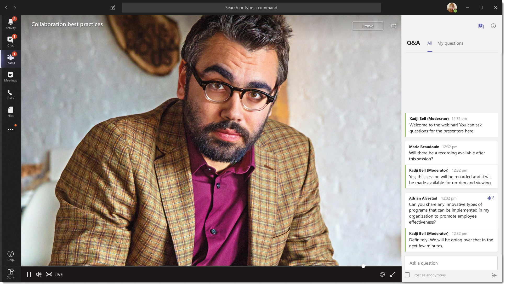

# Cosa sono gli eventi di Microsoft teams Live

## Panoramica

Con gli eventi di teams Live, gli utenti dell'organizzazione possono trasmettere video e soddisfare le riunioni in grandi gruppi di destinatari online.

Gli eventi live di Microsoft 365 portano il video live streaming a un nuovo livello. Gli eventi dinamici favoriscono la connessione durante l'intero ciclo di vita dell'impegno con i partecipanti prima, durante e dopo gli eventi live. È possibile creare un evento Live ovunque si trovi il pubblico, il team o la community, usando Microsoft Stream, teams o Yammer.  

Teams offre la collaborazione, le chiamate, le riunioni e gli eventi live basati sulla chat, in modo da poter espandere il gruppo di destinatari delle riunioni. Teams Live Events è un'estensione delle riunioni di teams, che consente agli utenti di trasmettere video e soddisfare le riunioni a un grande pubblico online. Gli eventi dinamici sono pensati per le comunicazioni uno-a-molti in cui l'host dell'evento sta conducendo le interazioni e la partecipazione del pubblico è principalmente quella di visualizzare il contenuto condiviso dall'host. I partecipanti possono guardare l'evento Live o registrato in Yammer, teams e/o Stream e possono interagire con i relatori usando la Q & A o una conversazione di Yammer.

Gli eventi live di teams sono considerati la prossima versione di Skype meeting broadcast e alla fine sostituiranno le funzionalità disponibili in Skype meeting broadcast. A questo punto, Microsoft continuerà a supportare Skype meeting broadcast per gli utenti che usano Skype for business nelle loro organizzazioni, senza interruzioni in servizio per eventi nuovi o futuri. Tuttavia, ti invitiamo a provare gli eventi di teams Live per sfruttare tutte le nuove ed entusiasmanti funzionalità, tra cui la condivisione dello schermo e il supporto per i codificatori hardware/software esterni.

Per iniziare, iniziamo. Prima di tutto, Vedi il diagramma seguente che mostra i componenti di alto livello coinvolti negli eventi live di Microsoft 365 e come sono connessi.

### Ruoli del gruppo di eventi

Gli eventi dinamici in teams abilitano più ruoli (organizzatore, produttore, relatore e partecipante) per trasmettere e partecipare a un evento in modo efficace. Per altre informazioni, vedere [ruoli di gruppi di eventi](https://support.office.com/article/get-started-with-microsoft-teams-live-events-d077fec2-a058-483e-9ab5-1494afda578a?ui=en-US&rs=en-US&ad=US#bkmk_roles).

## Componenti principali

Puoi vedere dall'immagine precedente che sono presenti cinque componenti chiave usati con gli eventi dinamici in teams.

> [!NOTE]
> Per una panoramica su come configurare gli eventi live e l'esperienza dei partecipanti, vedere questi brevi [video](https://support.office.com/article/video-plan-and-schedule-a-live-event-f92363a0-6d98-46d2-bdd9-f2248075e502).

### Pianificazione

Teams offre agli organizzatori la possibilità di creare un evento con le autorizzazioni appropriate per i partecipanti, designare i membri del team dell'evento, selezionare un metodo di produzione e invitare i partecipanti. Se l'evento Live è stato creato dall'interno di un gruppo di Yammer, i partecipanti all'evento Live potranno usare la conversazione di Yammer per interagire con le persone dell'evento.

### Produzione

L'input video è il fondamento dell'evento Live e può variare da una singola webcam a una produzione video professionale con più telecamere. Gli eventi dinamici in Microsoft 365 supportano uno spettro di scenari di produzione, includono un evento prodotto in teams usando una webcam o un evento prodotto in un'app o un dispositivo esterno. È possibile scegliere queste opzioni a seconda dei requisiti di progetto e del preventivo. Esistono due modi per produrre eventi:

- **Teams**: questo metodo di produzione consente agli utenti di produrre i loro eventi dinamici in teams usando la webcam o usando l'input A/V dei sistemi room di teams. Questa opzione è l'opzione migliore e più veloce se vuoi usare i dispositivi audio e video connessi al PC o invitando i relatori remoti a partecipare all'evento. Questa opzione consente agli utenti di usare facilmente le loro webcam e condividere lo schermo come input nell'evento.

    

- **App o dispositivo esterno**: i codificatori esterni consentono agli utenti di produrre gli eventi dinamici direttamente da un codificatore hardware o basato su software esterno con [flusso](https://stream.microsoft.com). Questa opzione è la soluzione migliore per gli strumenti di qualità di studio, ad esempio i mixer multimediali, che supportano lo streaming in un servizio RTMP (Real-Time Messaging Protocol). Questo tipo di produzione viene in genere usato in eventi su larga scala, come i municipi esecutivi, in cui un singolo flusso di un mixer multimediale viene trasmesso al pubblico.

    

>[!Note]
> Il passaggio dall'utilizzo di Microsoft Stream a [ OneDrive for Business e SharePoint per le registrazioni delle riunioni ](../tmr-meeting-recording-change.md) sarà graduale. Al momento del lancio sarà possibile acconsentire esplicitamente all’esperienza. A novembre sarà necessario rifiutarla esplicitamente se si vuole continuare a usare Stream e all'inizio del 2021 sarà chiesto a tutti i clienti di usare OneDrive for Business e SharePoint per le nuove registrazioni delle riunioni.

### Piattaforma di streaming

La piattaforma di streaming di eventi dinamici è composta dalle parti seguenti:

- **Azure Media Services**:  [Azure Media Services](https://docs.microsoft.com/azure/media-services/previous/) offre servizi di streaming video di qualità broadcast per raggiungere un numero elevato di utenti nei dispositivi mobili più diffusi di oggi. I servizi multimediali ottimizzano l'accessibilità, la distribuzione e la scalabilità e rendono più semplice ed economico lo streaming di contenuti nei destinatari locali o in tutto il mondo, proteggendo il contenuto.
- **Rete di distribuzione di contenuti di Azure (CDN)**: una volta che il flusso viene eseguito, viene recapitato tramite la [rete di distribuzione di contenuti di Azure](https://docs.microsoft.com/azure/cdn/). Azure Media Services offre CDN integrata per gli endpoint di flusso. In questo modo i flussi verranno visualizzati in tutto il mondo senza buffering.

### Rete di distribuzione del contenuto aziendale (eCDN)

L'obiettivo di eCDN è quello di portare il contenuto video da Internet e distribuire il contenuto in tutta l'organizzazione senza influire sulle prestazioni della rete. È possibile usare uno dei partner di eCDN certificati seguenti per ottimizzare la rete per gli eventi dinamici contenuti nell'organizzazione:

- [Hive](https://www.hivestreaming.com/partners/integration-partners/microsoft/)
- [Kollective](https://kollective.com/ecdn-solutions/microsoft-live-events/)
- [Rampa](https://rampecdn.com)
- [Riverbed](https://www.riverbed.com/solutions/office-365.html)

### Esperienza partecipante

L'esperienza dei partecipanti è l'aspetto più importante degli eventi live ed è fondamentale che i partecipanti possano partecipare all'evento live senza problemi. L'esperienza partecipante USA Stream Player (per gli eventi prodotti in teams) e Azure Media Player (per gli eventi prodotti in un'app o un dispositivo esterno) e funziona su desktop, browser e dispositivi mobili (iOS, Android). Microsoft 365 e Office 365 supportano Yammer e teams come due hub di collaborazione e l'esperienza Live partecipanti è integrata in questi strumenti di collaborazione.

### Report sull'utilizzo di eventi dinamici

Gli amministratori del tenant possono visualizzare le analisi di utilizzo in tempo reale per gli eventi dinamici nell'interfaccia di amministrazione di Microsoft teams.  Il [report utilizzo eventi dinamici](../teams-analytics-and-reports/teams-live-event-usage-report.md) Mostra la panoramica delle attività degli eventi dinamici nell'organizzazione.  Gli amministratori possono visualizzare le informazioni sull'utilizzo degli eventi, inclusi lo stato dell'evento, l'ora di inizio, le visualizzazioni e il tipo di produzione.  

## Passaggi successivi

Vai alla pagina [piano per gli eventi live di teams](plan-for-teams-live-events.md).

### Argomenti correlati

- [Eventi Live in Microsoft 365 in Yammer, Microsoft teams e Microsoft Stream](https://docs.microsoft.com/stream/live-event-m365)
- [Introduzione agli eventi live di Microsoft Teams](https://support.office.com/article/d077fec2-a058-483e-9ab5-1494afda578a)
- [Eventi dinamici in Yammer](https://support.office.com/article/live-events-in-yammer-4ece0ee2-c268-4636-bf2a-16e454befe57)
- [Eventi dinamici in Microsoft Stream](https://docs.microsoft.com/stream/live-event-overview)
