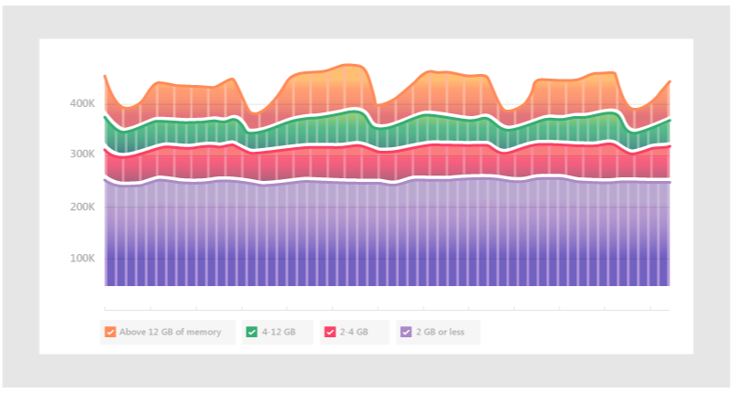

# Come viene usata la memoria in Microsoft Teams

Alcuni Microsoft Teams hanno domande su come Teams memoria. Questo articolo descrive come viene usata la memoria da Teams e perché l'applicazione desktop Teams e l'app Web Teams non impediscono l'esecuzione ottimale di altre app e carichi di lavoro nello stesso computer. Teams è progettato per usare la moderna tecnologia Web. A questo scopo, il client desktop Teams è stato sviluppato su Electron, che usa Chromium per il rendering. Questo è lo stesso motore di rendering dietro molti dei browser più diffusi di oggi, tra cui Edge e Chrome.

## Come Teams lavoro

Teams progettato su Electron consente uno sviluppo più rapido e mantiene anche la parità tra le versioni Teams in diversi sistemi operativi (Windows, Mac e Linux). Questa parità è possibile perché Electron e Chromium una base di codice simile in tutte le versioni. Un altro vantaggio di questa architettura è che esiste un profilo di utilizzo della memoria simile tra l'app Web Teams e la versione desktop. Sia l'app Web che le versioni desktop usano la memoria in modo simile a come verrebbe utilizzata da un browser. Altre informazioni su Electron sono disponibili [sul loro sito Web.](https://electronjs.org/)

Per [altre informazioni, Chromium utilizzo della](https://www.chromium.org/developers/memory-usage-backgrounder) memoria e concetti chiave in Chrome [Memory.](https://chromium.googlesource.com/chromium/src.git/+/master/docs/memory/key_concepts.md)

L'immagine seguente mostra gli utilizzi affiancati della memoria dell'app desktop Teams per Windows e dell'app Web Teams (in questo esempio, in esecuzione in Google Chrome).

## Utilizzo della memoria in Teams

È importante comprendere  il comportamento previsto di Teams quando si tratta di memoria di sistema e conoscere i sintomi di problemi di memoria di sistema davvero problematici.

### Utilizzo previsto della memoria per Teams

Se si esegue l'app desktop Teams o l'app Web Teams, Chromium rileva la quantità di memoria di sistema disponibile e ne usa una quantità sufficiente per ottimizzare l'esperienza di rendering. Quando altre app o servizi richiedono memoria di sistema, Chromium memoria a tali processi. Chromium sintonizzi l Teams di memoria su base continuativa per ottimizzare Teams prestazioni senza influire sugli altri dati attualmente in esecuzione.

In questo modo, carichi di Chromium simili possono usare quantità variabili di memoria, a seconda della quantità di memoria di sistema disponibile.

Il grafico seguente illustra l'utilizzo della memoria Teams in quattro sistemi separati, ognuno con quantità di memoria diverse disponibili. Ognuno dei sistemi sta elaborando carichi di lavoro simili (stesse app aperte ed in esecuzione).

Quando i computer hanno più memoria, Teams la memoria verrà utilizzata. Nei sistemi in cui la memoria è scarsa, Teams utilizzerà meno.

### Sintomi di problemi di memoria di sistema

Se nel computer sono visualizzati uno o più dei sintomi seguenti, potrebbe verificarsi un grave problema di memoria di sistema:

- Utilizzo elevato della memoria quando più applicazioni di grandi dimensioni vengono eseguite contemporaneamente.
- Rallentamento delle prestazioni del sistema o delle applicazioni sospese.
- Utilizzo della memoria di sistema complessivo sostenuto del 90% o superiore in tutte le app. Con questa quantità di utilizzo della memoria, Teams la memoria dovrebbe essere tornata ad altre app e carichi di lavoro. Un utilizzo sostenuto della memoria del 90% potrebbe significare che Teams memoria non viene tornata al sistema, il che indica un problema.

Le immagini seguenti mostrano esempi di visualizzazioni in Gestione attività quando l'utilizzo della memoria di sistema è anomalo.

