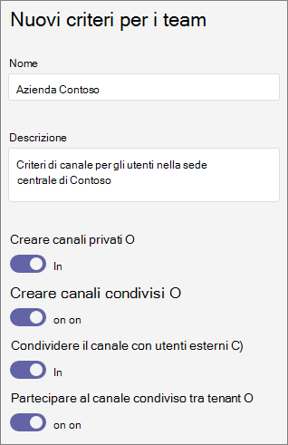

# Gestire i criteri dei team in Microsoft Teams

Gli amministratori possono usare i criteri di teams in Microsoft Teams per controllare le attività che gli utenti dell'organizzazione possono eseguire nei team e nei canali. Ad esempio, è possibile impostare se gli utenti sono autorizzati a creare canali privati.

Per gestire i criteri dei team, è **possibile accedere Teams** Teams criteri  >  **nell'Microsoft Teams** di amministrazione. È possibile usare il criterio globale (predefinito a livello di organizzazione) o creare e assegnare criteri personalizzati. Gli utenti dell'organizzazione verranno assegnati automaticamente al criterio globale, a meno che non venga creato e assegnato un criterio personalizzato.

È possibile modificare i criteri globali o creare e assegnare criteri personalizzati. Dopo aver modificato i criteri globali o aver assegnato un criterio, l'applicazione delle modifiche può richiedere alcune ore.

## Creare criteri di team personalizzati

1. Nel riquadro di spostamento sinistro dell'Microsoft Teams di amministrazione passare **a** Teams  >  **Teams criteri.**
2. Fare clic su **Aggiungi**.
3. Immettere un nome e una descrizione per il criterio.

    
4. Attivare o disattivare Crea  canali **privati,** a seconda che si voglia consentire agli utenti di creare canali privati.

5. Fare clic su **Salva**.

## Modificare un criterio di Teams

È possibile modificare i criteri globali o i criteri personalizzati creati dall'utente.

1. Nel riquadro di spostamento sinistro dell'Microsoft Teams di amministrazione passare **a** Teams  >  **Teams criteri.**
2. Selezionare il criterio facendo clic a sinistra del nome del criterio, quindi selezionare **Modifica**.
3. Attivare o disattivare le impostazioni desiderate e quindi fare clic su **Salva.**

## Assegnare criteri di team personalizzati agli utenti

[!INCLUDE [assign-policy](includes/assign-policy.md)]

## Argomenti correlati

[Canali privati in Teams](private-channels.md)

[Assegnare i criteri agli utenti in Teams](assign-policies.md)

[New-CsTeamsChannelsPolicy](/powershell/module/skype/new-csteamschannelspolicy?view=skype-ps)