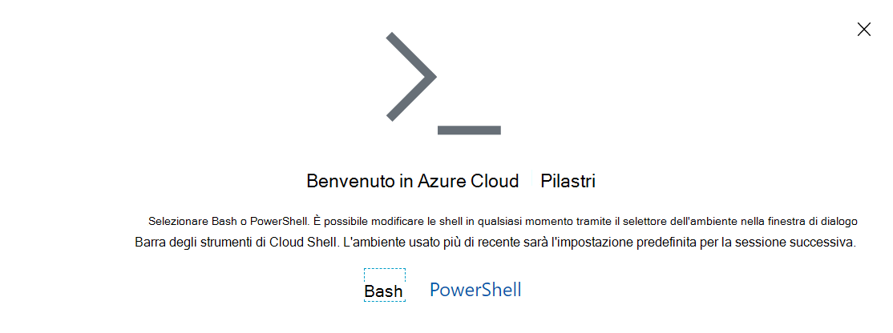

# <a name="manage-teams-with-microsoft-teams-powershell"></a>Gestire Teams con Microsoft Teams PowerShell

Questo articolo illustra come usare Microsoft Teams PowerShell per gestire Teams e Skype for Business.

Usare queste indicazioni in combinazione con il [riferimento ai cmdlet di Microsoft Teams](/powershell/teams/?view=teams-ps) e [Skype for Business riferimento ai cmdlet](/powershell/skype/intro?view=skype-ps).

Per gestire Teams nell'interfaccia di amministrazione di Teams, vedere [Gestire Teams con Azure Cloud Shell](#manage-teams-with-azure-cloud-shell).

## <a name="create-and-manage-teams-using-powershell"></a>Creare e gestire team con PowerShell

I cmdlet per la creazione e la gestione dei team si trovano nel [modulo PowerShell di Microsoft Teams](https://www.powershellgallery.com/packages/MicrosoftTeams/).

Teams è supportato da Office 365 Gruppi, quindi quando si crea un team si crea un gruppo. Sono disponibili un set di cmdlet per il funzionamento nel team principale e le relative impostazioni (, , ), la gestione degli utenti del team (``add-teamuser``, ``remove-teamuser``), nonché i cmdlet per la gestione dei canali del team (``new-teamchannel``, ``remove-teamchannel``). ``set-team````get-team````new-team`` Tutti questi cmdlet possono essere eseguiti come utenti finali, ma funzionano solo sui team di cui si è proprietari o di cui si è membri. Se si è un Amministrazione globale o un amministratore di Teams, sarà possibile agire su tutti i team dell'organizzazione.

```powershell
New-Team -DisplayName "Contoso Marketing" -Description "Collaboration space for Contoso's Marketing department"
```

> [!NOTE]
> Il **GroupId** usato nei cmdlet dei moduli di PowerShell di Microsoft Teams è lo stesso della proprietà **Identity** restituita ``Get-UnifiedGroup`` nel modulo di Exchange PowerShell.

## <a name="manage-teams-with-azure-cloud-shell"></a>Gestire Teams con Azure Cloud Shell

Cloud Shell è una shell interattiva, autenticata e accessibile dal browser che consente di gestire le risorse. Per altre informazioni su Cloud Shell, vedere [Azure Cloud Shell](/azure/cloud-shell/overview).

Per accedere ad Azure Cloud Shell e usare PowerShell per gestire Teams, accedere all'interfaccia di amministrazione di Teams.

1. Selezionare l'icona Cloud Shell nell'angolo in alto a destra.

    

1. Quando richiesto, scegliere **PowerShell**.

    

1. Eseguire il comando seguente per avviare una sessione di Teams PowerShell:

    ```powershell
    Connect-MicrosoftTeams
    ```

Dopo aver completato questi passaggi, è possibile eseguire i comandi di PowerShell di Teams.

> [!IMPORTANT]
> Se si desidera utilizzare i cmdlet Cs*, è necessario prima di tutto connettersi a Teams utilizzando il ``Connect-MicrosoftTeams -UseDeviceAuthentication`` comando.

## <a name="manage-policies-via-powershell"></a>Gestire i criteri tramite PowerShell

> [!NOTE]
> - Skype for Business Online Connector è stato consolidato in PowerShell di Teams. Attualmente è disponibile in anteprima pubblica. Nel tempo, i cmdlet di Skype for Business Online applicabili a Teams saranno disponibili in modo nativo nel modulo Teams PowerShell. I passaggi di installazione sono disponibili nell'articolo [Installare PowerShell di Teams](teams-powershell-install.md) .
> - I cmdlet saranno disponibili nella sessione di PowerShell dopo la connessione a Skype for Business Online. Per altre informazioni, vedere [Gestire Skype for Business online con Office 365 PowerShell](/office365/enterprise/powershell/manage-skype-for-business-online-with-office-365-powershell).

Trovare i cmdlet per la gestione dei criteri nel [modulo dei cmdlet di Skype for Business](/powershell/module/teams).

Un criterio è un gruppo di impostazioni che possono essere applicate in modo granulare ai singoli utenti. Ogni tipo di criterio ha un set di cmdlet specifico per creare, visualizzare, eliminare e aggiornare i criteri e quindi assegnarli agli utenti. La struttura generale è:

- **Comandi GET** (ad esempio): ``Get-CsTeamsMeetingPolicy``restituisce i documenti dei criteri che sono disponibili per l'assegnazione nell'organizzazione, inclusi i criteri creati da Microsoft da usare e i criteri personalizzati creati.
  - Per trovare solo i criteri personalizzati creati nell'organizzazione, usare ``-Filter "tag:*"``.

- **NUOVI** comandi (ad esempio): ``New-CsTeamsMeetingPolicy``crea nuovi criteri da assegnare all'organizzazione agli utenti dell'organizzazione. Non tutti i criteri supportano la creazione di criteri personalizzati. Spesso questo serve per assicurarsi che i criteri usati nell'organizzazione abbiano una combinazione supportata di impostazioni.

- **Comandi SET** (ad esempio ``Set-CsTeamsMeetingPolicy``): consente di impostare valori specifici per un determinato criterio. Alcuni criteri non hanno comandi SET disponibili o contengono parametri che non è possibile personalizzare nel criterio. Le descrizioni di PowerShell indicano quali parametri non è possibile personalizzare.
  - Per modificare il criterio che verrà assegnato per impostazione predefinita agli utenti dell'organizzazione a cui non è assegnato un criterio personalizzato, eseguire ``Set-Cs<PolicyName> -Identity Global``.

- **Comandi REMOVE** (ad esempio ``Remove-CsTeamsMeetingPolicy``): elimina un criterio personalizzato creato nel tenant. Se si elimina un criterio personalizzato assegnato ad almeno un utente dell'organizzazione, l'utente tornerà al criterio globale.
  - In realtà non è possibile rimuovere i criteri globali nell'organizzazione, ma se si vogliono reimpostare i criteri globali nell'organizzazione alle impostazioni predefinite fornite da Microsoft, eseguire ``Remove-Cs<PolicyName> -Identity Global``.

- **Comando GRANT** ( ``Grant-CsTeamsMeetingPolicy``ad esempio): assegna un criterio a un utente specifico.
  - Per rimuovere un'assegnazione di criteri personalizzata e fare in modo che l'utente torni al criterio predefinito nell'organizzazione, eseguire ``Grant-Cs<PolicyName> -Identity <User Identity> -PolicyName $null``.

> [!TIP]
> Non tutti i criteri consentono la creazione di criteri personalizzati e alcuni criteri hanno impostazioni che non è possibile personalizzare, in modo da poter visualizzare l'impostazione ma non impostare un valore personalizzato durante ``set-`` e ``new-``. La documentazione di ogni cmdlet indica se i parametri sono disponibili per l'uso da parte dei clienti.

Parametri comuni:

- **Identity**: Per ``Get-``, , ``New-````Set-``e ``Remove-``, il parametro **Identity** farà sempre riferimento a un'istanza del criterio specifica. Per ``Grant``, il parametro **Identity** fa riferimento a un oggetto utente specifico a cui viene applicato il criterio.

## <a name="manage-configurations-via-powershell"></a>Gestire le configurazioni tramite PowerShell

Trovare i cmdlet per la gestione della configurazione nel [modulo dei cmdlet di Skype for Business](/powershell/module/skype).

Le configurazioni sono bucket di impostazioni gestite nel servizio che non è possibile specificare a livello di utente. Le impostazioni si applicano sempre all'intera organizzazione. La configurazione globale è l'unica valida all'interno dell'organizzazione. Ogni tipo di configurazione include due cmdlet principali:

- ``Get-Cs<ConfigurationName>``(ad esempio): ``Get-CsTeamsClientConfiguration``

- Comandi SET (ad esempio ``Set-CsTeamsClientConfiguration``): impostare le proprietà nella configurazione di quel tipo. Specificare i parametri da modificare.
    > [!NOTE]
    > È possibile fare riferimento alla configurazione che si sta modificando in uno dei due modi seguenti: specificando -**Identity Global** o eseguendo ``Get-Cs<ConfigurationName>`` | ``Set-Cs<ConfigurationName>``.

## <a name="what-can-each-admin-role-do"></a>Cosa può fare ogni ruolo di amministratore?

Leggere [Usare i ruoli di amministratore di Microsoft Teams per gestire Teams](using-admin-roles.md) per capire quali ruoli di amministratore possono eseguire ogni cmdlet PowerShell.

## <a name="related-topics"></a>Argomenti correlati

[Installazione di Teams PowerShell](teams-powershell-install.md)

[Note sulla versione di PowerShell in Teams](teams-powershell-release-notes.md)

[Teams cmdlet reference](/powershell/teams/?view=teams-ps)

[riferimento ai cmdlet di Skype for Business](/powershell/skype/intro?view=skype-ps)

[Usare i ruoli di amministratore per gestire Teams](using-admin-roles.md)
