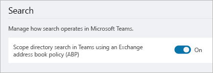

# Usare la ricerca nella directory con ambito di Microsoft TeamsUse Microsoft Teams scoped directory search

La ricerca nell'ambito di Microsoft Teams consente alle organizzazioni di creare limiti virtuali che controllano come gli utenti possono trovare e comunicare con altri utenti dell'organizzazione.Microsoft Teams scoped directory search allows organizations to create virtual boundaries that control how users can find and communicate with other users in their organization. 

Microsoft Teams consente alle organizzazioni di fornire visualizzazioni personalizzate della directory agli utenti.Microsoft Teams lets organizations provide custom views of the directory to their users. Microsoft Teams usa [criteri di protezione delle informazioni](https://docs.microsoft.com/microsoft-365/compliance/information-barriers) per supportare queste visualizzazioni personalizzate.Microsoft Teams uses [Information Barrier policies](https://docs.microsoft.com/microsoft-365/compliance/information-barriers) to support these custom views. Una volta abilitati i criteri, l'ambito dei risultati restituiti dalle ricerche di altri utenti (ad esempio per avviare una chat o per aggiungere membri a un team) verrà rientrato nell'ambito in base ai criteri configurati.Once the policies are enabled, the results returned by searches for other users (for example, to initiate a chat or to add members to a team) will be scoped according to the configured policies. Gli utenti non saranno in grado di cercare o individuare alcun team quando è attivo l'ambito di ricerca, ma i membri esistenti in questi team possono aggiungere utenti, come consentito dai criteri di protezione delle informazioni attive.Users will not be able to search or discover any teams when scoped search is in effect, but existing members in those teams can add users, as allowed by active Information Barrier policies.

> [!NOTE]
> Negli ambienti ibridi di Exchange questa caratteristica funziona solo con le cassette postali di Exchange Online e non con le cassette postali locali.In Exchange hybrid environments, this feature only works with Exchange Online mailboxes, and not with on-premises mailboxes.

## Quando usare le ricerche nella directory con ambito?When should you use scoped directory searches?

Gli scenari che traggono vantaggio dalle ricerche nella directory con ambito sono simili a quelli dei criteri della Rubrica.Scenarios that benefit from scoped directory searches are similar to address book policy scenarios. Ad esempio, è possibile usare la ricerca nella directory con ambito nelle situazioni seguenti:For example, you may want to use scoped directory search in the following situations:

- L'organizzazione ha più società all'interno del tenant che si vogliono mantenere separate.Your organization has multiple companies within its tenant that you want to keep separate. 
- L'istituto di istruzione vuole limitare le chat tra docenti e studenti.Your school wants to limit chats between faculty and students. 
 
Per informazioni su come usare i criteri della rubrica, vedere Criteri per le [barriere linguistiche in Exchange Online.](https://docs.microsoft.com/microsoft-365/compliance/information-barriers)To learn how to use address book policies, read [Information Barrier policies in Exchange Online](https://docs.microsoft.com/microsoft-365/compliance/information-barriers).

> [!IMPORTANT]
> I criteri della rubrica forniscono solo una separazione virtuale degli utenti dal punto di vista della directory.Address book policies provide only a virtual separation of users from directory perspective. È anche importante tenere presente che i dati utente già memorizzati nella cache prima dell'applicazione dei criteri della rubrica nuovi o aggiornati rimarranno disponibili per gli utenti per un massimo di 30 giorni.It is also important to note that any user data that had already been cached, prior to the enforcement of new or updated address book policies, will remain available to users for up to 30 days.

## Attivare la ricerca nella directory con ambitoTurn on scoped directory search

1. Usare i criteri di protezione delle informazioni per configurare l'organizzazione in sottogruppi virtuali.Use Information Barrier policies to configure your organization into virtual subgroups. Per altre informazioni, vedere [Definire i criteri di protezione delle informazioni.](https://docs.microsoft.com/microsoft-365/compliance/information-barriers-policies)For more information, see [Define Information Barrier policies](https://docs.microsoft.com/microsoft-365/compliance/information-barriers-policies).

2. Nell'interfaccia di amministrazione di Microsoft Teams, selezionare Impostazioni di Teams **a livello di**  >  **organizzazione.**In the Microsoft Teams admin center, select **Org-wide settings** > **Teams settings**.

3. In **Cerca,** accanto a Ricerca nella directory di ambito in Teams usando i criteri della rubrica **di Exchange (ABP),** attiva **l'interruttore.**Under **Search**, next to **Scope directory search in Teams using an Exchange address book policy (ABP)**, turn the toggle **On**.

    

> [!IMPORTANT]
> Il replica di questa modifica può richiedere alcune ore.This change can take a few hours to replicate.
