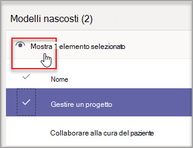
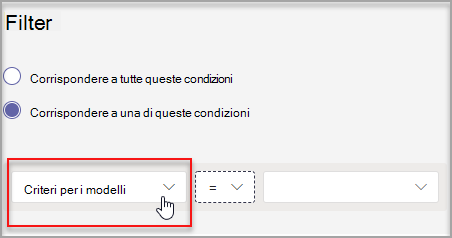

# <a name="manage-team-templates-in-the-admin-center"></a>Gestire i modelli di team nell'interfaccia di amministrazione

È possibile gestire i modelli di team visualizzati dagli utenti finali creando criteri per i modelli nell'interfaccia di amministrazione. All'interno di ogni criterio di modelli, è possibile specificare quali modelli sono visualizzati o nascosti.
Assegnare utenti diversi a criteri di modelli diversi in modo che gli utenti visualizzizzno solo il sottoinsieme di modelli di team specificati.

Guardare questo breve video per informazioni su come gestire i criteri dei modelli.

> [!VIDEO https://www.microsoft.com/videoplayer/embed/RWyXL9]

## <a name="create-templates-policies-and-assign-available-templates"></a>Creare criteri di modelli e assegnare modelli disponibili

1. Passare all'interfaccia di amministrazione di Teams.

2. Vai a **Teams** >  **Templates policies**.

3. Scegliere **Aggiungi**.

    

1. Assegnare un nome al criterio e aggiungere una breve descrizione.

2. Nell'elenco **Modelli visualizzabili** selezionare i modelli da nascondere e quindi scegliere **Nascondi**.

    

    I modelli che si è scelto di nascondere sono visualizzati nell'elenco **Modelli nascosti** .

1. Per scoprire alcuni modelli, passare all'elenco **Modelli nascosti** .

2. Selezionare i modelli da scoprire e quindi selezionare **Mostra**.

   

   I modelli selezionati verranno visualizzati nell'elenco **Modelli visualizzabili** .
3. Scegliere **Save**.

   I nuovi criteri dei modelli vengono visualizzati nell'elenco **Criteri modelli** .

## <a name="assign-templates-policies-to-users"></a>Assegnare criteri modelli agli utenti

È possibile assegnare criteri di modello direttamente agli utenti, singolarmente o in scala tramite un'assegnazione batch. Tenere presente che l'applicazione dei nuovi criteri agli utenti può richiedere fino a 24 ore.

> [!Note]
> Attualmente, l'assegnazione di criteri dei modelli agli utenti in base all'appartenenza ai gruppi, ad esempio a tutti gli utenti di un gruppo di sicurezza, non è supportata. Questa funzionalità sarà disponibile in futuro.

Per una panoramica delle modalità di assegnazione dei criteri in Teams, vedere [Assegnare criteri in Teams](policy-assignment-overview.md).

### <a name="assign-a-templates-policy-to-individual-users"></a>Assegnare criteri modelli ai singoli utenti

È possibile usare l'interfaccia di amministrazione di Teams o PowerShell per assegnare criteri di modello a un singolo utente o a un numero ridotto di utenti alla volta. Per altre informazioni, vedere [Assegnare criteri ai singoli utenti](assign-policies-users-and-groups.md#assign-a-policy-to-individual-users).

### <a name="assign-a-templates-policy-to-a-batch-of-users"></a>Assegnare criteri modelli a un batch di utenti

È possibile usare PowerShell per assegnare criteri di modello a grandi set di utenti alla volta. A tale scopo, utilizza il cmdlet [New-CsBatchPolicyAssignmentOperation](/powershell/module/teams/new-csbatchpolicyassignmentoperation) insieme a TeamsTemplatePermissionPolicy per ```PolicyType``` inviare un batch di utenti e i criteri dei modelli che vuoi assegnare. Ad esempio:

```powershell
New-CsBatchPolicyAssignmentOperation -OperationName <Any operation name> -PolicyType TeamsTemplatePermissionPolicy -PolicyName <policy name> -Identity <users identity | list of user identities>
```

Le assegnazioni vengono elaborate come operazione in background e viene generato un ID operazione per ogni batch. Puoi quindi utilizzare il cmdlet [Get-CsBatchPolicyAssignmentOperation](/powershell/module/teams/get-csbatchpolicyassignmentoperation) per tenere traccia dello stato e dello stato delle assegnazioni in un batch.

Per altre informazioni, vedere [Assegnare criteri a un batch di utenti con PowerShell](assign-policies-users-and-groups.md#use-powershell-method).

## <a name="size-limits-for-templates-policies"></a>Limiti di dimensioni per i criteri dei modelli

È possibile nascondere un massimo di 100 modelli per criterio. Il pulsante **Nascondi** è disabilitato se il criterio specificato contiene già 100 modelli nascosti.

## <a name="frequently-asked-questions"></a>Domande frequenti

**D: Se viene creato un nuovo modello, verrà incluso nei criteri?**

R: Tutti i nuovi modelli saranno visibili per impostazione predefinita. È possibile scegliere di nascondere il modello nell'interfaccia di amministrazione nella sezione Criteri modelli.

**D: Cosa succede se un modello viene eliminato?**

R: I modelli eliminati non saranno più presenti nei criteri dei modelli.

**D: È possibile assegnare più utenti a un criterio di modelli nell'interfaccia di amministrazione di Teams?**

R: Sì.

1. Nell'interfaccia di amministrazione di Teams passare a **UtentiGesti** >  utenti.
1. Nell'elenco degli utenti selezionare gli utenti da assegnare ai criteri dei modelli.
1. Selezionare **Modifica impostazioni**, quindi in **Criteri modelli** scegliere il criterio da assegnare.
1. Scegliere **Applica**.

Per altre informazioni, vedere [Assegnare criteri ai singoli utenti](assign-policies-users-and-groups.md#assign-a-policy-to-individual-users).

**D: Ricerca per categorie visualizzare tutti gli utenti assegnati a un criterio specifico?**

R: Nell'interfaccia di amministrazione di Teams:

1. Passare a **UtentiGesti** >  **gli utenti**.
2. Selezionare **Filtro**, impostare un filtro per i criteri dei modelli e quindi scegliere **Applica**.

    

**D: È possibile gestire i criteri dei modelli tramite PowerShell?**

R: No, la gestione dei criteri dei modelli in PowerShell non è supportata. Tuttavia, è possibile usare PowerShell per [assegnare criteri di modello](#assign-templates-policies-to-users) agli utenti.

**D: I criteri per i modelli sono applicabili all'istruzione e alla istruzione?**

R: No, i criteri dei modelli per l'istruzione non sono supportati.

## <a name="related-articles"></a>Articoli correlati

- [Attività iniziali con i modelli di team nell'interfaccia di amministrazione](./get-started-with-teams-templates-in-the-admin-console.md)

- [Creare un modello di team personalizzato](./create-a-team-template.md)

- [Creare un modello da un team esistente](./create-template-from-existing-team.md)

- [Creare un modello di team da un modello di team esistente](./create-template-from-existing-template.md)

- [Assegnare criteri agli utenti in Microsoft Teams - Microsoft Teams \| Microsoft Docs](./policy-assignment-overview.md)

- [New-CsBatchPolicyAssignmentOperation](/powershell/module/teams/new-csbatchpolicyassignmentoperation)
