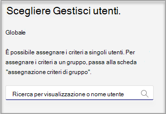

# Creare e gestire i modelli di team nell'interfaccia di amministrazione

[!INCLUDE [preview-feature](includes/preview-feature.md)]

Gestisci i modelli di team che vengono visualizzati agli utenti finali creando criteri per i modelli nell'interfaccia di amministrazione. All'interno di ogni criterio modello è possibile specificare i modelli visualizzati o nascosti.
Assegnare diversi utenti a criteri di modello diversi, in modo che gli utenti visualizzano solo il sottoinsieme dei modelli di team specificati.

## Creare criteri modello e assegnare modelli disponibili

1. Accedere all'interfaccia di amministrazione di teams.

2. Espandere i criteri dei modelli di **Teams**  >  .

3. Selezionare **Aggiungi**.

    

1. Nella sezione **Impostazioni criteri modelli** completare i campi seguenti:

    - Nome criterio modelli

    - Descrizione breve dei criteri per i modelli

2. Nella tabella **modelli visualizzabili** selezionare i modelli che si desidera nascondere e selezionare **Nascondi**.

    

    È possibile visualizzare i modelli selezionati per nasconderli nella tabella **modelli nascosti** .

1. Per scoprire alcuni modelli, scorrere fino alla tabella **modelli nascosti** .

1. Selezionare i modelli da scoprire e quindi selezionare **Mostra**.

   

   I modelli selezionati verranno visualizzati nella tabella **modelli visualizzabili** .
3. Selezionare **Salva**.

   Il nuovo criterio modello viene visualizzato nell'elenco **criteri modelli** .

## Assegnare utenti ai criteri modello

Gli utenti assegnati a un criterio saranno in grado di visualizzare solo i modelli visualizzabili all'interno di tale criterio.

1. In **criteri modelli** selezionare un criterio e quindi selezionare **Gestisci utenti**.

2. Digitare gli utenti da assegnare a questo criterio.

   

3. Selezionare **applica**.

> [!Note]
> I nuovi criteri potrebbero richiedere fino a 24 ore per applicare l'effetto agli utenti finali.

## Limiti di dimensione per i criteri modello

Puoi nascondere un massimo di 100 modelli per ogni criterio. Il pulsante **Nascondi** è disabilitato se il criterio indicato contiene già modelli di 100 nascosti.

## Domande frequenti

**D: è possibile assegnare un batch agli utenti ai criteri dei modelli di Team?**
  
A: Sì, sosteniamo l'assegnazione in batch per i criteri di modello in PowerShell. Il tipo di criterio per questa azione è TeamsTemplatePermissionPolicy. [Ulteriori informazioni](https://docs.microsoft.com/powershell/module/teams/new-csbatchpolicyassignmentoperation?view=teams-ps)

**D: i gruppi possono essere assegnati ai criteri dei modelli di Team?**

A: attualmente No. Questa funzionalità sarà disponibile in futuro.

**D: se viene creato un nuovo modello, il modello verrà incluso nei miei criteri?**

A: qualsiasi nuovo modello sarà visibile per impostazione predefinita. È possibile scegliere di nascondere il modello nell'interfaccia di amministrazione nella sezione criteri modelli.

**D: cosa succede se un modello viene eliminato?**

A: i modelli eliminati non saranno più presenti nei criteri per i modelli.

**D: è possibile assegnare più utenti a un criterio modello nell'interfaccia di amministrazione di Teams?**

A: Sì.

1. Nell'interfaccia di amministrazione accedere a **utenti**.
1. Nella tabella elenco utenti selezionare gli utenti che si desidera assegnare a determinati criteri dei modelli.
1. Selezionare Modifica impostazioni e modificare il campo criteri modelli.
1. Selezionare Applica.
   Altre informazioni [assegnare criteri agli utenti in Microsoft teams-Microsoft teams Microsoft \| docs](https://docs.microsoft.com/microsoftteams/assign-policies#assign-a-policy-to-a-batch-of-users).

**D: come si visualizzano tutti gli utenti assegnati a un criterio specifico?**

A: nell'interfaccia di amministrazione:

1. Accedere alla sezione **utenti** .
2. Selezionare il filtro nella tabella elenco utenti e filtrare per i criteri del modello teams.
3. Selezionare **applica**.

**D: è possibile gestire I criteri dei modelli tramite PowerShell?**

A: No, non è supportato.

**D: i criteri per i modelli sono applicabili a EDU?**

A: No, non è supportato.

## Argomenti correlati

- [Introduzione ai modelli di team nell'interfaccia di amministrazione](https://docs.microsoft.com/MicrosoftTeams/get-started-with-teams-templates-in-the-admin-console)

- [Creare un modello di team personalizzato](https://docs.microsoft.com/MicrosoftTeams/create-a-team-template)

- [Creare un modello da un team esistente](https://docs.microsoft.com/MicrosoftTeams/create-template-from-existing-team)

- [Creare un modello di team da un modello di Team esistente](https://docs.microsoft.com/MicrosoftTeams/create-template-from-existing-template)

- [Assegnare criteri agli utenti in Microsoft teams-Microsoft teams Microsoft \| docs](https://docs.microsoft.com/microsoftteams/assign-policies)

- [Assegnare un batch agli utenti a un criterio](https://docs.microsoft.com/powershell/module/teams/new-csbatchpolicyassignmentoperation?view=teams-ps)
