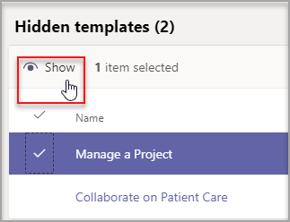

# Gestire i modelli di Teams nell'interfaccia di amministrazione

Gestire i modelli di Teams visualizzati dagli utenti finali creando criteri di modelli nell'interfaccia di amministrazione. All'interno di ogni criterio di modello è possibile specificare i modelli da visualizzare o nascondere.
Assegnare utenti diversi a criteri di modello diversi in modo che gli utenti visualizzano solo il sottoinsieme di modelli di Teams specificato.

Questo breve video illustra come gestire i criteri dei modelli.

> [!VIDEO https://www.microsoft.com/videoplayer/embed/RWyXL9]

## Creare criteri di modello e assegnare i modelli disponibili

1. Passare all'interfaccia di amministrazione di Teams.

2. Espandere Criteri **di Modelli** di  >  **Teams**.

3. Selezionare **Aggiungi**.

    

1. Nella sezione **Impostazioni criteri modelli** compilare i campi seguenti:

    - Nome dei criteri dei modelli

    - Breve descrizione dei criteri dei modelli

2. Nella tabella **Modelli visualizzabili** selezionare i modelli da nascondere e scegliere **Nascondi.**

    

    È possibile visualizzare i modelli selezionati per nasconderli nella **tabella Modelli** nascosti.

1. Per scoprire alcuni modelli, scorrere fino alla **tabella Modelli nascosti.**

2. Selezionare i modelli da scoprire e quindi selezionare **Mostra.**

   

   I modelli selezionati verranno visualizzati nella **tabella Modelli visualizzabili.**
3. Selezionare **Salva**.

   I nuovi criteri di modello vengono visualizzati **nell'elenco Criteri** modelli.

## Assegnare utenti ai criteri di modello

Gli utenti assegnati a un criterio potranno visualizzare solo i modelli visualizzabili all'interno di tale criterio.

1. In **Criteri modelli** selezionare un criterio e quindi selezionare Gestisci **utenti.**

2. Digitare gli utenti da assegnare a questo criterio.

   

3. Selezionare **Applica**.

> [!Note]
> L'applicazione del nuovo criterio per gli utenti finali potrebbe richiedere fino a 24 ore.

## Limiti delle dimensioni per i criteri di modello

È possibile nascondere un massimo di 100 modelli per criterio. Il **pulsante** Nascondi è disabilitato se il criterio specificato contiene già 100 modelli nascosti.

## Domande frequenti

**D: È possibile assegnare utenti in batch ai criteri dei modelli di team?**
  
A: Sì, l'assegnazione in batch per i criteri di modello è in PowerShell. Il tipo di criterio per questa azione è TeamsTemplatePermissionPolicy. [Ulteriori informazioni](https://docs.microsoft.com/powershell/module/teams/new-csbatchpolicyassignmentoperation)

**D: I gruppi possono essere assegnati ai criteri dei modelli di team?**

A: Attualmente no. Questa funzionalità sarà disponibile in futuro.

**D: Se viene creato un nuovo modello, il modello verrà incluso nei criteri?**

A: Tutti i nuovi modelli saranno visibili per impostazione predefinita. È possibile scegliere di nascondere il modello nell'interfaccia di amministrazione nella sezione Criteri modelli.

**D: Cosa succede se un modello viene eliminato?**

A: Tutti i modelli eliminati non saranno più presenti nei criteri dei modelli.

**D: È possibile assegnare più utenti a un criterio di modello nell'interfaccia di amministrazione di Teams?**

A: Sì.

1. Nell'interfaccia di amministrazione passare a **Utenti**.
1. Nella tabella elenco Utenti selezionare gli utenti da assegnare a un determinato criterio di modelli.
1. Selezionare Modifica impostazioni e modificare il campo Criteri modelli.
1. Selezionare Applica.
   Altre informazioni [Su come assegnare criteri agli utenti in Microsoft Teams - Microsoft Teams \| Microsoft Docs](https://docs.microsoft.com/microsoftteams/assign-policies#assign-a-policy-to-a-batch-of-users).

**D: Come si visualizzano tutti gli utenti assegnati a un criterio specifico?**

A: Nell'interfaccia di amministrazione:

1. Passare alla **sezione** Utenti.
2. Selezionare il filtro nella tabella Elenco utenti e filtrare per i criteri del modello teams.
3. Selezionare **Applica**.

**D: È possibile gestire i criteri dei modelli tramite PowerShell?**

A: No, la gestione dei modelli in PowerShell non è supportata.

**D: I criteri dei modelli sono applicabili all'EDU?**

A: No, i criteri dei modelli per EDU non sono supportati.

## Argomenti correlati

- [Introduzione ai modelli di team nell'interfaccia di amministrazione](https://docs.microsoft.com/MicrosoftTeams/get-started-with-teams-templates-in-the-admin-console)

- [Creare un modello di team personalizzato](https://docs.microsoft.com/MicrosoftTeams/create-a-team-template)

- [Creare un modello da un team esistente](https://docs.microsoft.com/MicrosoftTeams/create-template-from-existing-team)

- [Creare un modello di team da un modello di team esistente](https://docs.microsoft.com/MicrosoftTeams/create-template-from-existing-template)

- [Assegnare criteri agli utenti in Microsoft Teams - Microsoft Teams \| Microsoft Docs](https://docs.microsoft.com/microsoftteams/assign-policies)

- [Assegnare utenti a un criterio in batch](https://docs.microsoft.com/powershell/module/teams/new-csbatchpolicyassignmentoperation)
