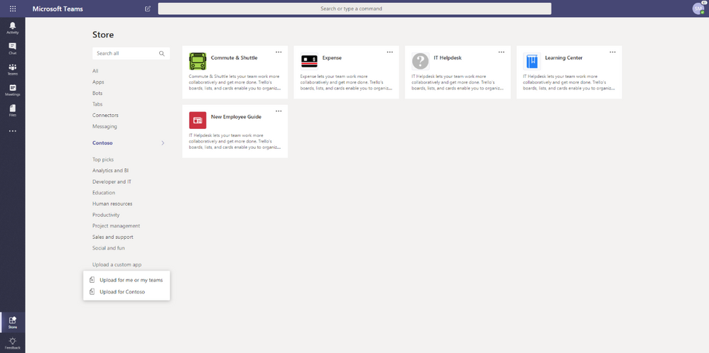
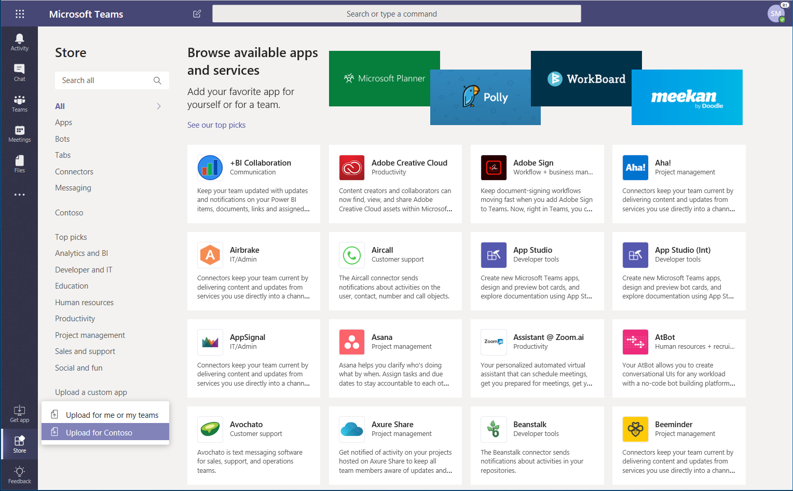
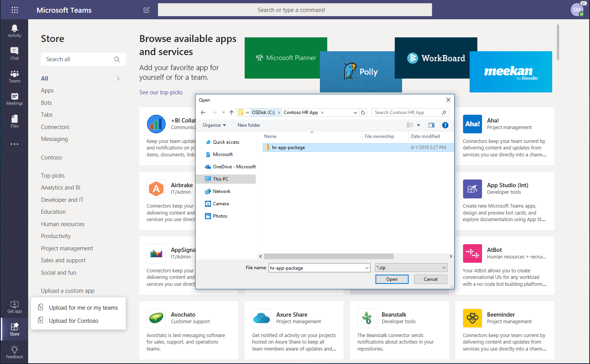
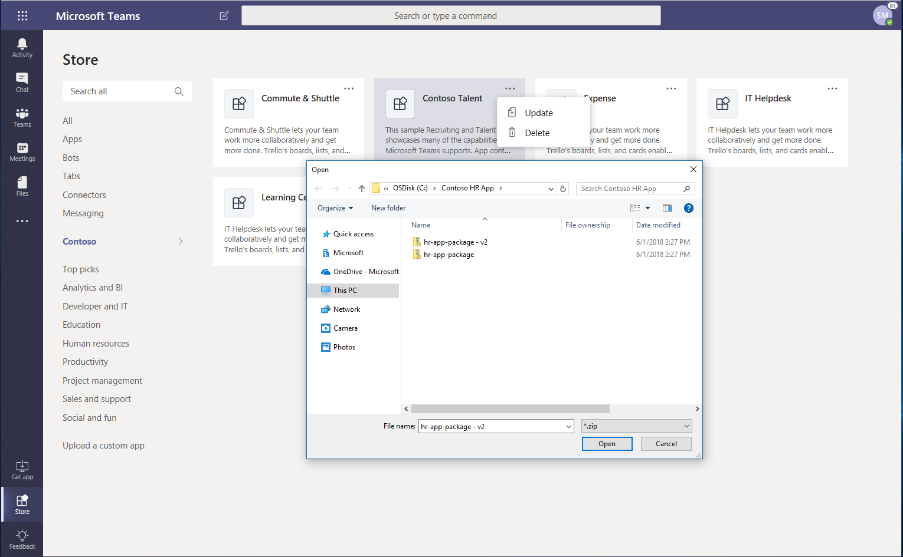
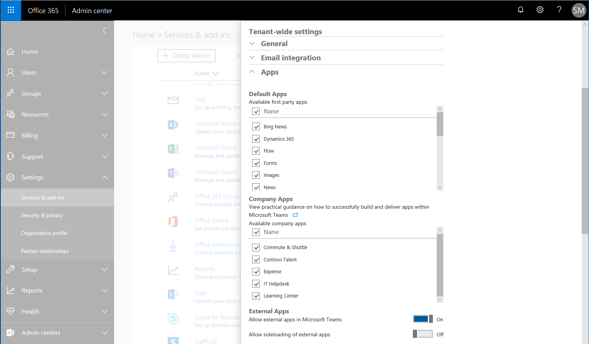

Pubblicare app nel catalogo delle app del tenant di Microsoft Teams
=======================================================

È possibile usare il catalogo delle app del tenant di Microsoft teams per testare e distribuire le applicazioni line-of-business alla propria organizzazione.

Il catalogo delle app tenant teams consente di distribuire applicazioni line-of-business costruite appositamente per l'organizzazione e di affidarsi alle funzioni aziendali critiche.

Per pubblicare app per l'organizzazione, accedere al client teams usando un account con l'amministratore globale o i ruoli di amministratore del servizio teams e quindi seguire le istruzioni riportate di seguito.

## Pubblicare un'app nel catalogo delle app tenant dal client Teams

> [!NOTE]
> È necessario avere effettuato l'accesso al client Microsoft teams con un account che include l'amministratore globale o il ruolo di amministratore del servizio teams abilitato per pubblicare le app per l'organizzazione. Leggi altre informazioni sull' [uso dei ruoli di amministratore per gestire i team](https://docs.microsoft.com/MicrosoftTeams/using-admin-roles).

### Ottenere un pacchetto dell'app Teams

Viene creato un pacchetto dell'app teams con [Teams App Studio](https://docs.microsoft.com/microsoftteams/platform/get-started/get-started-app-studio). Una volta che hai il pacchetto dell'app, puoi aggiungerlo al catalogo dell'app Enterprise. Mentre tutti gli utenti del tenant possono visualizzare il catalogo delle app, solo gli amministratori globali e i servizi di teams hanno la possibilità di pubblicarli e gestirli.

### Vai al catalogo delle app tenant

Avviare il client Microsoft teams ed eseguire l'accesso usando le credenziali di amministratore del servizio globale o teams. Seleziona **app** sul lato sinistro dell'app e quindi seleziona la nuova sezione denominata per l'organizzazione specifica (in questo esempio, contoso). Gli utenti dell'organizzazione possono visualizzare le app nel catalogo e installarle per i team di cui fanno parte.

### Aggiungere un'app al catalogo delle app tenant

1. Nella pagina **app** selezionare **carica un caricamento di un'app** > personalizzata**per contoso**.

    

    Puoi anche scegliere **carica per me o i miei team**, che si chiama *sideload*. Sideload rende l'app disponibile solo per i team o per i team selezionati.)

2. Passare al pacchetto dell'app e selezionarlo e quindi fare clic su **Apri**.

    

Quando si torna al catalogo delle app tenant, la nuova app Enterprise sarà presente. Ricordati che solo tu e i membri dell'organizzazione hai accesso a questo catalogo app.

### Aggiornare un'app nel catalogo delle app tenant

1. Dal catalogo delle app tenant selezionare "**...**" nell'angolo in alto a destra dell'app che vuoi aggiornare.

2. Passare al pacchetto dell'app aggiornata e selezionarlo e quindi fare clic su **Apri**.

    

L'app verrà aggiornata alla versione 2,0. Puoi anche eliminare l'app per l'intera società da questo menu.

## Usare il portale di amministrazione di Office 365 per gestire il catalogo delle app tenant

Se si hanno app che necessitano di correzioni di bug, è possibile disabilitare temporaneamente le app tramite l'interfaccia di amministrazione di Microsoft 365 > i**criteri di autorizzazione** delle**app** > Teams dell'interfaccia di **Amministrazione** > teams > <il nome del criterio, ad esempio "Global (org-Wide default)" > **app tenant** > bloccare app specifiche e consentire a tutti gli altri utenti di aggiungere l'app all'elenco.

La disattivazione di un'app impedirà agli utenti di interagire con l'app, senza eliminare completamente l'app. Questi controlli offrono maggiore flessibilità e controllo per la gestione delle app nell'organizzazione.
