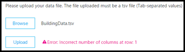

# Attivare e usare la chiamata Quality dashboard per Microsoft teams e Skype for business onlineTurn on and use Call Quality Dashboard for Microsoft Teams and Skype for Business Online

Informazioni su come configurare l'organizzazione di Office 365 in modo da usare il dashboard qualità chiamata per monitorare la qualità delle chiamate.Learn how to configure your Office 365 organization to use the Call Quality Dashboard to monitor call quality.
  
Call Quality Dashboard (Call Quality Dashboard) offre informazioni sulla qualità delle chiamate effettuate con i servizi Microsoft teams e Skype for business online.Call Quality Dashboard (CQD) provides insight into the quality of calls made using Microsoft Teams and Skype for Business Online services. In questo argomento vengono illustrati i passaggi per iniziare a raccogliere i dati che è possibile usare per risolvere i problemi di qualità delle chiamate.This topic describes the steps to start collecting data you can use to troubleshoot call quality issues.

Attualmente, Advanced Call Quality dashboard e Call Quality dashboard sono entrambi disponibili per l'uso.Currently, Advanced CQD and CQD are both available for use. Advanced Call Quality dashboard è disponibile all' https://cqd.teams.microsoft.comindirizzo.Advanced CQD is available at https://cqd.teams.microsoft.com. Nuovo URL, ma lo stesso accesso con le credenziali di amministratore.New URL but the same log in with your administrator credentials.

## Ultime modifiche e aggiornamentiLatest changes and updates

L'aggiornamento di Call Quality Dashboard (a partire dall'inizio di novembre 2019) offre un dashboard di Call Quality dashboard quasi in tempo reale.The updated CQD (as of early November 2019) delivers a Near Real-Time CQD dashboard. I dati di Call Quality dashboard sono ora disponibili in media in 30 minuti (in confronto alla Call Quality dashboard precedente, in media 24 ore).CQD data is now available on average in 30 minutes (in comparison to the previous CQD which is on average of 24 hours).  L'aggiornamento di Call Quality dashboard usa le informazioni di identificazione dell'utente finale (EUII), dando agli amministratori la possibilità di eseguire il drill-down e lo zoom avanti fino al livello dell'utente.The updated CQD uses End User Identifiable Information (EUII), giving admins the ability to drill down and zoom in to the user level. È inoltre possibile segnalare l'interattività per supportare nuovi scenari, ad esempio:There is also report interactivity to support new scenarios such as:

- Qualità delle chiamate per area geografica:Call Quality by Region:
  - Data per area geograficadate-by-region
  - aggregato fino a ora per area geograficaaggregated down to hour-by-region
  - posizioni specifichespecific locations
  - subnet specificaspecific subnet
  - utente o utenti interessatiimpacted user or users

- Affidabilità delle chiamate/errore per area geografica:Call Reliability/Failure by Region:
  - Data per area geograficadate-by-region
  - aggregato fino a ora per area geograficaaggregated down to hour-by-region
  - posizioni specifichespecific locations
  - subnet specificaspecific subnet
  - utente o utenti interessatiimpacted user or users

- Valuta la mia chiamata (RMC) per area geografica: da mese per area geografica aggregata fino a posizioni specifiche per gli utenti che prevedono valutazioni RMC basse.Rate My Call (RMC) by Region: from month-by-region aggregated down to specific locations to users who provide low RMC ratings. Call Quality dashboard v3 include anche feedback Verbatim.CQD v3 also includes verbatim feedback.
- Helpdesk: disponibile per un utente specifico su chiamate o riunioni P2P oppure per tutti i partecipanti e i dettagli delle chiamate.Helpdesk: available for a specific user on P2P calls or Meetings, or for all participants and call details. Consente di identificare i possibili problemi di sistema in base a posizione di rete, dispositivi o firmware.Helps identify possible system issues based on network location, devices, or firmware.  
- Versioni client: visualizzare la sessione e gli utenti conta per ogni versione del client oppure eseguire il drill-down in nomi utente per ogni versione del client.Client Versions: View the Session and Users counts for each Client Version, or drill down to User names for each client version. I filtri predefiniti per il tipo di prodotto e client consentono di mettere a punto le versioni a specifici client.Pre-built filters for Product and Client Type help focus the versions to specific clients.
- Endpoint: Mostra gli endpoint del computer mappati per creare/modellare il PC/Mac.Endpoints: Shows Machine Endpoints mapped to Make/Model of the PC/Mac. Mostra la qualità aggregata per creazione/modello.Shows aggregated quality by Make/Model. I dati di mapping vengono caricati in modo simile alla creazione di dati.Mapping data is uploaded similar to Building data.

Advanced Call Quality Dashboard (v3) offre anche il supporto RBAC, se EUII Access non è disponibile.Advanced CQD (V3) also provides RBAC support, in case EUII access is not available.  

Un amministratore può gestire Skype for Business Server 2019 (non solo Skype for business online e Microsoft Teams) tramite Call Quality dashboard versione 3.An admin can manage Skype for Business Server 2019 (not just Skype for Business Online and Microsoft Teams) through CQD version 3. Questo richiede un'implementazione ibrida e l'uso del connettore dati chiamata.This requires a hybrid implementation and the use of Call Data Connector. Per altre informazioni, vedere [pianificare il connettore dati](/SkypeForBusiness/hybrid/plan-call-data-connector) per le chiamate.See [Plan Call Data Connector](/SkypeForBusiness/hybrid/plan-call-data-connector) for more information.

Call Quality dashboard versione 2 aggiunta:CQD version 2 added:

- Dati per Microsoft teams e Skype for business onlineData for Microsoft Teams and Skype for Business Online
- I report di riepilogo includono un filtro prodotto per selezionare tutti i dati, i dati di Microsoft teams o i dati di Skype for business onlineSummary reports include a product filter to select all data, Microsoft Teams data, or Skype for Business Online data
- Aggiornamento della logica di classificazione della qualità del flusso video e VBSS.Updated Video and VBSS stream quality classification logic. Vedere la [classificazione del flusso nel dashboard qualità chiamata](stream-classification-in-call-quality-dashboard.md) per le definizioni del classificatore.Refer to [Stream Classification in Call Quality Dashboard](stream-classification-in-call-quality-dashboard.md) for the classifier definitions.

Fare riferimento a questo articolo per un elenco di [dimensioni e misure disponibili nel dashboard qualità chiamata](dimensions-and-measures-available-in-call-quality-dashboard.md).Refer to this article for a list of [Dimensions and measures available in Call Quality Dashboard](dimensions-and-measures-available-in-call-quality-dashboard.md).
  
> [!NOTE]
> Per visualizzare le informazioni sugli aggiornamenti e le modifiche apportate al dashboard, fare clic sul collegamento nella **buona notizia.**To see information about updates and changes to the dashboard,  click the link in the **Good news!** banner quando viene visualizzato nel dashboard.banner when it displays on the dashboard.

Call Quality dashboard versione 1 ha fornito agli amministratori di Skype for Business Server 2015 le caratteristiche seguenti:CQD version 1 provided Skype for Business Server 2015 admins the following features:

- Accesso ai dati del report memorizzati nella cache per l'accesso rapidoAccess to cached report data for fast access
- Collegamenti profondi alle pagine del report per informazioni sulla condivisione e la pubblicazioneDeep links to report pages for sharing and publishing information
- Modifica e creazione di report semplificati e metadati modificabili per le descrizioni dei reportStreamlined report editing and creation, and editable metadata for report descriptions
- API Web che forniscono l'accesso a livello di codice ai dati del cubo per l'uso nei dashboard personalizzatiWeb APIs that give programmatic access to the cube data for use in custom dashboards

## Dati di Call Quality dashboard near-Real-Time (NRT)CQD Near-Real-Time (NRT) Data

Advanced Call Quality Dashboard (v3, rilasciata il 2019 novembre) usa un feed di dati quasi in tempo reale.Advanced CQD (V3, released November 2019) uses a near-real-time data feed. I record di chiamata sono disponibili presso il portale di Call Quality dashboard entro 30 minuti dalla fine della chiamata.Call Records are available at the CQD portal within 30 minutes of the end of the call. I record di chiamata della pipeline NRT sono disponibili solo per alcuni mesi prima di essere rimossi dal set di dati.Call Records from the NRT pipeline are only available for a few months before they are removed from the data set. Call Quality dashboard V3 unisce i dati della pipeline V2 corrente con i dati della NRT della pipeline V3.CQD v3 merges data from the current v2 pipeline with NRT data from the v3 pipeline. Le query sui portali V2 e V3 per i dati del periodo di archiviazione producono gli stessi risultati.Queries on the v2 and v3 portals for the data from the Archival period produce the same results. Le query di dati V2 e V3 per i dati NRT e NRT data + PII periodi saranno diverse.V2 and v3 data queries for the NRT Data and NRT Data + PII periods will be different.

### Dati personali/EUIIPII/EUII Data

I dati PII o EUII provengono solo dalla pipeline V3.PII or EUII data only comes from the v3 pipeline. A causa di motivi di conformità, i dati personali/EUII vengono conservati solo per 30 giorni.Due to compliance reasons, PII/EUII data is only kept for 30 days. Dato che i dati della NRT attraversano il contrassegno di 30 giorni, i campi PII/EUII vengono cancellati, ottenendo dati della NRT senza informazioni personali.As NRT data crosses the 30-day mark, the PII/EUII fields are cleared out, resulting in PII-free NRT data. I campi PII/EUII sono:The PII/EUII fields are:

- Indirizzo IP completoFull IP address
- Indirizzo MAC (Media Access Control)Media Access Control (MAC) Address
- ID set di servizi di base (BSSID)Basic Service Set identifier (BSSID)
- URI SIP (Session Initiation Protocol) (solo Skype for business)Session Initiation Protocol (SIP) URI (Skype for Business only)
- Nome dell'entità utente (UPN)User Principal Name (UPN)
- Nome endpoint computerMachine Endpoint Name
- Feedback Verbatim dell'utenteUser Verbatim Feedback
- ID oggetto (l'ID oggetto Active Directory dell'utente dell'endpoint)Object ID (the Active Directory object ID of the endpoint's user)

### Controlli dataDate controls

Call Quality dashboard V3 aggiunge i nuovi tipi di tendenza a rotazione seguenti:CQD v3 adds the following new Rolling Trend types:

- 5 giorni5-day
- 7 giorni7-day
- 30 giorni30-day
- 60-giorno60-day
- 90-giorno90-day

Il parametro data URL ora può accettare un campo Day.The URL Date parameter can now accept a Day field. I report di giorni lavorativi usano le date specificate nel formato AAAA-MM-DD come ultimo giorno della tendenza.Rolling-day reports use dates specified in the YYYY-MM-DD format as the last day of the trend.  Il parametro data URL "00" indica "oggi".The URL Date parameter “00”  indicates “today”.

|URLURL| Data di fine dell'andamento del giorno di rotolamentoEnd date of Rolling Day Trend|
|:---|:---|
|https://<cqdv3>/SPD/#/Dashboard/<reportid>/2019-02/https://<cqdv3>/spd/#/Dashboard/<reportid>/2019-02/   |Giorno corrente di feb 2019Current Day of Feb 2019|
|https://<cqdv3>/SPD/#/Dashboard/<reportid>/2019-02-15/https://<cqdv3>/spd/#/Dashboard/<reportid>/2019-02-15/|15 feb 2019Feb 15, 2019|
|https://<cqdv3>/SPD/#/dashboard/<reportid>/00/https://<cqdv3>/spd/#/Dashboard/<reportid>/00/        |Giorno correnteCurrent Day|
|||

Per impostazione predefinita, il giorno corrente del mese viene usato come ultimo giorno dell'andamento del giorno di rotolamento.By default the current day of the month is used as the last day of the Rolling Day Trend.

### Funzionalità drill-throughDrill Thru Functionality

Call Quality dashboard V3 supporta l'uso dei campi drill-through o drill-down nei report SPD.CQD v3 supports the use of drill through or drill-down fields in SPD reports. Se sono selezionati questi campi di dimensione, il report apre automaticamente una scheda report diversa e filtra il valore selezionato.If these dimension fields are selected,  the report automatically opens a different report tab and filters on the selected value. I campi con il filtro drill-through assegnato sono distinti da un'icona di cursore diversa (il puntatore) quando si passa il mouse su di essi.Fields with an assigned drill through filter are distinguished by a different cursor icon (the pointer) when you hover over them.

Quando viene selezionato un campo drill-through, il dashboard passa automaticamente alla nuova scheda specificata e applica un filtro con il valore selezionato.When a drill through field is selected, the Dashboard automatically navigates to the new, specified tab and applies a filter with the selected value. Se la scheda include i campi drill-through personalizzati e uno è selezionato, i filtri drill-through precedenti e quelli nuovi vengono propagati in avanti.If that tab has its own drill through fields and one is selected, the previous drill through filters and the new one all propagate forward. In questo modo è possibile creare un report che limita progressivamente il set di dati risultante.This allows you to build a report that progressively narrows the resulting data set.

Ad esempio, in un report drill-through di qualità delle chiamate, un utente può fare clic sulla data a cui si vuole eseguire il drill-through, che porta alla scheda posizione.For example, in a Call quality drill-through report, a user can click the date they would like to 'drill-through', which leads to the Location tab.

È possibile aggiungere più date dalla scheda posizione, ad esempio l'aggiunta di 2019-09-22 alla data: 2019-09-24:You can add multiple dates from the location tab, such as adding 2019-09-22 to Date: 2019-09-24: 

> [!NOTE]
> Non passare direttamente all'ultima scheda. Senza filtri selezionati da un precedente drill-through i risultati sarebbero troppo grandi per essere visualizzati in una tabella.Don't jump directly to the last tab. Without filters selected from a previous drill-through the results would be too large to show on a table.

## Attivare i report di riepilogo di Microsoft Call Quality Dashboard (Call Quality Dashboard)Activate Microsoft Call Quality Dashboard (CQD) Summary Reports

Prima di poter iniziare a usare Call Quality dashboard, attivarlo per l'organizzazione di Office 365 come segue:Before you can start using CQD, activate it for your Office 365 organization as follows:

 Microsoft teams con l'interfaccia di amministrazione di **Microsoft teams** **Using the Microsoft Teams admin center**

1. Accedere all'organizzazione di Office 365 tramite l'account di amministratore del servizio Microsoft teams e quindi selezionare il riquadro **amministratore** per aprire l'interfaccia di amministrazione.Sign in to your Office 365 organization using Microsoft Teams service admin account, and then select the **Admin** tile to open the Admin center.
2. Nel riquadro sinistro, in **centri di amministrazione**, selezionare **Microsoft teams** per aprire l'interfaccia di amministrazione di Microsoft teams.In the left pane, under **Admin centers**, select **Microsoft Teams** to open the Microsoft Teams admin center.
3. Nell'interfaccia di amministrazione di Microsoft teams selezionare **chiamata dashboard qualità** nel riquadro sinistro.In the Microsoft Teams admin center, select **Call quality dashboard** in the left pane.
4. \(Nella pagina che apre https://CQD.teams.Microsoft.com\)fare clic su **Accedi** e immettere l'account di amministratore globale o le informazioni dell'account di amministratore del servizio Microsoft teams.On the page that opens \(https://cqd.teams.microsoft.com\), click **Sign in** and enter your Global Administrator account or Microsoft Teams Service Admin account information.

    
  
Dopo aver effettuato l'accesso, una volta attivato, Call Quality dashboard inizierà a raccogliere ed elaborare i dati.After you sign in, once activated, the CQD will begin collecting and processing data.  
> [!NOTE]
> Potrebbe essere necessario uno o più ore per elaborare dati sufficienti per visualizzare i risultati significativi nei report.It may take one or more hours to process enough data to display meaningful results in the reports.

 Skype for business **con il portale legacy di Skype for business** **Using the Skype for Business legacy portal**

1. Accedere all'organizzazione di Office 365 con un account di amministratore e quindi selezionare il riquadro **amministratore** per aprire l'interfaccia di amministrazione.Sign in to your Office 365 organization using an admin account, and then select the **Admin** tile to open the Admin center.
2. Nel riquadro sinistro, in **centri di amministrazione**, selezionare **Microsoft teams** per aprire l'interfaccia di amministrazione di Microsoft teams.In the left pane, under **Admin centers**, select **Microsoft Teams** to open the Microsoft Teams admin center.
3. Nell'interfaccia di amministrazione di Microsoft teams selezionare **portale legacy** nel riquadro sinistro, selezionare **strumenti**e quindi selezionare **Skype for business online Call Quality dashboard**.In the Microsoft Teams admin center, select **Legacy Portal** in the left pane, select **Tools**, and then select **Skype for Business Online Call Quality Dashboard**.

     

4. Nella pagina visualizzata accedere con l'account di amministratore globale e quindi specificare le credenziali per l'account quando richiesto.On the page that opens, sign in with your Global Administrator account, and then provide the credentials for the account when prompted.

Dopo aver effettuato l'accesso, una volta attivato, il dashboard qualità chiamata inizierà a raccogliere ed elaborare i dati.After you sign in, once activated, the Call Quality Dashboard will begin collecting and processing data.

## Caratteristiche del dashboard qualità chiamata per Microsoft teams e Skype for business onlineFeatures of the Call Quality Dashboard for Microsoft Teams and Skype for Business Online

I report di riepilogo di Call Quality dashboard includono un sottoinsieme delle funzionalità pianificate per i report dettagliati.CQD Summary Reports provide a subset of the features planned for Detailed Reports. Di seguito sono riepilogate le differenze tra le edizioni:The differences between the editions are summarized here:
  
|FunzionalitàFeature|Report di riepilogoSummary Reports|Report dettagliatiDetailed Reports|
|:--- |:--- |:--- |
|Metrica di condivisione applicazioniApplication sharing metric | NoNo | SìYes |
|Supporto per informazioni sulla creazione di clientiCustomer building information support | SìYes | Supporto per più paesiYes |
|Supporto per le informazioni sull'endpoint clienteCustomer endpoint information support | Solo in CQD.teams.Microsoft.comOnly in cqd.teams.microsoft.com | Solo in CQD.teams.Microsoft.comOnly in cqd.teams.microsoft.com |
|Supporto analisi drill-downDrill down analysis support   | NoNo   | SìYes   |
|Metriche per l'affidabilità multimedialeMedia reliability metrics   | NoNo   | SìYes   |
|Report di out-of-the-boxOut-of-the-box reports   | SìYes   | Supporto per più paesiYes   |
|Report generaliOverview reports   | SìYes   | Supporto per più paesiYes   |
|Set di report per utentePer-user report set   | NoNo   | SìYes   |
|Personalizzazione del set di report (aggiunta, eliminazione, modifica di report)Report set customization (add, delete, modify reports)   | NoNo   | SìYes   |
|Metriche di condivisione dello schermo basate su videoVideo-based screen sharing metrics   | NoNo   | SìYes   |
|Metriche videoVideo metrics   | NoNo   | SìYes   |
|Quantità di dati disponibiliAmount of data available   | Ultimi 6 mesiLast 6 months   | Ultimi 6 mesiLast 6 months   |
|Dati di Microsoft TeamsMicrosoft Teams data   | SìYes   | Supporto per più paesiYes   |
| | | |

### Report di out-of-the-boxOut-of-the-box reports

Tutte le edizioni di Call Quality dashboard offrono un'esperienza che consente di definire le metriche di qualità senza la necessità di creare nuovi report.All editions of CQD provide an experience that gives you call quality metrics without the need to create new reports. Una volta elaborati i dati nel back-end, vengono visualizzati i dati relativi alla qualità delle chiamate nei report.Once data is processed in the back-end, you see call quality data in the reports.
  
### Report generaliOverview reports

Tutte le edizioni di Call Quality dashboard costituiscono un punto di ingresso di alto livello per le informazioni generali sulla qualità delle chiamate, ma il modo in cui vengono presentate le informazioni in rapporti di riepilogo è diverso dai report dettagliati.All editions of the CQD provide a high-level entry point to the overall call quality information, but the way information is presented in Summary Reports is different from Detailed Reports.  
  
I report di riepilogo includono una visualizzazione semplificata del report di pagina in cui è possibile esplorare e comprendere rapidamente lo stato e le tendenze generali della qualità delle chiamate.Summary Reports provide a simplified tabbed page report view so you can quickly browse and understand the overall call quality status and trends.

Le quattro schede includono:The four tabs include:
  
- **Qualità complessiva delle chiamate** : fornisce informazioni su tutti i flussi, un'aggregazione che mostra le tendenze mensili e quotidiane per**Overall Call Quality** — provides information about all streams, which is an aggregation that shows monthly and daily trends for:
  - Flussi client serverServer-Client streams
  - Flussi client clientClient-Client streams
  - Flussi distinti client e client server-clientSeparate Server-Client and Client-Client streams
- **Server-client** : fornisce dettagli per i flussi tra endpoint server e client.**Server—Client** — provides details for the streams between Server and Client endpoints.
- **Client-client** : fornisce dettagli per i flussi tra due endpoint client.**Client—Client** — provides details for the streams between two Client endpoints.
- **SLA qualità vocale** : fornisce informazioni sulle chiamate incluse nell'SLA sulla qualità vocale di Skype for business online.**Voice Quality SLA** — provides information about calls that are included in the Skype for Business Online Voice Quality SLA.

> [!NOTE]
> Call Quality dashboard versione 3 funziona con Microsoft teams, Skype for business online e Skype for Business Server.CQD Version 3 works with Microsoft Teams, Skype for Business Online, and Skype for Business Server. Per usare Call Quality Dashboard con Skype for Business Server 2019, sarà necessario configurare il [connettore dati chiamata](https://docs.microsoft.com/skypeforbusiness/hybrid/configure-call-data-connector).To use CQD with Skype for Business Server 2019, you will have to [Configure Call Data Connector](https://docs.microsoft.com/skypeforbusiness/hybrid/configure-call-data-connector). Vedere [pianificare il connettore dati chiamata](https://docs.microsoft.com/skypeforbusiness/hybrid/plan-call-data-connector) prima di iniziare.See [Plan Call Data Connector](https://docs.microsoft.com/skypeforbusiness/hybrid/plan-call-data-connector) before you start.

- Qualità delle chiamate per area geografica:Call Quality by Region:

  - Data per area geograficadate-by-region
  - aggregato fino a ora per area geograficaaggregated down to hour-by-region
  - posizioni specifichespecific locations
  - subnet specificaspecific subnet
  - utente o utenti interessatiimpacted user or users

- Affidabilità delle chiamate/errore per area geografica:Call Reliability/Failure by Region:
  - Data per area geograficadate-by-region
  - aggregato fino a ora per area geograficaaggregated down to hour-by-region
  - posizioni specifichespecific locations
  - subnet specificaspecific subnet
  - utente o utenti interessatiimpacted user or users

- Valuta la mia chiamata (RMC) per area geografica: da mese per area geografica aggregata fino a posizioni specifiche per gli utenti che prevedono valutazioni RMC basse.Rate My Call (RMC) by Region: from month-by-region aggregated down to specific locations to users who provide low RMC ratings. Call Quality dashboard v3 include anche feedback Verbatim.CQD v3 also includes verbatim feedback.
- Helpdesk: disponibile per un utente specifico su chiamate o riunioni P2P oppure per tutti i partecipanti e i dettagli delle chiamate.Helpdesk: available for a specific user on P2P calls or Meetings, or for all participants and call details. Consente di identificare i possibili problemi di sistema in base a posizione di rete, dispositivi o firmware.Helps identify possible system issues based on network location, devices, or firmware.  
- Versioni client: visualizzare la sessione e gli utenti conta per ogni versione del client oppure eseguire il drill-down in nomi utente per ogni versione del client.Client Versions: View the Session and Users counts for each Client Version, or drill down to User names for each client version. I filtri predefiniti per il tipo di prodotto e client consentono di mettere a punto le versioni a specifici client.Pre-built filters for Product and Client Type help focus the versions to specific clients.
- Endpoint: Mostra gli endpoint del computer mappati per creare/modellare il PC/Mac.Endpoints: Shows Machine Endpoints mapped to Make/Model of the PC/Mac. Mostra la qualità aggregata per creazione/modello.Shows aggregated quality by Make/Model. I dati di mapping vengono caricati in modo simile alla creazione di dati.Mapping data is uploaded similar to Building data.

### Scheda qualità complessiva delle chiamateOverall Call Quality tab

Usare i dati in questa scheda per valutare lo stato di qualità delle chiamate e le tendenze in base a conteggi flusso e percentuali scadenti.Use the data on this tab to evaluate call quality status and trends based on stream counts and poor percentages. La legenda nell'angolo in alto a destra mostra il colore e gli elementi visivi che rappresentano queste metriche.The legend in the upper-right corner shows which color and visual elements represent these metrics.
  

  
I flussi sono classificati in tre gruppi: Buono, scadente e non classificato.Streams are classified in three groups: Good, Poor, and Unclassified. Vengono inoltre calcolati valori di *% poveri* che consentono di ottenere il rapporto tra i flussi classificati come *poveri* e il conteggio totale del flusso classificato.There are also calculated  *Poor %*  values that give you the ratio of streams classified as *Poor*  to the total classified stream count. Poiché il *povero% = flussi poveri/(flussi poveri + flussi buoni) \* 100*, il *povero%* non è influenzato dalla presenza di più flussi non *classificati* .Since *Poor % = Poor streams/ (Poor streams+ Good streams) \* 100*, the *Poor %*  is unaffected by the presence of multiple *Unclassified*  streams. Per vedere cosa classifica un flusso come scadente o valido, vedere classificazione dello [Stream nel dashboard qualità chiamata](stream-classification-in-call-quality-dashboard.md).To see what classifies a stream as poor or good, refer to [Stream Classification in Call Quality Dashboard](stream-classification-in-call-quality-dashboard.md).
  
Usare la scala a sinistra per misurare i valori del conteggio del flusso.Use the scale on the left to measure the stream count values.
  

  
Usare la scala a destra per misurare i valori di% poveri.Use the scale on the right to measure the Poor % values.
  

  
Puoi anche ottenere i valori numerici effettivi passando il puntatore del mouse su una barra.You can also obtain the actual numerical values by hovering the mouse over a bar.
  
> [!NOTE]
> L'esempio seguente è costituito da un set di dati di esempio molto piccolo e i valori non sono realistici per una distribuzione effettiva.The following example is from a very small sample data set, and the values aren't realistic for an actual deployment.
  

  
Il volume complessivo del flusso consente di determinare la pertinenza delle percentuali di scarsità calcolate.The overall stream volume helps determine how relevant the calculated Poor percentages are. Minore è il volume dei flussi generali, meno affidabili sono i valori di percentuale di scarsità segnalati.The smaller the volume of overall streams, the less reliable the reported Poor percentage values are.
  
### Scheda client-server e schede client-clientServer-Client tab and Client-Client tabs

Queste due schede includono dettagli per i flussi che hanno avuto luogo negli scenari endpoint-to-endpoint.These two tabs provide details for the streams that took place in their endpoint-to-endpoint scenarios. La scheda Server-client include quattro sezioni comprimibili che rappresentano quattro scenari in cui i flussi multimediali scorrono.The Server-Client tab has four collapsible sections  that represent four scenarios under which media streams would flow.
  
- Cablato all'internoWired Inside
- Cablata all'esternoWired Outside
- WiFi all'internoWifi Inside
- WiFi all'esternoWifi Outside

Analogamente, la scheda client-client contiene cinque sezioni comprimibili:Similarly, the Client-Client tab has five collapsible sections:

- Cablato all'interno: cablato all'internoWired Inside — Wired Inside
- Cablata all'interno: esterna cablataWired Inside — Wired Outside
- Esterno cablato: collegato all'esternoWired Outside — Wired Outside
- Cablato all'interno: WiFi all'internoWired Inside — Wifi Inside
- Cablata all'interno: WiFi all'esternoWired Inside — Wifi Outside

#### Test all'internoInside Test

Durante l'elaborazione, il back-end Call Quality Dashboard classifica un flusso come *all'interno* o *all'esterno* usando le informazioni sulla creazione, se esiste.During processing, the CQD back-end classifies a stream as  *Inside*  or *Outside*  using Building information, if it exists. Gli endpoint di ogni flusso sono associati a un indirizzo di subnet.Endpoints of each stream are associated with a subnet address. Se la subnet si trova nell'elenco delle subnet contrassegnate InsideCorp nelle informazioni di compilazione caricate, viene considerato *all'interno*.If the subnet is in the list of the subnets marked InsideCorp in the uploaded Building information, then it is considered *Inside*. Se le informazioni sulla compilazione non sono ancora state caricate, in test vengono sempre classificati i flussi come *all'esterno*.If Building information has not yet been uploaded, then Inside Test  always classifies the streams as *Outside*.  

> [!NOTE]
> Il test interno per uno scenario server-client considera solo l'endpoint client.The Inside Test for a Server-Client scenario only considers the client endpoint. Poiché i server sono sempre esterni dal punto di vista dell'utente, questo non viene contabilizzato nel test.Because servers are always outside from a user's perspective, this isn't accounted for in the test.
  
#### Wi-Fi cablatoWired vs. wifi

Come indicano i nomi, i criteri di classificazione si basano sul tipo di connessioni client.As the names indicate, the classification criteria is based on the type of client connections. Anche in questo caso, il server è sempre cablato e non è incluso nel calcolo.Again, server is always wired and it isn't included in the calculation.
  
> [!NOTE]
> Dato un flusso, se uno dei due endpoint è connesso a una rete Wi-Fi, viene classificato come WiFi in Call Quality dashboard.Given a stream, if one of the two endpoints is connected to a Wifi network, then it is classified as Wifi in CQD.
  
## Selezione dei dati del prodotto da visualizzare nei reportSelecting product data to see in reports

Nei report di riepilogo e posizione avanzata è possibile usare l'elenco a discesa **filtro prodotto** per visualizzare tutti i dati del prodotto, solo i dati di Microsoft teams o solo i dati di Skype for business online.In the Summary and Location Enhanced Reports, you can use the **Product Filter** drop-down to show all product data, only Microsoft Teams data, or only Skype for Business Online data.
  

  
In report dettagliati è possibile usare la dimensione **is teams** per filtrare i dati in Microsoft teams o nei dati di Skype for business online.In Detailed reports, you can use the **Is Teams** dimension to filter the data to Microsoft Teams or Skype for Business Online data.
  
## Caricare informazioni sui dati del tenantUpload Tenant Data information

Il dashboard report di riepilogo di Call Quality dashboard include una pagina di **caricamento dei dati del tenant** , a cui si accede selezionando **Carica dati tenant** dal menu impostazioni nell'angolo in alto a destra.The CQD Summary Reports dashboard includes a **Tenant Data Upload** page, accessed by selecting **Tenant Data Upload** from the settings menu in the top-right corner. Questa pagina viene usata per gli amministratori per caricare le proprie informazioni, ad esempio:This page is used for admins to upload their own information, such as:

- Mappa dell'indirizzo IP e delle informazioni geograficheA map of IP address and geographical information
- Mappa di ogni punto di accesso wireless e del relativo indirizzo MACA map of each wireless AP and its MAC address
- Una mappa di endpoint da fare/modello/tipo di endpoint e così via.A map of Endpoint to Endpoint Make/Model/Type, etc.
  
> [!NOTE]
> Le etichette di segnalazione che si caricano in Call Quality dashboard verranno gestite come *dati di supporto* sotto il contratto per Office 365, incluse le eventuali informazioni che altrimenti verrebbero considerate dati *dei clienti* o *dati personali*.Reporting Labels that you upload to CQD will be handled as *Support Data* under your agreement for Office 365, including any information that would otherwise be considered *Customer Data* or *Personal Data*. Non includere dati che non si desidera concedere a Microsoft come *dati di supporto*, queste informazioni saranno visibili agli ingegneri Microsoft per scopi di supporto.Please do not include data you do not wish to provide to Microsoft as *Support Data*, this information will be visible to Microsoft Engineers for support purposes.

  
1. Nella pagina **caricamento dati tenant** usare il menu a discesa per scegliere un tipo di file di dati da caricare.On the **Tenant Data Upload** page, use the drop-down menu to choose a data file type to upload. Il tipo di dati del file denota il contenuto del file, ad esempio "Building" fa riferimento al mapping dell'indirizzo IP e dell'edificio e ad altre informazioni geografiche, "endpoint" si riferisce al mapping del nome dell'endpoint alle informazioni sul tipo o sul modello o sul testo dell'endpoint.The file data type denotes the content of the file (for example, "Building" refers to mapping of IP address and building and other geographical information, “Endpoint” refers to mapping of Endpoint Name to Endpoint Make/Model/Type information). Attualmente Call Quality dashboard supporta i tipi di dati "Building" e "endpoint" per cqd.teams.microsoft.com (in anteprima e non ancora ufficialmente disponibile), cqd.lync.com supporta solo il tipo di dati "Building".Currently CQD supports “Building” and “Endpoint” data types for cqd.teams.microsoft.com (in preview stage and not officially available yet), cqd.lync.com only supports the "Building" data type.

2. Dopo aver selezionato il tipo di dati file, fare clic su **Sfoglia** per scegliere un file di dati.After you select the file data type, click **Browse** to choose a data file.

   - Un file di dati deve essere un file con estensione TSV (valori separati da tabulazioni) o un file CSV (valore delimitato da virgole).A data file must be a .tsv (Tab-separated values) file or a .csv (Comma-separated value) file. Con un file CSV, qualsiasi campo che contiene una virgola deve essere racchiuso tra virgolette o avere la virgola rimossa.With a .csv file, any field that contains a comma must be surrounded by quotes or have the comma removed. Ad esempio, se il nome dell'edificio è NY, NY, immettere "NY, NY" nel file CSV.For example, if your building name is NY,NY,  enter  "NY,NY" in the .csv file.
   - Il file di dati non deve essere maggiore di 50 MB.The data file must be no larger than 50 MB.
   - I file caricati in cqd.teams.microsoft.com hanno un limite di riga espanso di 1 milione per semplificare le prestazioni delle query.Files uploaded to cqd.teams.microsoft.com have an expanded row limit of 1,000,000 to keep query performance fast. Questo limite si applica anche a Call Quality dashboard V2 inCall Quality dashboard.Lync. com.This limit also applies to CQD v2  on cqd.lync.com.
   - Per ogni file di dati, ogni colonna del file deve corrispondere a un tipo di dati predefinito, descritto più avanti in questo argomento.For each data file, each column in the file must match a predefined data type, discussed later in this topic.
3. Specificare quindi una **Data di inizio** e, facoltativamente, **specificare una data di fine**.Next, specify a **Start date** and, optionally, **Specify an end date**.
4. Infine, seleziona **carica** per caricare il file nel server Call Quality dashboard.Finally, select **Upload** to upload the file to the CQD server.
    Prima che il file venga caricato, viene prima convalidato.Before the file is uploaded, it is first validated. Una volta convalidato, viene archiviato in un BLOB di Azure.Once validated, it is stored in an Azure blob. Se la convalida non riesce o il file non viene archiviato in un BLOB di Azure, un messaggio di errore richiede una correzione al file.If validation fails or the file fails to be stored in an Azure blob, an error message requests a correction to the file. L'immagine seguente mostra un errore di esempio con un numero errato di colonne nel file di dati.The following image shows a sample error with an incorrect number of columns in the data file.

     
  
5. Se non si verificano errori durante la convalida, il caricamento del file viene eseguito correttamente.If no errors occur during validation, the file upload succeeds. È quindi possibile **visualizzare il file** di dati caricati nella tabella uploads.You can then see the uploaded data file in the **My uploads** table. Nella parte inferiore della pagina viene visualizzato anche un elenco completo di tutti i file caricati per il tenant corrente.The bottom of that page also shows a full list of all files uploaded for the current tenant.
    Ogni record Mostra un file di dati del tenant caricato, con il tipo di file, l'ora dell'ultimo aggiornamento, il periodo di tempo, la descrizione, un'icona di rimozione e un'icona di download.Each record shows one uploaded tenant data file, with file type, last update time, time period, description, a remove icon, and a download icon. Per rimuovere un file, selezionare l'icona del cestino nella tabella.To remove a file, select the trash bin icon in the table. Per scaricare un file, selezionare l'icona download nella colonna **Scarica** della tabella.To download a file, select the download icon in the **Download** column of the table.

     

6. Se si sceglie di usare più file di dati dell'edificio o più file di dati dell'endpoint, alcuni report generano più lentamente.If you choose to use multiple building data files or multiple endpoint data files, some reports generate more slowly.

### Formato e struttura del file di dati tenantTenant data file format and structure

### Creazione di file di datiBuilding data file

Call Quality dashboard usa un file di dati dell'edificio, che consente di ottenere dettagli utili per le chiamate.CQD uses a Building data file, which helps provide useful call details. La colonna subnet viene derivata espandendo la colonna Network + NetworkRange, quindi unendo la colonna subnet alla prima subnet o alla seconda colonna subnet del record di chiamata per visualizzare le informazioni su edifici, città, Paesi o aree geografiche.The Subnet column is derived by expanding the Network+NetworkRange column, then joining the Subnet column to the call record’s First Subnet or Second Subnet column to show Building, City, Country, or Region information. Il formato del file di dati caricato deve soddisfare i criteri seguenti per superare il controllo di convalida prima del caricamento:The format of the data file you upload must meet the following criteria to pass the validation check before upload:

È possibile scaricare un modello di esempio [qui](https://github.com/MicrosoftDocs/OfficeDocs-SkypeForBusiness/blob/live/Teams/downloads/locations-template.zip?raw=true)You can download a sample template [here](https://github.com/MicrosoftDocs/OfficeDocs-SkypeForBusiness/blob/live/Teams/downloads/locations-template.zip?raw=true)
  
- Il file deve essere un file TSV (le colonne sono separate da una TABULAzione) o un file CSV (le colonne sono separate da una virgola).The file must be either a .tsv file (columns are separated by a TAB) or a .csv file (columns are separated by a comma).
- Il file di dati non include una riga di intestazione di tabella.The data file doesn't include a table header row. La prima riga del file di dati dovrebbe essere dati reali, non etichette di intestazione come "rete".The first line of the data file is expected to be real data, not header labels like "Network".
- I tipi di dati nel file possono essere solo stringa, Integer o Boolean.Data types in the file can only be String, Integer, or Boolean. Per il tipo di dati Integer, il valore deve essere un valore numerico.For the  Integer data type, the value must be a numeric value. I valori booleani devono essere 0 o 1.Boolean values must be either 0 or 1.
- Se una colonna usa il tipo di dati stringa, un campo dati può essere vuoto, ma deve comunque essere separato da una tabulazione o da una virgola.If a column uses the String data type, a data field can be empty but must still be separated by a tab or comma. Un campo dati vuoto assegna semplicemente un valore di stringa vuoto.An empty data field just assigns an empty String value.
- Devono essere presenti 14 colonne per ogni riga, ogni colonna deve avere il tipo di dati appropriato e le colonne devono essere nell'ordine elencato nella tabella seguente:There must be 14 columns for each row, each column must have the appropriate data type, and the columns must be in the order listed in the following table:

||||||||||||||||
|:--- |:--- |:--- |:--- |:--- |:--- |:--- |:--- |:--- |:--- |:--- |:--- |:--- |:---  |:--- |:---|
|**Nome campo colonna****Column field name**|NetworkIPNetworkIP  |NetworkNameNetworkName              |NetworkRangeNetworkRange|BuildingnameBuildingName  |OwnershipTypeOwnershipType| BuildingTypeBuildingType  |BuildingOfficeTypeBuildingOfficeType|CittàCity   |ZipCodeZipCode|PaeseCountry|StatoState |AreaRegion|InsideCorp&dagger;InsideCorp&dagger;|ExpressRoute&Dagger;ExpressRoute&Dagger;|VPN (facoltativo)VPN (optional)|
|**Tipo di dati****Data type**        | StringaString    | StringaString                  |NumeroNumber      | StringaString       | StringaString      | StringaString        |StringaString            |StringaString |StringaString |StringaString |StringaString|StringaString|BooleanBoolean   |BooleanBoolean     |BooleanBoolean|
|**Valore di esempio****Example value**    |192.168.1.0192.168.1.0|USA/Seattle/SEATTLE-SEA-1USA/Seattle/SEATTLE-SEA-1| 2626         | SEATTLE-SEA-1SEATTLE-SEA-1| ContosoContoso     | Terminazione ITIT Termination|IngegneriaEngineering       |SeattleSeattle|9800198001  |NOIUS     |WAWA    |MSUSMSUS  | 11        |00           | 00|
|||||||||||||||||

&dagger;Questa impostazione può essere usata per riflettere se la subnet si trova o meno all'interno della rete aziendale.&dagger; This setting can be used to reflect whether or not the subnet is inside the corporate network. Puoi personalizzare l'utilizzo per altri scopi, se decidi di farlo.You can customize usage for other purposes if you decide to.

&Dagger;Questa impostazione può essere usata per riflettere se la rete usa Azure ExpressRoute.&Dagger; This setting can be used to reflect whether or not the network uses Azure ExpressRoute. Puoi personalizzare l'utilizzo per altri scopi, se decidi di farlo.You can customize usage for other purposes if you decide to.  

**Riga di esempio:****Sample row:**

`192.168.1.0,USA/Seattle/SEATTLE-SEA-1,26,SEATTLE-SEA-1,Contoso,IT Termination,Engineering,Seattle,98001,US,WA,MSUS,1,0,0`

> [!IMPORTANT]
> L'intervallo di rete può essere usato per rappresentare una SuperNet (combinazione di più subnet con un unico prefisso di routing).The network range can be used to represent a supernet (combination of several subnets with a single routing prefix). Tutti gli upload di nuovi edifici verranno controllati per gli intervalli sovrapposti.All new building uploads will be checked for any overlapping ranges. Se in precedenza è stato caricato un file di costruzione, è consigliabile scaricare il file corrente e caricarlo di nuovo per identificare eventuali sovrapposizioni e correggere il problema prima del caricamento.If you have previously uploaded a building file, you should download the current file and re-upload it to identify any overlaps and fix the issue before uploading again. Qualsiasi sovrapposizione nei file caricati in precedenza può comportare l'errata mappatura delle subnet agli edifici nei report.Any overlap in previously uploaded files may result in the wrong mappings of subnets to buildings in the reports. Alcune implementazioni VPN non segnalano in modo accurato le informazioni sulla subnet.Certain VPN implementations do not accurately report the subnet information. Si consiglia di aggiungere voci separate per ogni indirizzo della subnet VPN in una rete a 32 bit separata per l'aggiunta di una subnet VPN al file di compilazione, anziché una voce per la subnet.It is recommended that when adding a VPN subnet to the building file, instead of one entry for the subnet, separate entries are added for each address in the VPN subnet as a separate 32-bit network. Ogni riga può avere gli stessi metadati dell'edificio.Each row can have the same building metadata. Ad esempio, invece di una riga per 172.16.18.0/24, dovresti avere 256 righe, con una riga per ogni indirizzo compreso tra 172.16.18.0/32 e 172.16.18.255/32, incluso.For example, instead of one row for 172.16.18.0/24, you should have 256 rows, with one row for each address between 172.16.18.0/32 and 172.16.18.255/32, inclusive.
>
> La colonna VPN è facoltativa e sarà impostata su 0.The VPN column is optional and will default to 0.  Se il valore della colonna VPN è impostato su 1, la subnet rappresentata da tale riga verrà espansa completamente in modo che corrisponda a tutti gli indirizzi IP nella subnet.If the VPN column’s value is set to 1, the subnet represented by that row will be fully expanded to match all IP addresses within the subnet.  Usare questo metodo con parsimonia e solo per le subnet VPN poiché l'espansione completa di queste subnet avrà un impatto negativo sugli orari delle query per le query che coinvolgono i dati dell'edificio.Please use this sparingly and only for VPN subnets since fully expanding these subnets will have a negative impact on query times for queries involving building data.

### File di dati endpointEndpoint data file

Call Quality dashboard usa un file di dati dell'endpoint.CQD uses an Endpoint data file. I valori della colonna vengono usati nel primo nome dell'endpoint client del record di chiamata o nella seconda colonna nome endpoint client per visualizzare le informazioni sul tipo, il modello o la marca dell'endpoint.The column values are used in the call record’s First Client Endpoint Name or Second Client Endpoint Name column to show Endpoint Make, Model, or Type information. Il formato del file di dati caricato deve soddisfare i criteri seguenti per superare il controllo di convalida prima del caricamento:The format of the data file you upload must meet the following criteria to pass the validation check before upload:

- Il file deve essere un file TSV (le colonne sono separate da una TABULAzione) o un file CSV (le colonne sono separate da una virgola).The file must be either a .tsv file (columns are separated by a TAB) or a .csv file (columns are separated by a comma).
- Il contenuto del file di dati non include le intestazioni di tabella.The content of the data file doesn't include table headers. La prima riga del file di dati dovrebbe essere dati reali, non un'etichetta di intestazione come "EndpointName".The first line of the data file is expected to be real data, not a header label like "EndpointName".
- Tutte e sette le colonne usano solo il tipo di dati stringa.All seven columns use the String data type only. La lunghezza massima consentita è di 64 caratteri.The maximum allowed length is 64 characters.
- Un campo dati può essere vuoto, ma deve comunque essere separato da una tabulazione o da una virgola.A data field can be empty but must still be separated by a tab or comma. Un campo dati vuoto assegna semplicemente un valore di stringa vuoto.An empty data field just assigns an empty String value.
- EndpointName deve essere univoco, altrimenti il caricamento non riesce.EndpointName must be unique, otherwise the upload fails. Se è presente una riga duplicata o due righe che usano lo stesso EndpointName, il conflitto causerà l'Unione errata.If there is a duplicate row or two rows that use the same EndpointName the conflict will  cause incorrect joining.
- EndpointLabel1, EndpointLabel2 e EndpointLabel3 sono etichette personalizzabili.EndpointLabel1, EndpointLabel2, and EndpointLabel3 are customizable labels. Possono essere stringhe o valori vuoti, ad esempio "reparto IT designato 2018 laptop" o "asset tag 5678".They can be empty Strings or values such as “IT Department designated 2018 Laptop” or “Asset Tag 5678”.
- Devono essere presenti sette colonne per ogni riga e le colonne devono essere nell'ordine seguente:There must be seven columns for each row and the columns must be in the following order:

  **Ordine dei campi:****Field order:**

EndpointName, EndpointMake, EndpointModel, EndpointType, EndpointLabel1, EndpointLabel2, EndpointLabel3EndpointName, EndpointMake, EndpointModel, EndpointType, EndpointLabel1, EndpointLabel2,  EndpointLabel3

  **Riga di esempio:****Sample row:**

' 1409W3534, 123 Manufacturer, Fabrikam Model 123, laptop, IT designed 2018 laptop, asset tag 5678, Purchase 2018\`1409W3534, 123 manufacturer, Fabrikam Model 123, Laptop, IT designated 2018 Laptop, Asset Tag 5678, Purchase 2018

## Creare report dettagliati personalizzatiCreate custom detailed reports

Se si vuole creare un report specifico che si concentri su una dimensione dei dati in modo che i report dettagliati forniti non siano disponibili, creare un report personalizzato.If you find you want to create a specific report that focuses on a dimension of the data in a way the provided detailed reports do not, create a custom report.

Nell'elenco a discesa dei report nella parte superiore dello schermo visualizzato all'accesso \(la schermata \*\*\*\* \) Riepilogo report selezionare **report dettagliati** e quindi **nuovo** d fare clic su "modifica" nel menu azione di un report per visualizzare l'editor di query.From the pull-down list of reports at the top of the screen displayed at login \(the **Summary Reports** screen\) Select **Detailed Reports**  and then **New** d Click "Edit" in the action menu of a report to see the Query Editor. Ogni report viene supportato da una query nel cubo.Each report is backed by a query into the cube. Un report è una visualizzazione dei dati restituiti dalla query.A report is a visualization of the data returned by its query. L'editor di query consente di modificare queste query e le opzioni di visualizzazione del report.The Query Editor helps you edit these queries and the display options of the report. Quando si apre l'editor di query per un nuovo report, viene visualizzato un elemento simile a questa schermata:When you open the Query Editor for a new report, you see something similar to this screenshot:

1. Le dimensioni, le misure e i filtri vengono scelti nel riquadro sinistro.Dimensions, measures, and filters are chosen in the left pane. Fare clic sul pulsante "più" accanto a un titolo per aprire la finestra di dialogo in cui è possibile aggiungere una dimensione, una misura o un filtro e selezionare la casella corrispondente.Click the "plus" button next to a heading to open the dialog where you can add a  dimension, measure, or filter and check the corresponding box. Se si modifica un report esistente, è possibile deselezionare i valori esistenti per rimuoverli.If you edit an existing report, you can uncheck existing values to remove them. Per informazioni dettagliate, vedere [dimensioni e misure disponibili nel dashboard qualità chiamata](dimensions-and-measures-available-in-call-quality-dashboard.md).For details, see [Dimensions and measures available in Call Quality Dashboard](dimensions-and-measures-available-in-call-quality-dashboard.md).
2. Le opzioni per la personalizzazione del grafico sono visualizzate nella parte superiore.Options for chart customization are displayed at the top.
3. Un'anteprima del report è disponibile nell'editor di query.A preview of the report is available in the Query Editor.
4. Un nome di report dettagliato e una descrizione possono essere creati con la casella Modifica nella parte inferiore.A detailed report name and description can be created with the edit box at the bottom.

## Domande frequentiFrequently Asked Questions

### Perché i dati del report Call Quality dashboard V2 hanno un aspetto diverso rispetto ai dati del report di Call Quality dashboard V3?Why does my CQD v2 report data look different than the CQD v3 report data? 

Se vengono visualizzate differenze di dati tra Call Quality dashboard V2 e V3, verificare che il confronto o la convalida dei dati sia stata eseguita su un livello "mele-mele" e su uno stretto, non su un livello aggregato.If you see data differences between CQD v2 and v3, make sure that data comparison or validation is done on an 'apples-to-apples'  and narrow level, not an aggregated level. Se ad esempio si filtrano entrambi i report per i dati client desktop di MSIT ' Building 30', la percentuale di qualità scadente dovrebbe essere uguale tra V2 e V3.For example, if you filter both reports for MSIT ‘Building 30' WiFi Teams Desktop client data, the Percentage of Poor Quality should be the same between v2 and v3.

Call Quality dashboard V2 e Call Quality dashboard V3 hanno conteggi totali diversi poiché Call Quality dashboard V3 presenta nuovi scenari non presenti in Call Quality dashboard V2.CQD v2 and CQD v3 have different total counts since CQD v3 has new scenarios not present in CQD v2. Il totale di riepilogo o i numeri totali aggregati senza filtri dovrebbero essere diversi.Summary Total or Aggregated all-up numbers with no filters are expected to be different.  

Se lo scenario di utilizzo include le chiamate di Skype for Business Server 2019, i dati di Call Quality dashboard V3 includono chiamate Skype bot (operatore automatico, CVI, interfaccia desktop virtuale), eventi dinamici e chiamate PSTN.If the usage scenario includes Skype for Business Server 2019 calls, CQD v3 data includes Skype Bot calls (auto attendant, CVI, Virtual Desktop Interface), Live Events, and PSTN calls. Call Quality dashboard V2 non usa questi dati.CQD v2 does not use this data. (Call Quality dashboard V3 richiede Skype for Business Server 2019 con il connettore di dati cloud configurato).(CQD v3 requires Skype for Business Server 2019 with cloud data connector configured.)

Ad esempio, se vengono visualizzati i flussi audio di 200.000 con gli errori di 5000 in un report di riepilogo di Call Quality dashboard V2, non sarebbe insolito vedere i flussi audio di 300.000 con gli errori di 5500 (la differenza può essere dovuta alle chiamate di Skype for Business Server di 2019, alle chiamate CVI, alle chiamate PSTN e così via) in un report di riepilogo di Call Quality dashboard V3.For instance, if you see 200,000 audio streams with 5000 failures in a CQD v2 Summary Report it would not be unusual to see 300,000 audio streams with 5500 failures (the difference can be due to Skype for Business Server 2019 calls, CVI calls, PSTN calls, and so on) in a CQD v3 Summary report.

Per evitare ambiguità tra le differenze impreviste, esaminare più di una scomposizione dei dati complessivi.To disambiguate unexpected differences, look at more than one breakdown of the overall data. Filtrare i dati in base a uno o più dei parametri seguenti:Filter the data by one or more of the following parameters:

- User Agent Category PairUser Agent Category Pair
- Primo prodottoFirst Product
- Secondo prodottoSecond Product

### Altre differenze previste tra Call Quality dashboard V2 e Call Quality dashboard V3Other expected differences between CQD v2 and CQD v3

Ci sono diversi miglioramenti di qualità e affidabilità in teams ma non in Skype for business online:There are several Quality and Reliability improvements in Teams but not Skype for Business Online:

- Riconnessione automaticaAuto-reconnect
- Roaming veloceFast roaming
- Gestione BW migliorataImproved BW management

Quando si confrontano i dati per questi due servizi:When you compare data for these two services:

- Selezionare uno scenario con uno stato di priorità limitato, ad esempio connessioni cablate aziendali, desktop di Windows o una singola area geografica o un edificio.Pick a scenario with a tight focus, such as corporate wired connections, Windows Desktops, or a single region or building.
- Controlla gli intervalli di indirizzi IP per i team MR, TR o MP.Check the Teams MR, TR, or MP IP ranges. Gli intervalli di team sono più recenti di Skype for business online e questo può causare problemi di connettività che coinvolgono i firewallThe Teams ranges are newer than Skype for Business Online, and that can cause connectivity issues involving firewalls
- Non confrontare i numeri di riepilogo o di primo livello.Don't compare summary or top-level numbers. Questi confronti ti consentiranno di confrontare un grande volume di chiamate Skype for business online su una connessione cablata aziendale a un piccolo volume di chiamate di Team su una rete LTE o privata.These comparisons will lead you to compare a large call volume of Skype for Business Online calls on a corporate wired connection to a small volume of Teams calls on an LTE or private network.
- Attenzione alla distorsione della posizione e alle differenze di popolazione: esistono molti confronti troppo dissimili per essere utili:Beware of location bias and population differences: There are many comparisons that are too dissimilar to be useful:
  - NOAM: APACNOAM : APAC
  - NY: GoaNY : Goa
  - Cablata : WiFiWired : wifi
  - Rete aziendale: rete domesticaCorporate network : home network
  

## Argomenti correlatiRelated topics

[Dimensioni e misure disponibili in Dashboard Qualità della chiamataDimensions and measures available in Call Quality Dashboard](dimensions-and-measures-available-in-call-quality-dashboard.md)

[Classificazione del flusso in Dashboard Qualità della chiamataStream Classification in Call Quality Dashboard](stream-classification-in-call-quality-dashboard.md)

[Configurazione di Skype for Business Call AnalyticsSet up Skype for Business Call Analytics](set-up-call-analytics.md)

[Uso dell'analisi delle chiamate per risolvere problemi di bassa qualità delle chiamateUse Call Analytics to troubleshoot poor call quality](use-call-analytics-to-troubleshoot-poor-call-quality.md)

[Analisi delle chiamate e Dashboard Qualità della chiamataCall Analytics and Call Quality Dashboard](difference-between-call-analytics-and-call-quality-dashboard.md)
