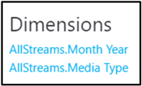

# Attivazione e utilizzo di Call Quality dashboard per Microsoft teams e Skype for business onlineTurning on and using Call Quality Dashboard for Microsoft Teams and Skype for Business Online

Informazioni su come configurare l'organizzazione di Office 365 in modo da usare il dashboard qualità chiamata per monitorare la qualità delle chiamate.Learn how to configure your Office 365 organization to use the Call Quality Dashboard to monitor call quality.
  
Il dashboard qualità chiamata (Call Quality Dashboard) per Microsoft teams e Skype for business online consente di ottenere informazioni approfondite sulla qualità delle chiamate effettuate con i servizi Microsoft teams e Skype for business.The Call Quality Dashboard (CQD) for Microsoft Teams and Skype for Business Online allows you to gain insights into the quality of calls made using Microsoft Teams and Skype for Business services. Questo argomento descrive i passaggi che è necessario completare per iniziare a raccogliere dati.This topic describes the steps you'll need to complete to start collecting data.
  
  
## Ultime modifiche e aggiornamentiLatest changes and updates

Le modifiche più recenti a Call Quality dashboard sono le seguenti:The most recent changes to CQD are as follows:
  
- Include i dati di Microsoft teams oltre ai dati di Skype for business online.Includes Microsoft Teams data in addition to Skype for Business Online data.
    
- I report di riepilogo includono un filtro prodotto per selezionare tutti i dati, i dati di Microsoft teams o i dati di Skype for business online.Summary reports include a product filter to select all data, Microsoft Teams data, or Skype for Business Online data.

- La logica di classificazione della qualità del flusso video e VBSS è stata aggiornata.Video and VBSS stream quality classification logic has been updated. Vedere la [classificazione in Stream in dashboard qualità chiamata](stream-classification-in-call-quality-dashboard.md) per le definizioni di classificatore più recenti.Refer to [Stream Classification in Call Quality Dashboard](stream-classification-in-call-quality-dashboard.md) for the latest classifier definitions.

Fare riferimento a questo articolo per un elenco di [dimensioni e misure disponibili nel dashboard qualità chiamata](dimensions-and-measures-available-in-call-quality-dashboard.md).Refer to this article for a list of [Dimensions and measures available in Call Quality Dashboard](dimensions-and-measures-available-in-call-quality-dashboard.md).
  
> [!NOTE]
> Le informazioni sugli aggiornamenti e le modifiche apportate al dashboard possono essere trovate facendo clic sul collegamento nella **buona notizia.**Information about updates and changes to the dashboard can be found by clicking the link in the **Good news!** banner quando viene visualizzato nel dashboard.banner when it is displayed on the dashboard.
  
## Attivare i report di riepilogo di Microsoft Call Quality Dashboard (Call Quality Dashboard)Activate Microsoft Call Quality Dashboard (CQD) Summary Reports

Prima di poter iniziare a usare Call Quality dashboard, è necessario attivarlo per l'organizzazione di Office 365.Before you can start using the CQD, you'll need to activate it for your Office 365 organization.

 di Microsoft teams **con l'interfaccia di amministrazione di Microsoft teams** **Using the Microsoft Teams admin center**
 
1. Accedere all'organizzazione di Office 365 tramite l'account di amministratore del servizio Microsoft teams e quindi selezionare il riquadro **amministratore** per aprire l'interfaccia di amministrazione.Sign in to your Office 365 organization using Microsoft Teams service admin account, and then select the **Admin** tile to open the Admin center.
    
2. Nel riquadro sinistro, in **centri di amministrazione**, selezionare **Microsoft teams** per aprire l'interfaccia di amministrazione di Microsoft teams.In the left pane, under **Admin centers**, select **Microsoft Teams** to open the Microsoft Teams admin center.
    
3. Nell'interfaccia di amministrazione di Microsoft teams selezionare **chiamata dashboard qualità** nel riquadro sinistro.In the Microsoft Teams admin center, select **Call quality dashboard** in the left pane.
    
  
4. Nella pagina visualizzata accedere con l'account di amministratore globale o con l'account di amministrazione del servizio Microsoft teams e quindi specificare le credenziali per l'account quando richiesto.On the page that opens, sign in with your Global Administrator account or Microsoft Teams Service Admin account, and then provide the credentials for the account when prompted.
    
     
  
Dopo aver effettuato l'accesso, una volta attivato, Call Quality dashboard inizierà a raccogliere ed elaborare i dati.After you sign in, once activated, the CQD will begin collecting and processing data.  
> [!NOTE]
> Potrebbe essere necessario un paio di ore per elaborare dati sufficienti per visualizzare i risultati significativi nei report.It may take a couple of hours to process enough data to display meaningful results in the reports. 

 di Skype for business **con l'interfaccia di amministrazione di Skype for business** **Using the Skype for Business admin center**
 
1. Accedere all'organizzazione di Office 365 con un account di amministratore e quindi selezionare il riquadro **amministratore** per aprire l'interfaccia di amministrazione.Sign in to your Office 365 organization using an admin account, and then select the **Admin** tile to open the Admin center.
    
2. Nel riquadro sinistro, in **centri di amministrazione**, seleziona **Skype for business** per aprire l'interfaccia di amministrazione di Skype for business.In the left pane, under **Admin centers**, select **Skype for Business** to open the Skype for Business admin center.
    
3. Nell'interfaccia di amministrazione di Skype for Business seleziona **strumenti** nel riquadro sinistro e quindi scegli **Skype for business online Call Quality dashboard**.In the Skype for Business admin center, select **Tools** in the left pane, and then select **Skype for Business Online Call Quality Dashboard**.
    
     
  
4. Nella pagina visualizzata accedere con l'account di amministratore globale e quindi specificare le credenziali per l'account quando richiesto.On the page that opens, sign in with your Global Administrator account, and then provide the credentials for the account when prompted.
    
     
  
Dopo aver effettuato l'accesso, una volta attivato, Call Quality dashboard inizierà a raccogliere ed elaborare i dati.After you sign in, once activated, the CQD will begin collecting and processing data.

  
## Caratteristiche del dashboard qualità chiamata per Microsoft teams e Skype for business onlineFeatures of the Call Quality Dashboard for Microsoft Teams and Skype for Business Online 

I report di riepilogo di Call Quality dashboard includono un sottoinsieme delle funzionalità pianificate per i report dettagliati.CQD Summary Reports provide a subset of the features planned for Detailed Reports. Di seguito sono riepilogate le differenze tra le due edizioni:The differences between the two editions are summarized here:
  
|**Funzionalità****Feature**|**Report di riepilogo****Summary Reports**|**Report dettagliati****Detailed Reports**|
|:-----|:-----|:-----|
|Metrica di condivisione applicazioniApplication sharing metric    |NoNo    |SìYes    |
|Supporto per informazioni sulla creazione di clientiCustomer building information support    |SìYes    |Supporto per più paesiYes    |
|Supporto per le informazioni sull'endpoint clienteCustomer endpoint information support    |Solo in cqd.teams.microsoft.comOnly in cqd.teams.microsoft.com    |Solo in cqd.teams.microsoft.comOnly in cqd.teams.microsoft.com    |
|Supporto analisi drill-downDrill-down analysis support    |NoNo    |SìYes    |
|Metriche per l'affidabilità multimedialeMedia reliability metrics    |NoNo    |SìYes    |
|Report di out-of-the-boxOut-of-the-box reports    |SìYes    |Supporto per più paesiYes    |
|Report generaliOverview reports    |SìYes    |Supporto per più paesiYes    |
|Set di report per utentePer-user report set    |NoNo    |SìYes    |
|Personalizzazione del set di report (aggiunta, eliminazione, modifica di report)Report set customization (add, delete, modify reports)    |NoNo    |SìYes    |
|Metriche di condivisione dello schermo basate su videoVideo-based screen sharing metrics    |NoNo    |SìYes    |
|Metriche videoVideo metrics    |NoNo    |SìYes    |
|Quantità di dati disponibiliAmount of data available    |Ultimi 6 mesiLast 6 months    |Ultimi 6 mesiLast 6 months    |
|Dati di Microsoft TeamsMicrosoft Teams data    |SìYes    |Supporto per più paesiYes    |
   
### Report di out-of-the-boxOut-of-the-box reports

Entrambe le edizioni di Call Quality dashboard offrono un'esperienza fuori sede, fornendo le metriche di qualità delle chiamate senza la necessità di creare nuovi report.Both editions of CQD provide an out-of-the-box experience, giving you call quality metrics without the need to create any new reports. Una volta elaborati i dati nel back-end, è possibile iniziare a visualizzare i dati relativi alla qualità delle chiamate nei report.Once data is processed in the back-end, you can start seeing call quality data in the reports.
  
### Report generaliOverview reports

Entrambe le edizioni di Call Quality dashboard costituiscono un punto di ingresso di alto livello per le informazioni generali sulla qualità delle chiamate, ma il modo in cui vengono presentate le informazioni in rapporti di riepilogo è diverso da quello dei report dettagliati.Both editions of the CQD provide a high-level entry point to the overall call quality information, but the way information is presented in Summary Reports is different from that of Detailed Reports.
  
I report di riepilogo includono una visualizzazione semplificata del rapporto di pagina a schede che consente agli utenti di esplorare e comprendere rapidamente lo stato e le tendenze della qualità delle chiamate complessive.Summary Reports provide a simplified tabbed page report view that enables users to quickly browse and understand the overall call quality status and trends.
  
Le quattro schede includono:The four tabs include:
  
- **Qualità complessiva delle chiamate** : fornisce informazioni su tutti i flussi, ovvero un'aggregazione di flussi client-server e flussi client-client, oltre a flussi client server e client distinti, sotto forma di tendenze mensili e quotidiane.**Overall Call Quality** - provides information about all streams, which is an aggregation of Server-Client streams and Client-Client streams, as well as separate Server-Client and Client-Client streams, in the form of monthly and daily trends.
    
- **Server-client** : fornisce dettagli aggiuntivi per i flussi tra endpoint server e client.**Server - Client** - provides additional details for the streams between Server and Client endpoints.
    
- **Client-client** : fornisce dettagli aggiuntivi per i flussi tra due endpoint client.**Client - Client** - provides additional details for the streams between two Client endpoints.
    
- **SLA qualità vocale** -fornisce informazioni sulle chiamate incluse nel contratto di qualità vocale di Skype for business online.**Voice Quality SLA** - provides information about calls that are included in the Skype for Business Online Voice Quality SLA.
    
### Scheda qualità complessiva delle chiamateOverall Call Quality tab

Usare i dati in questa scheda per valutare lo stato e le tendenze della qualità delle chiamate esaminando i conteggi dei flussi e le percentuali scarse.Use the data on this tab to evaluate call quality status and trends by looking at the stream counts and poor percentages. La legenda nell'angolo in alto a destra mostra il colore e gli elementi visivi che rappresentano queste metriche.The legend in the upper-right corner shows which color and visual elements represent these metrics.
  

  
I flussi sono classificati in tre gruppi: Buono, scadente e non classificato.Streams are classified in three groups: Good, Poor, and Unclassified. Vengono inoltre calcolati valori di *% poveri* che consentono di ottenere il rapporto tra i flussi classificati come *poveri* e il conteggio totale del flusso classificato.There are also calculated  *Poor %*  values that give you the ratio of streams classified as *Poor*  to the total classified stream count. Poiché il *povero% = flussi poveri/(flussi poveri + flussi buoni) \* 100* , questo rende il *povero%* inalterato dalla presenza di più flussi non *classificati* .Since *Poor % = Poor streams/ (Poor streams+ Good streams) \* 100*  , this makes the *Poor %*  unaffected by the presence with multiple *Unclassified*  streams. Per ciò che viene usato per classificare un flusso come povero o buono, vedere [classificazione dello stream in Dashboard Quality](stream-classification-in-call-quality-dashboard.md).For what is used for classifying a stream as poor or good, refer to [Stream Classification in Call Quality Dashboard](stream-classification-in-call-quality-dashboard.md).
  
Usare la scala a sinistra per misurare i valori del conteggio del flusso.Use the scale on the left to measure the stream count values.
  

  
Usare la scala a destra per misurare i valori di% poveri.Use the scale on the right to measure the Poor % values.
  

  
Puoi anche ottenere i valori numerici effettivi passando il puntatore del mouse su una barra.You can also obtain the actual numerical values by hovering the mouse over a bar.
  
> [!NOTE]
> L'esempio seguente è costituito da un set di dati di esempio molto piccolo e i valori non sono realistici per una distribuzione effettiva.The following example is from a very small sample data set, and the values aren't realistic for an actual deployment. 
  

  
Il volume complessivo del flusso è un fattore importante per determinare la pertinenza delle percentuali di scarsità calcolate.The overall stream volume is an important factor in determining how relevant the calculated Poor percentages are. Minore è il volume dei flussi generali, meno affidabili sono i valori di percentuale di scarsità segnalati.The smaller the volume of overall streams, the less reliable the reported Poor percentage values are.
  
### Scheda client-server e schede client-clientServer-Client tab and Client-Client tabs

Queste due schede contengono dettagli aggiuntivi per i flussi che hanno avuto luogo negli scenari endpoint-to-endpoint.These two tabs provide additional details for the streams that took place in their endpoint-to-endpoint scenarios. La scheda Server-client include quattro sezioni comprimibili, che rappresentano quattro scenari in cui i flussi multimediali scorrono.The Server-Client tab has four collapsible sections, representing four scenarios under which media streams would flow.
  
- Cablato all'internoWired Inside
    
- Cablata all'esternoWired Outside
    
- WiFi all'internoWifi Inside
    
- WiFi all'esternoWifi Outside

Analogamente, la scheda client-client contiene cinque sezioni comprimibili:Similarly, the Client-Client tab has five collapsible sections:

- Cablato all'internoWired Inside - Wired Inside

- Cablata all'esternoWired Inside - Wired Outside

- Esterni cablati esterniWired Outside - Wired Outside

- Cablata all'interno-WiFi all'internoWired Inside - Wifi Inside

- Cablata all'interno-WiFi all'esternoWired Inside - Wifi Outside
    
    
#### Test all'internoInside Test

Durante l'elaborazione, il back-end Call Quality Dashboard classifica un flusso come *all'interno* o *all'esterno* usando le informazioni sulla creazione, se esiste.During processing, the CQD back-end classifies a stream as  *Inside*  or *Outside*  using Building information, if it exists. Gli endpoint di ogni flusso sono associati a un indirizzo di subnet.Endpoints of each stream are associated with a subnet address. Se la subnet si trova nell'elenco delle subnet contrassegnate InsideCorp nelle informazioni di compilazione caricate, viene considerato *all'interno*.If the subnet is in the list of the subnets marked InsideCorp in the uploaded Building information, then it is considered *Inside*. Se le informazioni sulla compilazione non sono ancora state caricate, i flussi verranno sempre classificati all' *esterno*.If Building information has not yet been uploaded, then Inside Test will always classify the streams as *Outside*. Tieni presente che l'endpoint client in test per server-client viene considerato solo.Please note that Inside Test for Server-Client scenario only considers the client endpoint. Poiché i server sono sempre esterni dal punto di vista dell'utente, questo non viene contabilizzato nel test.Because servers are always outside from a user's perspective, this isn't accounted for in the test.
  
#### Wi-Fi cablatoWired vs. wifi

Come indicano i nomi, si tratta di un criterio di classificazione basato sul tipo di connessioni client.As the names indicate, this is a classification criteria based on the type of client connections. Anche in questo caso, il server è sempre cablato e non è incluso nel calcolo.Again, server is always wired and it isn't included in the calculation.
  
> [!NOTE]
> Dato un flusso, se uno dei due endpoint è connesso a una rete Wi-Fi, viene classificato come WiFi in Call Quality dashboard.Given a stream, if one of the two endpoints is connected to a Wifi network, then it is classified as Wifi in CQD. 
  
## Selezione dei dati del prodotto da visualizzare nei reportSelecting product data to see in reports

Nei report di riepilogo e posizione avanzata è possibile usare l'elenco a discesa **filtro prodotto** per visualizzare tutti i dati del prodotto, solo i dati di Microsoft teams o solo i dati di Skype for business online.In the Summary and Location Enhanced Reports, you can use the **Product Filter** drop-down to show all product data, only Microsoft Teams data, or only Skype for Business Online data.
  

  
In report dettagliati è possibile usare la dimensione **is teams** per filtrare i dati in Microsoft teams o nei dati di Skype for business online nell'ambito della definizione del report.In Detailed reports, you can use the **Is Teams** dimension to filter the data to Microsoft Teams or Skype for Business Online data as part of defining the report.
  
## Caricare informazioni sui dati del tenantUpload Tenant Data information

Il dashboard report di riepilogo di Call Quality dashboard include una pagina di **caricamento dei dati del tenant** , a cui si accede selezionando **Carica dati tenant** dal menu impostazioni nell'angolo in alto a destra.The CQD Summary Reports dashboard includes a **Tenant Data Upload** page, accessed by selecting **Tenant Data Upload** from the settings menu in the top-right corner. Questa pagina viene usata per gli amministratori per caricare le proprie informazioni, ad esempio il mapping di indirizzi IP e informazioni geografiche, la mappatura di ogni punto di accesso wireless e il relativo indirizzo MAC, la mappatura dell'endpoint all'endpoint marca/modello/tipo e così via.This page is used for admins to upload their own information, such as mapping of IP address and geographical information, mapping each wireless AP and its MAC address, mapping of Endpoint to Endpoint Make/Model/Type, etc.
  

  
1. Nella pagina **caricamento dati tenant** usare il menu a discesa per scegliere un tipo di file di dati per il caricamento.On the **Tenant Data Upload** page, use the drop-down menu to choose a data file type for uploading. Il tipo di dati del file denota il contenuto del file, ad esempio "Building" si riferisce al mapping dell'indirizzo IP e dell'edificio, oltre ad altre informazioni geografiche, "endpoint" fa riferimento al mapping del nome dell'endpoint all'endpoint marca/modello/tipo...The file data type denotes the content of the file (for example, "Building" refers to mapping of IP address and building as well as other geographical information, “Endpoint” refers to mapping of Endpoint Name to Endpoint Make/Model/Type… informazioni).information). Attualmente supportiamo il caricamento dei tipi di dati "Building" e "endpoint" per cqd.teams.microsoft.com (in anteprima e non ancora ufficialmente disponibile), cqd.lync.com supporta solo il caricamento del tipo di dati "Building".Currently we support uploading “Building” and “Endpoint” data types for cqd.teams.microsoft.com (in preview stage and not officially available yet), cqd.lync.com only supports uploading "Building" data type. Verranno aggiunti altri tipi di dati con le versioni successive.A few more data types will be added with subsequent releases.
    
2. Dopo aver selezionato il tipo di dati file, fare clic su **Sfoglia** per scegliere un file di dati.After selecting the file data type, click **Browse** to choose a data file.
    
   - Il file di dati deve essere un file con estensione TSV (valori separati da tabulazioni) o un file CSV (delimitato da virgole).The data file must be a .tsv (Tab-separated values) file or a .csv (Comma-separated value) file. Se si usa un file CSV, qualsiasi campo che contiene una virgola deve essere racchiuso tra virgolette o avere la virgola rimossa.If using a .csv file, any field that contains a comma must be surrounded by quotes or have the comma removed. Ad esempio, se il nome dell'edificio è NY, NY, nel file CSV deve essere immesso come "NY, NY".For example, if your building name is NY,NY, in the .csv file it should be entered as "NY,NY".
    
   - Le dimensioni del file di dati non devono essere superiori a 50 MB.The data file must be no larger than 50MB in size.

   - I file caricati in cqd.teams.microsoft.com hanno un limite di riga espanso di 1 milione in modo da semplificare le prestazioni delle query.Files uploaded to cqd.teams.microsoft.com have an expanded row limit of 1,000,000 in order to keep query performance fast. Potremmo imporre il limite anche a cqd.lync.com.We may impose that limit on cqd.lync.com as well.
    
   - Per ogni file di dati, ogni colonna del file deve corrispondere a un tipo di dati predefinito, descritto più avanti in questo argomento.For each data file, each column in the file must match a predefined data type, discussed later in this topic.
    
3. Dopo aver selezionato un file di dati, specificare **Data di inizio** e, facoltativamente, **specificare una data di fine**.After selecting a data file, specify **Start date** and, optionally, **Specify an end date**.
    
4. Dopo aver selezionato **Data inizio**, selezionare **carica** per caricare il file nel server Call Quality dashboard.After selecting **Start date**, select **Upload** to upload the file to the CQD server.
    
    Prima che il file venga caricato, viene prima convalidato.Before the file is uploaded, it is first validated. Una volta convalidato, viene archiviato in un BLOB di Azure.Once validated, it is stored in an Azure blob. Se la convalida non riesce o il file non viene archiviato in un BLOB di Azure, viene visualizzato un messaggio di errore che richiede una correzione al file.If validation fails or the file fails to be stored in an Azure blob, an error message is displayed requesting a correction to the file. L'immagine seguente mostra un errore che si verifica quando il numero di colonne nel file di dati non è corretto.The following image shows an error occurring when the number of columns in the data file is incorrect.
    
     
  
5. Se non si verificano errori durante la convalida, il caricamento del file avrà esito positivo.If no errors occur during validation, the file upload will succeed. È quindi possibile visualizzare il file di dati caricati nella \*\*\*\* tabella uploads, che mostra l'elenco completo di tutti i file caricati per il tenant corrente nella parte inferiore della pagina.You can then see the uploaded data file in the **My uploads** table, which shows the full list of all uploaded files for the current tenant at the bottom of that page.
    
    Ogni record Mostra un file di dati del tenant caricato, con il tipo di file, l'ora dell'ultimo aggiornamento, il periodo di tempo, la descrizione, un'icona di rimozione e un'icona di download.Each record shows one uploaded tenant data file, with file type, last update time, time period, description, a remove icon, and a download icon. Per rimuovere un file, selezionare l'icona del cestino nella tabella.To remove a file, select the trash bin icon in the table. Per scaricare un file, selezionare l'icona download nella colonna **Scarica** della tabella.To download a file, select the download icon in the **Download** column of the table.
    
     

6. Si noti che se si sceglie di usare più file di dati dell'edificio o più file di dati dell'endpoint, la velocità operativa di alcuni report sarà più lenta.Note that if you choose to use multiple building data files or multiple endpoint data files, the operation speed of some reports will be slower.

### Formato e struttura del file di dati tenantTenant data file format and structure

### Creazione di file di datiBuilding data file
Call Quality dashboard usa il file di dati della creazione derivando dapprima la colonna subnet dall'espansione della colonna Network + NetworkRange, unendo quindi la colonna subnet alla prima colonna subnet/Second subnet della chiamata per mostrare la costruzione/città/paese/area geografica...CQD uses Building data file by first deriving the Subnet column from expanding the Network+NetworkRange column, then joining the Subnet column to the call record’s First Subnet/Second Subnet column to show Building/City/Country/Region… informazioni.information. Il formato del file di dati caricato deve soddisfare quanto segue per passare il controllo di convalida prima del caricamento.The format of the data file you upload must meet the following to pass the validation check before uploading.
  
- Il file deve essere un file con estensione TSV, ovvero in ogni riga le colonne sono separate da una TABULAzione o da un file CSV con ogni colonna separata da una virgola.The file must be either a .tsv file, which means, in each row, columns are separated by a TAB, or a .csv file with each column separated by a comma.
    
- Il contenuto del file di dati non include le intestazioni di tabella.The content of the data file doesn't include table headers. Questo significa che la prima riga del file di dati deve essere dati reali, non intestazioni come "rete" e così via.That means the first line of the data file should be real data, not headers like "Network," etc.
    
- Per ogni colonna, il tipo di dati può essere solo String, Number o bool.For each column, the data type can only be String, Number, or Bool. Se si tratta di un numero, il valore deve essere un valore numerico; Se è bool, il valore deve essere 0 o 1.If it is Number, the value must be a numeric value; if it is Bool, the value must be either 0 or 1.
    
- Per ogni colonna, se il tipo di dati è stringa, i dati possono essere vuoti (ma deve essere comunque separato da un delimitatore appropriato, ad esempio una tabulazione o una virgola).For each column, if the data type is string, the data can be empty (but still must be separated by an appropriate delimiter (i.e., a tab or comma). Questo assegna un valore di stringa vuoto solo al campo.This just assigns that field an empty string value.
    
- Devono essere presenti 14 colonne per ogni riga, ogni colonna deve avere il tipo di dati seguente e le colonne devono essere nell'ordine elencato nella tabella seguente:There must be 14 columns for each row, each column must have the following data type, and the columns must be in the order listed in the following table:
    
|**Nome colonna****Column Name**|**Tipo di dati****Data type**|**Esempio****Example**|
|:-----|:-----|:-----|
|ReteNetwork    |StringaString    |192.168.1.0192.168.1.0    |
|NetworkNameNetworkName    |StringaString    |USA/Seattle/SEATTLE-SEA-1USA/Seattle/SEATTLE-SEA-1    |
|NetworkRangeNetworkRange    |NumeroNumber    |2626    |
|BuildingnameBuildingName    |StringaString    |SEATTLE-SEA-1SEATTLE-SEA-1    |
|OwnershipTypeOwnershipType    |StringaString    |ContosoContoso    |
|BuildingTypeBuildingType    |StringaString    |Terminazione ITIT Termination    |
|BuildingOfficeTypeBuildingOfficeType    |StringaString    |IngegneriaEngineering    |
|CittàCity    |StringaString    |SeattleSeattle    |
|ZipCodeZipCode    |StringaString    |9800198001    |
|PaeseCountry    |StringaString    |NOIUS    |
|StatoState    |StringaString    |WAWA    |
|Area geograficaRegion    |StringaString    |MSUSMSUS    |
|InsideCorpInsideCorp    |BoolBool    |11    |
|ExpressRouteExpressRoute    |BoolBool    |00    |
   
> [!IMPORTANT]
> L'intervallo di rete può essere usato per rappresentare una SuperNet (combinazione di più subnet con un unico prefisso di routing).The network range can be used to represent a supernet (combination of several subnets with a single routing prefix). Tutti gli upload di nuovi edifici verranno controllati per gli intervalli sovrapposti.All new building uploads will be checked for any overlapping ranges. Se in precedenza è stato caricato un file di costruzione, è consigliabile scaricare il file corrente e caricarlo di nuovo per identificare eventuali sovrapposizioni e correggere il problema prima del caricamento.If you have previously uploaded a building file, you should download the current file and re-upload it to identify any overlaps and fix the issue before uploading again. Qualsiasi sovrapposizione nei file caricati in precedenza può comportare l'errata mappatura delle subnet agli edifici nei report.Any overlap in previously uploaded files may result in the wrong mappings of subnets to buildings in the reports. Alcune implementazioni VPN non segnalano in modo accurato le informazioni sulla subnet.Certain VPN implementations do not accurately report the subnet information. Si consiglia di aggiungere voci separate per ogni indirizzo della subnet VPN in una rete a 32 bit separata per l'aggiunta di una subnet VPN al file di compilazione, anziché una voce per la subnet.It is recommended that when adding a VPN subnet to the building file, instead of one entry for the subnet, separate entries are added for each address in the VPN subnet as a separate 32-bit network. Ogni riga può avere gli stessi metadati dell'edificio.Each row can have the same building metadata. Ad esempio, invece di una riga per 172.16.18.0/24, dovresti avere 256 righe, con una riga per ogni indirizzo compreso tra 172.16.18.0/32 e 172.16.18.255/32, incluso.For example, instead of one row for 172.16.18.0/24, you should have 256 rows, with one row for each address between 172.16.18.0/32 and 172.16.18.255/32, inclusive. 

### File di dati endpointEndpoint data file
Call Quality dashboard usa il file di dati dell'endpoint unendo la relativa colonna EndpointName alla prima colonna nome endpoint client/secondo endpoint client del record di chiamata per visualizzare le informazioni sul tipo o il modello di endpoint.CQD uses Endpoint data file by joining its EndpointName column to the call record’s First Client Endpoint Name/Second Client Endpoint Name column to show Endpoint Make/Model/Type information. Il formato del file di dati caricato deve soddisfare quanto segue per passare il controllo di convalida prima del caricamento.The format of the data file you upload must meet the following to pass the validation check before uploading.

- Il file deve essere un file con estensione TSV, ovvero in ogni riga le colonne sono separate da una TABULAzione o da un file CSV con ogni colonna separata da una virgola.The file must be either a .tsv file, which means, in each row, columns are separated by a TAB, or a .csv file with each column separated by a comma.

- Il contenuto del file di dati non include le intestazioni di tabella.The content of the data file doesn't include table headers. Questo significa che la prima riga del file di dati deve essere dati reali, non intestazioni come "EndpointName" e così via.That means the first line of the data file should be real data, not headers like "EndpointName," etc.

- Per ogni colonna, il tipo di dati può essere solo stringa e non deve avere più di 64 caratteri, che è la lunghezza massima consentita.For each column, the data type can only be String and it should have no more than 64 chars, which is maximum allowed length.

- Per ogni colonna, i dati possono essere vuoti (ma devono comunque essere separati da un delimitatore appropriato, ad esempio una tabulazione o un punto e virgola).For each column, the data can be empty (but still must be separated by an appropriate delimiter (i.e., a tab or comma). Questo assegna un valore di stringa vuoto solo al campo.This just assigns that field an empty string value.

- Devono essere presenti 7 colonne per ogni riga e le colonne devono essere nell'ordine elencato nella tabella seguente.There must be 7 columns for each row and the columns must be in the order listed in the following table.

- EndpointName deve essere univoco in caso contrario, il caricamento non riuscirà a causa di una riga duplicata perché causerà l'Unione errata.EndpointName must be unique otherwise upload will fail due to duplicate row as it will cause incorrect joining.

-  EndpointLabel1, EndpointLabel2, EndpointLable3 sono etichette personalizzabili dall'utente, possono essere stringhe vuote o valori che gli utenti preferiscono, ad esempio "reparto IT designato 2018 laptop", "asset tag 5678"... e così via.EndpointLabel1, EndpointLabel2, EndpointLable3 are user customizable labels, they can be empty strings or value users prefer such as “IT Department designated 2018 Laptop”, “Asset Tag 5678” …etc.

|**Nome colonna****Column Name**|**Tipo di dati****Data type**|**Esempio****Example**|
|:-----|:-----|:-----|
|EndpointNameEndpointName    |StringaString    |1409W35341409W3534    |
|EndpointMakeEndpointMake    |StringaString    |Fabrikam IncFabrikam Inc    |
|EndpointModelEndpointModel    |StringaString    |Modello Fabrikam 123Fabrikam Model 123    |
|EndpointTypeEndpointType     |StringaString    |PortatileLaptop    |
|EndpointLabel1EndpointLabel1    |StringaString    |HA designato il portatile di 2018IT designated 2018 Laptop    |
|EndpointLabel2EndpointLabel2    |StringaString    |Tag asset 5678Asset Tag 5678    |
|EndpointLabel3EndpointLabel3    |StringaString    |Acquistare 2018Purchase 2018     |

## Selezione del tipo di elemento multimediale in report dettagliatiSelecting media type in detailed reports

I report dettagliati supportano la ricerca di qualità e affidabilità multimediale per i tipi di elementi multimediali per la condivisione di audio, video, applicazioni e video.The detailed reports support looking at quality and media reliability for audio, video, application sharing, and video-based screen-sharing media types. Le dimensioni, le misure e i filtri specifici di un singolo tipo di elemento multimediale hanno "audio", "video", "condivisione applicazioni" o "VBSS" come prefisso.Dimensions, measures, and filters that are specific to a single media type have "Audio", "Video", "AppSharing", or "VBSS" as a prefix.
  

  
Per visualizzare le dimensioni e le misure per un singolo tipo di supporto, è possibile che siano necessarie la nuova dimensione MediaType e il filtro.If you want to view the dimensions and measures for a single media type, the new MediaType dimension and filter may be required. Ad esempio, per avere un report che mostra i conteggi totali delle sessioni tra diversi tipi di elementi multimediali, Includi la dimensione MediaType.For example, to have a report that shows the total session counts across different media types, include the MediaType dimension.
  

## Argomenti correlatiRelated topics
[Configurazione di Skype for Business Call AnalyticsSet up Skype for Business Call Analytics](set-up-call-analytics.md)

[Usare la chiamata analitica per risolvere i problemi di qualità delle chiamateUse Call Analytics to troubleshoot poor  call quality](use-call-analytics-to-troubleshoot-poor-call-quality.md)

[Analisi delle chiamate e Dashboard Qualità della chiamataCall Analytics and Call Quality Dashboard](difference-between-call-analytics-and-call-quality-dashboard.md)

  
 
