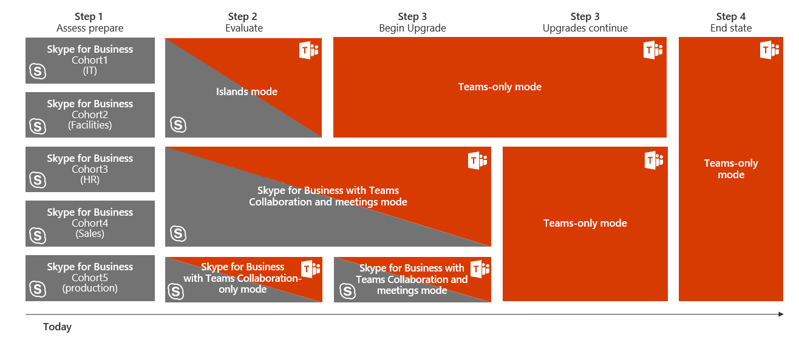

![Aggiornare il diagramma di viaggio, enfatizzando la distribuzione e l'implementazione] (media/upgrade-banner-deployment.png "Fasi del percorso di aggiornamento, con enfasi sulla fase di distribuzione e implementazione")

Questo articolo fa parte della fase di distribuzione e implementazione del viaggio di aggiornamento.This article is part of Deployment and Implementation stage of your upgrade journey. Prima di procedere, verificare di aver completato le attività seguenti:Before proceeding, confirm that you’ve completed the following activities:

- [Elenco delle parti interessate del progettoEnlisted your project stakeholders](upgrade-enlist-stakeholders.md)
- [Definizione dell'ambito del progettoDefined your project scope](https://aka.ms/SkypetoTeams-Scope)
- [Coesistenza e interoperabilità intesa di Skype for business e teamsUnderstood coexistence and interoperability of Skype for Business and Teams](https://aka.ms/SkypeToTeams-Coexist)

# Scegliere il viaggio di aggiornamento da Skype for business a teamsChoose your upgrade journey from Skype for Business to Teams

Come cliente esistente di Skype for business, la transizione completa ai team può richiedere del tempo.As an existing Skype for Business customer, your complete transition to Teams might take some time. Puoi tuttavia iniziare a realizzare il valore dei teams oggi, consentendo agli utenti di usare teams insieme a Skype for business.However, you can begin realizing the value of Teams today, by enabling your users to use Teams alongside Skype for Business. Poiché esistono alcune funzionalità sovrapposte tra le due app, è consigliabile esaminare le modalità di coesistenza e di aggiornamento disponibili per determinare il percorso appropriato per l'organizzazione.Given that there’s some overlapping functionality between the two apps, we recommend that you review the available coexistence and upgrade modes to help determine which path is right for your organization. Ad esempio, è possibile scegliere di abilitare tutti i carichi di lavoro su entrambe le soluzioni senza interoperabilità.For example, you might opt to enable all workloads on both solutions without interoperability. In alternativa, potresti decidere di gestire l'esperienza utente, introducendo gradualmente le funzionalità dei team o puntando su gruppi di utenti per le funzionalità di selezione, finché l'organizzazione non è pronta per aggiornare tutti i team.Or, you might decide to manage the user experience, either by gradually introducing Teams capabilities or by targeting groups of users for select capabilities, until your organization is ready to upgrade everyone to Teams. Usa il risultato del tuo pilota per valutare il viaggio di aggiornamento giusto per l'organizzazione.Use the outcome of your pilot to help assess the right upgrade journey for your organization.

> [!IMPORTANT]
> Skype for business online verrà ritirato il 31 luglio 2021, dopodiché non sarà più accessibile o supportato.Skype for Business Online will be retired on July 31, 2021, after which it will no longer be accessible or supported. Per massimizzare la realizzazione dei vantaggi e garantire che l'organizzazione abbia il tempo necessario per implementare l'aggiornamento, ti invitiamo a iniziare subito il tuo viaggio in Microsoft teams.To maximize benefit realization and ensure your organization has proper time to implement your upgrade, we encourage you to begin your journey to Microsoft Teams today.

In questo articolo vengono illustrate le varie modalità che consentono di gestire quali modalità in Skype for business e teams sono disponibili per gli utenti.This article outlines the various modes that enable you to manage which modalities in Skype for Business and Teams are available to your users. Come per qualsiasi distribuzione, ti consigliamo vivamente di [pilotare il piano previsto](pilot-essentials.md) con un gruppo selezionato di utenti prima di aggiornare l'organizzazione a teams.As with any deployment, we strongly encourage you to [pilot your intended plan](pilot-essentials.md) with a selected group of users before upgrading your organization to Teams. Tenere presente che l'introduzione di una nuova tecnologia può essere di disturbo per gli utenti.Remember, introducing new technology can be disruptive for users. Richiedere tempo per valutare la disponibilità degli utenti e implementare un piano di comunicazione e formazione prima di implementare una delle modalità descritte in questo documento.Take time to assess user readiness and implement a communication and training plan prior to implementing any of the modes outlined herein.

> [!TIP]
> Unisciti a noi per laboratori interattivi e dinamici in cui condivideremo le linee guida, le procedure consigliate e le risorse progettate per avviare la pianificazione e l'implementazione dell'aggiornamento.Join us for live, interactive workshops in which we’ll share guidance, best practices, and resources designed to kick start upgrade planning and implementation.
>
>Prima di tutto, partecipa al piano della sessione di [aggiornamento](https://aka.ms/SkypeToTeamsPlanning) per iniziare.Join the [Plan your upgrade](https://aka.ms/SkypeToTeamsPlanning) session first to get started.

## Aggiornare i blocchi predefiniti di viaggioUpgrade journey building blocks

Per preparare formalmente l'organizzazione per il viaggio in teams, è necessario avviare la pianificazione per gli scenari di aggiornamento che consentiranno alla tua organizzazione di accettare completamente i team come unica soluzione di comunicazione e collaborazione.To formally prepare your organization for its journey to Teams, you need to start planning for the upgrade scenarios that will eventually let your organization fully embrace Teams as your sole communications and collaboration solution.

Per aiutare a guidare il processo decisionale, familiarizzare con le varie modalità, i concetti e la terminologia pertinenti per l'aggiornamento da Skype for business a teams.To help guide your decision-making process, familiarize yourself with the various modes, concepts, and terminology relevant to upgrading from Skype for Business to Teams. Per altre informazioni, vedere coesistenza e interoperabilità di [Microsoft teams e Skype for business](https://aka.ms/SkypeToTeams-Coexist)For more information, see [Microsoft Teams and Skype for Business coexistence and interoperability](https://aka.ms/SkypeToTeams-Coexist)

Quando alcuni utenti sono pronti a usare solo team per le comunicazioni quotidiane e le esigenze di collaborazione, è possibile iniziare a eseguire l'aggiornamento di questi utenti ai team abilitando la modalità **solo teams** .When some of your users are ready to use only Teams for their day-to-day communications and collaboration needs, you can start upgrading these users to Teams by enabling **Teams Only** mode for them.

Se non è possibile che l'intera organizzazione venga spostata in teams, è possibile iniziare pilotando teams insieme a Skype for business in modalità di coesistenza per le **isole** .If it’s not feasible for your whole organization to move to Teams, you can start by piloting Teams alongside Skype for Business in **Islands** coexistence mode. Le modalità di coesistenza aggiuntive (ad esempio **Skype for business con teams Collaboration** e **Skype for business con la collaborazione e le riunioni**di Teams) diventano progressivamente disponibili nei prossimi mesi, ma è anche possibile iniziare completamente l'adozione di teams come soluzione di collaborazione di gruppo prima di tutto mantenendo Skype for business come soluzione di Unified Communications dell'organizzazione.As the additional coexistence modes, (i.e. **Skype for Business with Teams collaboration** and **Skype for Business with Teams collaboration and meetings**), are become progressively fully available in the next few months, you can also start by fully adopting Teams as a group collaboration solution first while keeping Skype for Business as your organization’s unified communications solution. Questo è il percorso consigliato da Microsoft per i clienti che usano Skype for Business Server (locale o ibrido) e i clienti con una complessità significativa la cui traiettoria per i team includerà un lungo periodo di coesistenza.That is Microsoft’s recommended path for customers using Skype for Business Server (on-premises or hybrid) and customers with significant complexity whose trajectory to Teams will include a long coexistence period.

![Screenshot dell'aggiornamento dei blocchi predefiniti da Skype for business a teams] (media/upgrade_journeys_building_block.png "Screenshot dell'aggiornamento dei blocchi predefiniti da Skype for business a teams, costituito da Skype for business con la&ndash;modalità di collaborazione in teams, Skype for business con la modalità di collaborazione e riunione in teams, modalità Islands, modalità solo teams e Skype for Modalità&ndash;solo business.")

Nella tabella seguente vengono confrontate le modalità di coesistenza e aggiornamento.The following table compares coexistence and upgrade modes.

|ModalitàMode |SituazioneSituation |Uso consigliatoRecommended Use |VantaggiAdvantages |AspettiCaveats |
|---|---|---|---|---|
|IsoleIslands |Distribuzione Skype for business più piccola o più sempliceSmaller or simpler Skype for Business deployment  Capacità e disponibilità a gestire una complessità a breve termine per spostarsi in team più rapidamenteAbility and willingness to manage some short-term complexity to move to Teams more quickly |Accedere all'esperienza team completa il più rapidamente possibileGo to the full Teams experience as quickly as possible  Condurre un proof of Concept (PoC) di TeamsConduct a proof of concept (PoC) of Teams  Percorso di aggiornamento consigliato per le organizzazioni che hanno adottato Skype for business onlineRecommended upgrade path for organizations who adopted Skype for Business Online |Semplice da usareSimple to operate  Le squadre più ricche hanno esperienza in anticipo per tutte le funzionalitàRichest Teams experience up-front for all capabilities |Richiede una buona comunicazione degli utenti per evitare confusione e guidare l'utilizzo verso i teamRequires good user communication to avoid confusion and to drive usage toward Teams  Exit Strategy richiede agli utenti di avere pienamente adottato teams prima di iniziare l'aggiornamento alla fase solo TeamsExit strategy requires users to have fully adopted Teams prior to starting upgrade to Teams Only phase  Nessuna interoperabilità per gli utenti in modalità Isole; Inoltre nessuna federazione da teams quando l'account Skype for business dell'utente viene ospitato in localeNo interop for users in Islands mode; also no federation from Teams when the user’s Skype for Business account is homed on-premises|
|Collaborazione tra Skype for business e teamsSkype for Business with Teams collaboration |Distribuzione di Skype for business con requisiti non ancora soddisfatti da Teams (ad esempio, conformità avanzata)Skype for Business deployment with requirements that aren’t yet met by Teams (for example, advanced compliance)  Necessità e/o impegno a lungo termine per Skype for businessLong-term need for and/or commitment to Skype for Business|Avviare rapidamente l'adozione di Team, concentrandosi innanzitutto sulla collaborazione di gruppoStart Teams adoption quickly, focusing on group collaboration first  Vuoi conservare tutti i carichi di lavoro delle comunicazioni unificate in Skype for business per oraWant to keep all unified communications workloads on Skype for Business for now  Uso consigliato come punto di partenza per l'organizzazione che avvia il viaggio da un locale (o ibrido) Skype for businessRecommended use as the starting point for organization starting their journey from on premises (or hybrid) Skype for Business|Nessuna funzionalità sovrapposta tra teams e Skype for businessNo overlapping capabilities between Teams and Skype for Business  La chat di messaggistica istantanea e la pianificazione delle riunioni si trovano in Skype for business (legato alla chiamata)Instant messaging chat and meeting scheduling will reside in Skype for Business (tied to calling)  Interoperabilità con gli utenti solo in teamsInteroperability with users in Teams Only|
|Skype for business con la collaborazione e le riunioni di TeamsSkype for Business with Teams collaboration and meetings |Distribuzione di Skype for business con un uso significativo della voce aziendale e dei requisiti che non sono ancora stati raggiunti da teams CallingSkype for Business deployment with significant use of enterprise voice and requirements that aren’t yet met by Teams calling  Necessità e/o impegno a lungo termine per Skype for businessLong-term need for and/or commitment to Skype for Business  Potrebbe essere l'uso di un servizio di riunione di terze partiMight be using a third-party meeting service|Avviare rapidamente l'adozione di teams, superando la collaborazione di gruppoStart Teams adoption quickly, going beyond group collaboration  Migliorare l'esperienza delle riunioni degli utentiImprove your users’ meetings experience  Uso consigliato per le organizzazioni locali che vogliono sfruttare le riunioni di teams prima di essere pronte per l'aggiornamento completo (in genere a causa di Enterprise Voice locale).Recommended use for on premises organizations wanting to take advantage of Teams meetings prior to being ready to fully upgrade (generally due to Enterprise Voice on-premises). |Nessuna funzionalità sovrappostaNo overlapping capabilities  Riunioni superiori in teams.Superior meetings on Teams. Funzionalità roadmap, UX e Cross Platform, qualità e affidabilitàFeatures roadmap, UX and cross platform, quality and reliability  Esperienze "Better Together" tra Skype for business e teams"Better Together" experiences between Skype for Business and Teams  Utenti di interoperabilità solo in teams.Interoperability users in Teams Only.|La messaggistica istantanea e la chat si trovano in Skype for business (legato alla chiamata)Instant messaging and chat will reside in Skype for Business (tied to calling)|
|Solo TeamsTeams Only |I team sono solo la destinazione finale per tutti gli utenti, alla fine.Teams Only is the final destination for all users, eventually.  Alcuni utenti devono rimanere in Skype for businessSome users need to stay on Skype for Business  Stai aggiornando gli utenti di Skype for business online a teams mantenendo gli utenti locali di Skype for business su Skype for Business ServerYou’re upgrading your Skype for Business Online users to Teams while keeping Skype for Business on-premises users on Skype for Business Server  Potresti avere già distribuito utenti in modalità isole e sei pronto per ritirare Skype for business per gruppi di utentiYou might have already deployed users in islands mode and are ready to retire Skype for Business for groups of users |Ridurre i costi variabili in Skype for business (operazioni server locali, contratto di outsourcing e così via)Reduce variable costs on Skype for Business (on-premises server operations, outsourcing contract, and so on)  Accedere all'esperienza completa di teams il più rapidamente possibile, almeno per alcuni utentiGo to the full Teams experience as quickly as possible, for at least some users|Limita la confusione degli utenti fornendo un solo client per lavorare con l'interoperabilità con gli utenti solo in Skype for business, Skype for business con Collaboration teams, Skype for business con la collaborazione e le riunioni di TeamsLimits user confusion by providing only one client to work with Interoperability with users in Skype for Business Only, Skype for Business with Teams Collaboration, Skype for Business with Teams Collaboration and Meetings|L'interoperabilità supporta solo la chat di base e le chiamate tra Skype for business e teams e gli scenari di interoperabilità per la condivisione desktop e la chat e le chiamate a più partiInteroperability only supports basic chat and calling between Skype for Business and Teams, and interop escalation scenarios for desktop sharing and multi-party chat and calling|
|Solo Skype for businessSkype for Business only |Alcuni utenti devono rimanere in Skype for businessSome users need to stay on Skype for Business  |Limita la confusione degli utenti fornendo un solo client con cui lavorareLimits user confusion by providing only one client to work with  L'utente può comunque partecipare a riunioni di team a cui sono invitatiUser can still participate in Teams meetings they are invited to|Continuare a soddisfare i requisiti aziendali che attualmente possono essere soddisfatti solo da Skype for businessContinue to meet business requirements that currently can only be met by Skype for Business  Interoperabilità con gli utenti solo in teamsInteroperability with users in Teams Only|L'interoperabilità supporta solo la chat di base e le chiamate tra Skype for business e teams e gli scenari di interoperabilità per la condivisione desktop e la chat e le chiamate a più partiInteroperability only supports basic chat and calling between Skype for Business and Teams, and interop escalation scenarios for desktop sharing and multi-party chat and calling|

> [!TIP]
> Per identificare la modalità di aggiornamento consigliata in base alle funzionalità che si vogliono abilitare in teams mentre Skype for business è ancora in uso, sfruttare la [procedura guidata di aggiornamento di Skype to teams](https://aka.ms/SkypeToTeamsWizard).To help identify the recommended upgrade mode based on the capabilities you want to enable in Teams while Skype for Business is still in use, leverage the [Skype to Teams Upgrade Wizard](https://aka.ms/SkypeToTeamsWizard).

## Aggiornare i viaggiUpgrade journeys

È possibile adottare più approcci per l'aggiornamento da Skype for business, online o locale, a teams:You can take multiple approaches to upgrading from Skype for Business, either online or on-premises, to Teams:

- In un viaggio di aggiornamento diretto devi prima distribuire teams insieme a Skype for business in **Islands** mode come parte della valutazione e dell'adozione iniziale e quindi aggiornare gli utenti alla modalità **solo teams** con l'obiettivo di ritirare rapidamente Skype for business dal ambiente per tutti gli utenti dell'organizzazione.In a direct upgrade journey, you first deploy Teams alongside Skype for Business in **Islands** mode as part of evaluation and early adoption, and then upgrade your users to **Teams Only** mode with the goal of quickly retiring Skype for Business from the environment for all users in the organization. Questo è il viaggio consigliato per i clienti Skype business online, a meno che non si preoccupi che i loro utenti vengano confusi con due strumenti per eseguire la stessa azione (chat, chiamata, pianificazione delle riunioni).This is the recommended journey for Skype Business online customers, unless they are concerned their users will be confused with having two tools to conduct the same action (chat, calling, meeting scheduling).
- Un viaggio di aggiornamento graduale offre una specifica modalità di coesistenza e aggiornamento a un gruppo specifico di utenti (detto anche *coorte*), a seconda dei requisiti di comunicazione e collaborazione.A gradual upgrade journey delivers a specific coexistence and upgrade mode to a specific group of users (also called a *cohort*), depending on their communications and collaboration requirements. Nel corso del tempo, l'intera organizzazione può confluire nell'uso di teams only e infine sostituire Skype for business.Over time, the entire organization can converge into using Teams Only and eventually replace Skype for Business. Tuttavia, se l'organizzazione ha motivi commerciali interessanti per evitare Skype for business, ad esempio una dipendenza da una soluzione basata su Unified Communications Managed API (UCMA), che si integra con le applicazioni line-of-business o da una soluzione di Wall Ethical attualmente disponibile solo per Skype for business o per una distribuzione VoIP aziendale complessa che deve richiedere tempo per l'aggiornamento a **Teams only**, è possibile aggiornare una parte degli utenti alla modalità **solo teams** mantenendo gli utenti di Skype for business in una delle modalità di coesistenza per una parte del popolamento degli utenti.However, if your organization has compelling business reasons to keep Skype for Business—such as a dependency on a Unified Communications Managed API (UCMA)–based solution that integrates with line-of-business applications, or an ethical wall solution currently available for Skype for Business only, or a complex Enterprise Voice deployment that will take time to upgrade to **Teams Only**—you can upgrade a portion of users to **Teams Only** mode while retaining Skype for Business users in one of the coexistence modes for a portion of your user population. Il percorso di aggiornamento graduale è l'approccio consigliato per i clienti locali (e ibridi) che iniziano con Skype for business con la modalità di coesistenza di teams e si spostano da lì alla modalità solo teams quando i requisiti per gli utenti si incontrano (possibilmente tramite il Skype for business con la modalità di coesistenza di teams e meetings.Gradual upgrade journey is the recommended approach for on-premises (and hybrid) customers starting with Skype for Business with Teams Collaboration coexistence mode and moving from there to Teams Only mode when requirement for the users met (possibly through the Skype for Business with Teams Collaboration and Meetings coexistence mode).

> [!IMPORTANT]
> Per entrambi i tipi di viaggio di aggiornamento, se l'organizzazione è attualmente una distribuzione locale di Skype for business, è necessario iniziare a pianificare l'implementazione di Skype for business Hybrid prima di aggiornare gli utenti alla modalità **solo teams** .For both types of upgrade journey, if your organization is currently a Skype for Business on-premises deployment only, you need to start planning to implement Skype for Business hybrid before upgrading your users to **Teams Only** mode. Questo aiuterà anche a facilitare l'interoperabilità con i team.This will also help facilitate interoperability with Teams.

> [!NOTE]
> La modalità **solo teams** richiede che gli utenti che fanno parte di coorti siano ospitati in Skype for business online e che sia necessaria una relazione ibrida tra la distribuzione locale di Skype for business e il tenant di Skype for business online per facilitare l' interoperabilità tra Skype for business e teams.**Teams Only** mode requires that the users who are part of cohorts be homed in Skype for Business Online, and a hybrid relationship between your Skype for Business on-premises deployment and your Skype for Business Online tenant is required to facilitate the interoperability between Skype for Business and Teams. Il passaggio a Skype for business online deve essere completato per gli utenti che fanno parte delle coorti prima di essere aggiornati alla modalità **solo teams** .The move to Skype for Business Online must be completed for users who are part of the cohorts before they’re upgraded to **Teams Only** mode. Skype for Business Server 2019 e Skype for Business Server 2015 con CU8 Update possono semplificare la meccanica dell'aggiornamento degli utenti locali ai team gestendo la migrazione a Skype for business online e aggiornando gli utenti alla modalità **solo teams** in un unico passaggio .Skype for Business Server 2019, and Skype for Business Server 2015 with CU8 update can simplify the mechanics of upgrading on-premises users to Teams by managing the migration to Skype for Business Online and upgrading the users to **Teams Only** mode in one step.

### Percorso di aggiornamento direttoDirect upgrade journey

Il percorso di aggiornamento diretto è illustrato nel diagramma seguente.The direct upgrade journey is illustrated in the following diagram.

![Screenshot del percorso di aggiornamento diretto] (media/upgrade_journey_direct_upgrade.png "Screenshot del percorso di aggiornamento diretto. Tutti gli utenti usano inizialmente teams in modalità isole, quindi transizione alla modalità solo teams, con lo stato finale dell'intera organizzazione aggiornata a teams.")

I team vengono distribuiti a tutti gli utenti dell'organizzazione e configurati in modalità **isole** .Teams is deployed to all users in the organization and configured in **Islands** mode. Quando l'organizzazione determina che i team sono pronti a soddisfare tutte le esigenze di comunicazione e collaborazione, avvisa gli utenti e aggiornali alla modalità **solo teams** .When your organization determines that Teams is ready to fulfill all of your communications and collaboration needs, notify the users and upgrade them to **Teams Only** mode. A questo punto, Skype for business può essere ritirato dall'ambiente.At that point, Skype for Business can be retired from the environment.

### Percorso di aggiornamento gradualeGradual upgrade journey

Un esempio di percorso di aggiornamento graduale è illustrato nel diagramma seguente.An example of a gradual upgrade journey is illustrated in the following diagram.

![Esempio illustrato del percorso di aggiornamento graduale] (media/upgrade_journey_gradual_upgrade.png "Nel percorso di aggiornamento graduale, le coorti degli utenti usano inizialmente teams in modalità Islands per la valutazione e quindi in una varietà di modalità di aggiornamento per l'adozione iniziale, affiancate da Skype for business. Alcune coorti possono passare alla modalità solo teams, mentre un gruppo di utenti rimane con Skype for business con la modalità di collaborazione e riunione teams.")

Teams è distribuito nell'organizzazione in modalità **Islands** per la valutazione e quindi passa a diverse modalità di coesistenza e aggiornamento per diversi gruppi di utenti.Teams is deployed in the organization in **Islands** mode for evaluation and then move to different coexistence and upgrade modes for different groups of users. Ad esempio, un gruppo di utenti può essere abilitato per la modalità **isole** , un altro abilitato per **Skype for business con la modalità di collaborazione e riunione in teams** , mentre un terzo gruppo di utenti potrebbe inizialmente essere abilitato per **Skype for business con teams modalità di sola collaborazione** .For example, a group of users can be enabled for **Islands** mode, another enabled for **Skype for Business with Teams collaboration and meetings** mode, while a third group of users might initially be enabled for **Skype for Business with Teams collaboration only** mode.

Nel tempo, i gruppi di utenti possono essere aggiornati alla modalità **solo teams** , seguiti dal resto dell'organizzazione.Over time, groups of users can be upgraded to **Teams Only** mode, followed by the rest of the organization. L'intera organizzazione sarà quindi pronta a ritirare Skype for business e a usare solo team per comunicazioni e collaborazione oppure, se i requisiti aziendali impongono che Skype for business venga mantenuto per un gruppo specifico, la maggior parte degli utenti del l'organizzazione può usare solo teams.Eventually, the entire organization will be ready to retire Skype for Business and use only Teams for communications and collaboration, or—if business requirements dictate that Skype for Business be retained for a specific group—the majority of users in the organization can use Teams Only.   
<table>
<tr><td>  Punto decisionaleDecision point</td><td><ul> Quale viaggio di aggiornamento è adatto ai requisiti aziendali dell'organizzazione?Which upgrade journey is suitable to your organization's business requirements?  </ul></td></tr>
<tr><td> Passaggio successivoNext step</td><td><ul> L'identificazione del modello di distribuzione corrente, l'uso di scenari di casi e le considerazioni chiave per l'organizzazione informano il viaggio ai team più adatti per l'organizzazione.Identifying your current deployment model, use case scenarios, and key considerations for your organization will inform the journey to Teams that’s best suited to your organization.  </ul></td></tr>
</table>

<table>
<tr><td>  Punto decisionaleDecision point</td><td><ul> Quale scenario di aggiornamento è applicabile all'organizzazione?Which upgrade scenario is applicable to your organization?  </ul></td></tr>
<tr><td> Passaggi successiviNext steps</td><td><ul> Decidi la sequenza temporale del viaggio di aggiornamento dell'organizzazione in base a messaggi, riunioni e requisiti aziendali per le chiamate.Decide the timeline of your organization's upgrade journey based on messaging, meetings, and calling business requirements.   Decidere il lavoro aggiuntivo necessario per completare il viaggio di aggiornamento.Decide the required additional work to complete your upgrade journey.  </ul></td></tr>
</table>

Dopo aver scelto il viaggio di aggiornamento migliore per l'organizzazione, [eseguire l'aggiornamento a teams](https://aka.ms/SkypeToTeams-Upgrade).After you’ve chosen the best upgrade journey for your organization, [perform your upgrade to Teams](https://aka.ms/SkypeToTeams-Upgrade).
