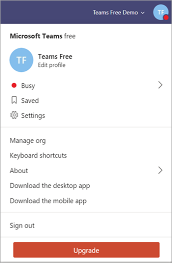

Aggiornare Microsoft teams gratuitamente alla versione dell'abbonamento a Office 365
======================================================

Se l'organizzazione usa la versione gratuita di Microsoft teams, è possibile eseguire facilmente l'aggiornamento alla versione completa acquistando un piano di sottoscrizione di Office 365 per gli utenti. La versione completa offre funzionalità aggiuntive per i team, ad esempio pianificazione, audioconferenza, amministrazione avanzata e funzionalità di sicurezza, che la versione gratuita non offre. Office 365 combina la famiglia di prodotti desktop Microsoft Office con versioni basate su cloud dei servizi di comunicazione e collaborazione di nuova generazione di Microsoft, inclusi Exchange Online, SharePoint Online e Office, per consentire agli utenti di essere produttivi da praticamente ovunque attraverso Internet. Quando si aggiornano teams, i dati dei team esistenti non andranno persi; tutti i team, i canali, le chat, i file e le autorizzazioni vengono forniti con l'utente. 

> [!NOTE]
> Se si ha già un abbonamento a Office 365, si è idonei per la versione di valutazione di Teams (con l'identità aziendale), non per la versione gratuita. Il Trial teams offre la versione completa di teams per un periodo di tempo limitato. Per altre informazioni, vedere [gestire l'offerta di valutazione cloud commerciale Microsoft teams](iw-trial-teams.md).

## In che modo i team si confrontano gratuitamente con la versione completa di Teams?

Teams Free è progettato per piccole e medie imprese ed ha le caratteristiche seguenti:

- 300 massimo utenti
- Messaggi di chat illimitati e ricerca
- Accesso Guest
- Integrazione con app e servizi, incluse le versioni online di Word, Excel, PowerPoint e OneNote
- 2 GB di spazio di archiviazione per utente e 10 GB di spazio di archiviazione condiviso
- chiamate audio e video online di 1:1 e di gruppo
- Riunioni di canale
- Condivisione dello schermo

La versione completa di teams inclusa in un abbonamento a Office 365 offre le caratteristiche seguenti, oltre alle funzionalità disponibili in teams Free:

- Nessun limite per gli utenti (con licenza Enterprise)
- Hosting di posta elettronica di Exchange e dominio di posta elettronica personalizzato
- OneDrive, SharePoint, planner, Yammer e altri servizi di Office 365
- 1 TB di spazio di archiviazione per utente
- Riunioni pianificate
- Audioconferenza
- Funzionalità avanzate per la sicurezza e la conformità, tra cui l'autenticazione a più fattori, Single Sign-on e il controllo e la creazione di report avanzati
- Controlli amministrativi e funzionalità di supporto, tra cui 24 x 7 telefono e supporto Web, strumenti di amministrazione per la gestione di utenti e app, creazione di report sull'utilizzo per servizi di Office 365, contratto a livello di servizio e impostazioni e criteri per gli utenti configurabili

Per un confronto dettagliato delle caratteristiche teams Free e teams, Vedi [confrontare i piani teams](https://products.office.com/microsoft-teams/free).

## Requisiti di aggiornamento

Se si soddisfano i requisiti seguenti, è possibile eseguire l'aggiornamento alla versione completa di teams:

- Sei la persona che ha effettuato l'iscrizione per l'abbonamento gratuito a teams esistenti.
- Se si sta portando il proprio dominio, non è già associato ad Azure Active Directory (tramite la versione di valutazione o l'abbonamento a Office 365 acquistato).

> [!NOTE]
> Per aggiornare e trasferire i dati, è necessario acquistare l'abbonamento tramite il processo di aggiornamento nell'applicazione teams. Se Office 365 è stato acquistato con teams senza passare al processo di aggiornamento, non è possibile trasferire i dati perché si avrà già un tenant separato.

## Limitazioni

Tieni presente le limitazioni seguenti:

- Dopo l'aggiornamento non è possibile tornare a teams free.
- Non è possibile unire più tenant gratuiti in un singolo tenant pagato.
- Tutti gli utenti devono essere nello stesso dominio. (Tutti gli utenti riceveranno l'accesso con il formato *nomeutente*@*Domain.com*).
- Tutti gli utenti devono essere aggiornati: non è supportata una combinazione di utenti di abbonamento gratuito e a pagamento in teams nello stesso tenant.

## Come si aggiorna l'organizzazione?

Per eseguire l'aggiornamento alla versione completa di teams, selezionare **Aggiorna** in teams.

Immettere l'indirizzo di posta elettronica che si usa per accedere a teams e quindi acquistare un piano Office 365 Business Premium. Se si vuole acquistare Office 365 Business Essentials o una versione Enterprise di Office 365, contattare il [supporto tecnico](https://portal.office.com/support/altusupport.aspx?app=teamsfreeupgrade).

## Altre informazioni

Al termine dell'aggiornamento, vedere [Introduzione a Microsoft teams](get-started-with-teams-quick-start.md) per i primi passaggi e [adottare Microsoft teams](adopt-microsoft-teams-landing-page.md) per un approccio graduale all'adozione di team nell'organizzazione.

## Ulteriori informazioni

- Per altre informazioni sulle versioni di team e sulle relative funzionalità, vedere [confrontare i piani di teams](https://products.office.com/microsoft-teams/free).
- Per altre informazioni sull'aggiornamento alla versione completa dei team, vedere [aggiornamento da teams Free to teams](https://support.office.com/article/Upgrade-from-Teams-free-to-Teams-29475bbd-a34f-4175-9b33-d44430f8ad39).
- Per altre attività di amministrazione associate all'aggiornamento degli utenti, tra cui l'aggiunta di licenze utente, la modifica dei nomi utente e l'assegnazione di password temporanee, vedere gli [amministratori che eseguono l'aggiornamento da teams Free a un abbonamento a pagamento](https://support.office.com/article/for-admins-upgrading-from-teams-free-to-a-paid-subscription-75a95e7f-001e-42d0-a787-ae8b992d5a52).
- Per informazioni sulla gestione di teams Free nell'organizzazione, vedere [gestire la versione gratuita di Microsoft teams](manage-freemium.md).

