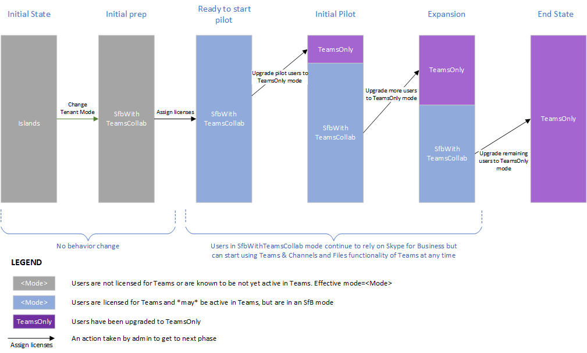

# <a name="upgrade-strategies-for-it-administrators"></a><span data-ttu-id="f1361-103">Strategie di aggiornamento per gli amministratori IT</span><span class="sxs-lookup"><span data-stu-id="f1361-103">Upgrade strategies for IT administrators</span></span>

<span data-ttu-id="f1361-104"></span><span class="sxs-lookup"><span data-stu-id="f1361-104"></span></span>

<span data-ttu-id="f1361-105">Questo articolo è per gli amministratori IT che vogliono implementare l'aggiornamento a Teams da Skype for Business.</span><span class="sxs-lookup"><span data-stu-id="f1361-105">This article is for IT administrators who want to implement their upgrade to Teams from Skype for Business.</span></span>

<span data-ttu-id="f1361-106">Prima di implementare l'aggiornamento, è consigliabile seguire gli articoli seguenti che descrivono i concetti importanti per l'aggiornamento e i comportamenti di coesistenza:</span><span class="sxs-lookup"><span data-stu-id="f1361-106">Before implementing your upgrade, we recommend the following articles which describe important upgrade concepts and coexistence behaviors:</span></span>

- [<span data-ttu-id="f1361-107">Comprendere Microsoft Teams e Skype for Business coesistenza e interoperabilità</span><span class="sxs-lookup"><span data-stu-id="f1361-107">Understand Microsoft Teams and Skype for Business coexistence and interoperability</span></span>](teams-and-skypeforbusiness-coexistence-and-interoperability.md)
- [<span data-ttu-id="f1361-108">Modalità di coesistenza - Riferimento</span><span class="sxs-lookup"><span data-stu-id="f1361-108">Coexistence modes - Reference</span></span>](migration-interop-guidance-for-teams-with-skype.md)
- [<span data-ttu-id="f1361-109">Esperienza del client di Teams e conformità alle modalità di coesistenza</span><span class="sxs-lookup"><span data-stu-id="f1361-109">Teams client experience and conformance to coexistence modes</span></span>](teams-client-experience-and-conformance-to-coexistence-modes.md)

## <a name="upgrade-options"></a><span data-ttu-id="f1361-110">Opzioni di aggiornamento</span><span class="sxs-lookup"><span data-stu-id="f1361-110">Upgrade options</span></span>

<span data-ttu-id="f1361-111">Questa sezione descrive come implementare l'aggiornamento usando una delle opzioni di aggiornamento seguenti:</span><span class="sxs-lookup"><span data-stu-id="f1361-111">This section describes how to implement your upgrade by using one of the following upgrade options:</span></span>

- [<span data-ttu-id="f1361-112">Aggiornamento delle funzionalità sovrapposte (con la modalità Isole)</span><span class="sxs-lookup"><span data-stu-id="f1361-112">Overlapping capabilities upgrade (using Islands mode)</span></span>](#overlapping-capabilities-upgrade-using-islands-mode)
- [<span data-ttu-id="f1361-113">Aggiornamento delle funzionalità di selezione per un'organizzazione che non ha ancora iniziato a usare Teams</span><span class="sxs-lookup"><span data-stu-id="f1361-113">A select capabilities upgrade for an organization that has not yet started using Teams</span></span>](#a-select-capabilities-upgrade-for-an-organization-that-has-not-yet-started-using-teams)
- [<span data-ttu-id="f1361-114">Aggiornamento delle funzionalità di selezione per un'organizzazione che usa già Teams in modalità Isole</span><span class="sxs-lookup"><span data-stu-id="f1361-114">A select capabilities upgrade for an organization that is already using Teams in Islands mode</span></span>](#a-select-capabilities-upgrade-for-an-organization-that-is-already-using-teams-in-islands-mode)

<span data-ttu-id="f1361-115">Per altre informazioni sulle opzioni, verificare di aver già letto Scegliere il percorso di aggiornamento da [Skype for Business a Teams](upgrade-and-coexistence-of-skypeforbusiness-and-teams.md).</span><span class="sxs-lookup"><span data-stu-id="f1361-115">If you need more information about the options, make sure you have already read [Choose your upgrade journey from Skype for Business to Teams](upgrade-and-coexistence-of-skypeforbusiness-and-teams.md).</span></span>

## <a name="overlapping-capabilities-upgrade-using-islands-mode"></a><span data-ttu-id="f1361-116">Aggiornamento delle funzionalità sovrapposte (con la modalità Isole)</span><span class="sxs-lookup"><span data-stu-id="f1361-116">Overlapping capabilities upgrade (using Islands mode)</span></span>

<span data-ttu-id="f1361-117">Per l'opzione di aggiornamento delle funzionalità sovrapposte:</span><span class="sxs-lookup"><span data-stu-id="f1361-117">For the overlapping capabilities upgrade option:</span></span>

- <span data-ttu-id="f1361-118">Considerare questa opzione se è possibile eseguire un aggiornamento rapido per l'intera organizzazione.</span><span class="sxs-lookup"><span data-stu-id="f1361-118">Consider this option if you can do a fast upgrade for your overall organization.</span></span>  <span data-ttu-id="f1361-119">Poiché esiste un potenziale rischio di confusione per gli utenti finali che eseguono entrambi i client, è meglio ridurre al minimo il periodo di tempo durante il quale gli utenti devono eseguire entrambi i client.</span><span class="sxs-lookup"><span data-stu-id="f1361-119">Since there is potential risk of confusion for end users with running both clients, it’s best if you can minimize the time period during which users must run both clients.</span></span> <span data-ttu-id="f1361-120">È consigliabile assicurarsi che gli utenti sappiano di eseguire entrambi i client.</span><span class="sxs-lookup"><span data-stu-id="f1361-120">You should ensure your users know to run both clients.</span></span>

- <span data-ttu-id="f1361-121">Questa opzione è il modello predefinito e non richiede l'azione dell'amministratore per iniziare a usare Teams se non per assegnare la licenza Microsoft 365 o Office 365 licenza.</span><span class="sxs-lookup"><span data-stu-id="f1361-121">This option is the out-of-the box model, and doesn’t require administrator action to get started with Teams except to assign the Microsoft 365 or Office 365 license.</span></span> <span data-ttu-id="f1361-122">Se gli utenti hanno già Skype for Business Online, è possibile che si sia già in questo modello.</span><span class="sxs-lookup"><span data-stu-id="f1361-122">If your users already have Skype for Business Online, you may already be in this model.</span></span>

- <span data-ttu-id="f1361-123">Può essere difficile uscire dalla modalità di sovrapposizione delle funzionalità e passare a TeamsOnly.</span><span class="sxs-lookup"><span data-stu-id="f1361-123">It can be challenging getting out of overlapping capabilities mode and moving to TeamsOnly.</span></span> <span data-ttu-id="f1361-124">Poiché gli utenti aggiornati comunicano solo tramite Teams, qualsiasi altro utente dell'organizzazione che comunica con tale utente deve usare Teams.</span><span class="sxs-lookup"><span data-stu-id="f1361-124">Because upgraded users only communicate via Teams, any other user in the organization communicating with that user must be using Teams.</span></span>  <span data-ttu-id="f1361-125">Se si hanno utenti che non hanno iniziato a Teams, questi verranno esposti ai messaggi mancanti.</span><span class="sxs-lookup"><span data-stu-id="f1361-125">If you have users that have not started using Teams, they will be exposed to missing messages.</span></span> <span data-ttu-id="f1361-126">Inoltre, non potranno vedere gli utenti di TeamsOnly online in Skype for Business.</span><span class="sxs-lookup"><span data-stu-id="f1361-126">Furthermore, they won’t see the TeamsOnly users online in Skype for Business.</span></span> <span data-ttu-id="f1361-127">Alcune organizzazioni scelgono di eseguire un aggiornamento a livello di tenant usando i criteri globali tenant per evitare questo problema, tuttavia ciò richiede una pianificazione iniziale e attende che tutti gli utenti siano pronti per l'aggiornamento.</span><span class="sxs-lookup"><span data-stu-id="f1361-127">Some organizations choose to do a tenant-wide upgrade using the Tenant global policy to avoid this, however that requires upfront planning as well as waiting until all users are ready to be upgraded.</span></span>


## <a name="a-select-capabilities-upgrade-for-an-organization-that-has-not-yet-started-using-teams"></a><span data-ttu-id="f1361-128">Aggiornamento delle funzionalità di selezione per un'organizzazione che non ha ancora iniziato a usare Teams</span><span class="sxs-lookup"><span data-stu-id="f1361-128">A select capabilities upgrade for an organization that has not yet started using Teams</span></span>

<span data-ttu-id="f1361-129">Se l'organizzazione non ha ancora utenti attivi in Teams, il primo passaggio consiste nell'impostare i criteri predefiniti a livello di tenant per TeamsUpgradePolicy su una delle modalità di Skype for Business, ad esempio SfbWithTeamsCollab.</span><span class="sxs-lookup"><span data-stu-id="f1361-129">If your organization does not yet have any active users in Teams, the first step is to set the default tenant-wide policy for TeamsUpgradePolicy to one of the Skype for Business modes, for example, SfbWithTeamsCollab.</span></span>  <span data-ttu-id="f1361-130">Gli utenti che non hanno ancora iniziato a Teams non noteranno alcuna differenza di comportamento.</span><span class="sxs-lookup"><span data-stu-id="f1361-130">Users who have not yet started using Teams won’t notice any difference in behavior.</span></span> <span data-ttu-id="f1361-131">Tuttavia, l'impostazione di questo criterio a livello di tenant consente di avviare l'aggiornamento degli utenti alla modalità TeamsOnly e assicura che gli utenti aggiornati possano comunque comunicare con utenti non aggiornati.</span><span class="sxs-lookup"><span data-stu-id="f1361-131">However, setting this policy at the tenant level makes it possible to start upgrading users to TeamsOnly mode, and ensures that the upgraded users can still communicate with non-upgraded users.</span></span>  <span data-ttu-id="f1361-132">Dopo aver identificato gli utenti pilota, è possibile aggiornarli a TeamsOnly.</span><span class="sxs-lookup"><span data-stu-id="f1361-132">Once you have identified your pilot users you can upgrade them to TeamsOnly.</span></span>  <span data-ttu-id="f1361-133">Se sono locali, usare Move-CsUser.</span><span class="sxs-lookup"><span data-stu-id="f1361-133">If they are on-premises, use Move-CsUser.</span></span> <span data-ttu-id="f1361-134">Se sono online, è sufficiente assegnare loro la modalità TeamsOnly usando Grant-CsTeamsUpgradePolicy.</span><span class="sxs-lookup"><span data-stu-id="f1361-134">If they are online, simply assign them TeamsOnly mode by using Grant-CsTeamsUpgradePolicy.</span></span> <span data-ttu-id="f1361-135">Per impostazione predefinita, Skype for Business le riunioni pianificate da questi utenti verranno migrate in Teams.</span><span class="sxs-lookup"><span data-stu-id="f1361-135">By default, any Skype for Business meetings scheduled by these users will be migrated to Teams.</span></span>

<span data-ttu-id="f1361-136">Di seguito sono riportati i comandi principali:</span><span class="sxs-lookup"><span data-stu-id="f1361-136">Following are the key commands:</span></span>

1. <span data-ttu-id="f1361-137">Impostare l'impostazione predefinita a livello di tenant sulla modalità SfbWithTeamsCollab nel modo seguente:</span><span class="sxs-lookup"><span data-stu-id="f1361-137">Set the tenant-wide default to mode SfbWithTeamsCollab as follows:</span></span>

   ```PowerShell
   Grant-CsTeamsUpgradePolicy -PolicyName SfbWithTeamsCollab -Global
   ```

2. <span data-ttu-id="f1361-138">Aggiornare gli utenti pilota a TeamsOnly come segue:</span><span class="sxs-lookup"><span data-stu-id="f1361-138">Upgrade the pilot users to TeamsOnly as follows:</span></span>

   - <span data-ttu-id="f1361-139">Per un utente online:</span><span class="sxs-lookup"><span data-stu-id="f1361-139">For a user who is online:</span></span>

     ```PowerShell
     Grant-CsTeamsUpgradePolicy -PolicyName UpgradeToTeams -Identity $username 
     ```

   - <span data-ttu-id="f1361-140">Per un utente locale:</span><span class="sxs-lookup"><span data-stu-id="f1361-140">For a user who is on-premises:</span></span>

     ```PowerShell
     Move-CsUser -identity $user -Target sipfed.online.lync.com -MoveToTeams -credential $cred 
     ```

<span data-ttu-id="f1361-141">Note</span><span class="sxs-lookup"><span data-stu-id="f1361-141">Notes</span></span>
 
- <span data-ttu-id="f1361-142">Invece di impostare i criteri a livello di tenant su SfbWithTeamsCollab, è possibile impostarlo su SfbWithTeamsCollabAndMeetings.</span><span class="sxs-lookup"><span data-stu-id="f1361-142">Instead of setting the tenant-wide policy to SfbWithTeamsCollab, you could set it to SfbWithTeamsCollabAndMeetings.</span></span> <span data-ttu-id="f1361-143">In questo modo tutti gli utenti pianificano tutte le nuove riunioni Teams.</span><span class="sxs-lookup"><span data-stu-id="f1361-143">This causes all users to schedule all new meetings in Teams.</span></span>
- <span data-ttu-id="f1361-144">`Move-CsUser` è un cmdlet negli strumenti locali.</span><span class="sxs-lookup"><span data-stu-id="f1361-144">`Move-CsUser` is a cmdlet in the on-premises tools.</span></span> <span data-ttu-id="f1361-145">`MoveToTeams`L'opzione richiede Skype for Business Server 2019 o Skype for Business Server 2015 con CU8 o versione successiva.</span><span class="sxs-lookup"><span data-stu-id="f1361-145">The `MoveToTeams` switch requires Skype for Business Server 2019 or Skype for Business Server 2015 with CU8 or later.</span></span> <span data-ttu-id="f1361-146">Se si usa una versione precedente, è prima di tutto possibile spostare l'utente in Skype for Business Online e quindi concedere la modalità TeamsOnly a tale utente.</span><span class="sxs-lookup"><span data-stu-id="f1361-146">If you are using a prior version, you can first move the user to Skype for Business Online, and then grant TeamsOnly mode to that user.</span></span>
- <span data-ttu-id="f1361-147">Per impostazione predefinita, Skype for Business le riunioni vengono migrate in Teams durante l'aggiornamento alla modalità TeamsOnly o quando si assegna la modalità SfbWithTeamsCollabAndMeetings.</span><span class="sxs-lookup"><span data-stu-id="f1361-147">By default, Skype for Business meetings are migrated to Teams when upgrading to TeamsOnly mode or when assigning SfbWithTeamsCollabAndMeetings mode.</span></span>  

<span data-ttu-id="f1361-148">Il diagramma seguente mostra le fasi concettuali dell'aggiornamento delle funzionalità di selezione per un'organizzazione senza l'uso preventivo di Teams.</span><span class="sxs-lookup"><span data-stu-id="f1361-148">The diagram below shows the conceptual phases of select capabilities upgrade for an organization with no prior usage of Teams.</span></span> <span data-ttu-id="f1361-149">L'altezza delle barre rappresenta il numero di utenti.</span><span class="sxs-lookup"><span data-stu-id="f1361-149">The height of the bars represents number of users.</span></span> <span data-ttu-id="f1361-150">Durante qualsiasi fase dell'aggiornamento, tutti gli utenti possono comunicare tra loro.</span><span class="sxs-lookup"><span data-stu-id="f1361-150">During any phase of the upgrade, all users can communicate with each other.</span></span>  <span data-ttu-id="f1361-151">Skype for Business gli utenti comunicano con TeamsSolo gli utenti che usano Interoperabilità e viceversa.</span><span class="sxs-lookup"><span data-stu-id="f1361-151">Skype for Business users communicate with TeamsOnly users using Interop, and vice versa.</span></span> <span data-ttu-id="f1361-152">Gli utenti in modalità Isole devono essere sicuri di eseguire entrambi i client.</span><span class="sxs-lookup"><span data-stu-id="f1361-152">Users in Islands mode must be sure to run both clients.</span></span>




## <a name="a-select-capabilities-upgrade-for-an-organization-that-is-already-using-teams-in-islands-mode"></a><span data-ttu-id="f1361-154">Aggiornamento delle funzionalità di selezione per un'organizzazione che usa già Teams in modalità Isole</span><span class="sxs-lookup"><span data-stu-id="f1361-154">A select capabilities upgrade for an organization that is already using Teams in Islands mode</span></span>

<span data-ttu-id="f1361-155">Se alcuni utenti dell'organizzazione usano attivamente Teams in modalità Isole, è probabile che non si voglia rimuovere funzionalità dagli utenti esistenti.</span><span class="sxs-lookup"><span data-stu-id="f1361-155">If some users in your organization are actively using Teams in Islands mode, you probably do not want to remove functionality from existing users.</span></span> <span data-ttu-id="f1361-156">Pertanto, prima di modificare i criteri a livello di tenant è necessario un passaggio aggiuntivo.</span><span class="sxs-lookup"><span data-stu-id="f1361-156">Therefore, an extra step is required before changing the tenant-wide policy.</span></span> <span data-ttu-id="f1361-157">La soluzione consiste nel "nonno" di questi utenti attivi Teams in modalità Isole, prima di impostare i criteri a livello di tenant su SfbWithTeamsCollab.</span><span class="sxs-lookup"><span data-stu-id="f1361-157">The solution is to “grandfather” these existing active Teams users into Islands mode, before setting the tenant-wide policy to SfbWithTeamsCollab.</span></span>  <span data-ttu-id="f1361-158">Dopo aver eseguito questa operazione, è possibile procedere con la distribuzione come sopra, tuttavia, si avranno due gruppi di utenti che si spostano in TeamsOnly: gli utenti che erano attivi in Teams saranno in modalità Isole e gli utenti rimanenti saranno in modalità SfbWithTeamsCollab.</span><span class="sxs-lookup"><span data-stu-id="f1361-158">Once you’ve done that, you can proceed with deployment as above, however, you’ll have two groups of users who are moving to TeamsOnly:  the users who were active in Teams will be in Islands mode, and the remaining users will be in SfbWithTeamsCollab mode.</span></span> <span data-ttu-id="f1361-159">È possibile spostare progressivamente questi utenti in modalità TeamsOnly.</span><span class="sxs-lookup"><span data-stu-id="f1361-159">You can progressively move these users to TeamsOnly mode.</span></span>

1. <span data-ttu-id="f1361-160">Trovare gli utenti attivi in Teams nel modo seguente:</span><span class="sxs-lookup"><span data-stu-id="f1361-160">Find users who are active in Teams as follows:</span></span>

   1. <span data-ttu-id="f1361-161">Nell'Microsoft 365 di amministrazione, nel riquadro di spostamento sinistro, passare a Report e quindi a Uso.</span><span class="sxs-lookup"><span data-stu-id="f1361-161">From the Microsoft 365 admin center, in the left-hand navigation, go to Reports, and then Usage.</span></span> 
   2. <span data-ttu-id="f1361-162">Nell'elenco a discesa "Seleziona un report" scegliere Microsoft Teams e quindi Attività utente.</span><span class="sxs-lookup"><span data-stu-id="f1361-162">In the “Select a report” dropdown, choose Microsoft Teams, and then User Activity.</span></span> <span data-ttu-id="f1361-163">In questo modo verrà mostrata una tabella esportabile degli utenti che sono stati attivi in Teams.</span><span class="sxs-lookup"><span data-stu-id="f1361-163">This will provide an exportable table of users who have been active in Teams.</span></span> 
   3. <span data-ttu-id="f1361-164">Fare clic su Esporta, Excel e filtrare per visualizzare solo gli utenti attivi in Teams.</span><span class="sxs-lookup"><span data-stu-id="f1361-164">Click Export, open Excel, and filter to show only the users who are active in Teams.</span></span>

2. <span data-ttu-id="f1361-165">Per ogni utente Teams attivo trovato nel passaggio 1, assegnare loro la modalità Isole in una sessione remota di PowerShell.</span><span class="sxs-lookup"><span data-stu-id="f1361-165">For each active Teams user found in step 1, assign them Islands mode in remote PowerShell.</span></span> <span data-ttu-id="f1361-166">In questo modo è possibile andare al passaggio successivo e assicurarsi di non modificare l'esperienza utente.</span><span class="sxs-lookup"><span data-stu-id="f1361-166">This allows you to go to the next step, and ensures you don’t change the user experience.</span></span>  

   ```PowerShell
   $users=get-content “C:\MyPath\users.txt” 
    foreach ($user in $users){ 
    Grant-CsTeamsUpgradePolicy -identity $user -PolicyName Islands} 
   ```

3. <span data-ttu-id="f1361-167">Impostare i criteri a livello di tenant su SfbWithTeamsCollab:</span><span class="sxs-lookup"><span data-stu-id="f1361-167">Set the tenant-wide policy to SfbWithTeamsCollab:</span></span>

   ```PowerShell
   Grant-CsTeamsUpgradePolicy -Global -PolicyName SfbWithTeamsCollab 
   ```

4. <span data-ttu-id="f1361-168">Aggiornare gli utenti selezionati alla modalità TeamsOnly.</span><span class="sxs-lookup"><span data-stu-id="f1361-168">Upgrade selected users to TeamsOnly mode.</span></span> <span data-ttu-id="f1361-169">È possibile scegliere di aggiornare gli utenti in modalità Isole o SfbWithTeamsCollab, anche se è consigliabile assegnare priorità all'aggiornamento degli utenti in modalità Isole per ridurre al minimo il potenziale di confusione che può verificarsi quando gli utenti sono in modalità Isole.</span><span class="sxs-lookup"><span data-stu-id="f1361-169">You can choose to upgrade either users in Islands mode or SfbWithTeamsCollab mode, although you might want to prioritize upgrading the users in Islands mode first to minimize the potential for confusion that can arise when users are in Islands mode.</span></span>   

   <span data-ttu-id="f1361-170">Per gli utenti ospitati in Skype for Business Online:</span><span class="sxs-lookup"><span data-stu-id="f1361-170">For users homed in Skype for Business Online:</span></span>  

   ```PowerShell
   Grant-CsTeamsUpgradePolicy -Identity $user -PolicyName UpgradeToTeams 
   ```

   <span data-ttu-id="f1361-171">Per gli utenti ospitati in Skype for Business Server locale:</span><span class="sxs-lookup"><span data-stu-id="f1361-171">For users homed in Skype for Business Server on-premises:</span></span>  

   ```PowerShell
   Move-CsUser -Identity $user -Target sipfed.online.lync.com -MoveToTeams -credential $cred 
   ```

<span data-ttu-id="f1361-172">Il diagramma seguente mostra le fasi concettuali di una transizione di funzionalità selezionate in cui sono presenti utenti delle Isole attive all'inizio.</span><span class="sxs-lookup"><span data-stu-id="f1361-172">The diagram below shows the conceptual phases of a select capabilities transition in which there are active Islands users at the start.</span></span> <span data-ttu-id="f1361-173">L'altezza delle barre rappresenta il numero di utenti.</span><span class="sxs-lookup"><span data-stu-id="f1361-173">The height of the bars represents the number of users.</span></span> <span data-ttu-id="f1361-174">Durante qualsiasi fase dell'aggiornamento, tutti gli utenti possono comunicare tra loro.</span><span class="sxs-lookup"><span data-stu-id="f1361-174">During any phase of the upgrade, all users can communicate with each other.</span></span>  <span data-ttu-id="f1361-175">Skype for Business gli utenti comunicano con TeamsSolo gli utenti che usano l'interoperabilità e viceversa.</span><span class="sxs-lookup"><span data-stu-id="f1361-175">Skype for Business users communicate with TeamsOnly users using interop, and vice versa.</span></span> 


   


## <a name="related-links"></a><span data-ttu-id="f1361-177">Collegamenti correlati</span><span class="sxs-lookup"><span data-stu-id="f1361-177">Related links</span></span>

[<span data-ttu-id="f1361-178">Indicazioni sulla migrazione e l'interoperabilità per le organizzazioni che usano Teams insieme a Skype for Business</span><span class="sxs-lookup"><span data-stu-id="f1361-178">Migration and interoperability guidance for organizations using Teams together with Skype for Business</span></span>](migration-interop-guidance-for-teams-with-skype.md) 

[<span data-ttu-id="f1361-179">Configurare la connettività ibrida tra Skype for Business Server e Microsoft 365 o Office 365</span><span class="sxs-lookup"><span data-stu-id="f1361-179">Configure hybrid connectivity between Skype for Business Server and Microsoft 365 or Office 365</span></span>](/SkypeForBusiness/hybrid/configure-hybrid-connectivity)

[<span data-ttu-id="f1361-180">Spostare utenti tra locale e cloud</span><span class="sxs-lookup"><span data-stu-id="f1361-180">Move users between on-premises and cloud</span></span>](/SkypeForBusiness/hybrid/move-users-between-on-premises-and-cloud)

[<span data-ttu-id="f1361-181">Impostazione delle impostazioni di coesistenza e aggiornamento</span><span class="sxs-lookup"><span data-stu-id="f1361-181">Setting your coexistence and upgrade settings</span></span>](setting-your-coexistence-and-upgrade-settings.md)

[<span data-ttu-id="f1361-182">Grant-CsTeamsUpgradePolicy</span><span class="sxs-lookup"><span data-stu-id="f1361-182">Grant-CsTeamsUpgradePolicy</span></span>](/powershell/module/skype/grant-csteamsupgradepolicy?view=skype-ps)

[<span data-ttu-id="f1361-183">Uso del servizio di migrazione delle riunioni (MMS)</span><span class="sxs-lookup"><span data-stu-id="f1361-183">Using the Meeting Migration Service (MMS)</span></span>](/skypeforbusiness/audio-conferencing-in-office-365/setting-up-the-meeting-migration-service-mms)