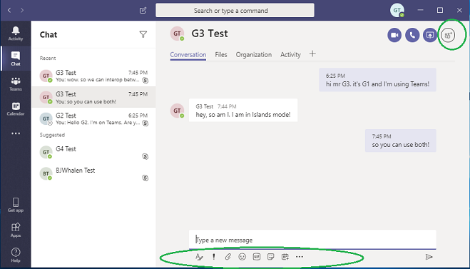

# <a name="upgrade-from-skype-for-business-to-teams-mdash-for-it-administrators"></a>Eseguire l'aggiornamento da Skype for business a teams &mdash; per gli amministratori IT

## <a name="overview"></a>Panoramica

Quando si esegue l'aggiornamento da Skype for business a teams, alcune organizzazioni richiedono un'implementazione progressiva progettata e gestita dai rispettivi reparti IT. Questo articolo è destinato principalmente agli amministratori IT di grandi organizzazioni locali, ma può anche essere applicato ad alcune organizzazioni di Skype for business online.  Prima di leggere questo articolo, leggere introduzione all' [aggiornamento dei team](upgrade-start-here.md) e [informazioni sul Framework di aggiornamento](upgrade-framework.md).

>[!NOTE]
>Questo articolo usa i termini Skype for business online, Skype for business locale e Skype for business.  Quest'ultimo termine si riferisce sia alle versioni online che a quelle locali.

Un utente che è stato migrato a teams non usa più un client Skype for business tranne che per partecipare a una riunione ospitata in Skype for business.  Tutte le chat in arrivo e le chiamate atterrano nel client Teams dell'utente, indipendentemente dal fatto che il mittente usi team o Skype for business. Tutte le nuove riunioni organizzate dall'utente migrato saranno programmate come riunioni teams. Se l'utente tenta di usare il client Skype for business, l'avvio delle chat e delle chiamate è bloccato.  Tuttavia, l'utente può (e deve) ancora usare il client Skype for business per partecipare alle riunioni a cui sono state invitate. I client Skype for business meno recenti forniti prima di 2017 non onorano TeamsUpgradePolicy. Verificare che si stia usando il client Skype for business più recente.
 
Gli amministratori gestiscono la transizione a teams usando il concetto di [modalità](migration-interop-guidance-for-teams-with-skype.md#coexistence-modes), che è una proprietà di [TeamsUpgradePolicy](https://docs.microsoft.com/powershell/module/skype/grant-csteamsupgradepolicy?view=skype-ps). Un utente che è stato migrato in teams come descritto in precedenza è in modalità "TeamsOnly".  Per un'organizzazione che sta migrando a teams, l'obiettivo finale è quello di trasferire tutti gli utenti alla modalità TeamsOnly.

Esistono due metodi per la migrazione di un'organizzazione esistente con Skype for business (sia online che locale) per i team:

- **Metodo di funzionalità sovrapposte** (usando la modalità isole): gli utenti di un'organizzazione Skype for business esistenti vengono introdotti in teams in modo che possano usare entrambi i client durante una fase transitoria. Durante questo periodo, la maggior parte--ma non tutte--la funzionalità dei team è disponibile. La modalità per questa configurazione è denominata isole e questa è la modalità predefinita per qualsiasi organizzazione esistente con Skype for business. Quando l'organizzazione è pronta, l'amministratore sposta gli utenti in modalità TeamsOnly.

- **Selezionare metodo di funzionalità** (usando una o più modalità di Skype for business): l'amministratore gestisce la transizione (da Skype for business a teams) della chat, delle chiamate e della funzionalità di pianificazione delle riunioni per gli utenti dell'organizzazione.  Ognuna di queste funzioni è disponibile sia in Skype for business che in teams, ma non in entrambi. Gli amministratori usano TeamsUpgradePolicy per controllare quando spostare questa funzionalità in teams per gli utenti. Gli utenti che non sono ancora in modalità TeamsOnly continuano a usare Skype for business per la chat e le chiamate e i due set di utenti possono comunicare tramite la funzionalità di interoperabilità. Gli amministratori gestiscono la transizione migrando progressivamente più utenti in modalità TeamsOnly.  

Questo articolo consente di scegliere il metodo giusto per l'organizzazione descrivendo entrambi i metodi e presentando i pro e i contro di ognuno di essi. 

## <a name="overlapping-capabilities-method-using-islands-mode"></a>Metodo di funzionalità sovrapposte (utilizzo della modalità isole)

Con il metodo di funzionalità sovrapposte, gli utenti possono usare sia i team che i client Skype for business per la chat, le chiamate VoIP e le riunioni. Questo stato si chiama modalità "isole" perché il traffico delle comunicazioni per Skype for business e teams rimane distinto (anche per lo stesso utente) e i due diversi client non comunicano mai tra loro (per gli utenti all'interno della stessa organizzazione). Supponiamo ad esempio che l'utente destinatario A sia in modalità isole:

- Le comunicazioni avviate dal client Skype for business di un altro utente verranno sempre atterrate nel client Skype for business dell'utente.
- Le comunicazioni avviate dal client teams di un altro utente saranno sempre presenti nel client teams di un utente, *se l'altro utente si trova nella stessa organizzazione*. 
- Le comunicazioni avviate dal client teams di un altro utente sbarcheranno sempre nel client Skype for business di un utente, *se l'altro utente si trova in un'organizzazione federata*.

La modalità Islands è la modalità predefinita di TeamsUpgradePolicy per tutte le organizzazioni esistenti che non sono ancora TeamsOnly. Quando si assegna una licenza Microsoft 365 o Office 365, per impostazione predefinita vengono assegnate entrambe le licenze teams e Skype for business online. (Questo vale anche se l'utente è ospitato in locale in Skype for Business Server. Se l'utente è ospitato in locale o online, lascia la licenza di Skype for business online abilitata, perché è attualmente necessaria per la funzionalità completa di teams. In realtà, se non hai adottato alcuna procedura per modificare la configurazione predefinita, potresti avere già un uso significativo dei team nell'organizzazione.  Questo è uno dei vantaggi dell'approccio delle funzionalità sovrapposte. Consente l'adozione rapida e guidata dall'utente finale all'interno di un'organizzazione.

Affinché questo metodo funzioni in modo efficace, è necessario che tutti gli utenti eseguano contemporaneamente entrambi i client. Le chat in arrivo e le chiamate dall'interno dell'organizzazione a un utente in modalità isole possono atterrare nel client Skype for business o teams e questo non è sotto il controllo del destinatario. Dipende dal client usato dal mittente per avviare la comunicazione. Se il mittente e il destinatario si trovano in organizzazioni diverse, le chiamate in arrivo e le chat di un utente in modalità isole atterrano sempre nel client Skype for business.  

Ad esempio, se un destinatario in modalità isole è in uso in Skype for business ma non in teams e qualcuno li invia tramite teams, il destinatario della modalità isole non vedrà il messaggio (ma alla fine riceverà un messaggio di posta elettronica che indica che non è stato ricevuto un SMS in teams). Allo stesso modo, se un utente ha in uso teams, ma non Skype for business, e i messaggi inviati dall'utente da Skype for business, l'utente non vedrà quella chat.  Si riceverà un messaggio di posta elettronica che indica che è stato visualizzato uno stato. Il comportamento in ognuno di questi casi è simile per la chiamata. Se gli utenti non eseguono entrambi i client, può facilmente comportare frustrazione.

Quando l'utente A è in modalità isole, la presenza di un utente come visibile da altri utenti in teams e in Skype for business è indipendente:

- Altri utenti, quando usano teams, vedranno la presenza in base alle attività dell'utente in teams. 
- Altri utenti, quando usano Skype for business, vedranno la presenza in base alle attività dell'utente in Skype for business. 

Questo significa che gli altri utenti possono visualizzare stati di presenza diversi per l'utente A, a seconda del client che usano. Per altre informazioni, Vedi [presenza](#presence).

Quando si è pronti per aggiornare gli utenti alla modalità TeamsOnly, è possibile aggiornare gli utenti singolarmente oppure è possibile aggiornare l'intero tenant in una sola volta usando i criteri a livello di tenant. Quando un utente viene aggiornato alla modalità TeamsOnly, riceve tutte le chat in arrivo e le chiamate in teams. Tieni presente che la migrazione delle riunioni di Skype for business alle riunioni di teams viene attivata solo quando applichi TeamsUpgradePolicy a singoli utenti, non in base a un tenant. Per informazioni dettagliate, vedere [migrazione delle riunioni](#meeting-migration) .

Tuttavia, i destinatari non aggiornati in modalità isole possono continuare a ricevere chat e chiamate da un utente di TeamsOnly nei client Skype for business o teams.  Questo perché il client teams mantiene i thread di conversazione separati per le comunicazioni team-to-teams e teams-to-Skype for business, anche per lo stesso utente.  Vedere [conversazioni in teams-interoperabilità versus thread nativi](#teams-conversations---interop-versus-native-threads).  Supponiamo ad esempio che l'utente Islands a usi teams to Message TeamsOnly utente B. Quando l'utente B risponde alla chat, la comunicazione atterrerà nel client teams di un utente. Ora supponiamo che l'utente usi il suo client Skype for business per inviare un messaggio a TeamsOnly utente b. l'utente B riceverà la chat in teams, ma questa sarà una conversazione separata nel client Teams dell'utente B rispetto all'altra conversazione. Se l'utente B risponde a questa conversazione con l'utente A, atterrerà nel client Skype for business di un utente. 

La tabella seguente riepiloga l'esperienza dei team per la modalità Islands e TeamsOnly:  

| Esperienza Teams | In modalità Isole | In modalità TeamsOnly |
|:------------------ | :------------------- | :------------------ |
| Chat in arrivo e chiamate ricevute in:|  Teams o Skype for business | Team |
| Chiamate PSTN ricevute in: | Skype for Business <br>L'uso della funzionalità PSTN in teams non è supportato in modalità Islands.    | Team |   
 |Icone di presenza  | La presenza in Skype for business e teams è indipendente. Gli utenti possono visualizzare stati diversi per gli stessi utenti delle isole, a seconda del client che usano. | La presenza si basa esclusivamente sulle attività dell'utente in teams. Tutti gli altri utenti, indipendentemente dal client che usano, vedono quella presenza. | 
 | Pianificazione delle riunioni   | Gli utenti possono pianificare le riunioni in teams o in Skype for business. Vedranno entrambi i componenti aggiuntivi in Outlook. |   Gli utenti pianificano solo riunioni in teams. Solo il componente aggiuntivo teams è disponibile in Outlook. | 

La tabella seguente riepiloga i pro e i contro dell'uso del metodo di funzionalità sovrapposte per eseguire la migrazione dell'organizzazione a teams.

| I professionisti     |       Contro |
| :------------------ | :---------------- |
| Consente l'adozione rapida all'interno di un'organizzazione.| Possibilità di confusione degli utenti finali perché esistono due client con funzionalità simili, ma interfacce utente diverse. Inoltre, non hanno alcun controllo su quale client le chat in arrivo/chiamate atterrano. |
| Consente agli utenti di acquisire familiarità con i team e di avere ancora accesso completo a Skype for business. | Potenziale per l'insoddisfazione degli utenti finali a causa di messaggi mancanti se l'utente non ha eseguito entrambi i client. Gli utenti potrebbero lamentarsi di non ricevere messaggi.|
| Sforzo di amministrazione minimo per iniziare in teams. | Può essere difficile "uscire dalle isole" e passa alla modalità TeamsOnly, se non tutti gli utenti dell'organizzazione usano team, specialmente se non tutti i partecipanti sono attivi in teams. Ad esempio, quando un sottoinsieme di utenti viene aggiornato alla modalità TeamsOnly, questi utenti invieranno solo in teams. Per il resto della popolazione in modalità isole, i messaggi verranno sempre sbarcati in teams. Ma se alcuni di questi utenti non eseguono Team, questi messaggi verranno percepiti come mancanti. |
|  | Quando si usano teams, gli utenti che hanno un account locale in Skype for Business Server non hanno supporto per l'interoperabilità o la Federazione.  Questo può potenzialmente creare confusione se si dispone di un mix di utenti di isole--alcuni residenti in Skype for business online e alcuni in Skype for business locale.   |

## <a name="select-capabilities-method-using-skype-for-business-modes"></a>Metodo di selezione delle funzionalità (utilizzo delle modalità Skype for business)

Alcune organizzazioni preferiscono offrire agli utenti finali un'esperienza più semplice e prevedibile per le transizioni dell'organizzazione da Skype for business a teams. In questo modello gli amministratori IT usano una delle modalità Skype for business in TeamsUpgradePolicy per designare esplicitamente gli utenti rimasti in Skype for business prima di eseguire la migrazione alla modalità TeamsOnly. Dato che sono pronti a spostare gli utenti selezionati in modalità TeamsOnly, l'amministratore aggiorna la modalità per gli utenti a TeamsOnly. Man mano che la distribuzione avanza, sempre più utenti vengono trasferiti da Skype for business alla modalità TeamsOnly.  Durante questa transizione:

- Gli utenti ancora in Skype for Business ricevono tutte le chat in arrivo e le chiamate nel client Skype for business, indipendentemente dal fatto che la comunicazione sia stata originata dai team di altri utenti o dal client Skype for business. Inoltre, per questi utenti di Skype for business, le funzionalità di chiamata e chat nel client teams sono disabilitate per impedire la confusione degli utenti finali e garantire un routing corretto. 

- Gli utenti in modalità TeamsOnly ricevono tutte le chat in arrivo e le chiamate nel client teams, indipendentemente da dove la comunicazione ha avuto origine da: teams, Skype for business o da qualsiasi tipo di utente federato. 

Diversamente dal metodo Islands, nel metodo Select capabilities gli utenti di Skype for business e gli utenti di TeamsOnly possono comunicare tra loro. La comunicazione tra un utente di Skype for business e un utente di teams è nota come interoperabilità o "Interop". (Vedi [interoperabilità](#interoperability)) Le comunicazioni di interoperabilità sono possibili su base uno-a-uno per le chat e le chiamate tra un utente in Skype for business e un altro utente in teams. Inoltre, gli utenti invitati possono sempre partecipare a una riunione Skype for business o teams, ma devono usare un client che corrisponda al tipo di riunione. Per altre informazioni, vedere [riunioni](#meetings).

Poiché gli utenti in una transizione di funzionalità di selezione non sono in genere in modalità isole, la presenza per un utente è coerente indipendentemente dal client usato dall'altro utente. Se l'utente si trova in una delle modalità Skype for business, tutti gli altri utenti vedranno la presenza in base alle attività dell'utente in Skype for business. Allo stesso modo, se un utente è in modalità TeamsOnly, tutti gli altri utenti vedranno la presenza in base alle attività dell'utente in teams. Per informazioni dettagliate, vedere [presenza](#presence).

Per un'organizzazione che non ha ancora iniziato a usare teams, l'amministratore deve cambiare la modalità a livello di tenant da Islands a SfbWithTeamsCollab. (Per le organizzazioni che hanno già un certo utilizzo di teams, l'amministratore deve "nonno" gli utenti già attivi in teams per assicurarsi che questa modifica non sia applicabile. Per informazioni dettagliate, vedere [l'aggiornamento delle funzionalità di selezione per un'organizzazione che usa già teams in modalità Islands](#a-select-capabilities-upgrade-for-an-organization-that-is-already-using-teams-in-islands-mode).

Quando la modalità cambia da Islands a SfbWithTeamsCollab, un utente che non ha mai usato teams vedrà nessuna differenza nel modo in cui usano Skype for business. Tuttavia, se l'utente inizia a usare teams, verrebbe esposto solo a funzionalità come team & canale e file. La chat, le chiamate e la pianificazione delle riunioni non sarebbero disponibili in teams, poiché l'amministratore ha (per ora) nominato Skype for business come client desiderato per tali funzioni.  

Nota: quando l'utente modifica le proprie isole in una delle modalità Skype for business, il client teams di qualsiasi altro utente che comunica con l'utente deve sapere che la modalità di un utente è cambiata in modo che possa instradare la comunicazione al client appropriato per l'utente A.  Per tutti gli utenti che hanno già creato chat di teams-to-teams native con l'utente A, possono essere necessarie fino a 36 ore per consentire ai clienti di questi altri utenti di essere a conoscenza della modalità di modifica delle isole in qualsiasi modalità Skype for business.   Al contrario, le modifiche apportate a un utente esistente in modalità TeamsOnly vengono scoperte da altri client entro 2 ore.

Quando gli amministratori sono pronti, possono spostare la chat, le chiamate e la pianificazione delle riunioni per un utente specifico in teams tutti insieme aggiornando la modalità dell'utente in TeamsOnly.  

In alternativa, l'amministratore può prima di tutto spostare solo la pianificazione della riunione in teams, lasciando le funzioni di chat e chiamate in Skype for business usando la modalità SfBWithTeamsCollabAndMeetings. Questa modalità consente alle organizzazioni di passare ai team per le riunioni, se gli utenti non sono ancora pronti per il passaggio alla modalità TeamsOnly (in genere perché potrebbe essere necessario più tempo per eseguire la migrazione delle funzionalità PSTN esistenti). Questo scenario di transizione viene indicato per [primo come riunioni](meetings-first.md).


La tabella seguente riepiloga i pro e i contro dell'uso delle modalità Skype for business come passaggio di transizione verso la modalità TeamsOnly.


| I professionisti     |       Contro |
| :------------------ | :---------------- |
| Routing prevedibile per l'utente finale.  Tutte le chiamate e le chat si atterrano in Skype for business o in teams (ma non entrambe), in base alla selezione dell'amministratore.  | Le conversazioni di interoperabilità mancano del supporto per RTF, condivisione di file e condivisione dello schermo.  Questo problema può essere risolto con riunioni su richiesta, ma non è così semplice.  |
| Eliminare la confusione degli utenti finali perché una determinata funzionalità è disponibile solo in un solo client.  | Gli utenti non possono provare entrambi i client affiancati per lo stesso set di funzionalità. Questo potrebbe essere un fattore particolare se gli utenti percepiscono il cambiamento da Skype for business a teams come un cambiamento di paradigma importante. |
| Consente l'introduzione incrementale di teams.  |  | |
| L'amministratore ha il pieno controllo della transizione da Skype for business a teams. |  | | 
| Consente a un'organizzazione di usare team per le riunioni, anche se non è ancora pronto per essere completamente in modalità TeamsOnly. |  | |
| La presenza di un utente specifico visualizzato da altri è la stessa, indipendentemente dal client che usano.  |  | |

## <a name="summary-of-upgrade-methods"></a>Riepilogo dei metodi di aggiornamento

Nella tabella seguente vengono riepilogati i metodi di aggiornamento:

| Funzionalità sovrapposte (con la modalità isole)     |      Selezionare funzionalità (con le modalità Skype for business) |
| :------------------ | :---------------- |
| Prima di eseguire l'aggiornamento a TeamsOnly, è necessario che gli utenti eseguano entrambi i client contemporaneamente, poiché le chat in arrivo e le chiamate possono atterrare in entrambi i client.   | Chat e chiamate solo terra in un solo client, in base alla modalità del destinatario. Gli utenti non aggiornati possono eseguire entrambi i client, ma non sono presenti sovrapposizioni funzionali (le chiamate e le chat non sono disponibili in teams).  Gli amministratori possono anche controllare se gli utenti pianificano riunioni in teams o Skype for business.   |
| Gli utenti possono usare Skype for business e team affiancati per la stessa funzionalità.   | Consente agli amministratori di introdurre nuove funzionalità nette di teams per gli utenti finali (team e canali), senza fornire le stesse funzionalità che esistono anche in Skype for business.   |
|L'interoperabilità tra Skype for business e teams non esiste mentre entrambi gli utenti sono in modalità isole. Dopo l'aggiornamento di alcuni utenti a TeamsOnly, la conversazione di interoperabilità può essere eseguita tra gli utenti e gli altri utenti ancora in modalità isole. Tuttavia, l'utente Islands può scegliere di usare teams ed evitare la conversazione di interoperabilità. | L'interoperabilità è necessaria per la comunicazione tra Skype for business e gli utenti teams.   |

## <a name="tools-for-managing-the-upgrade"></a>Strumenti per la gestione dell'aggiornamento

Per uno dei metodi descritti in precedenza, gli amministratori gestiscono la transizione a TeamsOnly usando [TeamsUpgradePolicy](https://docs.microsoft.com/powershell/module/skype/grant-csteamsupgradepolicy?view=skype-ps), che controlla la modalità di coesistenza di un utente. Per altre informazioni su ognuna delle modalità, vedere [modalità di coesistenza](migration-interop-guidance-for-teams-with-skype.md#coexistence-modes).

Se l'amministratore esegue una transizione di selezione delle funzionalità usando le modalità Skype for business o semplicemente aggiornando la modalità TeamsOnly dalla configurazione predefinita Islands, TeamsUpgradePolicy è lo strumento principale.  Analogamente a qualsiasi altro criterio in teams, TeamsUpgradePolicy può essere assegnato direttamente a un utente e può anche essere impostato come predefinito a livello di tenant. Qualsiasi assegnazione a un utente ha la precedenza sull'impostazione predefinita del tenant.  Può essere gestito sia nella console di amministrazione di teams che in PowerShell.

Gli amministratori possono assegnare qualsiasi modalità di TeamsUpgradePolicy agli utenti se l'utente è ospitato in Skype for business online o in locale, ad eccezione del fatto che la modalità TeamsOnly può essere assegnata solo a un utente già disponibile in Skype for business online. Il motivo è che l'interoperabilità con gli utenti e la Federazione di Skype for business è possibile solo se l'utente è ospitato in Skype for business online.

Gli utenti con account Skype for business ospitati in locale [devono essere spostati online](https://docs.microsoft.com/SkypeForBusiness/hybrid/move-users-from-on-premises-to-teams) (Skype for business online o Direct to Teams) usando Move-CsUser nel set di strumenti locali di Skype for business. Questi utenti possono essere spostati in TeamsOnly in uno o due passaggi:

-   1 passaggio: specificare l'opzione-MoveToTeams in Move-CsUser. Ciò richiede Skype for Business Server 2019 o Skype for Business Server 2015 con CU8.

-   2 passaggi: dopo aver eseguito Move-CsUser, concedere la modalità TeamsOnly all'utente usando TeamsUpgradePolicy.

A differenza di altri criteri, non è possibile creare nuove istanze di TeamsUpgradePolicy in Microsoft 365 o Office 365. Tutte le istanze esistenti sono compilate nel servizio.  Tieni presente che la modalità è una proprietà all'interno di TeamsUpgradePolicy, piuttosto che il nome di un'istanza di criteri. In alcuni casi, ma non tutti, il nome dell'istanza di criterio corrisponde alla modalità. In particolare, per assegnare la modalità TeamsOnly a un utente, l'istanza "UpgradeToTeams" di TeamsUpgradePolicy viene assegnata all'utente. Per visualizzare un elenco di tutte le istanze, è possibile eseguire il comando seguente:

```PowerShell
Get-CsTeamsUpgradePolicy|ft Identity, Mode, NotifySfbUsers
```

Per aggiornare un utente online alla modalità TeamsOnly, assegna l'istanza "UpgradeToTeams": 

```PowerShell
Grant-CsTeamsUpgradePolicy -PolicyName UpgradeToTeams -Identity $user 
```

Per aggiornare un utente locale di Skype for business alla modalità TeamsOnly, USA Move-CsUser nel set di strumenti locale:

```PowerShell
Move-CsUser -identity $user -Target sipfed.online.lync.com -MoveToTeams -credential $cred
```

Per modificare la modalità per tutti gli utenti del tenant, ad eccezione di quelli che hanno una concessione esplicita per utente (che ha la precedenza), eseguire il comando seguente:

```PowerShell
Grant-CsTeamsUpgradePolicy -PolicyName SfbWithTeamsCollab -Global
```


>[!NOTE]
>Se si hanno utenti con account Skype for business in locale, non è consigliabile assegnare la modalità TeamsOnly a livello di tenant, a meno che non si assegni esplicitamente un'altra modalità a tutti gli utenti con account Skype for business locale.


### <a name="using-notifications-in-skype-for-business-clients"></a>Uso delle notifiche nei client Skype for business

Gli amministratori hanno la possibilità di fornire notifiche degli utenti finali nel client Skype for business per informare gli utenti che presto verranno aggiornati ai team, come illustrato nel diagramma seguente. Ad esempio, una settimana prima che l'amministratore abbia intenzione di aggiornare un gruppo di utenti alla modalità TeamsOnly, l'amministratore potrebbe voler attivare queste notifiche per il gruppo di utenti. Queste notifiche sono abilitate usando un'istanza di TeamsUpgradePolicy con NotifySfbUsers = true.  Per tutte le modalità diverse da TeamsOnly, esistono in realtà due istanze per modalità, che corrispondono ai due valori di NotifySfbUsers.  Per tutte le modalità diverse da TeamsOnly, esistono in realtà due istanze per modalità, che corrispondono ai due valori di NotifySfbUsers. 


Se gli utenti sono ospitati in Skype for business online, è sufficiente assegnare l'istanza di criteri con la stessa modalità dell'utente, ma con NotifySfbUsers = true. 

Se gli utenti sono ospitati in Skype for Business Server locale, sarà necessario usare il set di strumenti locale e sarà necessario Skype for Business Server 2019 o CU8 per Skype for Business Server 2015. Nella finestra di PowerShell locale creare una nuova istanza di TeamsUpgradePolicy con NotifySfbUsers = true:

```PowerShell
New-CsTeamsUpgradePolicy -Identity EnableNotification -NotifySfbUsers $true
```

Quindi, usando la stessa finestra di PowerShell locale, assegna il nuovo criterio agli utenti desiderati:

```PowerShell
Grant-CsTeamsUpgradePolicy -Identity $user -PolicyName EnableNotification
```

### <a name="meeting-migration"></a>Migrazione delle riunioni

Quando un utente viene migrato in modalità TeamsOnly, per impostazione predefinita le riunioni Skype for business esistenti che hanno organizzato verranno convertite in teams. Puoi facoltativamente disabilitare il comportamento predefinito quando assegni la modalità TeamsOnly a un utente. Quando si spostano utenti da locale, le riunioni devono essere migrate nel cloud per funzionare con l'account utente online, ma se non si specifica-MoveToTeams, le riunioni verranno migrate come riunioni Skype for business, anziché convertite in teams. 

Quando si assegna la modalità TeamsOnly a livello di tenant, la migrazione delle riunioni non viene attivata per gli utenti. Se si vuole assegnare la modalità TeamsOnly a livello di tenant e eseguire la migrazione delle riunioni, è possibile usare PowerShell per ottenere un elenco di utenti nel tenant (ad esempio, usando Get-CsOnlineUser con tutti i filtri necessari) e quindi scorrere ogni utente per attivare la migrazione delle riunioni usando Start-CsExMeetingMigration. Per informazioni dettagliate, vedere [uso del servizio di migrazione delle riunioni (MMS)](https://docs.microsoft.com/skypeforbusiness/audio-conferencing-in-office-365/setting-up-the-meeting-migration-service-mms).


### <a name="additional-considerations-for-organizations-with-skype-for-business-server-on-premises"></a>Considerazioni aggiuntive per le organizzazioni con Skype for Business Server locale

- La configurazione di Skype for business Hybrid è un prerequisito per la migrazione alla modalità TeamsOnly. Anche se è possibile usare le squadre in modalità isole senza ibrida, la transizione alla modalità TeamsOnly non può essere eseguita finché l'utente non viene spostato da Skype for business locale a Skype for business online (usando [Move-CsUser](https://docs.microsoft.com/SkypeForBusiness/hybrid/move-users-between-on-premises-and-cloud)). Per altre informazioni, vedere [configurare la connettività ibrida](https://docs.microsoft.com/skypeforbusiness/hybrid/configure-hybrid-connectivity).

- Gli utenti di team che hanno un account Skype for business locale (ovvero non sono ancora stati spostati nel cloud usando Move-CsUser) non possono interagire con gli utenti di Skype for business, né possono essere federati con utenti esterni. Questa funzionalità è disponibile solo quando gli utenti vengono spostati nel cloud (in modalità isole o come utenti di TeamsOnly). 

- Se si hanno utenti con account Skype for business in locale, non è consigliabile assegnare la modalità TeamsOnly a livello di tenant, a meno che non si assegni esplicitamente un'altra modalità a tutti gli utenti con account Skype for business locale. 

- Devi assicurarti che gli utenti siano sincronizzati correttamente in Azure AD con gli attributi Skype for business corretti. Questi attributi sono tutti prefissi con "msRTCSIP-". Se gli utenti non vengono sincronizzati correttamente con Azure AD, gli strumenti di gestione in teams non saranno in grado di gestire questi utenti. Per altre informazioni, vedere [configurare Azure ad Connect per Teams e Skype for business](https://docs.microsoft.com/SkypeForBusiness/hybrid/configure-azure-ad-connect).

- Per creare un nuovo utente di TeamsOnly o Skype for business online in un'organizzazione ibrida, *è prima di tutto necessario abilitare l'utente in Skype for Business Server locale*e quindi trasferire l'utente dal locale al cloud usando Move-CsUser.  La creazione dell'utente in locale garantisce innanzitutto che tutti gli altri utenti di Skype for business rimanenti saranno in grado di instradare l'utente appena creato. Una volta che tutti gli utenti sono stati spostati online, non è più necessario abilitare prima gli utenti in locale.

- Quando un utente viene spostato dal locale al cloud, le riunioni organizzate dall'utente vengono migrate in Skype for business online o in teams, a seconda che venga specificato o meno l'opzione-MoveToTeams.

- Se si vogliono visualizzare le notifiche nel client Skype for business per gli utenti locali, è necessario usare TeamsUpgradePolicy nel set di strumenti locale. Solo il parametro NotifySfbUsers è pertinente per gli utenti locali.  Gli utenti locali ricevono la modalità dalle istanze online di TeamsUpgradePolicy. Vedere le note in [Grant-CsTeamsUpgradePolicy](https://docs.microsoft.com/powershell/module/skype/grant-csteamsupgradepolicy?view=skype-ps). 

>[!NOTE]
> Qualsiasi nuovo tenant creato dopo il 3 settembre 2019 viene creato come tenant di TeamsOnly, a meno che l'organizzazione non abbia già una distribuzione locale di Skype for Business Server. Microsoft usa i record DNS per identificare le organizzazioni di Skype for Business Server locale. Se l'organizzazione ha un server Skype for business locale senza voci DNS pubbliche, è necessario chiamare il supporto Microsoft per declassare il nuovo tenant. 


## <a name="perform-the-upgrade-for-your-organization"></a>Eseguire l'aggiornamento per l'organizzazione

Questa sezione descrive le opzioni di aggiornamento seguenti:

- Aggiornamento delle funzionalità sovrapposte (utilizzo della modalità isole)
- Aggiornamento delle funzionalità di selezione per un'organizzazione che non ha ancora iniziato a usare Teams
- Aggiornamento delle funzionalità di selezione per un'organizzazione che usa già teams in modalità Islands

### <a name="overlapping-capabilities-upgrade-using-islands-mode"></a>Aggiornamento delle funzionalità sovrapposte (utilizzo della modalità isole)

Per l'opzione di aggiornamento delle funzionalità sovrapposte:

- Considerare questa opzione se è possibile eseguire un aggiornamento rapido per l'organizzazione complessiva.  Poiché esiste un potenziale rischio di confusione con l'esecuzione di entrambi i client, è consigliabile riuscire a ridurre al minimo questo periodo di tempo. Dovresti assicurarti che gli utenti sappiano di eseguire entrambi i client.

- Questa opzione è il modello box fuori sede e non richiede l'intervento dell'amministratore per iniziare a usare teams tranne che per assegnare la licenza Microsoft 365 o Office 365. Se gli utenti hanno già Skype for business online, è possibile che si trovi già in questo modello.

- Può essere difficile uscire dalla modalità di sovrapposizione delle funzionalità e passare a TeamsOnly. Poiché gli utenti aggiornati comunicano solo tramite Team, qualsiasi altro utente dell'organizzazione che comunica con l'utente deve usare teams.  Se si hanno utenti che non hanno iniziato a usare teams, verranno esposti a messaggi mancanti. Inoltre, non vedranno gli utenti di TeamsOnly online in Skype for business. Alcune organizzazioni scelgono di eseguire un aggiornamento a livello di tenant usando il criterio globale tenant per evitare questo problema, ma richiede l'attesa finché tutti gli utenti non saranno pronti per l'aggiornamento.


### <a name="a-select-capabilities-upgrade-for-an-organization-that-has-not-yet-started-using-teams"></a>Aggiornamento delle funzionalità di selezione per un'organizzazione che non ha ancora iniziato a usare Teams

Se l'organizzazione non ha ancora utenti attivi in teams, il primo passaggio consiste nell'impostare i criteri a livello di tenant predefiniti per TeamsUpgradePolicy in una delle modalità Skype for business, ad esempio SfbWithTeamsCollab.  Gli utenti che non hanno ancora iniziato a usare teams non notano alcuna differenza di comportamento. Tuttavia, impostando questo criterio a livello di tenant, è possibile avviare l'aggiornamento degli utenti alla modalità TeamsOnly e assicurarsi che gli utenti aggiornati possano ancora comunicare con utenti non aggiornati.  Dopo aver identificato gli utenti pilota, è possibile aggiornarli in TeamsOnly.  In caso di locale, usare Move-CsUser. Se sono online, assegna semplicemente la modalità TeamsOnly usando TeamsUpgradePolicy.  Per impostazione predefinita, tutte le riunioni Skype for business programmate da questi utenti verranno migrate in teams.

Di seguito sono riportati i comandi principali:

1. Impostare l'impostazione predefinita a livello di tenant su modalità SfbWithTeamsCollab come indicato di seguito:

   ```PowerShell
   Grant-CsTeamsUpgradePolicy -PolicyName SfbWithTeamsCollab -Global
   ```

2. Aggiornare l'utente a TeamsOnly come segue:

   - Se l'utente è già online:

     ```PowerShell
     Grant-CsTeamsUpgradePolicy -PolicyName UpgradeToTeams -Identity $username 
     ```

   - Se l'utente è locale:

     ```PowerShell
     Move-CsUser -identity $user -Target sipfed.online.lync.com -MoveToTeams -credential $cred 
     ```

Note
 
- Invece di impostare il criterio a livello di tenant su SfbWithTeamsCollab, è possibile impostarlo su SfbWithTeamsCollabAndMeetings. In questo modo tutti gli utenti possono pianificare tutte le nuove riunioni in teams.
- Move-CsUser è un cmdlet degli strumenti locali. L'opzione MoveToTeams richiede Skype for Business Server 2019 o Skype for Business Server 2015 con CU8. Se si usa una versione precedente, è possibile prima di tutto trasferire l'utente in Skype for business online e quindi concedere la modalità TeamsOnly a tale utente.
- Per impostazione predefinita, le riunioni di Skype for business vengono migrate in teams quando si esegue l'aggiornamento alla modalità TeamsOnly o quando si assegna la modalità SfbWithTeamsCollabAndMeetings.  

Il diagramma seguente mostra le fasi concettuali dell'aggiornamento delle funzionalità di selezione per un'organizzazione senza l'utilizzo preventivo di teams. L'altezza delle barre rappresenta il numero di utenti. Durante qualsiasi fase dell'aggiornamento, tutti gli utenti possono comunicare tra loro.  Gli utenti di Skype for business comunicano con gli utenti di TeamsOnly con l'interoperabilità e viceversa.


### <a name="a-select-capabilities-upgrade-for-an-organization-that-is-already-using-teams-in-islands-mode"></a>Aggiornamento delle funzionalità di selezione per un'organizzazione che usa già teams in modalità Islands

Se alcuni utenti dell'organizzazione usano attivamente team in modalità isole, probabilmente non si vuole rimuovere la funzionalità dagli utenti esistenti. È pertanto necessario un passaggio aggiuntivo prima di modificare il criterio a livello di tenant. La soluzione consiste nel "nonno" di questi utenti di team attivi esistenti in modalità isole, prima di impostare i criteri a livello di tenant su SfbWithTeamsCollab.  Dopo aver eseguito questa operazione, è possibile procedere con la distribuzione come sopra, ma si avranno due gruppi di utenti che si spostano in TeamsOnly: gli utenti che erano attivi in teams saranno in modalità Islands e gli utenti rimanenti saranno in modalità SfbWithTeamsCollab. Puoi trasferire progressivamente questi utenti in modalità TeamsOnly.

1. Trovare gli utenti attivi in teams come indicato di seguito:

   1. Nell'interfaccia di amministrazione di Microsoft 365, nella barra di spostamento sinistra, vai a report e quindi utilizzo. 
   2. Nell'elenco a discesa "Seleziona un report" scegliere Microsoft teams e quindi attività utente. Verrà fornito un tavolo esportabile di utenti attivi in teams. 
   3. Fare clic su Esporta, Apri Excel e filtra per visualizzare solo gli utenti attivi in teams.

2. Per ogni utente di team attivi che si trova nel passaggio 1, assegnare la modalità isole in PowerShell remoto. In questo modo è possibile passare al passaggio successivo e verificare che l'esperienza utente non venga modificata.  

   ```PowerShell
   $users=get-content “C:\MyPath\users.txt” 
    foreach ($user in $users){ 
    Grant-CsTeamsUpgradePolicy -identity $user -PolicyName Islands} 
   ```

3. Impostare i criteri a livello di tenant su SfbWithTeamsCollab:

   ```PowerShell
   Grant-CsTeamsUpgradePolicy -Global -PolicyName SfbWithTeamsCollab 
   ```

4. Aggiornare gli utenti selezionati alla modalità TeamsOnly. È possibile scegliere di aggiornare gli utenti in modalità isole o in modalità SfbWithTeamsCollab, anche se è consigliabile assegnare priorità all'aggiornamento degli utenti in modalità isole per ridurre al minimo le potenzialità di confusione che possono verificarsi quando gli utenti si trovano in modalità isole.   

   Per gli utenti residenti in Skype for business online:  

   ```PowerShell
   Grant-CsTeamsUpgradePolicy -Identity $user -PolicyName UpgradeToTeams 
   ```

   Per gli utenti residenti in Skype for Business Server locale:  

   ```PowerShell
   Move-CsUser -Identity $user -Target sipfed.online.lync.com -MoveToTeams -credential $cred 
   ```

Il diagramma seguente mostra le fasi concettuali di una transizione di funzionalità di selezione in cui ci sono utenti di isole attive all'inizio. L'altezza delle barre rappresenta il numero di utenti. Durante qualsiasi fase dell'aggiornamento, tutti gli utenti possono comunicare tra loro.  Gli utenti di Skype for business comunicano con gli utenti di TeamsOnly con l'interoperabilità e viceversa.


   

## <a name="considerations-for-pstn-calling"></a>Considerazioni relative alle chiamate PSTN

Se è coinvolta una funzionalità di chiamata PSTN, quando si passa alla modalità TeamsOnly sono disponibili quattro possibili scenari:

- *Un utente in Skype for business online con un piano di chiamata Microsoft*. Dopo l'aggiornamento, questo utente continuerà ad avere un piano per le chiamate Microsoft.

- *Un utente in Skype for business online con funzionalità vocali locali* tramite Skype for business locale o Cloud Connector Edition. L'aggiornamento dell'utente ai team deve essere coordinato con la migrazione dell'utente per indirizzare il routing per garantire che l'utente di TeamsOnly abbia funzionalità PSTN.

- *Un utente in Skype for business locale con Enterprise Voice, che si sposterà in online e continuerà a mantenere la connettività PSTN locale*.  La migrazione di questo utente a teams richiede lo spostamento dell'account Skype for business locale dell'utente nel cloud e il coordinamento di tale spostamento con la migrazione dell'utente al routing diretto. 

- *Un utente in Skype for business locale con Enterprise Voice*, che si sposterà in online e userà un piano di chiamata Microsoft.  La migrazione di questo utente a teams richiede lo spostamento dell'account Skype for business locale dell'utente nel cloud e il coordinamento di tale spostamento con una a) la porta del numero di telefono di tale utente in un piano di chiamata Microsoft o B) che assegna un nuovo numero di abbonato dalle aree disponibili.

Questo articolo fornisce solo una panoramica di alto livello. Per altre informazioni, Vedi piani di routing e [chiamate](calling-plan-landing-page.md) [dirette del sistema telefonico](direct-routing-landing-page.md) . Inoltre, tieni presente che l'uso del sistema telefonico con teams è supportato solo quando l'utente è in modalità TeamsOnly.  Se l'utente è in modalità isole, il sistema telefonico è supportato solo con Skype for business. 

### <a name="from-skype-for-business-online-with-microsoft-calling-plans"></a>Da Skype for business online con i piani per le chiamate Microsoft 

Questo è lo scenario di aggiornamento più semplice che include la voce. 

1. Assicurarsi che agli utenti sia stata assegnata una licenza teams. Per impostazione predefinita, quando si assegna una licenza Microsoft 365 o Office 365, teams è abilitato, quindi, a meno che non sia stata disabilitata in precedenza la licenza teams, non è necessario eseguire alcuna azione.

2.  Se gli utenti hanno già un piano di chiamata Microsoft con un numero di telefono, l'unica modifica necessaria consiste nell'assegnare la modalità di TeamsOnly utente in TeamsUpgradePolicy.  Prima di assegnare la modalità TeamsOnly, le chiamate PSTN in arrivo sbarcheranno nel client Skype for business dell'utente. Dopo l'aggiornamento alla modalità TeamsOnly, le chiamate PSTN in arrivo sbarcheranno nel client Teams dell'utente.  

### <a name="from-skype-for-business-online-with-on-premises-voice"></a>Da Skype for business online con la voce locale

In questo scenario l'utente è già in Skype for business online, ma la connettività PSTN è locale, usando Skype for Business Server in modalità ibrida o Cloud Connector Edition. La migrazione di questi utenti alla modalità TeamsOnly con funzionalità PSTN significa consentire loro il routing diretto, in cui i trunk PSTN si connettono direttamente al servizio di routing diretto nel cloud, tramite il controller di bordo della sessione locale (SBC).

I passaggi di base sono elencati di seguito.  I passaggi 1-4 sono elencati nella sequenza suggerita, ma possono essere eseguiti in qualsiasi ordine. La chiave è che tutti questi devono essere completati prima del passaggio 5.

1. Se si stanno impostando i criteri a livello di tenant in una delle modalità Skype for business, assicurarsi di avere un nonno per gli utenti delle isole esistenti assegnando esplicitamente la modalità isole, come descritto in precedenza.

2. Configurare il tenant per il routing diretto. Vedere [Riepilogo della configurazione per tenant di routing diretto](#summary-of-per-tenant-configuration-of-direct-routing).

3. Se lo si desidera, configurare i diversi criteri di team per questi utenti, ad esempio TeamsMessagingPolicy, TeamsMeetingPolicy e così via. Questa operazione può essere eseguita in qualsiasi momento, ma se si vuole garantire che gli utenti abbiano la configurazione corretta quando vengono aggiornati, è consigliabile eseguire questa operazione prima che l'utente venga aggiornato alla modalità TeamsOnly.

4. Preparare Seleziona utenti per la migrazione vocale: 
   - Se necessario, assegnare la licenza teams.  Supponendo che l'utente sia già funzionante in Skype for business online Voice locale, l'utente ha già Skype for Business Plan 2 e Microsoft Phone System. Lascia entrambi i piani abilitati, inclusa la licenza di Skype for business online Plan 2.  
   - Assegnare il OnlineVoiceRoutingPolicy desiderato. 

5. Aggiornare l'utente: questi passaggi devono essere coordinati. 

   - In Microsoft 365 o Office 365 aggiornare l'utente alla modalità TeamsOnly (Grant-CsTeamsUpgradePolicy).
   - In SBC configurare il routing vocale per abilitare le chiamate in arrivo inviando le chiamate al routing diretto anziché al server di mediazione locale.


### <a name="from-skype-for-business-server-on-premises-with-enterprise-voice-to-direct-routing"></a>Da Skype for Business Server locale, con VoIP aziendale, per indirizzare il routing

In questo scenario l'utente è ancora ospitato in Skype for business locale e la connettività PSTN è anche locale. La migrazione di questi utenti alla modalità TeamsOnly con funzionalità PSTN significa consentire loro il routing diretto e quindi spostare l'utente nel cloud. 
 
I passaggi di base sono elencati di seguito.  I passaggi 1-5 sono elencati nella sequenza suggerita, ma possono essere eseguiti in qualsiasi ordine. La chiave è che tutti questi elementi devono essere completati prima del passaggio 6.

1. Se si vuole impostare il criterio a livello di tenant su una delle modalità Skype for business, assicurarsi che gli utenti delle isole esistenti vengano esplicitamente assegnati alla modalità isole, come descritto in precedenza.

2. Se non lo hai ancora fatto, [Configura l'organizzazione per Skype for business Hybrid](https://docs.microsoft.com/SkypeForBusiness/hybrid/configure-hybrid-connectivity).

3. Configurare il tenant per il routing diretto. Vedere [Riepilogo della configurazione per tenant di routing diretto](#summary-of-per-tenant-configuration-of-direct-routing).

4. Se lo si desidera, configurare i diversi criteri di team per questi utenti (ad esempio TeamsMessagingPolicy, TeamsMeetingPolicy e così via). Questa operazione può essere eseguita in qualsiasi momento, ma se si vuole garantire che gli utenti abbiano la configurazione corretta quando vengono aggiornati, è consigliabile eseguire questa operazione prima che l'utente venga aggiornato a TeamsOnly.

5. Assegnare le licenze Microsoft 365 o Office 365, se necessario.  L'utente dovrebbe avere sia teams che Skype for business online Plan 2, oltre a un sistema telefonico. Se il piano 2 di Skype for business online è disabilitato, riattivarlo.  

6. Aggiornare l'utente: questi passaggi devono essere coordinati. 

   - Usando gli strumenti di Skype for business locali, Esegui Move-CsUser con-MoveToTeams switch. Se si usa una versione di Skype for Business Server che non supporta l'opzione-MoveToTeams, eseguire prima di tutto Move-CsUser e quindi assegnare la modalità TeamsOnly nella console di amministrazione remota di PowerShell o teams.

   - In SBC configurare il routing vocale per abilitare le chiamate in arrivo inviando le chiamate al routing diretto anziché al server di mediazione locale. 

   - In Microsoft 365 o Office 365: assegnare il OnlineVoiceRoutingPolicy pertinente per abilitare le chiamate in uscita. 


### <a name="from-skype-for-business-server-on-premises-with-enterprise-voice-to-microsoft-calling-plan"></a>Da Skype for Business Server locale, con Enterprise Voice, al piano per le chiamate Microsoft

In questo scenario l'utente è ancora ospitato in Skype for business locale e la connettività PSTN è anche locale. La migrazione di questi utenti alla modalità TeamsOnly con funzionalità PSTN significa spostare l'utente nel cloud e trasferire il proprio numero dal vecchio gestore a un piano di chiamata Microsoft o assegnare un nuovo numero all'utente. 

I passaggi di base sono elencati di seguito.I passaggi 1-5 sono elencati nella sequenza suggerita, ma possono essere eseguiti in qualsiasi ordine. La chiave è che tutti questi elementi devono essere completati prima del passaggio 6. 

1. Se si vuole impostare il criterio a livello di tenant su una delle modalità Skype for business, assicurarsi che gli utenti delle isole esistenti vengano esplicitamente assegnati alla modalità isole, come descritto in precedenza. 

2. Se non lo hai ancora fatto, [Configura l'organizzazione per Skype for business Hybrid](https://docs.microsoft.com/SkypeForBusiness/hybrid/configure-hybrid-connectivity). 

3. Se lo si desidera, configurare i diversi criteri di team per questi utenti, ad esempio TeamsMessagingPolicy, TeamsMeetingPolicy e così via. Questa operazione può essere eseguita in qualsiasi momento, ma se si vuole garantire che gli utenti abbiano la configurazione corretta quando vengono aggiornati, è consigliabile eseguire questa operazione prima che l'utente venga aggiornato a TeamsOnly. 

4. Assegnare le licenze Microsoft 365 o Office 365, se necessario.L'utente dovrebbe avere sia teams che Skype for business online Plan 2, oltre a un sistema telefonico. Se il piano 2 di Skype for business online è disabilitato, riattivarlo.  

5. Ottenere i numeri di telefono per gli utenti. Per informazioni dettagliate, vedere [gestire i numeri di telefono per l'organizzazione](https://docs.microsoft.com/MicrosoftTeams/manage-phone-numbers-for-your-organization/manage-phone-numbers-for-your-organization).

   - Se si riutilizzeranno i numeri, inviare una richiesta di conversione al gestore.  
   - In alternativa, è possibile acquisire nuovi numeri direttamente da Microsoft. 

6. Aggiornare l'utente. Usando gli strumenti di Skype for business locali, Esegui Move-CsUser con l'opzione-MoveToTeams.  

    - Se si trasferiscono i numeri in Microsoft, è consigliabile coordinare l'intervallo di questa operazione quando si verifica la porta. 

    - Se si usano nuovi numeri da Microsoft, è necessario modificare il LineUri per l'utente.Questa operazione deve essere eseguita in strumenti Prem e quindi sincronizzata con Azure AD Connect nel cloud. Dovresti ora che l'operazione di Move-CsUser sia concorrente quando Azure AD Connect sincronizza la modifica. 

### <a name="summary-of-per-tenant-configuration-of-direct-routing"></a>Riepilogo della configurazione per tenant del routing diretto 

1. Verificare che il controller di bordo della sessione (SBC) sia supportato con il routing diretto rivedendo [questo elenco](direct-routing-border-controllers.md). Devi anche assicurarti di avere la versione corretta del firmware.  

2. Associare il proprio SBC locale al servizio di routing diretto di teams. Per informazioni dettagliate, vedere [associare il SBC al servizio di routing diretto del sistema telefonico](direct-routing-configure.md). 

3. Questa configurazione è essenzialmente uno specchio della configurazione locale. La configurazione online è costituita da: 
   - OnlineVoiceRoutingPolicy (basato sul VoiceRoutingPolicy locale se si esegue la migrazione degli utenti da Skype for business online e basato su VoicePolicy se la migrazione degli utenti è locale con Enterprise Voice).
   - Oggetti OnlinePSTNUsage (basati sull'utilizzo PSTN locale). 
   - Oggetti OnlineVoiceRoute (basati VoiceRoute locale). 

Per altre informazioni, vedere [configurare il routing diretto](direct-routing-configure.md). 

### <a name="manage-enterprisevoiceenabled-property-during-migration"></a>Gestire la proprietà EnterpriseVoiceEnabled durante la migrazione 

Se si usa il routing diretto o un piano di chiamata Microsoft, un utente deve avere EnterpriseVoiceEnabled = true in Azure AD affinché l'utente abbia funzionalità PSTN.  EnterpriseVoiceEnabled ("EV-Enabled") è una proprietà (non un criterio) che esiste sia in una directory locale che nel cloud. Il valore nel cloud è importante per i team.  La logica esatta per il modo in cui l'abilitazione EV viene impostata su true dipende dallo scenario seguente: 

- Se l'utente è abilitato per l'abilitazione EV in Skype for Business Server locale e viene assegnata una licenza di sistema telefonico all'utente prima di spostare l'utente nel cloud con Move-CsUser, verrà eseguito il provisioning dell'utente online con EV-Enabled = true. 

- Se a un utente esistente di TeamsOnly o Skype for business online viene assegnata una licenza di sistema telefonico, EV-Enabled non è impostato su true per impostazione predefinita.  Questo accade anche se un utente locale viene spostato nel cloud prima di assegnare la licenza per il sistema telefonico. In entrambi i casi, l'amministratore deve specificare il cmdlet seguente: 

  ```PowerShell
  Set-CsUser -EnterpriseVoiceEnabled $True 
  ```

## <a name="coexistence-of-teams-with-skype-for-business"></a>Coesistenza di teams con Skype for business

Questa sezione riepiloga il comportamento che può essere sperimentato quando si esegue sia i team che i client Skype for business nella stessa organizzazione, indipendentemente dalla modalità e dal metodo di aggiornamento usato:

- [Riunioni](#meetings)
- [Interoperabilità](#interoperability)
- [Conversazioni in teams-interoperabilità contro thread nativi](#teams-conversations---interop-versus-native-threads)
- [Icone di presenza](#presence)
- [Federazione](#federation)
- [Contatti](#contacts)

### <a name="meetings"></a>Riunioni

Indipendentemente dalla modalità, gli utenti possono sempre partecipare a qualsiasi tipo di riunione a cui sono invitati, che si tratti di Skype for business o teams.  Gli utenti devono tuttavia partecipare alla riunione con un client corrispondente che corrisponda al tipo di riunione:

- Se la riunione è una riunione di teams, tutti i partecipanti (sia TeamsOnly, Islands o Skype for Business Users) usano il client teams per partecipare alla riunione. Se teams non è installato, l'utente verrà indirizzato al Web, dopo aver tentato di partecipare a una riunione.

- Se la riunione è una riunione Skype for business, tutti i partecipanti (che si tratti di TeamsOnly, isole o utenti Skype for business) usano il client Skype for business per partecipare alla riunione. Se il client Skype for business non è installato, l'utente verrà indirizzato al Web per partecipare tramite l'app riunione Skype.

Durante l'organizzazione delle riunioni, il tipo di riunione che viene programmato si basa sulla modalità dell'organizzatore, come illustrato nella tabella seguente:

| Modalità di organizzazione    |      Comportamento |
| :------------------ | :---------------- |
| TeamsOnly, SfbWithTeamsCollabAndMeetings |    Tutte le riunioni programmate in teams. Il componente aggiuntivo Skype for business non è disponibile in Outlook. | 
| SfbWithTeamsCollab, SfbOnly   | Tutte le riunioni programmate in Skype for business. Il componente aggiuntivo teams non è disponibile in Outlook. | 
| Isole |     Le riunioni possono essere programmate sia in Skype for business che in teams. In Outlook sono disponibili entrambi i componenti aggiuntivi. | 


### <a name="interoperability"></a>Interoperabilità

Teams supporta l'interoperabilità ("Interop") con Skype for business in alcuni scenari. Interoperabilità comunicazioni fa riferimento a una chat o a una chiamata tra un utente di Skype for business e un utente di teams.  Le comunicazioni di interoperabilità sono possibili solo tra due utenti; la chat/chiamata multiparte o l'aggiunta di altri utenti non è supportata.

Una chat di interoperabilità o una chiamata tra due utenti viene creata quando ognuna delle condizioni seguenti è vera:

- Un utente usa teams e l'altro usa Skype for business.

- La modalità del destinatario della comunicazione iniziale non è Islands (in caso contrario la comunicazione atterrerà nello stesso client) se entrambi gli utenti si trovano nella stessa organizzazione. Negli scenari federati l'utente mittente USA teams e il destinatario non è in modalità TeamsOnly. 

- L'utente teams non ha anche un account Skype for business ospitato in locale. 

Nella comunicazione di interoperabilità la chat è solo testo normale. Inoltre, la condivisione di file e la condivisione dello schermo non sono possibili *nella chat di interoperabilità*. Gli utenti di una conversazione di interoperabilità possono tuttavia raggiungere facilmente la condivisione di file e/o dello schermo creando una riunione su richiesta, dall'interno della chat di interoperabilità, come descritto di seguito:

- Se l'utente teams tenta di condividere lo schermo, viene creata automaticamente una riunione di Team su richiesta e viene inviato un collegamento invita alla riunione al client dell'utente di Skype for business. Dopo aver fatto clic sul collegamento, l'utente di Skype for business aprirà teams e parteciperà alla riunione. Entrambi gli utenti si trovano ora in una riunione di teams e possono essere condivisi in base alle esigenze.

- Se l'utente di Skype for business usa un client da 2018 o versione successiva e tenta di condividere qualsiasi contenuto, viene creata automaticamente una riunione Skype for business su richiesta e viene inviato un collegamento invita alla riunione al client dell'utente del team. Dopo aver fatto clic sul collegamento, l'utente del team tenterà di partecipare alla riunione Skype for business. Se l'utente di Teams ha installato il client Skype for business, viene aperto e viene richiesto di accedere (se non è già stato effettuato l'accesso).  Se l'utente teams non ha installato il client Skype for business, all'utente verrà richiesto di usare la versione Web. Una volta che entrambi gli utenti hanno eseguito l'accesso, si trovano in una riunione Skype for business e possono essere condivisi in base alle esigenze.

### <a name="teams-conversations---interop-versus-native-threads"></a>Conversazioni in teams-interoperabilità contro thread nativi

Poiché le comunicazioni di interoperabilità non supportano tutte le funzionalità della conversazione di Team nativi, il client teams mantiene i thread di conversazione separati per le comunicazioni team-to-teams e teams-to-Skype for business. Queste conversazioni vengono visualizzate in modo diverso nell'interfaccia utente: i thread di interoperabilità possono essere differenziati da un normale thread nativo di teams:

- Mancanza di controlli per il testo RTF, la condivisione di file/schermi, l'impossibilità di aggiungere utenti.
- Una modifica all'icona dell'utente di destinazione, che mostra una "S" per Skype for business.

Queste differenze sono illustrate negli screenshot seguenti:

Una conversazione nativa teams-to-teams con test utente G3



Una conversazione di interoperabilità con lo stesso test utente G3


Dopo aver creato un thread di conversazione, il tipo non cambia mai. Una volta creato, un thread di interoperabilità in teams verrà sempre indirizzato al client Skype for business dell'utente di destinazione. Un thread nativo verrà sempre indirizzato al client Teams dell'utente di destinazione.  Se la modalità di un utente del destinatario cambia, i thread di team esistenti non funzioneranno più e verrà visualizzata una nota in quella chat con un collegamento per avviare una nuova conversazione nativa, come illustrato nello screenshot seguente. Per altre informazioni, Vedi [chat e chiamate da thread preesistenti](coexistence-chat-calls-presence.md#chats-and-calls-from-pre-existing-threads).


### <a name="presence"></a>Icone di presenza

La presenza di un utente specifico si basa sulle attività dell'utente nel servizio tramite il client. La presenza viene quindi pubblicata per consentire ad altri utenti di visualizzarla.  Skype for business e teams sono servizi distinti con client distinti, quindi ogni servizio ha un proprio stato di presenza per un utente.   Esiste anche la sincronizzazione tra i servizi di presenza in teams e in Skype for business online.  Ciò consente a un servizio di pubblicare potenzialmente la presenza dell'utente dall'altro servizio, se necessario. 

Il comportamento di pubblicazione della presenza si basa sulla modalità dell'utente. Sono disponibili tre casi di base:

- Se un utente è in modalità TeamsOnly, tutti gli altri utenti vedranno la presenza di team per quell'utente, indipendentemente dal client che usano.

- Se un utente si trova in una delle modalità Skype for business, tutti gli altri utenti vedranno la presenza di Skype for business per l'utente, indipendentemente dal client che usano.

- Se un utente è in modalità isole, la presenza pubblicata in Skype for business e teams è indipendente, quindi la presenza mostrata agli utenti all'interno della stessa organizzazione dipende dal client dell'altro utente. Gli utenti delle organizzazioni federate vedranno la presenza dell'utente in base alle attività di Skype for business, poiché il traffico federato verso un utente in modalità isole atterra in Skype for business.

Supponiamo ad esempio che l'utente A sia in modalità isole. Se l'utente A è attivo in teams ma non ha eseguito l'accesso a Skype for business, altri utenti vedranno l'utente come attivo dal client teams, ma nel client Skype for business vedranno l'utente come offline. In base alla progettazione, poiché l'utente A non può essere raggiunto se non esegue il client. 

Per altre informazioni, Vedi [presenza](coexistence-chat-calls-presence.md#presence).

### <a name="federation"></a>Federazione

La Federazione da Teams a un altro utente che usa Skype for business richiede che l'utente dei team sia ospitato online in Skype for business. TeamsUpgradePolicy regola il routing per le chiamate e le Chat federate in arrivo. Il comportamento di routing federato è lo stesso per gli scenari dello stesso tenant, ad eccezione della modalità isole. Quando i destinatari sono in modalità isole:

- Chat e chiamate avviate da teams atterrano in Skype for business se il destinatario si trova in un tenant federato.
- Chat e chiamate avviate da teams atterrano in teams se il destinatario si trova nello stesso tenant.
- Chat e chiamate avviate da Skype for business sempre atterrano in Skype for business.

Una chat federata tra un utente di teams e Skype for business è un thread di interoperabilità, quindi non è possibile condividere testo RTF e condivisione. L'interfaccia utente espone le Chat federate in modo simile ai thread di interoperabilità dello stesso tenant, ad eccezione di una nota che indica che l'utente è esterno.

Quando teams introdusse la Federazione per la prima volta, una chat federata tra due utenti di teams era anche un thread di interoperabilità, ma in futuro verrà introdotta la Federazione nativa di teams, che offre funzionalità complete per le conversazioni tra gli utenti in modalità TeamsOnly. . 

Per altre informazioni, Vedi [routing federativo per nuove chat o chiamate](coexistence-chat-calls-presence.md#federated-routing-for-new-chats-or-calls).

### <a name="contacts"></a>Contatti

I team e Skype for business hanno elenchi separati di contatti. Ciò significa che le aggiunte di contatti, la rimozione e le modifiche apportate in un sistema non vengono sincronizzate con l'altro sistema. Tuttavia, i contatti di Skype for business vengono copiati automaticamente in teams quando si verifica uno di questi due eventi specifici: 

- Per tutti gli utenti di Skype for business online, la prima volta che accedono ai team, i contatti di Skype for business verranno copiati in teams.  Questo comportamento non è disponibile per gli utenti con un account locale in Skype for Business Server.  

- Dopo l'aggiornamento di un utente a TeamsOnly (tramite l'assegnazione di TeamsUpgradePolicy o tramite Move-CsUser-MoveToTeams), la volta successiva che un utente accede a teams, i contatti esistenti in Skype for business verranno uniti ai contatti esistenti già presenti in teams. Questo comportamento si verifica se l'account Skype for business dell'utente è ospitato in locale o online. 

In entrambi i casi, il trasferimento di contatti da Skype for business a teams è asincrono, quindi potrebbero essere pochi minuti prima che i contatti vengano visualizzati in teams. I due eventi descritti sopra sono quelli che innescano la copia.  

## <a name="related-links"></a>Collegamenti correlati

[Linee guida per la migrazione e l'interoperabilità per le organizzazioni che usano team insieme a Skype for business](migration-interop-guidance-for-teams-with-skype.md) 

[Configurare la connettività ibrida tra Skype for Business Server e Microsoft 365 o Office 365](https://docs.microsoft.com/SkypeForBusiness/hybrid/configure-hybrid-connectivity)

[Spostare utenti tra locale e cloud](https://docs.microsoft.com/SkypeForBusiness/hybrid/move-users-between-on-premises-and-cloud)

[Impostazione delle impostazioni di coesistenza e aggiornamento](setting-your-coexistence-and-upgrade-settings.md)

[Grant-CsTeamsUpgradePolicy](https://docs.microsoft.com/powershell/module/skype/grant-csteamsupgradepolicy?view=skype-ps)

[Uso del servizio di migrazione delle riunioni (MMS)](https://docs.microsoft.com/skypeforbusiness/audio-conferencing-in-office-365/setting-up-the-meeting-migration-service-mms)

