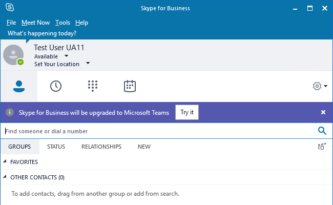

# <a name="tools-for-upgrading-to-teams-mdash-for-it-administrators"></a>Strumenti per l'aggiornamento a Teams &mdash; per amministratori IT

Questo articolo descrive gli strumenti per l'aggiornamento a Teams. Questo articolo è il terzo di molti articoli che descrivono i concetti e l'implementazione dell'aggiornamento per gli amministratori IT.  

- [Panoramica](upgrade-to-teams-on-prem-overview.md)
- [Metodi di aggiornamento](upgrade-to-teams-on-prem-upgrade-methods.md)
- **Strumenti per la gestione dell'aggiornamento**   (questo articolo)
- [Considerazioni aggiuntive per le organizzazioni con Skype for Business locale](upgrade-to-teams-on-prem-considerations.md)
- [Implementare l'aggiornamento](upgrade-to-teams-on-prem-implement.md)
- [Considerazioni sulla rete PSTN (Public Switched Telephone Network)](upgrade-to-teams-on-prem-pstn-considerations.md)

Gli articoli seguenti descrivono inoltre concetti importanti sull'aggiornamento e comportamenti di coesistenza:

- [Coesistenza di Teams e Skype for Business](upgrade-to-teams-on-prem-coexistence.md)
- [Modalità di coesistenza - Riferimento](migration-interop-guidance-for-teams-with-skype.md)
- [Esperienza del client di Teams e conformità alle modalità di coesistenza](teams-client-experience-and-conformance-to-coexistence-modes.md)


## <a name="tools-for-managing-the-upgrade"></a>Strumenti per la gestione dell'aggiornamento

Qualunque sia il metodo di aggiornamento scelto, per gli utenti che hanno già Skype for Business online, puoi gestire la transizione a TeamsOnly utilizzando [TeamsUpgradePolicy,](https://docs.microsoft.com/powershell/module/skype/grant-csteamsupgradepolicy?view=skype-ps)che controlla la modalità di coesistenza di un utente. Gli utenti con un account locale in Skype for Business Server possono anche `Move-CsUser` [spostarli nel cloud.](https://docs.microsoft.com/skypeforbusiness/hybrid/move-users-between-on-premises-and-cloud)  Per altre informazioni su ognuna delle modalità, vedere Modalità [di coesistenza.](migration-interop-guidance-for-teams-with-skype.md)  

Se esegui una transizione delle funzionalità di selezione utilizzando le modalità Skype for Business o esegui semplicemente l'aggiornamento alla modalità TeamsOnly dalla configurazione predefinita delle isole, TeamsUpgradePolicy è lo strumento principale per gli utenti che hanno già Skype for Business online. Come qualsiasi altro criterio in Teams, è possibile assegnare TeamsUpgradePolicy direttamente a un utente. È anche possibile impostare il criterio come predefinito a livello di tenant. Qualsiasi assegnazione a un utente ha la precedenza rispetto all'impostazione predefinita del tenant.  Puoi gestire i criteri nella console di amministrazione di Teams e in PowerShell.

È anche possibile assegnare qualsiasi modalità di TeamsUpgradePolicy, ad eccezione della modalità TeamsOnly, agli utenti ospitati in Skype for Business locale. **La modalità TeamsOnly può essere assegnata solo a un utente già presente in Skype for Business online.** Questo perché l'interoperabilità con gli utenti e la federazione di Skype for Business, nonché con la funzionalità Sistema telefonico Microsoft 365, è possibile solo se l'utente è presente in Skype for Business online. Inoltre, non è possibile assegnare la modalità **TeamsOnly** come impostazione predefinita a livello di tenant se si ha una distribuzione locale di Skype for Business (rilevata dalla presenza di un record DNS lyncdiscover che punta a una posizione diversa da Office 365).

Gli utenti con account Skype for Business ospitati in locale devono essere spostati [online](https://docs.microsoft.com/SkypeForBusiness/hybrid/move-users-from-on-premises-to-teams) (in Skype for Business online o direttamente a Teams) usando Move-CsUser nel set di strumenti locale di Skype for Business. Questi utenti possono essere spostati in TeamsOnly in 1 o 2 passaggi:

-   1 passaggio: specificare il parametro -MoveToTeams in Move-CsUser. È necessario Skype for Business Server 2019 o Skype for Business Server 2015 con CU8 o versione successiva.

-   2 passaggi: dopo aver eseguito Move-CsUser, concedere la modalità TeamsOnly all'utente utilizzando TeamsUpgradePolicy.

A differenza di altri criteri, non è possibile creare nuove istanze di TeamsUpgradePolicy in Microsoft 365 o Office 365. Tutte le istanze esistenti sono incorporate nel servizio.  Si noti che la modalità è una proprietà all'interno di TeamsUpgradePolicy, invece del nome di un'istanza di criterio. In alcuni casi, ma non in tutti, il nome dell'istanza del criterio corrisponde alla modalità. In particolare, per assegnare la modalità TeamsOnly a un utente, si concede l'istanza "UpgradeToTeams" di TeamsUpgradePolicy a tale utente. Per visualizzare un elenco di tutte le istanze, è possibile eseguire il comando seguente:

```PowerShell
Get-CsTeamsUpgradePolicy|ft Identity, Mode, NotifySfbUsers
```

Per aggiornare un utente online alla modalità TeamsOnly, assegnare l'istanza "UpgradeToTeams": 

```PowerShell
Grant-CsTeamsUpgradePolicy -PolicyName UpgradeToTeams -Identity $user 
```

Per aggiornare un utente Skype for Business locale alla modalità TeamsOnly, Move-CsUser nel set di strumenti locale:

```PowerShell
Move-CsUser -identity $user -Target sipfed.online.lync.com -MoveToTeams -credential $cred
```

Per cambiare la modalità per tutti gli utenti nel tenant, ad eccezione di quelli che hanno una concessione esplicita per utente (che ha la precedenza), eseguire il comando seguente:

```PowerShell
Grant-CsTeamsUpgradePolicy -PolicyName SfbWithTeamsCollab -Global
```


>[!NOTE]
>Se hai utenti con account Skype for Business in locale, non puoi assegnare la modalità TeamsOnly a livello di tenant. È necessario spostare questi utenti singolarmente nel cloud con Move-CsUser.


## <a name="using-notifications-in-skype-for-business-clients"></a>Uso delle notifiche nei client di Skype for Business

Gli amministratori hanno la possibilità di fornire notifiche all'utente finale nel client Skype for Business per informare gli utenti che verranno presto aggiornati a Teams, come illustrato nel diagramma seguente. Ad esempio, una settimana prima che l'amministratore piani di aggiornare un gruppo di utenti alla modalità TeamsOnly, l'amministratore potrebbe voler attivare queste notifiche per quel gruppo di utenti. Queste notifiche sono abilitate usando un'istanza di TeamsUpgradePolicy con NotifySfbUsers=true.  Per tutte le modalità diverse da TeamsOnly, in realtà sono presenti due istanze per modalità, corrispondenti ai due valori di NotifySfbUsers.  Per tutte le modalità diverse da TeamsOnly, in realtà sono presenti due istanze per modalità, corrispondenti ai due valori di NotifySfbUsers. 



Se gli utenti sono ospitati in Skype for Business online, basta assegnare l'istanza del criterio che ha la stessa modalità dell'utente, ma con NotifySfbUsers=true. 

Se gli utenti sono ospitati in Skype for Business Server locale, dovrai utilizzare il set di strumenti locale e avrai bisogno di Skype for Business Server 2019 o CU8 per Skype for Business Server 2015. Per gli utenti ospitati in Skype for Business Server locale, viene rispettata la proprietà modalità dell'istanza online di TeamsUpgradePolicy, ma non la proprietà NotifySfbUsers. Se si desidera ricevere notifiche, è necessario creare un'istanza locale di TeamsUpgradePolicy per controllare il comportamento del client. 

Nella finestra di PowerShell locale, creare una nuova istanza di TeamsUpgradePolicy con NotifySfbUsers=true:

```PowerShell
New-CsTeamsUpgradePolicy -Identity EnableNotification -NotifySfbUsers $true
```

Quindi, usando la stessa finestra di PowerShell locale, assegnare il nuovo criterio agli utenti desiderati:

```PowerShell
Grant-CsTeamsUpgradePolicy -Identity $user -PolicyName EnableNotification
```

## <a name="meeting-migration"></a>Migrazione delle riunioni

Quando un utente viene migrato alla modalità TeamsOnly, per impostazione predefinita le riunioni esistenti di Skype for Business che hanno organizzato verranno convertite in Teams. Se si desidera, è possibile disabilitare il comportamento predefinito quando si assegna la modalità TeamsOnly a un utente. Quando si spostano utenti dalla distribuzione locale, le riunioni devono essere migrate nel cloud per funzionare con l'account utente online, ma se non si specifica -MoveToTeams, le riunioni verranno migrate come riunioni Skype for Business, invece di essere convertite in Teams. 

Quando si assegna la modalità TeamsOnly a livello di tenant, la migrazione delle riunioni non viene attivata per gli utenti. Se si vuole assegnare la modalità TeamsOnly a livello di tenant ed eseguire la migrazione delle riunioni, è possibile usare PowerShell per ottenere un elenco di utenti nel tenant (ad esempio usando Get-CsOnlineUser con tutti i filtri necessari) e quindi eseguire un ciclo tra questi utenti per avviare la migrazione delle riunioni con Start-CsExMeetingMigration. Per informazioni dettagliate, vedere Uso del servizio [MMS (Meeting Migration Service).](https://docs.microsoft.com/skypeforbusiness/audio-conferencing-in-office-365/setting-up-the-meeting-migration-service-mms)


## <a name="related-links"></a>Collegamenti correlati

[Indicazioni sulla migrazione e l'interoperabilità per le organizzazioni che usano Teams insieme a Skype for Business](migration-interop-guidance-for-teams-with-skype.md) 

[Configurare la connettività ibrida tra Skype for Business Server e Microsoft 365 o Office 365](https://docs.microsoft.com/SkypeForBusiness/hybrid/configure-hybrid-connectivity)

[Spostare utenti tra locale e cloud](https://docs.microsoft.com/SkypeForBusiness/hybrid/move-users-between-on-premises-and-cloud)

[Impostazione delle impostazioni di coesistenza e aggiornamento](setting-your-coexistence-and-upgrade-settings.md)

[Grant-CsTeamsUpgradePolicy](https://docs.microsoft.com/powershell/module/skype/grant-csteamsupgradepolicy?view=skype-ps)

[Uso del servizio MMS (Meeting Migration Service)](https://docs.microsoft.com/skypeforbusiness/audio-conferencing-in-office-365/setting-up-the-meeting-migration-service-mms)

