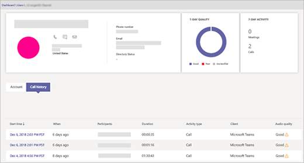

# Uso di Call Analytics per risolvere problemi di bassa qualità delle chiamateUse Call Analytics to troubleshoot poor call quality

L'analisi delle chiamate consente di risolvere i problemi di chiamata o di connessione con Microsoft teams e Skype for business.Call Analytics helps you troubleshoot call or connection problems with Microsoft Teams and Skype for Business. Chiamata analitica Mostra informazioni dettagliate sui dispositivi, le reti e la connettività per le chiamate e le riunioni di ogni utente nell'account Microsoft 365 o Office 365.Call Analytics shows detailed information about the devices, networks, and connectivity for the calls and meetings of each user in your Microsoft 365 or Office 365 account. Se le informazioni relative a compilazione, sito e tenant sono state aggiunte all'analisi delle chiamate, verranno visualizzate anche per ogni chiamata e sessione.If building, site, and tenant information has been added to Call Analytics, it will also be shown for each call and session. Le informazioni disponibili tramite le funzionalità di analisi delle chiamate consentono di individuare il motivo per cui un utente ha ricevuto una chiamata o un'esperienza di riunione scadente.Information available via Call Analytics can help you figure out why a user had a poor call or meeting experience. 
  
## Autorizzazioni di analisi delle chiamateCall Analytics permissions

L'amministratore riceverà l'accesso completo a tutte le caratteristiche di Call Analytics.As the admin, you get full access to all the features of Call Analytics. È inoltre possibile assegnare ruoli di Azure Active Directory per supportare il personale.In addition, you can assign Azure Active Directory roles to support staff. Assegnare il ruolo di specialista delle comunicazioni di teams agli utenti che dovrebbero avere una visione limitata dell'analisi delle chiamate.Assign the Teams communications support specialist role to users who should have a limited view of Call Analytics. Assegnare il ruolo di assistente tecnico comunicazioni teams agli utenti che hanno bisogno di accedere alle funzionalità complete di analisi delle chiamate.Assign the Teams communications support engineer role to users who need access to the full functionality of Call Analytics. Entrambi i livelli di autorizzazione impediscono l'accesso al resto dell'interfaccia di amministrazione di Microsoft teams.Both permission levels prevent access to the rest of the Microsoft Teams admin center.

Gli specialisti del supporto delle comunicazioni gestiscono i problemi di qualità delle chiamate di base.Communications support specialists handle basic call-quality problems. Non analizzano i problemi relativi alle riunioni.They don't investigate issues with meetings. Raccolgono invece informazioni correlate e poi escalano in un tecnico del supporto delle comunicazioni.Instead, they collect related information and then escalate to a communications support engineer. Gli ingegneri del supporto delle comunicazioni visualizzano informazioni in registri di chiamate dettagliati nascosti dagli specialisti del supporto delle comunicazioni.Communications support engineers see information in detailed call logs that's hidden from communications support specialists. La tabella seguente offre una panoramica delle informazioni disponibili per gli specialisti del supporto delle comunicazioni e per gli ingegneri del supporto delle comunicazioni quando usano le analisi delle chiamate.The following table gives an overview of information available to communications support specialists and communications support engineers when they use Call Analytics.

Il livello di autorizzazione assegnato determina il tipo di informazioni a cui si ha accesso in Call Analytics:The permissions level assigned to you determines what type of information you have access to in Call Analytics:
  
- Amministratore del **servizio teams o amministratore di team Communications**: è possibile accedere a tutte le informazioni in Call Analytics e nell'interfaccia di amministrazione di Microsoft teams.**Teams service administrator or Teams communications administrator**: You have access to all the information in Call Analytics and in the Microsoft Teams admin center.
    
- **Specialista supporto comunicazioni teams**: viene visualizzato un set limitato di dati in Call Analytics.**Teams communications support specialist**: You see a limited set of data in Call Analytics. È possibile risolvere i problemi relativi alle chiamate, ma le riunioni vengono risolte in un team di supporto tecnico per le comunicazioni.You can troubleshoot calls, but you'll hand off problems with meetings to a Teams communications support engineer. Non si ha accesso al resto dell'interfaccia di amministrazione di Microsoft teams.You don't have access to the rest of the Microsoft Teams admin center.
    
- **Assistente tecnico comunicazioni teams**: vengono visualizzati tutti i dati disponibili in analisi delle chiamate e possono essere utili per la risoluzione dei problemi relativi a chiamate e riunioni.**Teams communications support engineer**: You see all available data in Call Analytics and can help troubleshoot problems with both calls and meetings. Non si ha accesso al resto dell'interfaccia di amministrazione di Microsoft teams.You don't have access to the rest of the Microsoft Teams admin center.
    
> [!NOTE]
> Il ruolo di specialista del supporto delle comunicazioni equivale al supporto di Tier 1 e il ruolo dell'ingegnere del supporto delle comunicazioni equivale al supporto di Tier 2.The communications support specialist role is equivalent to tier 1 support and the communications support engineer role is equivalent to tier 2 support.

Per altre informazioni sui ruoli di amministratore di teams, vedere [usare i ruoli di amministratore di Microsoft teams per gestire i team](using-admin-roles.md).For more information about Teams admin roles, see [Use Microsoft Teams admin roles to manage Teams](using-admin-roles.md). Per un confronto dettagliato tra i ruoli di supporto tecnico comunicazioni di teams Specialist e teams support, vedere [configurare l'analisi delle chiamate](set-up-call-analytics.md#set-call-analytics-permissions)For a detailed comparison of the Teams communications support specialist and Teams communications support engineer roles, see [Set up Call Analytics](set-up-call-analytics.md#set-call-analytics-permissions) 
  
Vedere l'amministratore di teams e Skype for business se serve aiuto con le autorizzazioni.See your Teams and Skype for Business admin if you need help with permissions.
  
## Risolvere i problemi di qualità delle chiamate con l'analisi delle chiamateTroubleshoot call quality problems using Call Analytics

1. Accedere con le credenziali di supporto delle comunicazioni teams o di amministratore teams.Sign in with your Teams communications support or Teams admin credentials.

2. Nel Web browser andare a *https://admin.teams.microsoft.com* .In your web browser go to *https://admin.teams.microsoft.com*.
    
3. Nel **Dashboard**, in **ricerca utente**, iniziare a digitare il nome o l'indirizzo SIP dell'utente le cui chiamate si vuole risolvere o selezionare **Visualizza utenti** per visualizzare un elenco di utenti.On the **Dashboard**, in **User Search**, start typing either the name or sip address of the user whose calls you want to troubleshoot or select **View users** to see a list of users.
    
    
  
4. Selezionare l'utente nell'elenco.Select the user from the list.

5. Selezionare **cronologia chiamate**e quindi selezionare la chiamata o la riunione che si vuole risolvere.Select **Call history**, and then select the call or meeting that you want to troubleshoot.  Verrà restituito un massimo di record di 500.A maximum of 500 records will be returned.
    
    
  
6. Selezionare la scheda **Avanzate** e cercare gli elementi gialli e rossi che indicano la qualità della chiamata o i problemi di connessione.Select the **Advanced** tab, and then look for yellow and red items which indicate poor call quality or connection problems.
    
    Nei dettagli della sessione per ogni chiamata o riunione, i problemi secondari vengono visualizzati in giallo.In the session details for each call or meeting, minor issues appear in yellow. Ad esempio, nella schermata seguente i valori sono in giallo per jitter medio, jitter Max e percentuale media di perdita di pacchetti. Se qualcosa è giallo, è al di fuori dell'intervallo normale e può contribuire al problema, ma è improbabile che sia la causa principale del problema.(For example, in the following screenshot, the values are in yellow for Average jitter, Max jitter, and Average packet loss rate.) If something is yellow, it's outside of normal range, and it may be contributing to the problem, but it's unlikely to be the main cause of the problem. Se qualcosa è rosso, è un problema significativo ed è probabilmente la causa principale della scarsa qualità delle chiamate per questa sessione.If something is red, it's a significant problem, and it's likely the main cause of the poor call quality for this session. 
    
    
  
In rari casi, la qualità dei dati dell'esperienza non viene ricevuta per le sessioni audio.In rare cases, quality of experience data isn't received for audio sessions. Spesso questa operazione è causata dalla chiamata in calo e la connessione al client termina.Often this is caused by the call dropping and connection with the client terminating. In questo caso, la valutazione della sessione non è **disponibile**.When this occurs, the session rating is **unavailable**.
  
Per le sessioni audio in cui sono presenti dati QoE (Quality of Experience), la tabella seguente descrive i problemi principali che qualificano una sessione come **poveri**.For audio sessions that do have quality of experience (QoE) data, the following table describes major issues that qualify a session as **poor**.
  
|**Problema****Issue**|**Zona****Area**|**Descrizione****Description**|
|:-----|:-----|:-----|
|Configurazione chiamataCall setup    |SessioneSession    |Il codice di errore MS-diag 20-29 indica che la configurazione delle chiamate non è riuscita.The error code Ms-diag 20-29 indicates the call setup failed. L'utente non ha potuto partecipare alla chiamata o alla riunione.The user couldn't join the call or meeting.    |
|Chiamata scadente della rete audio classificataAudio network classified poor call    |SessioneSession    |Sono stati rilevati problemi di qualità della rete, ad esempio perdita di pacchetti, jitter, degradazione NMOS, RTT o rapporto nascosto.Network quality issues (such as packet loss, jitter, NMOS degradation, RTT, or concealed ratio) were encountered. Per altre informazioni sulle condizioni usate per classificare le chiamate scadenti, vedere questo [post di Blog Microsoft](https://go.microsoft.com/fwlink/p/?linkid=852133).For more information about the conditions used to classify poor calls, see this [Microsoft blog post](https://go.microsoft.com/fwlink/p/?linkid=852133).    |
|Dispositivo non funzionanteDevice not functioning    |DispositivoDevice    | Un dispositivo non funziona correttamente.A device isn't functioning correctly. I rapporti tra dispositivi non funzionanti sono:Device not functioning ratios are :    DeviceRenderNotFunctioningEventRatio >= 0,005DeviceRenderNotFunctioningEventRatio >= 0.005    DeviceCaptureNotFunctioningEventRatio >= 0,005DeviceCaptureNotFunctioningEventRatio >= 0.005   |
   
## Argomenti correlatiRelated topics
[Configurare l'analisi delle chiamateSet up Call Analytics](set-up-call-analytics.md)

[Analisi delle chiamate e Dashboard Qualità della chiamataCall Analytics and Call Quality Dashboard](difference-between-call-analytics-and-call-quality-dashboard.md)

  
 
