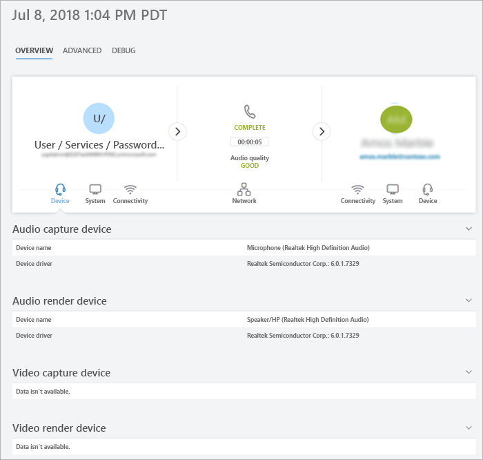

# Usare la chiamata analitica per risolvere i problemi di qualità delle chiamate

Questo articolo spiega come usare la chiamata analitica per risolvere i problemi di qualità delle chiamate o delle riunioni di Microsoft teams per singoli utenti, se si è un amministratore di team o uno specialista o un ingegnere di supporto per le comunicazioni Teams

  
## Autorizzazioni di analisi delle chiamate

Questo articolo presuppone che tu abbia già configurato l'analisi delle chiamate. Se non è ancora stato fatto, leggere [configurare l'analisi delle chiamate per i team](set-up-call-analytics.md).

## Introduzione all'analisi delle chiamate

Chiamata analitica Mostra informazioni dettagliate sulle chiamate e le riunioni di team per ogni utente nell'account di Office 365. Include informazioni su dispositivi, reti, connettività e qualità delle chiamate (uno di questi fattori può essere un fattore di scarsa qualità delle chiamate o delle riunioni). Se si caricano informazioni su edifici, siti e tenant, queste informazioni verranno visualizzate anche per ogni chiamata e riunione. Usare la funzionalità di analisi delle chiamate per individuare il motivo per cui un utente ha ricevuto una chiamata o un'esperienza di riunione scadente.

L'analisi delle chiamate consente di visualizzare ogni tappa di una chiamata o di una riunione, ad esempio da un partecipante a un secondo partecipante. Analizzando questi dettagli, un amministratore di teams può isolare le aree problematiche e identificare la causa radice per una qualità scadente.
   
Come amministratore di teams, Ottieni l'accesso completo a tutti i dati di analisi delle chiamate per ogni utente. È inoltre possibile assegnare ruoli di Azure Active Directory per supportare il personale. Per altre informazioni su questi ruoli, leggere [concedere l'autorizzazione per il supporto tecnico e il personale dell'helpdesk](set-up-call-analytics.md#give-permission-to-support-and-helpdesk-staff). Non perdere [il ruolo di supporto di ogni teams?](#what-does-each-teams-support-role-do) di seguito.

## Dove trovare le analisi delle chiamate per utente

Per visualizzare tutte le informazioni sulle chiamate e i dati per un utente, accedere all'interfaccia di [amministrazione di teams](https://admin.teams.microsoft.com). In **utenti**selezionare un utente e quindi aprire la scheda **cronologia chiamate** nella pagina del profilo dell'utente. Qui troverai tutte le chiamate e le riunioni per l'utente per gli ultimi 30 giorni.

Per ottenere altre informazioni su una determinata sessione, incluse le statistiche dettagliate su elementi multimediali e di rete, fare clic su una sessione per visualizzare i dettagli.

  
## Che cosa fa il ruolo di supporto di ogni team?

Lo **specialista supporto comunicazioni teams** (supporto Tier 1) gestisce i problemi di qualità delle chiamate di base. Non analizzano i problemi relativi alle riunioni. Raccolgono invece informazioni correlate e poi escalano in un tecnico del supporto delle comunicazioni. 

Il supporto **tecnico di Communications teams** (support di livello 2) Visualizza le informazioni in registri di chiamata dettagliati nascosti dallo specialista supporto comunicazioni teams. Nella tabella seguente sono elencate le informazioni disponibili per ogni ruolo di supporto comunicazioni di teams.

La tabella seguente indica quali informazioni per utente sono disponibili per ogni ruolo di supporto delle comunicazioni.

|**Attività**|**Informazioni**|Cosa vede lo **specialista** supporto comunicazioni|Cosa vede l' **ingegnere** del supporto comunicazioni|
|:-----|:-----|:-----|:-----|
|**Chiamate**   |Nome chiamante    |Solo il nome dell'utente per il quale è stato cercato l'agente.    |Nome utente.    |
||Nome destinatario    |Viene visualizzato come utente interno o utente esterno.    |Nome destinatario.    |
||Numero di telefono del chiamante    |L'intero numero di telefono eccetto le ultime tre cifre viene offuscato con simboli asterisco. Ad esempio, 15552823 * * *.    |L'intero numero di telefono eccetto le ultime tre cifre viene offuscato con simboli asterisco. Ad esempio, 15552823 * * *.    |
||Numero di telefono del destinatario    |L'intero numero di telefono eccetto le ultime tre cifre viene offuscato con simboli asterisco. Ad esempio, 15552823 * * *.    |L'intero numero di telefono eccetto le ultime tre cifre viene offuscato con simboli asterisco. Ad esempio, 15552823 * * *.    |
||**Dettagli chiamata**  >  Scheda **Avanzate**   |Informazioni non visualizzate.    |Tutti i dettagli visualizzati, ad esempio i nomi dei dispositivi, l'indirizzo IP, il mapping della subnet e altro ancora.    |
||**Dettagli chiamata**  >  **Avanzate**  >  Scheda **debug**   |Informazioni non visualizzate.    |Tutti i dettagli visualizzati, ad esempio suffisso DNS e SSID.    |
|**Riunioni**   |Nomi dei partecipanti    |Solo il nome dell'utente per il quale è stato cercato l'agente. Altri partecipanti identificati come utenti interni o utenti esterni.    |Tutti i nomi visualizzati.    |
||Conteggio partecipanti    |Numero di partecipanti.    |Numero di partecipanti.    |
||Dettagli della sessione    |Dettagli della sessione mostrati con eccezioni. Solo il nome dell'utente per il quale è visualizzato l'agente cercato. Altri partecipanti identificati come utenti interni o utenti esterni. Ultime tre cifre del numero di telefono offuscato con simboli asterischi.    |Dettagli della sessione mostrati. Nomi utente e dettagli della sessione mostrati. Ultime tre cifre del numero di telefono offuscato con simboli asterischi.    |
||||
  
## Risolvere i problemi di qualità delle chiamate utente 

1. Aprire l'interfaccia di amministrazione di teams https://admin.teams.microsoft.com) e accedere con le credenziali di supporto delle comunicazioni teams o di amministratore teams.

2. Nel **Dashboard**, in **ricerca utente**, iniziare a digitare il nome o l'indirizzo SIP dell'utente le cui chiamate si vuole risolvere o selezionare **Visualizza utenti** per visualizzare un elenco di utenti.

3. Selezionare l'utente nell'elenco.

4. Selezionare **cronologia chiamate**e quindi selezionare la chiamata o la riunione che si vuole risolvere.
    
5. Selezionare la scheda **Avanzate** e cercare gli elementi gialli e rossi che indicano la qualità della chiamata o i problemi di connessione.
    
    Nei dettagli della sessione per ogni chiamata o riunione, i problemi secondari vengono visualizzati in giallo. Se qualcosa è giallo, è al di fuori dell'intervallo normale e può contribuire al problema, ma è improbabile che sia la causa principale del problema. Se qualcosa è rosso, è un problema significativo ed è probabilmente la causa principale della scarsa qualità delle chiamate per questa sessione. 
      
In rari casi, la qualità dei dati dell'esperienza non viene ricevuta per le sessioni audio. Spesso questa operazione è causata da una chiamata eliminata o quando la connessione con il client termina. In questo caso, la valutazione della sessione non è **disponibile**.
  
Per le sessioni audio in cui sono presenti dati QoE (Quality of Experience), la tabella seguente descrive i problemi principali che qualificano una sessione come **poveri**.
  
|**Problema**|**Zona**|**Descrizione**|
|:-----|:-----|:-----|
|Configurazione chiamata    |Sessione    |Il codice di errore MS-diag 20-29 indica che la configurazione delle chiamate non è riuscita. L'utente non ha potuto partecipare alla chiamata o alla riunione.    |
|Chiamata scadente della rete audio classificata    |Sessione    |Sono stati rilevati problemi di qualità della rete, ad esempio perdita di pacchetti, jitter, degradazione NMOS, RTT o rapporto nascosto.    |
|Dispositivo non funzionante    |Dispositivo    | Un dispositivo non funziona correttamente. I rapporti tra dispositivi non funzionanti sono:    DeviceRenderNotFunctioningEventRatio >= 0,005    DeviceCaptureNotFunctioningEventRatio >= 0,005   |
   

## Argomenti correlati

[Configurare l'analisi delle chiamate per utente](set-up-call-analytics.md)

  
 
