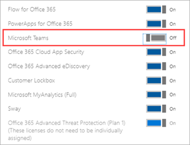

# <a name="manage-user-access-to-teams"></a>Gestire l'accesso degli utenti a Teams

L'utente gestisce l'accesso a Teams a livello di utente assegnando o rimuovendo una licenza di prodotto di Microsoft Teams. Ad eccezione della partecipazione alle riunioni di Teams in forma anonima, ogni utente dell'organizzazione deve avere una licenza di Teams prima di poter usare Teams. È possibile assegnare una licenza di Teams ai nuovi utenti quando vengono creati nuovi account utente o agli utenti con account esistenti.

Per impostazione predefinita, quando un piano di licenza (ad esempio, Microsoft 365 Enterprise E3 o Microsoft 365 Business Premium) viene assegnato a un utente, viene assegnata automaticamente una licenza di Teams e l'utente è abilitato per Teams. È possibile disabilitare o abilitare Teams per un utente rimuovendo o assegnando una licenza in qualsiasi momento.

Usare i criteri di messaggistica, gestiti da <a href="https://go.microsoft.com/fwlink/p/?linkid=2024339" target="_blank">Teams Amministrazione Center</a>, per controllare quali funzionalità di messaggistica di chat e canale sono disponibili per gli utenti in Teams. È possibile usare il criterio predefinito o creare uno o più criteri di messaggistica personalizzati per gli utenti dell'organizzazione. Per altre informazioni, vedere [Gestire i criteri di messaggistica in Teams](messaging-policies-in-teams.md).
Le licenze di Teams possono essere gestite nel interfaccia di amministrazione di Microsoft 365 o tramite PowerShell. Per gestire le licenze, è necessario essere un amministratore globale o un amministratore gestione utenti.

> [!NOTE]
> È consigliabile abilitare Teams per tutti gli utenti in modo che i team possano essere creati in modo organico per i progetti e altre iniziative dinamiche. Anche se si esegue un progetto pilota, può essere comunque utile mantenere Teams abilitato per tutti gli utenti, ma solo per le comunicazioni di destinazione verso il gruppo pilota di utenti.

## <a name="using-the-microsoft-365-admin-center"></a>Uso della interfaccia di amministrazione di Microsoft 365

Le licenze a livello utente di Teams vengono gestite direttamente tramite le interfacce di gestione degli utenti interfaccia di amministrazione di Microsoft 365. Un amministratore può assegnare licenze ai nuovi utenti quando vengono creati nuovi account utente o a utenti con account esistenti.

> [!IMPORTANT]
> Per gestire le licenze di Microsoft Teams, l'amministratore deve disporre dei privilegi di amministratore globale o amministratore gestione utenti.
Usare la interfaccia di amministrazione di Microsoft 365 per gestire le licenze di Teams per singoli utenti o piccoli gruppi di utenti contemporaneamente. È possibile gestire le licenze di Teams nella pagina **Licenze** (per un massimo di 20 utenti alla volta) o nella pagina **Utenti attivi** . Il metodo scelto dipende dalla gestione delle licenze di prodotto per utenti specifici o dalla gestione delle licenze utente per prodotti specifici.

Se è necessario gestire le licenze di Teams per un numero elevato di utenti, ad esempio centinaia o migliaia di utenti, [usare PowerShell](#using-powershell) o [le licenze basate su gruppo in Azure Active Directory (Azure AD).](/azure/active-directory/users-groups-roles/licensing-groups-assign)If you need to manage Teams licenses for a large number of users, such as hundreds or thousands of users, use PowerShell or group-based licensing in Azure Active Directory (Azure AD). 

### <a name="assign-a-teams-license"></a>Assegnare una licenza di Teams

La procedura varia a seconda che si usi la pagina **Licenze** o **Utenti attivi** .  Per istruzioni dettagliate, vedere [Assegnare licenze agli utenti](/microsoft-365/admin/manage/assign-licenses-to-users).

|&nbsp;|&nbsp;|
|---------|---------|
|    |         |

### <a name="remove-a-teams-license"></a>Rimuovere una licenza di Teams

> [!IMPORTANT]
> La disabilitazione di uno SKU di Teams richiede circa 24 ore.

Quando rimuovi una licenza di Teams da un utente, Teams viene disabilitato per quell'utente e non vedrà più Teams nell'icona di avvio delle app o nella home page. Per la procedura dettagliata, vedere [Annullare l'assegnazione delle licenze agli utenti](/microsoft-365/admin/manage/remove-licenses-from-users).

|&nbsp;|&nbsp;|
|---------|---------|
|    |         |

## <a name="using-powershell"></a>Utilizzo di PowerShell

Usare PowerShell per gestire le licenze di Teams per gli utenti in blocco. È possibile abilitare e disabilitare Teams tramite PowerShell come per qualsiasi altra licenza del piano di servizio. Sono necessari gli identificatori per i piani di servizio per Teams, che sono i seguenti:

- Microsoft Teams: TEAMS1
- Microsoft Teams per GCC: TEAMS_GOV
- Microsoft Teams per DoD: TEAMS_DOD

### <a name="assign-teams-licenses-in-bulk"></a>Assegnare licenze di Teams in blocco

Per la procedura dettagliata, vedere [Assegnare licenze agli account utente con PowerShell](/office365/enterprise/powershell/assign-licenses-to-user-accounts-with-office-365-powershell).

### <a name="remove-teams-licenses-in-bulk"></a>Rimuovere le licenze di Teams in blocco

Per la procedura dettagliata, vedere [Disabilitare l'accesso ai servizi con PowerShell](/office365/enterprise/powershell/disable-access-to-services-with-office-365-powershell) e [Disabilitare l'accesso ai servizi durante l'assegnazione delle licenze utente](/office365/enterprise/powershell/disable-access-to-services-while-assigning-user-licenses).

#### <a name="example"></a>Esempio 

Di seguito è riportato un esempio di come usare i cmdlet [New-MsolLicenseOptions](/powershell/module/msonline/new-msollicenseoptions) e [Set-MsolUserLicense](/powershell/module/msonline/set-msoluserlicense) per disabilitare Teams per gli utenti che hanno un piano di licenza specifico. Ad esempio, seguire questa procedura per disabilitare prima Teams per tutti gli utenti che hanno un particolare piano di licenza. Abilitare quindi Teams per ogni singolo utente che dovrebbe avere accesso a Teams.

> [!IMPORTANT]
> Il cmdlet [New-MsolLicenseOptions](/powershell/module/msonline/new-msollicenseoptions) abilita tutti i servizi che in precedenza sono stati disabilitati, a meno che non siano stati esplicitamente identificati nello script personalizzato. Ad esempio, se si vuole lasciare disabilitato sia Exchange che Sway disabilitando anche Teams, è necessario includerlo nello script oppure sia Exchange che Sway saranno abilitati per gli utenti identificati.

Eseguire il comando seguente per visualizzare tutti i piani di licenza disponibili nell'organizzazione. Per altre informazioni, vedere [Visualizzare licenze e servizi con PowerShell](/office365/enterprise/powershell/view-licenses-and-services-with-office-365-powershell).


```powershell
Get-MsolAccountSku
```

Eseguire i comandi seguenti, dove \<CompanyName:License> si trova il nome dell'organizzazione e l'identificatore del piano di licenza recuperato nel passaggio precedente. Ad esempio, ContosoSchool:ENTERPRISEPACK_STUDENT.

```powershell
$acctSKU="<CompanyName:License>"
$x = New-MsolLicenseOptions -AccountSkuId $acctSKU -DisabledPlans "TEAMS1"
```

Eseguire il comando seguente per disabilitare Teams per tutti gli utenti che hanno una licenza attiva per il piano di licenza.

```powershell
Get-MsolUser | Where-Object {$_.licenses[0].AccountSku.SkuPartNumber -eq  ($acctSKU).Substring($acctSKU.IndexOf(":")+1,  $acctSKU.Length-$acctSKU.IndexOf(":")-1) -and $_.IsLicensed -eq $True} |  Set-MsolUserLicense -LicenseOptions $x
```

## <a name="related-topics"></a>Argomenti correlati

- [Licenze per i componenti aggiuntivi di Teams](teams-add-on-licensing/microsoft-teams-add-on-licensing.md)
- [Assegnare licenze per i componenti aggiuntivi di Teams](teams-add-on-licensing/assign-teams-add-on-licenses.md)
- [Visualizzare licenze e servizi con PowerShell](/office365/enterprise/powershell/view-licenses-and-services-with-office-365-powershell)
- [Nomi dei prodotti e identificatori dei piani di servizio per le licenze](/azure/active-directory/users-groups-roles/licensing-service-plan-reference)
- [Informazioni di riferimento su SKU education](sku-reference-edu.md)
