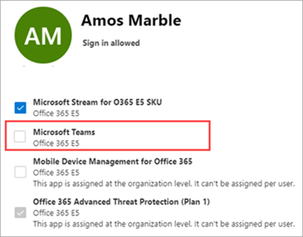

# <a name="manage-user-access-to-teams"></a><span data-ttu-id="29c06-103">Gestire l'accesso degli utenti a Teams</span><span class="sxs-lookup"><span data-stu-id="29c06-103">Manage user access to Teams</span></span>

<span data-ttu-id="29c06-104">Puoi gestire l'accesso ai team a livello di utente assegnando o rimuovendo una licenza di prodotto Microsoft teams.</span><span class="sxs-lookup"><span data-stu-id="29c06-104">You manage access to Teams at the user level by assigning or removing a Microsoft Teams product license.</span></span> <span data-ttu-id="29c06-105">Fatta eccezione per l'aggiunta di riunioni di team in modo anonimo, ogni utente dell'organizzazione deve avere una licenza per Teams prima di poter usare teams.</span><span class="sxs-lookup"><span data-stu-id="29c06-105">Except for joining Teams meetings anonymously, each user in your organization must have a Teams license before they can use Teams.</span></span> <span data-ttu-id="29c06-106">È possibile assegnare una licenza di teams per i nuovi utenti quando vengono creati nuovi account utente o per gli utenti con account esistenti.</span><span class="sxs-lookup"><span data-stu-id="29c06-106">You can assign a Teams license for new users when new user accounts are created or to users with existing accounts.</span></span>

<span data-ttu-id="29c06-107">Per impostazione predefinita, quando un piano di licenza (ad esempio Microsoft 365 Enterprise E3 o Microsoft 365 Business Premium) viene assegnato a un utente, viene automaticamente assegnata una licenza di teams e l'utente è abilitato per Teams.</span><span class="sxs-lookup"><span data-stu-id="29c06-107">By default, when a licensing plan (for example, Microsoft 365 Enterprise E3 or Microsoft 365 Business Premium) is assigned to a user, a Teams license is automatically assigned, and the user is enabled for Teams.</span></span> <span data-ttu-id="29c06-108">Puoi disabilitare o abilitare team per un utente rimuovendo o assegnando una licenza in qualsiasi momento.</span><span class="sxs-lookup"><span data-stu-id="29c06-108">You can disable or enable Teams for a user by removing or assigning a license at any time.</span></span>

<span data-ttu-id="29c06-109">Usare i criteri di messaggistica, gestiti dall'interfaccia di <a href="https://go.microsoft.com/fwlink/p/?linkid=2024339" target="_blank">amministrazione di teams</a>, per controllare quali funzionalità di messaggistica chat e canali sono disponibili per gli utenti in teams.</span><span class="sxs-lookup"><span data-stu-id="29c06-109">Use messaging policies, managed from the <a href="https://go.microsoft.com/fwlink/p/?linkid=2024339" target="_blank">Teams Admin Center</a>, to control what chat and channel messaging features are available to users in Teams.</span></span> <span data-ttu-id="29c06-110">È possibile usare i criteri predefiniti o creare uno o più criteri di messaggistica personalizzati per gli utenti dell'organizzazione.</span><span class="sxs-lookup"><span data-stu-id="29c06-110">You can use the default policy or create one or more custom messaging policies for people in your organization.</span></span> <span data-ttu-id="29c06-111">Per altre informazioni, leggere [gestire i criteri di messaggistica in teams](messaging-policies-in-teams.md).</span><span class="sxs-lookup"><span data-stu-id="29c06-111">To learn more, read [Manage messaging policies in Teams](messaging-policies-in-teams.md).</span></span>
<span data-ttu-id="29c06-112">È possibile gestire le licenze teams nell'interfaccia di amministrazione di Microsoft 365 o tramite PowerShell.</span><span class="sxs-lookup"><span data-stu-id="29c06-112">You manage Teams licenses in the Microsoft 365 admin center or by using PowerShell.</span></span> <span data-ttu-id="29c06-113">Per gestire le licenze, è necessario essere un amministratore globale o un amministratore di gestione utenti.</span><span class="sxs-lookup"><span data-stu-id="29c06-113">You must be a Global admin or User management admin to manage licenses.</span></span>

> [!NOTE]
> <span data-ttu-id="29c06-114">Ti consigliamo di abilitare teams per tutti gli utenti in modo che i team possano essere formati organicamente per progetti e altre iniziative dinamiche.</span><span class="sxs-lookup"><span data-stu-id="29c06-114">We recommend that you enable Teams for all users so that teams can be formed organically for projects and other dynamic initiatives.</span></span> <span data-ttu-id="29c06-115">Anche se si sta usando un pilota, può essere comunque utile conservare i team abilitati per tutti gli utenti, ma solo le comunicazioni di destinazione per il gruppo di utenti pilota.</span><span class="sxs-lookup"><span data-stu-id="29c06-115">Even if you're running a pilot, it may still be helpful to keep Teams enabled for all users, but only target communications to the pilot group of users.</span></span>

## <a name="using-the-microsoft-365-admin-center"></a><span data-ttu-id="29c06-116">Uso dell'interfaccia di amministrazione di Microsoft 365</span><span class="sxs-lookup"><span data-stu-id="29c06-116">Using the Microsoft 365 admin center</span></span>

<span data-ttu-id="29c06-117">Le licenze a livello di utente di teams vengono gestite direttamente tramite le interfacce di gestione degli utenti di Microsoft 365.</span><span class="sxs-lookup"><span data-stu-id="29c06-117">Teams user-level licenses are managed directly through the Microsoft 365 admin center user management interfaces.</span></span> <span data-ttu-id="29c06-118">Un amministratore può assegnare licenze ai nuovi utenti quando vengono creati nuovi account utente o per gli utenti con account esistenti.</span><span class="sxs-lookup"><span data-stu-id="29c06-118">An administrator can assign licenses to new users when new user accounts are created, or to users with existing accounts.</span></span> 

> [!IMPORTANT]
> <span data-ttu-id="29c06-119">Per gestire le licenze di Microsoft teams, l'amministratore deve avere i privilegi di amministratore globale o gestione utenti.</span><span class="sxs-lookup"><span data-stu-id="29c06-119">The administrator must have Global Administrator or User Management Administrator privileges to manage Microsoft Teams licenses.</span></span>
<span data-ttu-id="29c06-120">Usare l'interfaccia di amministrazione di Microsoft 365 per gestire le licenze di team per singoli utenti o piccoli set di utenti alla volta.</span><span class="sxs-lookup"><span data-stu-id="29c06-120">Use the Microsoft 365 admin center to manage Teams licenses for individual users or small sets of users at a time.</span></span> <span data-ttu-id="29c06-121">È possibile gestire le licenze per i team nella pagina **licenze** (per un massimo di 20 utenti alla volta) o nella pagina **utenti attivi** .</span><span class="sxs-lookup"><span data-stu-id="29c06-121">You can manage Teams licenses on the **Licenses** page (for up to 20 users at at time) or **Active users** page.</span></span> <span data-ttu-id="29c06-122">Il metodo scelto varia a seconda che si vogliano gestire le licenze di prodotto per utenti specifici o gestire le licenze utente per prodotti specifici.</span><span class="sxs-lookup"><span data-stu-id="29c06-122">The method you choose depends on whether you want to manage product licenses for specific users or manage user licenses for specific products.</span></span>

<span data-ttu-id="29c06-123">Se è necessario gestire le licenze per i team per un numero elevato di utenti, ad esempio centinaia o migliaia di utenti, [usare PowerShell](#using-powershell) o le [licenze basate su gruppo in Azure Active Directory (Azure ad)](https://docs.microsoft.com/azure/active-directory/users-groups-roles/licensing-groups-assign).</span><span class="sxs-lookup"><span data-stu-id="29c06-123">If you need to manage Teams licenses for a large number of users, such as hundreds or thousands of users, [use PowerShell](#using-powershell) or [group-based licensing in Azure Active Directory (Azure AD)](https://docs.microsoft.com/azure/active-directory/users-groups-roles/licensing-groups-assign).</span></span> 

### <a name="assign-a-teams-license"></a><span data-ttu-id="29c06-124">Assegnare una licenza per Teams</span><span class="sxs-lookup"><span data-stu-id="29c06-124">Assign a Teams license</span></span>

<span data-ttu-id="29c06-125">La procedura è diversa a seconda che si usi la pagina **licenze** o **gli utenti attivi** .</span><span class="sxs-lookup"><span data-stu-id="29c06-125">The steps are different depending on whether you use the **Licenses** page or **Active users** page.</span></span>  <span data-ttu-id="29c06-126">Per istruzioni dettagliate, vedere [assegnare licenze agli utenti](https://docs.microsoft.com/microsoft-365/admin/manage/assign-licenses-to-users).</span><span class="sxs-lookup"><span data-stu-id="29c06-126">For step-by-step instructions, see [Assign licenses to users](https://docs.microsoft.com/microsoft-365/admin/manage/assign-licenses-to-users).</span></span>

|||
|---------|---------|
|    |         |

### <a name="remove-a-teams-license"></a><span data-ttu-id="29c06-129">Rimuovere una licenza per Teams</span><span class="sxs-lookup"><span data-stu-id="29c06-129">Remove a Teams license</span></span>

<span data-ttu-id="29c06-130">Quando si rimuove una licenza di Teams da un utente, i team sono disabilitati per l'utente e non vedranno più i team nell'icona di avvio delle app o nella Home page.</span><span class="sxs-lookup"><span data-stu-id="29c06-130">When you remove a Teams license from a user, Teams is disabled for that user, and they will no longer see Teams in the app launcher or homepage.</span></span> <span data-ttu-id="29c06-131">Per la procedura dettagliata, vedere [annullare l'assegnazione di licenze dagli utenti](https://docs.microsoft.com/microsoft-365/admin/manage/remove-licenses-from-users).</span><span class="sxs-lookup"><span data-stu-id="29c06-131">For detailed steps, see [Unassign licenses from users](https://docs.microsoft.com/microsoft-365/admin/manage/remove-licenses-from-users).</span></span>

|||
|---------|---------|
|    |         |

## <a name="using-powershell"></a><span data-ttu-id="29c06-134">Utilizzo di PowerShell</span><span class="sxs-lookup"><span data-stu-id="29c06-134">Using PowerShell</span></span>

<span data-ttu-id="29c06-135">Usare PowerShell per gestire le licenze per i team per gli utenti in blocco.</span><span class="sxs-lookup"><span data-stu-id="29c06-135">Use PowerShell to manage Teams licenses for users in bulk.</span></span> <span data-ttu-id="29c06-136">Puoi abilitare e disabilitare teams tramite PowerShell nello stesso modo in cui vuoi per qualsiasi altra licenza per il piano di servizio.</span><span class="sxs-lookup"><span data-stu-id="29c06-136">You enable and disable Teams through PowerShell in the same way that you would for any other service plan license.</span></span> <span data-ttu-id="29c06-137">Sono necessari gli identificatori per i piani di servizio per i team, che sono i seguenti:</span><span class="sxs-lookup"><span data-stu-id="29c06-137">You'll need the identifiers for the service plans for Teams, which are as follows:</span></span>

- <span data-ttu-id="29c06-138">Microsoft teams: TEAMS1</span><span class="sxs-lookup"><span data-stu-id="29c06-138">Microsoft Teams: TEAMS1</span></span>
- <span data-ttu-id="29c06-139">Microsoft teams per GCC: TEAMS_GOV</span><span class="sxs-lookup"><span data-stu-id="29c06-139">Microsoft Teams for GCC: TEAMS_GOV</span></span>
- <span data-ttu-id="29c06-140">Microsoft teams per DoD: TEAMS_DOD</span><span class="sxs-lookup"><span data-stu-id="29c06-140">Microsoft Teams for DoD: TEAMS_DOD</span></span>

### <a name="assign-teams-licenses-in-bulk"></a><span data-ttu-id="29c06-141">Assegnare licenze teams in blocco</span><span class="sxs-lookup"><span data-stu-id="29c06-141">Assign Teams licenses in bulk</span></span>

<span data-ttu-id="29c06-142">Per la procedura dettagliata, vedere [assegnare licenze agli account utente con PowerShell](https://docs.microsoft.com/office365/enterprise/powershell/assign-licenses-to-user-accounts-with-office-365-powershell).</span><span class="sxs-lookup"><span data-stu-id="29c06-142">For detailed steps, see [Assign licenses to user accounts with PowerShell](https://docs.microsoft.com/office365/enterprise/powershell/assign-licenses-to-user-accounts-with-office-365-powershell).</span></span>

### <a name="remove-teams-licenses-in-bulk"></a><span data-ttu-id="29c06-143">Rimuovere le licenze teams in blocco</span><span class="sxs-lookup"><span data-stu-id="29c06-143">Remove Teams licenses in bulk</span></span>

<span data-ttu-id="29c06-144">Per la procedura dettagliata, vedere [disabilitare l'accesso ai servizi con PowerShell](https://docs.microsoft.com/office365/enterprise/powershell/disable-access-to-services-with-office-365-powershell) e [disabilitare l'accesso ai servizi durante l'assegnazione di licenze utente](https://docs.microsoft.com/office365/enterprise/powershell/disable-access-to-services-while-assigning-user-licenses).</span><span class="sxs-lookup"><span data-stu-id="29c06-144">For detailed steps, see [Disable access to services with PowerShell](https://docs.microsoft.com/office365/enterprise/powershell/disable-access-to-services-with-office-365-powershell) and [Disable access to services while assigning user licenses](https://docs.microsoft.com/office365/enterprise/powershell/disable-access-to-services-while-assigning-user-licenses).</span></span>

#### <a name="example"></a><span data-ttu-id="29c06-145">Esempio</span><span class="sxs-lookup"><span data-stu-id="29c06-145">Example</span></span> 

<span data-ttu-id="29c06-146">Di seguito è riportato un esempio di come usare i cmdlet [New-MsolLicenseOptions](https://docs.microsoft.com/powershell/module/msonline/new-msollicenseoptions) e [Set-MsolUserLicense](https://docs.microsoft.com/powershell/module/msonline/set-msoluserlicense) per disabilitare i team per gli utenti con un piano di licenze specifico.</span><span class="sxs-lookup"><span data-stu-id="29c06-146">The following is an example of how to use the [New-MsolLicenseOptions](https://docs.microsoft.com/powershell/module/msonline/new-msollicenseoptions) and [Set-MsolUserLicense](https://docs.microsoft.com/powershell/module/msonline/set-msoluserlicense) cmdlets to disable Teams for users who have a specific licensing plan.</span></span> <span data-ttu-id="29c06-147">Ad esempio, seguire questa procedura per disabilitare prima i team per tutti gli utenti che hanno un particolare piano di licenze.</span><span class="sxs-lookup"><span data-stu-id="29c06-147">For example, follow these steps to first disable Teams for all users who have a particular licensing plan.</span></span> <span data-ttu-id="29c06-148">Quindi Abilita teams per ogni singolo utente che dovrebbe avere accesso a teams.</span><span class="sxs-lookup"><span data-stu-id="29c06-148">Then enable Teams for each individual user who should have access to Teams.</span></span>

> [!IMPORTANT]
> <span data-ttu-id="29c06-149">Il cmdlet [New-MsolLicenseOptions](https://docs.microsoft.com/powershell/module/msonline/new-msollicenseoptions) consentirà di abilitare tutti i servizi precedentemente disabilitati, a meno che non siano stati identificati esplicitamente nello script personalizzato.</span><span class="sxs-lookup"><span data-stu-id="29c06-149">The [New-MsolLicenseOptions](https://docs.microsoft.com/powershell/module/msonline/new-msollicenseoptions) cmdlet will enable all services that were previously disabled unless explicitly identified in your custom script.</span></span> <span data-ttu-id="29c06-150">Ad esempio, se vuoi abbandonare sia Exchange che Sway disabled mentre disabilitano anche i team, dovrai includere questo nello script o sia Exchange che Sway saranno abilitati per gli utenti che hai identificato.</span><span class="sxs-lookup"><span data-stu-id="29c06-150">For example, if you want to leave both Exchange and Sway disabled while also disabling Teams, you'll need to include this in the script or both Exchange and Sway will be enabled for those users you identified.</span></span>

<span data-ttu-id="29c06-151">Eseguire il comando seguente per visualizzare tutti i piani di licenze disponibili nell'organizzazione.</span><span class="sxs-lookup"><span data-stu-id="29c06-151">Run the following command to display all available licensing plans in your organization.</span></span> <span data-ttu-id="29c06-152">Per altre informazioni, vedere [visualizzare licenze e servizi con PowerShell](https://docs.microsoft.com/office365/enterprise/powershell/view-licenses-and-services-with-office-365-powershell).</span><span class="sxs-lookup"><span data-stu-id="29c06-152">To learn more, see [View licenses and services with PowerShell](https://docs.microsoft.com/office365/enterprise/powershell/view-licenses-and-services-with-office-365-powershell).</span></span>


```powershell
Get-MsolAccountSku
```

<span data-ttu-id="29c06-153">Eseguire i comandi seguenti, dove \<CompanyName:License> si trova il nome dell'organizzazione e l'identificatore per il piano di licenza recuperato nel passaggio precedente.</span><span class="sxs-lookup"><span data-stu-id="29c06-153">Run the following commands, where \<CompanyName:License> is your organization name and the identifier for the licensing plan that you retrieved in the earlier step.</span></span> <span data-ttu-id="29c06-154">Ad esempio, ContosoSchool: ENTERPRISEPACK_STUDENT.</span><span class="sxs-lookup"><span data-stu-id="29c06-154">For example, ContosoSchool:ENTERPRISEPACK_STUDENT.</span></span>

```powershell
$acctSKU="<CompanyName:License>
$x = New-MsolLicenseOptions -AccountSkuId $acctSKU -DisabledPlans "TEAMS1"
```

<span data-ttu-id="29c06-155">Eseguire il comando seguente per disabilitare team per tutti gli utenti che hanno una licenza attiva per il piano di licenza.</span><span class="sxs-lookup"><span data-stu-id="29c06-155">Run the following command to disable Teams for all users who have an active license for the licensing plan.</span></span>

```powershell
Get-MsolUser | Where-Object {$_.licenses[0].AccountSku.SkuPartNumber -eq  ($acctSKU).Substring($acctSKU.IndexOf(":")+1,  $acctSKU.Length-$acctSKU.IndexOf(":")-1) -and $_.IsLicensed -eq $True} |  Set-MsolUserLicense -LicenseOptions $x
```

## <a name="manage-teams-at-the-organization-level"></a><span data-ttu-id="29c06-156">Gestire team a livello di organizzazione</span><span class="sxs-lookup"><span data-stu-id="29c06-156">Manage teams at the organization level</span></span>

[!INCLUDE [global-switch-expiry-note](includes/global-switch-expiry-note.md)]

## <a name="related-topics"></a><span data-ttu-id="29c06-157">Argomenti correlati</span><span class="sxs-lookup"><span data-stu-id="29c06-157">Related topics</span></span>

- [<span data-ttu-id="29c06-158">Licenze per i componenti aggiuntivi Teams</span><span class="sxs-lookup"><span data-stu-id="29c06-158">Teams add-on licenses</span></span>](teams-add-on-licensing/microsoft-teams-add-on-licensing.md)
- [<span data-ttu-id="29c06-159">Assegnare licenze per il componente aggiuntivo Teams</span><span class="sxs-lookup"><span data-stu-id="29c06-159">Assign Teams add-on licenses</span></span>](teams-add-on-licensing/assign-teams-add-on-licenses.md)
- [<span data-ttu-id="29c06-160">Visualizzare licenze e servizi con PowerShell</span><span class="sxs-lookup"><span data-stu-id="29c06-160">View licenses and services with PowerShell</span></span>](https://docs.microsoft.com/office365/enterprise/powershell/view-licenses-and-services-with-office-365-powershell)
- [<span data-ttu-id="29c06-161">Nomi dei prodotti e identificatori dei piani di servizio per le licenze</span><span class="sxs-lookup"><span data-stu-id="29c06-161">Product names and service plan identifiers for licensing</span></span>](https://docs.microsoft.com/azure/active-directory/users-groups-roles/licensing-service-plan-reference)
- [<span data-ttu-id="29c06-162">Riferimento SKU per l'istruzione</span><span class="sxs-lookup"><span data-stu-id="29c06-162">Education SKU reference</span></span>](sku-reference-edu.md)
