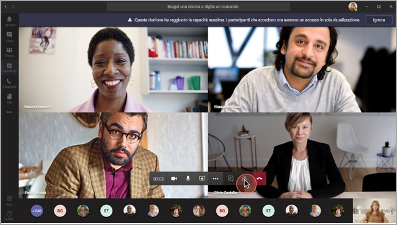
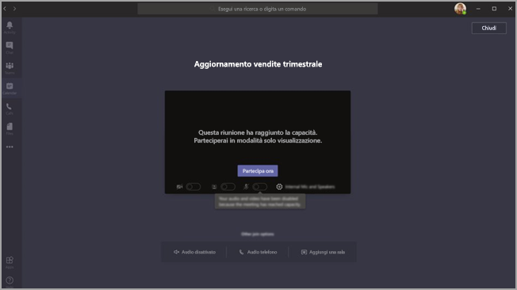

# <a name="teams-view-only-meeting-experience"></a>Esperienza di sola visualizzazione nelle riunioni di Teams

> [!Note]
> Le trasmissioni nella modalità di sola visualizzazione sono disponibili in Microsoft 365 E3/E5 e Microsoft 365 A3/A5. Questa caratteristica sarà abilitata come predefinita l'1 marzo 2021. La distribuzione di questa funzionalità in Microsoft 365 Government Community Cloud (GCC) inizierà alla fine di marzo 2021. Government Community Cloud High (GCCH) e Department of Defense (DoD) saranno distribuiti in seguito. È necessario modificare i criteri predefiniti dopo tale data se si attivare la funzionalità. Usare PowerShell per abilitare i criteri `Set-CsTeamsMeetingPolicy -Identity Global -StreamingAttendeeMode Enabled`.

> [!Note]
> Se la riunione o il webinar supera la capacità, Teams si adatterà rapidamente per offrire un'esperienza di trasmissione in modalità solo visualizzazione per 10.000 persone.  Inoltre, durate questo periodo di maggiore telelavoro, si possono organizzare trasmissioni ancora più grandi, per 20.000 persone, fino alla fine di quest'anno.

Microsoft Teams consente fino a 10.000 partecipanti alle riunioni. Dopo aver raggiunto la capacità della riunione principale , ovvero quando 300 utenti in WW o 250 in GCC entrano in una riunione, altri partecipanti si uniranno con un'esperienza di sola visualizzazione.

I partecipanti che aderiscono per primi alla riunione, fino alla capacità della riunione principale, otterrà l'esperienza completa della riunione di Teams. Possono condividere audio e video, visualizzare i video condivisi e partecipare alla chat delle riunioni.

Gli utenti che accedono dopo il superamento della capacità della riunione accederanno a un'esperienza di sola visualizzazione.  

I partecipanti potranno partecipare all'esperienza di sola visualizzazione tramite desktop, Web e Teams mobile (Android e iOS).

> [!Note]
> La capacità limite corrente della "riunione principale", o in altre parole, il numero di utenti completamente interattivi è 300 in WW e 250 in GCC, GCC High e DoD.

## <a name="teams-view-only-experience-controls"></a>Controlli dell'esperienza di sola visualizzazione di Teams

È possibile abilitare l'esperienza di sola visualizzazione usando PowerShell.

```PowerShell
Set-CsTeamsMeetingPolicy -Identity Global -StreamingAttendeeMode Enabled
```

Per disabilitare l'esperienza di sola visualizzazione, è anche possibile usare PowerShell.

```PowerShell
Set-CsTeamsMeetingPolicy -Identity Global -StreamingAttendeeMode Disabled
```

In futuro sarà possibile abilitare o disabilitare l'esperienza di sola visualizzazione nell'interfaccia di amministrazione di Teams.

## <a name="impact-to-users"></a>Impatto sugli utenti

L'esperienza d'uso varia a seconda di numerosi fattori.

Quando il limite di partecipati della riunione principale viene raggiunto, i partecipanti non possono accedere alla riunione se una qualsiasi delle seguenti condizioni è vera: 

- Un amministratore ha disabilitato l'esperienza di sola visualizzazione di Teams per l'organizzatore o per l'intero tenant.
- Il partecipante di sola visualizzazione non può ignorare la sala d'attesa. Ad esempio, se un organizzatore di una  riunione sceglie di fare in modo che solo le persone dell'organizzazione esemplino la sala d'attesa e un partecipante esterno all'organizzazione tenti di partecipare come partecipante di sola visualizzazione, verrà rifiutato.

Una volta raggiunta la capacità della riunione principale, l'organizzatore della riunione e i relatori vedranno uno striscione che informa che i nuovi partecipanti si uniranno come partecipanti di sola visualizzazione.

  

Quando viene raggiunto il limite di partecipanti della riunione principale, i partecipanti vengono informati nella schermata preliminare di accesso che stanno accedendo a un'esperienza di sola visualizzazione. 

  

Se lo spazio è sufficiente, i nuovi utenti accedono sempre alla riunione principale. Se il limite della riunione principale viene raggiunto e uno o più utenti abbandonano la riunione, la riunione principale ha una capacità sufficiente. I partecipanti che accedono (o riaccedono) alla riunione entreranno nella sala principale fino al raggiungimento del limite di utenti. I partecipanti che hanno avviato l'esperienza di sola visualizzazione non saranno promossi automaticamente alla riunione principale, e al momento non possono esservi promossi.

Se sono stati impostati ruoli di relatore e partecipante e un relatore prova a partecipare a una riunione dopo che la riunione principale di ha raggiunto la capacità, partecipa come partecipante di sola visualizzazione e ha le stesse limitazioni degli altri partecipanti di sola visualizzazione. Supporto per garantire che tutti i relatori che aderiscono alla riunione principale siano in un secondo momento. L'organizzatore avrà sempre uno spazio garantito nella riunione principale.

## <a name="impact-to-meeting-presenters"></a>Impatto per i relatori della riunione

Le limitazioni dei relatori delle riunioni includono:

- Non sono disponibili informazioi sui partecipanti in modalità di sola visualizzazione. I processi e-discovery non sono supportati per i partecipanti in modalità di sola visualizzazione.
- Gli utenti della riunione principale non possono vedere i partecipanti di sola visualizzazione.
- Non è possibile rimuovere i partecipanti in modalità di sola visualizzazione dalle riunioni.

> [!Note]
> Il numero di partecipanti rifletterà solo le persone nella riunione principale e non le persone nella sala di sola visualizzazione. Pertanto, i presentatori non possono conoscere esattamente il numero degli utenti nella sala di sola visualizzazione.

## <a name="experience-for-view-only-attendees"></a>Esperienza per gli in modalità nella sala di sola visualizzazione

L'esperienza di sola visualizzazione consente ai partecipanti di:

- Ascoltare i partecipanti alla riunione principale di Teams.
- Vedere il feed video del relatore attivo (se il relatore sta condividendo il video).
- Visualizzare il contenuto condiviso usando la funzionalità condividi desktop o schermo.

I partecipanti nella sala di sola visualizzazione non potranno usare le seguenti opzioni delle riunioni:

- Partecipare alle riunioni se il partecipante non è autorizzato a ignorare la sala di attesa in base ai criteri o alle opzioni configurati della sala di attesa.
- Accedere alla sala di solo visualizzazione usando la funzionalità di audioconferenza.
- Partecipare alla sala di sola visualizzazione usando il sistema Microsoft Teams Rooms o i servizi CVI (Cloud Video Interop).
- Condividere l'audio o il video.
- Leggere o partecipare alla chat della riunione.
  - I primi 1000 (o 300 a seconda del limite della riunione principale) gli utenti invitati alla riunione verranno aggiunti alla chat.
  - Anche se gli utenti di sola visualizzazione non vedono la chat nella riunione, potrebbero comunque essere in grado di chattare nell'app principale se sono state le prime 350 persone invitate.
  - Al contrario, se un utente interattivo non fa parte dei primi 350 utenti invitati alla riunione, non otterrà accesso alla chat della riunione sia nell'app teams principale che nella riunione.
- Visualizzare il video trasmesso dai partecipanti alla riunione, se non sono i relatori attivi.
- Vedere File di PowerPoint condivisi con la funzionalità PowerPoint Live o singole condivisioni di applicazioni ,ad esempio desktop o condivisione dello schermo.
- Alzare la mano durante la riunione.
- Inviare o visualizzare le reazioni.
- Interagisci con qualsiasi app 3P che si integra nella riunione di Teams, inclusi i sondaggi.

## <a name="view-only-feature-limitations"></a>Limitazioni della funzionalità di sola visualizzazione

- I partecipanti di sola visualizzazione potranno vedere solo i sottotitoli in tempo reale sul desktop e sul Web. Al momento sono supportati solo i sottotitoli in inglese.
- I partecipanti nella sala di sola visualizzazione saranno supportati dalla tecnologia di streaming.
- I partecipanti nella sala di sola visualizzazione non vengono inclusi nel report sui partecipanti.
- I partecipanti nella sala di sola visualizzazione hanno un'esperienza video singola. Possono accedere l'altoparlante attivo o i contenuti che vengono condivisi, ma non entrambi.
- Al momento non supportiamo i layout **Galleria**, **Galleria estesa**, o **Modalità Insieme** per gli utenti nella sala di sola visualizzazione.  
- Gli utenti nella sala di sola visualizzazione non avranno la stessa latenza degli utenti regolari. <sup>1</sup>

  <sup>1</sup> I partecipanti nella sala di sola visualizzazione avrannno un ritardo audio e video di 30 secondi durante la riunione.  
