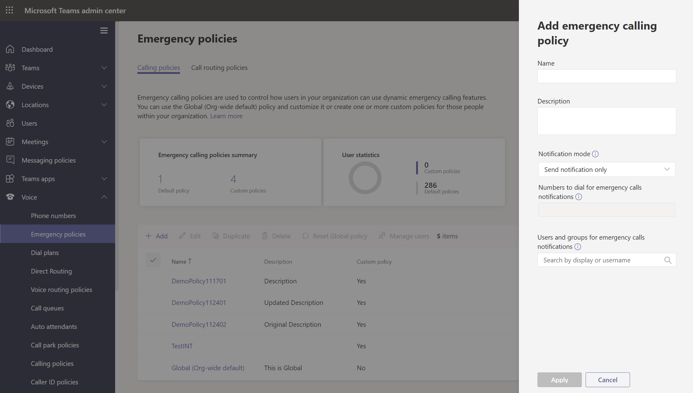
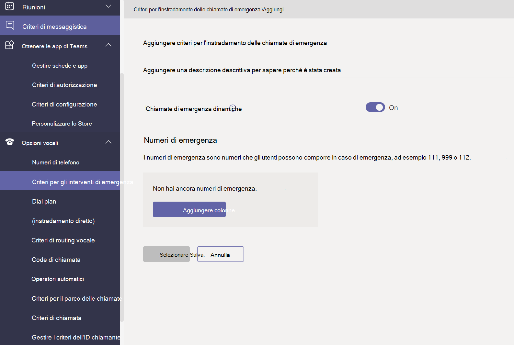
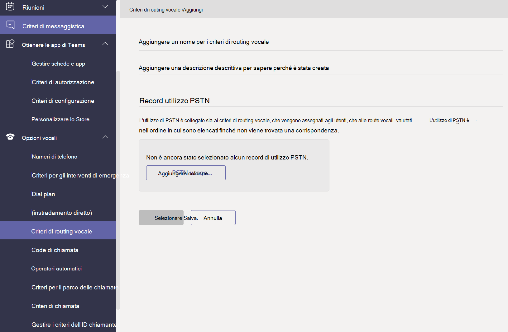

# Gestire i criteri vocali e di chiamata in Microsoft Teams

I criteri vocali e di chiamata vengono usati per controllare le chiamate e i comandi vocali in Microsoft Teams.

## Criteri per le chiamate di emergenza

I criteri [per le chiamate di emergenza](manage-emergency-calling-policies.md) consentono di configurare cosa accade quando un utente dell'organizzazione effettua una chiamata di emergenza. Questi criteri vengono gestiti nell'interfaccia di amministrazione di Teams o usando Windows PowerShell.

## Criteri di routing delle chiamate di emergenza

Se l'organizzazione ha distribuito il **routing diretto del sistema telefonico**, puoi utilizzare i [criteri di routing delle chiamate di emergenza](manage-emergency-call-routing-policies.md) per determinare dove vengono instradate le chiamate di emergenza, se i servizi di emergenza avanzati sono abilitati e quali numeri vengono utilizzati per i servizi di emergenza. Questi criteri vengono gestiti tramite PowerShell o nell'interfaccia di amministrazione di Microsoft Teams.

## Criteri ID chiamante

[I criteri ID chiamante](caller-id-policies.md) vengono usati per modificare o bloccare l'ID chiamante.

## Criteri di routing vocale

Un [criterio di routing vocale](manage-voice-routing-policies.md) è un contenitore per i record di utilizzo PSTN (Public Switched Telephone Network). È possibile usare questi criteri se l'organizzazione ha distribuito **il routing diretto del sistema telefonico**. I criteri di routing vocale possono essere gestiti con PowerShell o nell'interfaccia di amministrazione di Teams.

## Criteri di chiamata

[I criteri di](teams-calling-policy.md) chiamata controllano le funzionalità di inoltro di chiamata e chiamata disponibili per gli utenti, inclusa la possibilità di effettuare chiamate private, inviare chiamate a gruppi di chiamata e instradare le chiamate alla segreteria telefonica.

## Criteri di parcheggio di chiamata e recupero

[Parcheggio di chiamata e recupero](call-park-and-retrieve.md) consente agli utenti di mettere altri utenti in attesa e consente allo stesso utente o a qualcun altro di continuare la chiamata.

## Creare e impostare dial plan

[I piani di](create-and-manage-dial-plans.md) chiamata traducono numeri di telefono comporre per l'autorizzazione e il routing delle chiamate. È possibile creare e gestire piani di chiamata tramite PowerShell o nell'interfaccia di amministrazione di Microsoft Teams.

## Argomenti correlati

* [Gestire i criteri per le chiamate di emergenza in Microsoft Teams](manage-emergency-calling-policies.md)
* [Gestire i criteri del routing delle chiamate di emergenza](manage-emergency-call-routing-policies.md)
* [Gestire i criteri dell'ID chiamante in Microsoft Teams](caller-id-policies.md)
* [Gestire i criteri di routing vocale](manage-voice-routing-policies.md)
* [Criteri per le chiamate in Microsoft Teams](teams-calling-policy.md)
* [Parcheggio di chiamata e recupero in Microsoft Teams](call-park-and-retrieve.md)
* [Creare e impostare dial plan](create-and-manage-dial-plans.md)
* [Gestire Teams con i criteri](manage-teams-with-policies.md)
