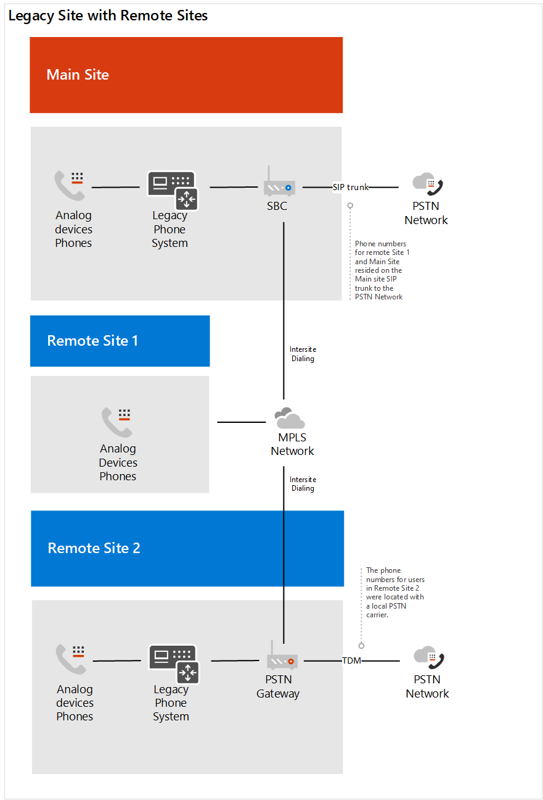

# Case Study di Contoso: sistema telefonico

A seconda della posizione geografica e di altri fattori, Contoso ha avuto uffici usando le soluzioni di telefonia seguenti:

- Tipo di sito A: Skype for Business Enterprise Voice

- Tipo di sito B: sistemi di telefonia legacy tradizionali

- Tipo di sito C: una combinazione di Skype for Business Enterprise Voice e sistemi di telefonia legacy tradizionali

Per implementare una soluzione di sistema telefonico Microsoft per l'intera organizzazione, Contoso ha dovuto determinare &mdash; per ogni tipo di sito &mdash; quale delle opzioni seguenti verrebbero usate con il sistema telefonico per connettersi alla rete PSTN (Public Switched Telephone Network):

- Sistema telefonico con un piano per le chiamate 

- Sistema telefonico con il proprio gestore PSTN tramite routing diretto 

- Combinazione di sistema telefonico con piano per chiamate e sistema telefonico con il proprio gestore PSTN tramite routing diretto
 
Per determinare la soluzione appropriata per la propria organizzazione, Contoso ha usato le [soluzioni di telefonia Microsoft](https://docs.microsoft.com/SkypeForBusiness/hybrid/msft-telephony-solutions) e le [chiamate di sessione Ignite 2019 in Microsoft teams](https://myignite.techcommunity.microsoft.com/sessions/83170?source=sessions).  

## Tipo di sito A: Skype for Business Enterprise Voice 

Contoso Skype for Business Enterprise Voice è stato configurato come hub e spoke. Esiste una posizione centrale che ha mantenuto il gateway PSTN nell'area che ha fornito la connessione alla rete PSTN per gli utenti di Skype for Business VoIP Enterprise nel paese. Spesso questi uffici satellitari non avevano una propria uscita Internet. I numeri per questi utenti risiedevano nel trunk SIP che si connette a un SBC esistente. 

Per determinare se il SBC già distribuito è certificato per il routing diretto e il bypass multimediale, Contoso ha controllato l' [elenco dei controller di bordo della sessione certificati per il routing diretto](direct-routing-border-controllers.md).  

Le abitudini di chiamata dell'utente erano di chiamare un utente nel sistema di telefonia legacy usando un'estensione, anche quando l'utente ha un client Skype for business disponibile per l'audio peer-to-peer. 

Contoso ha basato la propria decisione sulle seguenti domande:

- Q. È necessario mantenere le funzionalità fornite dalla distribuzione locale? 
  Un. No 

- Q. È necessario interagire con sistemi PBX di terze parti e altre apparecchiature per la telefonia? 
  Un. No 

- Q. È necessario mantenere l'attuale vettore di terze parti?  A. Sì (paesi regolamentati) e no 

- Q. È necessario ottenere il ROI su SBCs distribuito?  A. Sì e no  

- Q. I piani per le chiamate PSTN Microsoft sono disponibili nell'area geografica?  A. Sì e no 

In base alle risposte alle proprie domande, Contoso ha deciso di:

- Consente di trasferire gli utenti che si trovano in un'area geografica in cui i piani per chiamate PSTN sono disponibili per il sistema telefonico con piani di chiamata. 

- Consente di trasferire gli utenti che non si trovano in un'area geografica in cui sono disponibili piani per chiamate PSTN, gli utenti che si trovano in un sito in cui il ROI del SBCs deve ancora essere soddisfatto e gli utenti che hanno risieduto in un paese con regole di telefonia per il sistema telefonico con routing diretto. 

Il diagramma seguente mostra la distribuzione vocale iniziale di Skype for business e il modo in cui questa distribuzione è stata migrata sia in piani di chiamate Microsoft che in routing diretto:

## Tipo di sito B: sistemi di telefonia legacy tradizionali

Contoso ha molti uffici che sfruttano sistemi di telefonia legacy. C'è stato un sottoinsieme di utenti che avevano un numero di telefono E 1.64, mentre altri avevano solo un'estensione. Questi numeri risiedevano nel trunk TDM per il gateway PSTN. La configurazione intra-sito è stata configurata sfruttando un codice del sito davanti all'estensione per determinare dove instradare la chiamata. Le abitudini di chiamata degli utenti dovevano effettuare la chiamata tramite estensione.   

Contoso ha basato la propria decisione sulle seguenti domande:

- Q. È necessario mantenere le funzionalità fornite dalla distribuzione locale? 
  Un. No 

- Q. È necessario interagire con sistemi PBX di terze parti e altre apparecchiature per la telefonia?  A. Sì

- Q. È necessario mantenere l'attuale vettore di terze parti?  A. No 

- Q. Il piano per le chiamate di Microsoft PSTN è disponibile nell'area geografica?  A. Sì e no 

In base alle risposte alle proprie domande, Contoso ha deciso di: 

- Consente di trasferire gli utenti che si trovano in un'area geografica in cui i piani per chiamate PSTN sono disponibili per il sistema telefonico con piani di chiamata. 

- Consente di trasferire gli utenti che non si trovano in un'area geografica in cui i piani per chiamate PSTN sono disponibili per il sistema telefonico con routing diretto. 

- Gestire una connessione PSTN a dispositivi analogici business critical.

I diagrammi seguenti mostrano la distribuzione originale del sistema legacy con i siti remoti e la migrazione a una distribuzione di routing diretto con l'ottimizzazione media locale:

**Original legacy deployment**  
 Distribuzione 

**Distribuzione con routing diretto**

 
## Tipo di sito C: combinazione di Skype for Business Enterprise Voice e sistemi di telefonia legacy tradizionali

I numeri di utenti di VoIP Skype for Business Enterprise di Contoso si trovano nel trunk SIP verso il SBC dal vettore. I numeri per i sistemi di telefonia tradizionali risiedevano nel trunk TDM per il gateway PSTN.   

Contoso ha basato la propria decisione sulle seguenti domande:

- Q. È necessario mantenere le funzionalità fornite dalla distribuzione locale? 
  Un. No 

- Q. È necessario interagire con sistemi PBX di terze parti e altre apparecchiature per la telefonia?  A. No 

- Q. È necessario mantenere l'attuale vettore di terze parti?  A. No 

- Q. È necessario ottenere il ROI su SBCs distribuito?  A. Sì e no  

- Q. Il piano per le chiamate PSTN di Microsoft è disponibile nell'area geografica?  A. No 

In base alle risposte alle proprie domande, Contoso ha deciso di eseguire le operazioni seguenti: 

- Per gli utenti di telefonia legacy che verranno abilitati per il routing diretto, Contoso ha convertito i numeri dal trunk TDM al trunk SIP per il SBC, poiché il SBC è certificato per il routing diretto. 

- Per supportare un sottoinsieme di utenti che si spostano nel sistema telefonico e per consentire il routing continuo attraverso il sistema legacy, il sistema di telefonia legacy è stato configurato come hop successivo per il SBC.   

- Inoltre, per incoraggiare il comportamento degli utenti a modificare e rimuovere la dipendenza dalla chiamata alle estensioni Inter-e intra-sito, Contoso ha fornito indicazioni per l'uso di team per tutte le chiamate interne.  

I diagrammi seguenti illustrano la distribuzione originale di Skype for Business Enterprise Voice e legacy sistema di telefonia e la migrazione a una distribuzione mista tramite routing diretto:

**Original mixed deployment** 
 Distribuzione 

**Distribuzione mista con routing diretto** 
 

## Piani di chiamata

Per determinare i requisiti di configurazione per i piani di chiamata, Contoso ha esaminato le [decisioni di distribuzione di base del piano chiamante](calling-plan-landing-page.md#core-deployment-decisions). Le decisioni risultanti sono state apportate: 

- Q. I miei utenti hanno bisogno di chiamate internazionali?  A. Sì 

- Q. I miei utenti hanno ciascuno un numero di telefono diretto verso l'interno?  A. non oggi. Tutti gli utenti abilitati riceveranno un DID. 

- Q. Si vuole mascherare o disabilitare l'ID chiamante?  A. l'ID chiamante per un utente verrà mascherato al numero locale per contoso. 

## Routing diretto

Contoso ha partecipato a Ignite per mantenersi aggiornati sulle caratteristiche di Office 365, incluse quelle disponibili con il sistema telefonico e il routing diretto. La leadership tecnica e gli architetti hanno usato le indicazioni fornite durante l'accensione 2019 per determinarne la direzione.  Sessioni chiave usate: 

- [Pianificare il successo con il routing diretto di Microsoft Teams](https://myignite.techcommunity.microsoft.com/sessions/80381?source=sessions)

- [Aggiornamenti per il routing diretto](https://myignite.techcommunity.microsoft.com/sessions/80381?source=sessions)

## Configurazione

### Siti di piani di chiamata

Per ottenere licenze e assegnare numeri di telefono agli utenti, Contoso ha seguito la procedura descritta in [configurare i piani](set-up-calling-plans.md)per le chiamate. 

A causa del numero di utenti a cui devono essere assegnati i numeri di telefono, Contoso ha deciso di usare PowerShell per assegnare i numeri di telefono. Per informazioni su come assegnare numeri usando PowerShell &mdash; oltre ad altre impostazioni, &mdash; Contoso ha usato la [Panoramica di PowerShell per Teams](teams-powershell-overview.md).  

### Siti di routing diretto

Per connettere l'infrastruttura di telefonia locale di Contoso a Microsoft teams, l'amministratore di Contoso ha seguito la procedura descritta in [configurare il routing diretto](direct-routing-configure.md) e ha esaminato il video [Direct routing in Microsoft teams](https://www.youtube.com/watch?v=1ASftX_Msb8&index=10&list=PLaSOUojkSiGnKuE30ckcjnDVkMNqDv0Vl) per le indicazioni.  Contoso ha inoltre fatto riferimento alla documentazione relativa alla distribuzione diretta del routing da parte del fornitore SBC certificato. 

Una volta configurato il routing diretto tra SBC e il sistema telefonico Microsoft, era necessario che contoso provasse la configurazione. A questo scopo, gli amministratori di Contoso hanno usato il client tester SIP discusso nella [sessione aggiornamenti per il routing diretto in ignite 2019](https://myignite.techcommunity.microsoft.com/sessions/83178?source=sessions). Lo script client del tester SIP e la documentazione sono stati scaricati dallo script di PowerShell per testare le connessioni del controller di bordo della sessione di routing diretto.   

### Ottimizzazione media locale

Contoso ha visto l'opportunità di sfruttare l'ottimizzazione dei contenuti multimediali locali nelle diverse aree geografiche in tutto il mondo. Gli scenari supportati per Contoso sono descritti nell' [ottimizzazione di elementi multimediali locali per il routing diretto](direct-routing-media-optimization.md). La configurazione dell'Ottimizzazione multimediale locale è stata completata seguendo le indicazioni del fornitore SBC e Microsoft. I passaggi di configurazione per l'ottimizzazione di elementi multimediali locali includono: 

- Configurare i siti utente e SBC 

- Configurare SBC in base alla specifica del fornitore SBC, 

- Aggiungere indirizzi IP attendibili esterni a ogni sito usato per l'ottimizzazione media locale    

- Definire la topologia di rete 

- Definire la topologia di rete virtuale 

- Determinare la modalità: aggirare sempre o solo per gli utenti locali 

## Considerazioni sulla rete

Contoso ha avuto un numero di utenti che avevano bisogno di lavorare in remoto per un periodo di tempo prolungato dopo l'abilitazione per il sistema telefonico. Gli utenti hanno usato la VPN per accedere ad alcune applicazioni della linea di business. Mentre si è in VPN, gli utenti del sistema telefonico hanno sperimentato una degradazione della qualità delle chiamate. 

Per risolvere il problema di qualità, Contoso ha implementato il tunneling Split VPN, che ha consentito al traffico di Office 365 di attraversare Internet mentre la connessione alle app interne rimaneva nella VPN. Per implementare il tunneling Split VPN, Contoso ha seguito le indicazioni per l' [implementazione del tunneling Split VPN per Office 365](https://docs.microsoft.com/office365/enterprise/office-365-vpn-implement-split-tunnel).  

 

