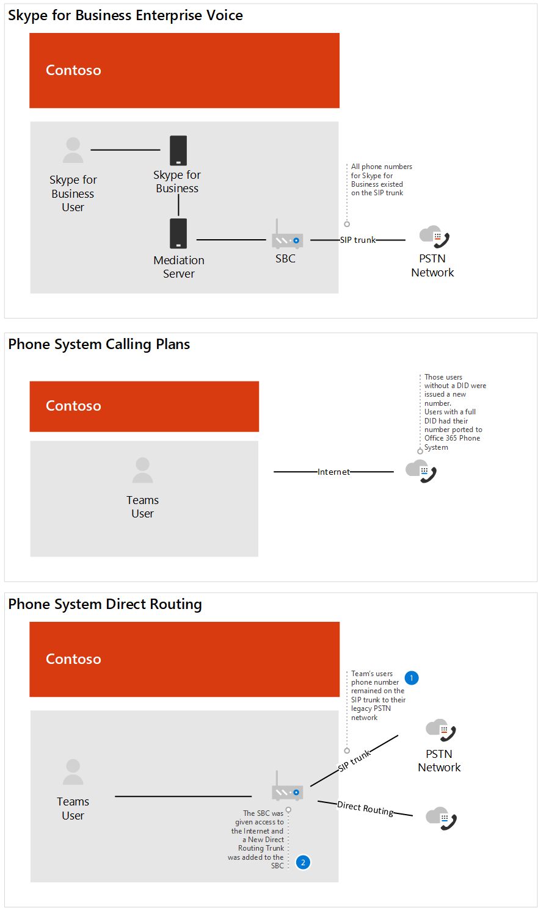

# Case study Contoso: Sistema telefonicoContoso case study: Phone System

A seconda della posizione geografica e di altri fattori, Contoso aveva uffici che usavano le seguenti soluzioni di telefonia:Depending on geographic location and other factors, Contoso had offices using the following telephony solutions:

- Tipo di sito A: Skype for Business VoIP aziendaleSite Type A: Skype for Business Enterprise Voice

- Tipo di sito B: sistemi di telefonia legacy tradizionaliSite Type B: Traditional legacy telephony systems

- Tipo di sito C: Combinazione dei sistemi di telefonia legacy VoIP aziendale Skype for BusinessSite Type C: A combination of Skype for Business Enterprise Voice and traditional legacy telephony systems

Per implementare una soluzione Sistema telefonico Microsoft per l'intera organizzazione, Contoso ha dovuto determinare per ogni tipo di sito quale delle seguenti opzioni verrebbe usata con il Sistema telefonico per connettersi alla rete &mdash; &mdash; PSTN (Public Switched Telephone Network):To implement a Microsoft Phone System solution for their entire organization, Contoso had to determine&mdash;for each site type&mdash;which of the following options would be used with Phone System to connect to the Public Switched Telephone Network (PSTN):

- Sistema telefonico con piano per chiamatePhone System with Calling Plan 

- Sistema telefonico con gestore PSTN tramite routing direttoPhone System with own PSTN carrier through Direct Routing 

- Combinazione di Sistema telefonico con Piano per chiamate e Sistema telefonico con un proprio gestore PSTN attraverso l'instradamento direttoCombination of Phone System with Calling Plan and Phone System with own PSTN carrier through Direct Routing
 
Per determinare la soluzione giusta per la propria organizzazione, Contoso ha utilizzato le soluzioni di telefonia [Microsoft](https://docs.microsoft.com/SkypeForBusiness/hybrid/msft-telephony-solutions) e le chiamate di sessione di Ignite 2019 [in Microsoft Teams.](https://myignite.techcommunity.microsoft.com/sessions/83170?source=sessions)To determine the right solution for their organization, Contoso used [Microsoft telephony solutions](https://docs.microsoft.com/SkypeForBusiness/hybrid/msft-telephony-solutions) and the Ignite 2019 session [Calling in Microsoft Teams](https://myignite.techcommunity.microsoft.com/sessions/83170?source=sessions).  

## Tipo di sito A: Skype for Business VoIP aziendaleSite Type A: Skype for Business Enterprise Voice 

Contoso Skype for Business VoIP aziendale è stato configurato come hub e parla.Contoso Skype for Business Enterprise Voice was set up as a hub and spoke. C'era una posizione centrale che ha mantenuto il gateway PSTN nell'area geografica che ha fornito la connessione alla rete PSTN per gli utenti VoIP aziendale Skype for Business nel paese.There was a central location that maintained the PSTN gateway in the region that provided the connection to the PSTN for the Skype for Business Enterprise Voice users in country. Spesso questi uffici satellitari non hanno un proprio indirizzo Internet in uscita.Often these satellite offices did not have their own Internet egress. I numeri per questi utenti risiedevano nel trunk SIP che si connette a un database SBC esistente.The numbers for these users resided on the SIP trunk connecting to an existing SBC. 

Per determinare se il controller SBC già distribuito è certificato per l'instradamento diretto e il bypass multimediale, Contoso ha controllato l'elenco dei controller dei confini della sessione [certificati per il routing diretto.](direct-routing-border-controllers.md)To determine if the SBC already deployed is certified for Direct Routing and Media Bypass, Contoso checked the [List of Session Border Controllers certified for Direct Routing](direct-routing-border-controllers.md).  

Le abitudini di composizione dell'utente erano di comporre un utente nel sistema di telefonia legacy utilizzando un'estensione, anche quando l'utente dispone di un client Skype for Business disponibile per l'audio peer-to-peer.The user's dialing habits were to dial a user on the legacy telephony system using an extension, even when the user has a Skype for Business client available for peer-to-peer audio. 

Contoso ha basato la decisione sulle domande seguenti:Contoso based their decision on the following questions:

- D.Q. È necessario mantenere le funzionalità fornite dalla distribuzione locale?Do we need to retain functionality provided by our on-premises deployment? 
  A.A. NoNo 

- D.Q. È necessario interoperabilità con sistemi PBX di terze parti e altri dispositivi di telefonia?Do we need to interoperate with third-party PBX systems and other telephony equipment? 
  A.A. NoNo 

- D.Q. È necessario conservare l'attuale gestore di terze parti?Do we need to retain our current third-party carrier?  A. Sì (paesi regolamentati) e NoA. Yes (regulated countries) and No 

- D.Q. È necessario distribuire il ROI nei PC SB?Do we need to get the ROI on SBCs deployed?  A. Sì e noA. Yes and No  

- D.Q. I Piani per chiamate PSTN Microsoft sono disponibili in questa area geografica?Is Microsoft PSTN Calling Plans available in this region?  A. Sì e noA. Yes and No 

In base alle risposte alle loro domande, Contoso ha deciso di:Based on the answers to their questions, Contoso decided to:

- Spostare gli utenti che si trovano in un'area in cui i piani per le chiamate PSTN sono disponibili nel Sistema telefonico con Piani per chiamate.Move the users that are located in a region where PSTN calling plans is available to Phone System with Calling Plans. 

- Spostare gli utenti che non si trovano in un'area geografica in cui sono disponibili i piani di chiamata PSTN, gli utenti che si trovano in un sito in cui il ROI dei PC non sono ancora stati soddisfatti e gli utenti che risiedono in un paese che ha normative di telefonia al Sistema telefonico con instradamento diretto.Move the users that are not located in a region where PSTN calling plans is available, users located in a site where the ROI on the SBCs have yet to be met, and users that resided in a country that has telephony regulations to Phone System with Direct Routing. 

Il diagramma seguente mostra la distribuzione iniziale di Skype for Business VoIP aziendale distribuzione e come è stata eseguita la migrazione di questa distribuzione ai Piani per chiamate Microsoft e all'instradamento diretto:The following diagram shows the initial Skype for Business Enterprise Voice deployment and how this deployment was migrated to both Microsoft Calling Plans and Direct Routing:

## Tipo di sito B: sistemi di telefonia legacy tradizionaliSite Type B: Traditional legacy telephony systems

Contoso ha molti uffici che sfruttano i sistemi di telefonia legacy.Contoso had many offices that leveraged legacy telephony systems. C'era un sottoinsieme di utenti che avevano un numero di telefono E1.64, mentre altri avevano solo un interno.There were a subset of users that had an E1.64 phone number while others only had an extension. Questi numeri risiedevano nel trunk TDM al gateway PSTN.These numbers resided on the TDM trunk to the PSTN gateway. La composizione tra siti è stata configurata sfruttando un codice di sito davanti all'interno per determinare dove instradare la chiamata.Intra-site dialing was configured by leveraging a site code in front of the extension to determine where to route the call. Le abitudini di composizione degli utenti erano di chiamata per interno.The users' dialing habits were to dial by extension.   

Contoso ha basato la decisione sulle domande seguenti:Contoso based their decision on the following questions:

- D.Q. È necessario mantenere le funzionalità fornite dalla distribuzione locale?Do we need to retain functionality provided by our on-premises deployment? 
  A.A. NoNo 

- D.Q. È necessario interoperabilità con sistemi PBX di terze parti e altri dispositivi di telefonia?Do we need to interoperate with third-party PBX systems and other telephony equipment?  A. SìA. Yes

- D.Q. È necessario conservare l'attuale gestore di terze parti?Do we need to retain our current third-party carrier?  A. NoA. No 

- D.Q. Il piano per le chiamate DI Microsoft PSTN è disponibile nella nostra area geografica?Is Microsoft PSTN's Calling Plan available in our region?  A. Sì e noA. Yes and No 

In base alle risposte alle loro domande, Contoso ha deciso di:Based on the answers to their questions, Contoso decided to: 

- Spostare gli utenti che si trovano in un'area in cui i piani per le chiamate PSTN sono disponibili nel Sistema telefonico con Piani per chiamate.Move the users that are located in a region where PSTN calling plans is available to Phone System with Calling Plans. 

- Spostare gli utenti che non si trovano in un'area geografica in cui i piani per le chiamate PSTN sono disponibili nel Sistema telefonico con instradamento diretto.Move the users that are not located in a region where PSTN calling plans is available to Phone System with Direct Routing. 

- Mantenere una connessione PSTN a dispositivi analogici di importanza fondamentale per l'azienda.Maintain a PSTN connection to business critical analog devices.

I diagrammi seguenti mostrano la distribuzione di sistema legacy originale con i siti remoti e la migrazione a una distribuzione di routing diretto con l'ottimizzazione dei supporti locali:The following diagrams show the original legacy system deployment with remote sites and the migration to a Direct Routing deployment with Local Media Optimization:

**Distribuzione legacy originale**  
 **Original legacy deployment** 

**Distribuzione con routing diretto****Deployment with Direct Routing**

 
## Tipo di sito C: Combinazione dei sistemi di telefonia legacy VoIP aziendale Skype for Business e tradizionaliSite Type C: Combination of Skype for Business Enterprise Voice and traditional legacy telephony systems

Contoso Skype for Business VoIP aziendale i numeri degli utenti risiedono nel trunk SIP al sistema SBC dal gestore.Contoso Skype for Business Enterprise Voice users' numbers reside on the SIP trunk to the SBC from the carrier. I numeri dei sistemi di telefonia tradizionali risiedevano nel trunk TDM al gateway PSTN.The numbers for the traditional telephony systems resided on the TDM trunk to the PSTN gateway.   

Contoso ha basato la decisione sulle domande seguenti:Contoso based their decision on the following questions:

- D.Q. È necessario mantenere le funzionalità fornite dalla distribuzione locale?Do we need to retain functionality provided by our on-premises deployment? 
  A.A. NoNo 

- D.Q. È necessario interoperabilità con sistemi PBX di terze parti e altri dispositivi di telefonia?Do we need to interoperate with third-party PBX systems and other telephony equipment?  A. NoA. No 

- D.Q. È necessario conservare l'attuale gestore di terze parti?Do we need to retain our current third-party carrier?  A. NoA. No 

- D.Q. È necessario distribuire il ROI nei PC SB?Do we need to get the ROI on SBCs deployed?  A. Sì e noA. Yes and No  

- D.Q. Il piano chiamate PSTN di Microsoft è disponibile in questa area geografica?Is Microsoft's PSTN Calling Plan available in this region?  A. NoA. No 

In base alle risposte alle loro domande, Contoso ha deciso quanto segue:Based on the answers to their questions, Contoso decided on the following: 

- Per gli utenti della telefonia legacy che saranno abilitati per il routing diretto, Contoso ha portato i numeri dal trunk TDM al trunk SIP per SBC, poiché SBC è certificato per l'instradamento diretto.For the legacy telephony users that will be enabled for Direct Routing, Contoso ported the numbers from the TDM trunk to the SIP Trunk for the SBC, since the SBC is certified for Direct Routing. 

- Per supportare un sottoinsieme di utenti che passano al Sistema telefonico e per consentire il routing continuo attraverso il sistema legacy, il sistema di telefonia legacy è stato configurato come hop successivo al sistema SBC.To support a subset of users moving to Phone System and to allow continued routing through the legacy system, the legacy telephony system was set up as the next hop to the SBC.   

- Inoltre, per incoraggiare il cambiamento del comportamento dell'utente e rimuovere la dipendenza dalla composizione delle estensioni interso e interne al sito, Contoso ha fornito indicazioni per usare Teams per tutte le chiamate interne.In addition, to encourage user behavior change and remove the dependency on inter- and intra-site extension dialing, Contoso provided guidance to use Teams for all internal calls.  

I seguenti diagrammi mostrano la distribuzione originale di Skype for Business VoIP aziendale sistema di telefonia legacy e la migrazione a una distribuzione mista con routing diretto:The following diagrams show the original Skype for Business Enterprise Voice and legacy telephony system deployment and the migration to a mixed deployment using Direct Routing:

**Distribuzione mista originale** 
 **Original mixed deployment**

**Distribuzione mista con routing diretto** 
 **Mixed deployment with Direct Routing**

## Piani di chiamataCalling Plans

Per determinare i requisiti di configurazione per i Piani per chiamate, Contoso ha esaminato le decisioni di distribuzione di base [del Piano per chiamate.](calling-plan-landing-page.md#core-deployment-decisions)To determine the configuration requirements for Calling Plans, Contoso reviewed the [Calling Plan core deployment decisions](calling-plan-landing-page.md#core-deployment-decisions). Sono state prese le decisioni risultanti:The resulting decisions were made: 

- D.Q. Gli utenti devono effettuare chiamate internazionali?Do my users need international calling?  A. SìA. Yes 

- D.Q. Gli utenti hanno ciascuno un numero di telefono DID diretto verso l'interno?Do my users each have a direct inward DID phone number?  A. Non oggi.A. Not today. Tutti gli utenti abilitati riceveranno un DID.All users enabled will receive a DID. 

- D.Q. Si vuole mascherare o disabilitare l'ID chiamante?Do I want to mask or disable caller ID?  A. L'ID chiamante di un utente verrà mascherato al numero locale di Contoso.A. The caller ID for a user will be masked to the local number for Contoso. 

## Routing direttoDirect Routing

Contoso ha partecipato a Ignite per restare al corrente sulle funzionalità di Office 365, incluse quelle disponibili con Sistema telefonico e Routing diretto.Contoso attended Ignite to stay current on Office 365 features including those available with Phone system and Direct Routing. I dirigenti tecnici e architetti hanno usato le indicazioni fornite durante la Ignite 2019 per determinare la direzione.Technical leadership and architects used the guidance provided during the Ignite 2019 to determine their direction.  Sessioni chiave usate:Key sessions that were used: 

- [Pianificare il successo con l'instradamento diretto di Microsoft TeamsPlan for success with Microsoft Teams Direct Routing](https://myignite.techcommunity.microsoft.com/sessions/80381?source=sessions)

- [Aggiornamenti per il routing direttoUpdates for Direct Routing](https://myignite.techcommunity.microsoft.com/sessions/80381?source=sessions)

## ConfigurazioneConfiguration

### Siti piani per chiamateCalling Plans sites

Per ottenere licenze e assegnare numeri di telefono agli utenti, Contoso ha seguito la procedura descritta in [Configurare i piani per chiamate.](set-up-calling-plans.md)To obtain licenses and assign phone numbers to users, Contoso followed the steps in [Set up Calling Plans](set-up-calling-plans.md). 

Dato il numero di utenti a cui assegnare numeri di telefono, Contoso ha deciso di usare PowerShell per assegnare i numeri di telefono.Due to the number of users that needed to be assigned phone numbers, Contoso decided to use PowerShell to assign the phone numbers. Per informazioni su come assegnare numeri usando PowerShell, oltre ad &mdash; altre &mdash; impostazioni, Contoso ha usato la panoramica [di Teams su PowerShell.](teams-powershell-overview.md)To learn how to assign numbers by using PowerShell&mdash;in addition to other settings&mdash;Contoso used the [Teams PowerShell Overview](teams-powershell-overview.md).  

### Siti di routing direttoDirect Routing sites

Per connettere l'infrastruttura di telefonia locale di Contoso a Microsoft Teams, l'amministratore di Contoso ha seguito la procedura [descritta](direct-routing-configure.md) in Configurare l'instradamento diretto ed esaminato il video Routing diretto in [Microsoft Teams](https://www.youtube.com/watch?v=1ASftX_Msb8&index=10&list=PLaSOUojkSiGnKuE30ckcjnDVkMNqDv0Vl) per indicazioni.To connect Contoso's on-premises telephony infrastructure to Microsoft Teams, Contoso's administrator followed the steps in [Configure Direct Routing](direct-routing-configure.md) and reviewed the video [Direct Routing in Microsoft Teams](https://www.youtube.com/watch?v=1ASftX_Msb8&index=10&list=PLaSOUojkSiGnKuE30ckcjnDVkMNqDv0Vl) for guidance.  Contoso ha anche fatto riferimento alla documentazione relativa alla distribuzione del routing diretto da parte del fornitore di SBC certificato.Contoso also referred to the Direct routing deployment documentation by the certified SBC vendor. 

Dopo la configurazione dell'instradamento diretto tra SBC e Sistema telefonico Microsoft, è necessario che Contoso testi la configurazione.Once Direct Routing was configured between the SBC and Microsoft Phone System, it was necessary for Contoso to test the configuration. A questo scopo, gli amministratori di Contoso hanno usato il client Tester SIP discusso nella sessione Aggiornamenti per il routing diretto [di Ignite 2019.](https://myignite.techcommunity.microsoft.com/sessions/83178?source=sessions)To do this, Contoso administrators used the SIP Tester client that was discussed in the [Updates for Direct Routing session at Ignite 2019](https://myignite.techcommunity.microsoft.com/sessions/83178?source=sessions). La documentazione e lo script client tester SIP sono stati scaricati dallo script di PowerShell per testare le connessioni al controller dei confini della sessione di routing diretto.The SIP Tester client script and documentation was downloaded from the PowerShell script to test Direct Routing Session Border Controller connections.   

### Ottimizzazione degli elementi multimediali localiLocal Media Optimization

Contoso ha visto l'opportunità di sfruttare l'ottimizzazione multimediale locale nelle diverse aree geografiche del mondo.Contoso saw the opportunity to leverage Local Media Optimization in the different regions across the globe. Gli scenari supportati per Contoso sono descritti in Ottimizzazione supporto locale [per il routing diretto.](direct-routing-media-optimization.md)The supported scenarios for Contoso are described in [Local Media Optimization for Direct Routing](direct-routing-media-optimization.md). La configurazione dell'ottimizzazione degli elementi multimediali locali è stata completata seguendo le indicazioni del fornitore di SBC e di Microsoft.The configuration of the local media optimization was completed by following guidance from both the SBC vendor and Microsoft. I passaggi di configurazione per l'ottimizzazione del supporto locale includono:The configuration steps for Local Media Optimization include: 

- Configurare l'utente e i siti SBCConfigure the user and SBC sites 

- Configurare SBC in base alle specifiche del fornitore di SBC,Configure the SBC  according to the SBC vendor specification, 

- Aggiungere indirizzi IP attendibili esterni a ogni sito usato per l'ottimizzazione del supporto localeAdd external trusted IP addresses to each site used for Local Media Optimization    

- Definire la topologia della reteDefine the network topology 

- Definire la topologia della rete virtualeDefine the virtual network topology 

- Determinare la modalità: Ignora sempre o Solo per gli utenti localiDetermine the mode: Always Bypass or Only for local users 

## Considerazioni sulla reteNetworking considerations

Contoso aveva diversi utenti che dovevano lavorare in remoto per un lungo periodo di tempo dopo l'a attivazione del Sistema telefonico.Contoso had a number of users who needed to work remotely for an extended period of time after they were enabled for Phone System. Gli utenti usava la rete VPN per accedere a determinate applicazioni Line of Business.The users used VPN to access certain Line of Business applications. Mentre si è connessi alla rete VPN, gli utenti del Sistema telefonico hanno riscontrato una riduzione della qualità delle chiamate.While on VPN, the Phone System users experienced a degradation of call quality. 

Per risolvere il problema della qualità, Contoso ha implementato lo split tunneling VPN, che consentiva al traffico di Office 365 di attraversare Internet mentre la connessione alle app interne rimaneva nella VPN.To resolve the quality issue, Contoso implemented VPN split tunneling, which allowed their Office 365 traffic to traverse the Internet while the connection to the internal apps remained on the VPN. Per implementare lo split tunneling VPN, Contoso ha seguito le istruzioni per implementare [lo split tunneling VPN per Office 365.](https://docs.microsoft.com/office365/enterprise/office-365-vpn-implement-split-tunnel)To implement VPN split tunneling, Contoso followed the guidance in [Implementing VPN split tunneling for Office 365](https://docs.microsoft.com/office365/enterprise/office-365-vpn-implement-split-tunnel).  

 

