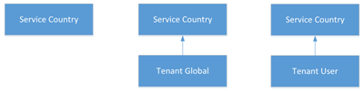

# Che cosa sono i piani di chiamata?What are dial plans?

[] Un piano di chiamata è un insieme denominato di regole di normalizzazione che traducono i numeri di telefono composti da un singolo utente in un formato alternativo (in genere E.164) per l'autorizzazione delle chiamate e l'instradamento delle chiamate.A dial plan is a named set of normalization rules that translate dialed phone numbers by an individual user into an alternate format (typically E.164) for purposes of call authorization and call routing.

Un piano di chiamata è costituito da una o più regole di normalizzazione che definiscono il modo in cui i numeri di telefono espressi in vari formati vengono convertiti in un formato alternativo.A dial plan consists of one or more normalization rules that define how phone numbers expressed in various formats are translated to an alternate format. La stessa stringa di chiamata può essere interpretata e tradotta in modo diverso in piani di chiamata diversi, quindi, a seconda del piano di chiamata assegnato a un determinato utente, lo stesso numero composto può essere tradotto e instradato in modo diverso.The same dial string may be interpreted and translated differently in different dial plans, so depending on which dial plan is assigned to a given user, the same dialed number may be translated and routed differently. Può essere presente un massimo di 1.000 piani di chiamata tenant.There can be a maximum of 1,000 tenant dial plans.

Vedere [Creare e gestire i dial plan per](create-and-manage-dial-plans.md) creare e gestire i dial plan del tenant.See [Create and manage dial plans](create-and-manage-dial-plans.md) to create and manage tenant dial plans.

## Ambito tenant del piano di chiamataTenant dial plan scope

L'ambito di un piano di chiamata determina il livello gerarchico in cui il piano di chiamata può essere applicato.A dial plan's scope determines the hierarchical level at which the dial plan can be applied. I client ottengono il piano di chiamata appropriato tramite le impostazioni di provisioning che vengono fornite automaticamente quando gli utenti a questo tipo di accesso a Teams.Clients get the appropriate dial plan through provisioning settings that are automatically provided when users sign in to Teams.Clients get the appropriate dial plan through provisioning settings that are automatically provided when users sign in to Teams. Gli amministratori possono gestire e assegnare livelli di ambito del piano di chiamata usando l'interfaccia di amministrazione di Microsoft Teams o Remote PowerShell.As an admin, you can manage and assign dial plan scope levels by using the Microsoft Teams admin center or Remote PowerShell.

In Teams sono disponibili due tipi di piani di chiamata: con ambito di servizio e con ambito tenant (per l'organizzazione).In Teams, there are two types of dial plans: service-scoped and tenant-scoped (which is for your organization). Un piano di chiamata con ambito di servizio è definito per ogni paese o area geografica in cui è disponibile Sistema telefonico.A service-scoped dial plan is defined for every country or region where Phone System is available. A ogni utente viene assegnato automaticamente il piano di chiamata del paese di servizio corrispondente alla posizione di utilizzo assegnata all'utente.Each user is automatically assigned the service country dial plan that matches the usage location assigned to the user. Non è possibile modificare il piano di chiamata del paese di servizio, ma è possibile creare piani di chiamata con ambito tenant, che aumentano il piano di chiamata del paese di servizio.You can't change the service country dial plan, but you can create tenant scoped dial plans, which augment the service country dial plan. Quando viene eseguito il provisioning dei client, ottengono un "piano di chiamata efficace", ovvero una combinazione del piano di chiamata del paese di servizio e del piano di chiamata tenant con ambito appropriato.As clients are provisioned, they obtain an "effective dial plan," which is a combination of the service country dial plan and the appropriately scoped tenant dial plan. Pertanto, non è necessario definire tutte le regole di normalizzazione nel piano di chiamata tenant, in quanto potrebbero già essere presenti nel piano di chiamata di servizio del Paese.Therefore, it's not necessary to define all normalization rules in tenant dial plans as they might already exist in the service country dial plan.

I piani di chiamata del tenant possono essere suddivisi ulteriormente in due ambiti: ambito tenant o ambito utente.Tenant dial plans can be further broken into two scopes - tenant-scope or user-scope. Se un tenant definisce e assegna un piano di chiamata con ambito di utente, all'utente verrà eseguito il provisioning con un piano di chiamata effettivo del piano di chiamata del paese di servizio dell'utente e del piano di chiamata utente assegnato.If a tenant defines and assigns a user-scoped dial plan, that user will be provisioned with an effective dial plan of the user's service country dial plan and the assigned user dial plan. Se un tenant definisce un piano di chiamata con ambito tenant ma non assegna un piano di chiamata con ambito utente, verrà eseguito il provisioning dell'utente con un piano di chiamata efficace del piano di chiamata del paese di servizio dell'utente e del piano di chiamata del tenant.If a tenant defines a tenant-scoped dial plan but doesn't assign a user-scoped dial plan, then that user will be provisioned with an effective dial plan of the user's service country dial plan and the tenant dial plan.

Di seguito è riportato il modello di ereditarietà dei piani di chiamata in Teams.The following is the inheritance model of dial plans in Teams.

Di seguito sono riportati i possibili piani di chiamata effettivi.The following are the possible effective dial plans:

 **Paese di servizio** Se non è definito alcun piano di chiamata con ambito tenant e all'utente con ambito tenant non è assegnato alcun piano di chiamata con ambito utente tenant, l'utente riceverà un piano di chiamata effettivo mappato al paese del servizio associato alla posizione di utilizzo.**Service Country** If no tenant scoped dial plan is defined and no tenant user scoped dial plan is assigned to the provisioned user, the user will receive an effective dial plan mapped to the service country associated with their usage location.

 **Tenant Global - Service Country** Se un piano di chiamata utente tenant è definito ma non assegnato a un utente, l'utente di cui è stato eseguito il provisioning riceverà un piano di chiamata effettivo costituito da un piano di chiamata tenant unito e dal piano di chiamata del paese di servizio associato alla posizione di utilizzo.**Tenant Global - Service Country** If a tenant user dial plan is defined but not assigned to a user, the provisioned user will receive an effective dial plan consisting of a merged tenant dial plan and the service country dial plan associated with their usage location.

 **Utente tenant - Paese servizio** Se un piano di chiamata utente tenant è definito e assegnato a un utente, l'utente di cui è stato eseguito il provisioning riceverà un piano di chiamata effettivo costituito dal piano di chiamata utente del tenant unito e dal piano di chiamata del paese di servizio associato alla posizione di utilizzo.**Tenant User - Service Country** If a tenant user dial plan is defined and assigned to a user, the provisioned user will receive an effective dial plan consisting of the merged tenant user dial plan and the service country dial plan associated with their usage location.

Vedere [Creare e gestire i dial plan](create-and-manage-dial-plans.md) per creare i dial plan del tenant.See [Create and manage dial plans](create-and-manage-dial-plans.md) to create your tenant dial plans.

> [!NOTE]
> Nello scenario in cui nessuna regola di normalizzazione del piano di chiamata si applica a un numero composto, la stringa chiamata viene ancora normalizzata anteponendo "+CC", dove CC è il codice paese della località di utilizzo dell'utente che chiama.In the scenario where no dial plan normalization rules apply to a dialed number, the dialed string is still normalized to prepend "+CC" where CC is the country code of the dialing user's usage location. Questo vale per i piani di chiamata, il routing diretto e gli scenari di chiamata in uscita per conferenze PSTN.This applies to Calling Plans, Direct Routing and PSTN Conference dial-out scenarios.

## Pianificazione dei piani di chiamata tenantPlanning for tenant dial plans

Per pianificare piani di chiamata personalizzati, attenersi alla seguente procedura.To plan custom dial plans, follow these steps:

- **Passaggio 1** Decidere se è necessario un piano di chiamata personalizzato per migliorare l'esperienza di composizione degli utenti.**Step 1** Decide whether a custom dial plan is needed to enhance the user dialing experience. In genere, è necessario supportare la composizione non E.164, ad esempio le estensioni o la composizione nazionale abbreviata.Typically, the need for one would be to support non-E.164 dialing, such as extensions or abbreviated national dialing.

- **Passaggio 2** Determinare se sono necessari piani di chiamata con ambito tenant globale o tenant o entrambi.**Step 2** Determine whether tenant global or tenant user scoped dial plans are needed, or both. Sono necessari piani di chiamata di ambito utente se gli utenti hanno diversi requisiti di composizione locali.User scoped dial plans are needed if users have different local dialing requirements.

- **Passo 3** Identificare i modelli di numerazione validi per ciascun piano di chiamata richiesto. Sono richiesti solo i modelli di numerazione che non sono definiti nel piano di chiamata di ambito di servizio del Paese.**Step 3** Identify valid number patterns for each required dial plan. Only the number patterns that are not defined in the service level country dial plans are required.

- **Passo 4** Sviluppare un sistema a livello di organizzazione per la denominazione dei piani di chiamata. L'adozione di uno schema di denominazione standard assicura la coerenza in tutta l'organizzazione e rende più semplici la manutenzione e gli aggiornamenti.**Step 4** Develop an organization-wide scheme for naming dial plans. Adopting a standard naming scheme assures consistency across an organization and makes maintenance and updates easier.

## Creazione del nuovo piano di chiamataCreating your new dial plan

Quando si crea un nuovo piano di chiamata, è necessario mettere le informazioni richieste.When you create a new dial plan, you must put in the information that is required.

### Nome e nome sempliceName and simple name

Per i piani di chiamata utente, è necessario specificare un nome descrittivo che identifichi gli utenti a cui verrà assegnato il piano di chiamata.For user dial plans, you should specify a descriptive name that identifies the users to which the dial plan will be assigned. Il nome semplice del piano di chiamata è precompilato con una stringa derivata dal nome del piano di chiamata.The dial plan Simple Name is pre-populated with a string that is derived from the dial plan name. Il campo Nome semplice è modificabile, per creare una convenzione di denominazione più descrittiva per i piani di chiamata.The Simple Name field is editable, which enables you to create a more descriptive naming convention for your dial plans. Il valore Nome semplice non può essere vuoto e deve essere unico.The Simple Name value cannot be empty and must be unique. L'approccio ideale è sviluppare una convenzione di denominazione per l'intera organizzazione e quindi utilizzare questa convenzione in modo coerente in tutte le sedi e per tutti gli utenti.A best practice is to develop a naming convention for your entire organization and then use this convention consistently across all sites and users.

### DescrizioneDescription

Consigliamo di digitare il nome comune riconoscibile della posizione geografica o del gruppo di utenti a cui si applica il piano di chiamata corrispondente.We recommend that you type the common, recognizable name of the geographic location or group of users to which the corresponding dial plan applies.

### Prefisso di accesso esternoExternal access prefix

È possibile specificare un prefisso di accesso esterno di un massimo di quattro caratteri (#, \* e 0-9), se gli utenti hanno bisogno di comporre una o più cifre iniziali (ad esempio 9) per accedere alla linea esterna.You can specify an external access prefix of up to four characters (#, \*, and 0-9) if users need to dial one or more additional leading digits (for example, 9) to get an external line.

> [!NOTE]
> Se si specifica un prefisso di accesso esterno, non è necessario creare un'ulteriore regola di normalizzazione che comprenda il prefisso.If you specify an external access prefix, you don't need to create an additional normalization rule to accommodate the prefix.

Vedere [Creare e gestire i dial plan](create-and-manage-dial-plans.md) per creare i dial plan del tenant.See [Create and manage dial plans](create-and-manage-dial-plans.md) to create your tenant dial plans.

## Regole di normalizzazioneNormalization rules

Le regole di normalizzazione definiscono come i numeri di telefono espressi in vari formati devono essere convertiti. La stessa stringa numerica può essere interpretata e tradotta in modo diverso, a seconda della posizione da cui viene composta. Le regole di normalizzazione possono essere necessarie se gli utenti devono essere in grado di comporre numeri interni o esterni abbreviati.Normalization rules define how phone numbers expressed in various formats are to be translated. The same number string may be interpreted and translated differently, depending on the locale from which it is dialed. Normalization rules may be necessary if users need to be able to dial abbreviated internal or external numbers.

Devono essere assegnate una o più regole di normalizzazione al piano di chiamata.One or more normalization rules must be assigned to the dial plan. Le regole di normalizzazione vengono abbinate dall'alto verso il basso, quindi l'ordine in cui vengono visualizzate in un piano di chiamata tenant è importante.Normalization rules are matched from top to bottom, so the order in which they appear in a tenant dial plan is important. Ad esempio, se un piano di chiamata tenant ha 10 regole di normalizzazione, la logica di abbinamento del numero composto verrà applicata per prima cosa alla prima regola di normalizzazione; se non corrisponde, passerà alla seconda, e così via.For example, if a tenant dial plan has 10 normalization rules, the dialed number matching logic will be tried starting with the first normalization rule, if there isn't a match then the second, and so forth. Se si ottiene un abbinamento, viene utilizzata quella regola e non vengono controllate le corrispondenze con altre regole definite.If a match is made, that rule is used and there is no effort to match any other rules that are defined. In un determinato piano di chiamata tenant possono essere presenti al massimo 50 regole di normalizzazione.There can be a maximum of 50 normalization rules in a given tenant dial plan.

### Determinare le regole di normalizzazione richiesteDetermining the required normalization rules

Poiché qualsiasi piano di chiamata tenant viene unito in modo efficace al piano di chiamata del paese di servizio di un determinato utente, è probabile che le regole di normalizzazione del piano di chiamata del paese di servizio devono essere valutate per determinare quali regole di normalizzazione del piano di chiamata tenant sono necessarie.Because any tenant dial plan is effectively merged with a given user's service country dial plan, it is likely that the service country dial plan's normalization rules need to be evaluated in order to determine which tenant dial plan normalization rules are needed. Il cmdlet **Get-CsEffectiveTenantDialPlan** può essere utilizzato per questo scopo.The **Get-CsEffectiveTenantDialPlan** cmdlet can be used for this purpose. Il cmdlet prende l'identità dell'utente come parametro di input e restituisce tutte le regole di normalizzazione applicabili per l'utente.The cmdlet takes the user's identity as the input parameter and will return all normalization rules that are applicable to the user.

### Creazione di regole di normalizzazioneCreating normalization rules

Le regole di normalizzazione .NET Framework espressioni regolari per specificare i criteri di corrispondenza numerica utilizzati dal server per tradurre le stringhe di chiamata nel formato E.164.Normalization rules use .NET Framework regular expressions to specify numeric match patterns that the server uses to translate dial strings to E.164 format. Possono essere create regole di normalizzazione specificando l'espressione regolare per cercare l'abbinamento e la conversione da eseguire quando si trova l'abbinamento.Normalization rules can be created by specifying the regular expression for the match and the translation to be done when a match is found. Terminata l'operazione, è possibile immettere un numero di prova per verificare che la regola di normalizzazione funzioni come previsto.When you finish, you can enter a test number to verify that the normalization rule works as expected.

Per informazioni dettagliate sull'.NET Framework espressioni regolari, vedere .NET Framework [espressioni regolari](/dotnet/standard/base-types/regular-expressions).For details about using .NET Framework regular expressions, see [.NET Framework Regular Expressions](/dotnet/standard/base-types/regular-expressions).

Vedere [Creare e gestire piani di chiamata](create-and-manage-dial-plans.md) per creare e gestire regole di normalizzazione per i piani di chiamata del tenant.See [Create and manage dial plans](create-and-manage-dial-plans.md) to create and manage normalization rules for your tenant dial plans.

> [!NOTE]
> Le regole di normalizzazione con il primo token come facoltativo non sono attualmente supportate nei dispositivi a 3pip , ad esempio il modello Polycom VVX 601.Normalization rules with the first token as optional are currently not supported on 3pip devices (for example, Polycom VVX 601 model). Se si vogliono applicare regole di normalizzazione con facoltatività su dispositivi a 3pip, è consigliabile creare due regole di normalizzazione invece di una.If you want to apply normalization rules with optionality on 3pip devices, you should create two normalization rules instead of one. Ad esempio, la regola ^0? (999)$ deve essere sostituito dalle due regole seguenti: (999)$ (Traduzione:$1) e ^0(999)$ (Traduzione:$1).For example, the rule ^0?(999)$ should be replaced by the following two rules: (999)$ (Translation:$1) and ^0(999)$ (Translation:$1).

### Esempio di regole di normalizzazioneSample normalization rules

La tabella seguente mostra esempi di regole di normalizzazione scritte sotto forma di espressioni regolari .NET Framework. Si tratta solo di esempi, non di regole fisse di riferimento per la creazione di regole di normalizzazione.The following table shows sample normalization rules that are written as .NET Framework regular expressions. The samples are examples only and are not meant to be a prescriptive reference for creating your own normalization rules.

 
 **Regole di normalizzazione con .NET Framework regolari**
**Normalization rules using .NET Framework regular expressions**

| Nome regolaRule name  | DescrizioneDescription  | Schema numericoNumber pattern  | ConversioneTranslation  | EsempioExample  |
|:-----|:-----|:-----|:-----|:-----|
|4digitExtension4digitExtension    |Converte i numeri interni a 4 cifre.Translates 4-digit extensions.    |^(\\d{4})$^(\\d{4})$    |+1425555$1+1425555$1    |0100 viene convertito in +142555501000100 is translated to +14255550100    |
|5digitExtension5digitExtension    |Converte i numeri interni a 5 cifre.Translates 5-digit extensions.    |^5(\\d{4})$^5(\\d{4})$    |+1425555$1+1425555$1    |50100 viene convertito in +1425555010050100 is translated to +14255550100    |
|7digitcallingRedmond7digitcallingRedmond    |Converte i numeri a 7 cifre in numeri locali di Redmond.Translates 7-digit numbers to Redmond local numbers.    |^(\\d{7})$^(\\d{7})$    |+1425$1+1425$1    |5550100 viene convertito in +142555501005550100 is translated to +14255550100   |
|RedmondOperatorRedmondOperator    |Converte 0 nel numero del centralino per Redmond.Translates 0 to Redmond Operator.    |^0$^0$    |+14255550100+14255550100    |0 viene convertito in +142555501000 is translated to +14255550100    |
|RedmondSitePrefixRedmondSitePrefix    |Converte i numeri con il prefisso in rete (6) e il codice di sede di Redmond (222).Translates numbers with on-net prefix (6) and Redmond site code (222).    |^6222(\\d{4})$^6222(\\d{4})$    |+1425555$1+1425555$1    |62220100 viene convertito in +1425555010062220100 is translated to +14255550100    |
|5digitRange5digitRange    |Converte i numeri interni a 5 cifre iniziando con l'intervallo di cifre da 3 a 7, limiti inclusi.Translates 5-digit extensions starting with the digit range between 3-7 inclusive.    |^([3-7]\\d{4})$^([3-7]\\d{4})$    |+142555$1+142555$1   |54567 viene convertito in +1425555456754567 is translated to +14255554567    |
|PrefixAddedPrefixAdded    |Aggiunge un prefisso internazionale prima di un numero a 9 cifre, con limitazioni sulla prima e terza cifra.Adds a country prefix in front of a 9 digit number with restrictions on the first and third digits.    |^([2-9]\\d\\d[2-9]\\d{6})$^([2-9]\\d\\d[2-9]\\d{6})$    |1$11$1    |4255554567 viene convertito in 142555545674255554567 is translated to 14255554567    |
|NoTranslationNoTranslation    |Abbinamento a 5 cifre senza conversione.Match 5 digits but no translation.    |^(\\d{5})$^(\\d{5})$    |$1$1    |34567 viene convertito in 3456734567 is translated to 34567    |

 **Piano di chiamata Redmond basato sulle regole di normalizzazione sopra indicate.****Redmond dial plan based on normalization rules shown above.**

 La tabella seguente illustra un piano di chiamata di esempio per Redmond, Washington, Stati Uniti, in base alle regole di normalizzazione indicate nella tabella precedente.The following table illustrates a sample dial plan for Redmond, Washington, United States, based on the normalization rules shown in the previous table.

| Piano di chiamata RedmondRedmond dial plan  |
|:-----------------------|                                                                                                                      
| 5digitExtension5digitExtension   |                                                                                                                                    
| 7digitcallingRedmond7digitcallingRedmond   |
| RedmondSitePrefixRedmondSitePrefix   |
| RedmondOperatorRedmondOperator   |

> [!NOTE]
> I nomi delle regole di normalizzazione mostrati nella tabella precedente non includono spazi, ma è una questione di scelta.The normalization rules names shown in the preceding table don't include spaces, but this is a matter of choice. Il primo nome nella tabella, ad esempio, avrebbe potuto essere "5 digit extension" o "5-digit Extension" e sarebbe stato comunque valido.The first name in the table, for example, could have been written "5 digit extension" or "5-digit Extension" and still be valid.

## Argomenti correlatiRelated topics

[Creare e impostare piani di chiamataCreate and manage dial plans](create-and-manage-dial-plans.md)

[Diversi tipi di numeri di telefono utilizzati nei Piani per chiamateDifferent kinds of phone numbers used for Calling Plans](different-kinds-of-phone-numbers-used-for-calling-plans.md)

[Gestire i numeri di telefono per la propria organizzazioneManage phone numbers for your organization](manage-phone-numbers-for-your-organization/manage-phone-numbers-for-your-organization.md)

[Termini e condizioni per le chiamate al numero di emergenzaEmergency calling terms and conditions](emergency-calling-terms-and-conditions.md)

[Etichetta di esclusione di responsabilità per chiamate di emergenza](https://github.com/MicrosoftDocs/OfficeDocs-SkypeForBusiness/blob/live/Teams/downloads/emergency-calling/emergency-calling-label-(en-us)-(v.1.0).zip?raw=true)[Emergency Calling disclaimer label](https://github.com/MicrosoftDocs/OfficeDocs-SkypeForBusiness/blob/live/Teams/downloads/emergency-calling/emergency-calling-label-(en-us)-(v.1.0).zip?raw=true)